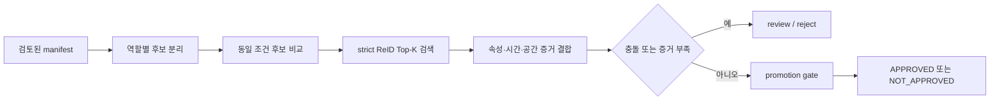

# CCTV Model Selection Lab

진행 중인 CCTV 모델 선택 실험을 공개 가능한 형태로 정리한 포트폴리오 저장소입니다. 이 저장소의 핵심은 단일 모델의 점수를 보여 주는 것이 아니라, 각 모델을 맞는 역할에 배치하고 검증 조건을 통과한 결과만 다음 단계로 넘기는 의사결정 과정입니다.



## 무엇을 선택했는가

| 역할 | 현재 후보·상태 | 선택 원칙 |
| --- | --- | --- |
| 임베디드 1차 후보 | `student_CLIP_hard`, proxy 우선 | 낮은 복잡도의 1차 후보만 만들고 최종 판정은 하지 않습니다. |
| 서버 속성 인식 | `SOLIDER Swin-B + PAR`, 구현 후보 | 사람 속성의 구조화된 multi-label 출력을 담당합니다. |
| 동일인 검색 | SOLIDER ReID, Top-K 후보 검색만 허용 | strict 교차 카메라·시퀀스 비교에서 자동 매칭 기준을 통과하지 못하면 차단합니다. |
| 생성형 모델 | Qwen 계열, 충돌·저신뢰도 검토 보조 | 속성 분류기나 자동 동일인 판정기를 대체하지 않습니다. |

현재 strict ReID 재비교에서 가장 높은 후보는 SOLIDER-ReID Swin-B Top-3 mean입니다. Rank-1 `0.4737`, Recall@5 `0.7789`, identity-MRR `0.6074`였으며, 자동 동일인 매칭 기준인 Rank-1 `0.85`와 Recall@5 `0.95`를 통과하지 못했습니다. 따라서 후보 검색에는 쓰되 자동 매칭은 `BLOCKED`로 유지합니다.

현재 runtime은 `provisional`이며 `productionApproved = false`입니다. retrieval-only 제한은 runtime에서 강제하고, 생성형 모델은 자동 fallback이나 primary identity classifier가 아닙니다. 교차 카메라 identity 정답도 아직 없으므로, 현재 사람 검토 track의 identity는 원래 source track 안에서만 유효하게 취급합니다.

## GPU 실험 자료 복구 현황

GPU 작업공간에서 회수한 공개 가능 자료는 `gpu-recovery/` 아래에 정리되어 있습니다. 원본 CCTV와 개인정보 이미지는 공개 저장소에 넣지 않고, 재현에 필요한 코드·설정·수치·검증 결과와 선택 가중치만 보존했습니다.

| 구분 | 현재 보존 상태 | 다시 실행할 때 필요한 것 |
| --- | --- | --- |
| 학습·추론·오케스트레이션 코드 | 업로드됨 | 저장소 clone 후 의존성 설치 |
| 파인튜닝·증류·ReID 파라미터 | 업로드됨 | 비공개 데이터와 base model 복원 |
| 실험 JSON·로그·그래프·promotion gate | 업로드됨 | 결과 파일을 기준으로 동일 split 재검증 |
| 선택 가중치 | 10개, Git LFS 업로드 | `git lfs pull` |
| GPU 서버 전체 모델 목록 | 198개, 305.813 GiB의 목록·크기·경로 | 나머지 모델은 재다운로드 또는 사설 저장소 복원 |
| 원본·중간 CCTV 자료 | 공개 저장소에서 제외 | 비공개 `CCTV_DATA_ROOT` 필요 |

### 공개 가능한 실험 수치 요약

아래 수치는 서로 다른 데이터셋과 평가 목적을 섞지 않고 원본 결과 파일의 단위 그대로 표시합니다.

| 실험 | 지표 | 기록값 | 해석 |
| --- | --- | ---: | --- |
| CLIP ViT-L/14 partial fine-tune | PA-100K test mA | `0.7827` | 속성 proxy |
| SOLIDER PA head | PA-100K test mA / InsF1 | `0.7567 / 0.8584` | 속성 보조 head |
| CLIP ← SOLIDER KD 최선 조합 | PA-100K KD mA | `0.7316` | 증류 proxy, 자동 승격 보류 |
| SOLIDER ReID strict | CHIRLA Rank-1 / Recall@5 | `0.4526 / 0.7579` | 후보 검색용 |
| 저장소 선택 snapshot | strict Rank-1 / Recall@5 | `0.4737 / 0.7789` | 자동 identity match 기준 미달 |

PA-100K 수치는 속성 분류, CHIRLA 수치는 공개 ReID proxy이므로 프로젝트 CCTV의 일반화 정확도로 합산하거나 바꾸어 쓰지 않습니다. 상세 파라미터와 원본 결과 파일은 [GPU 실험·가중치·파라미터 인덱스](gpu-recovery/manifests/experiment_artifacts_summary.md)에서 확인합니다.

### 복원 순서

```powershell
git lfs pull
python -m pip install -e .
python -m pytest -q tests --disable-warnings --maxfail=1
```

초기화 전 백업 범위와 삭제 조건은 [복구 완전성 기준](gpu-recovery/manifests/recovery_completeness_20260814.md)에 적었습니다. GitHub에 목록만 있고 바이너리가 없는 모델은 반드시 별도 복원해야 합니다.

## 비교와 루프의 경계

- 현재 속성 proxy는 PA-100K local 100-image subset의 6개 필드별 top-1 평균 `0.7267`입니다. 이 값은 CCTV identity·track-heldout 결과나 외부 benchmark의 mA·InsF1과 동등하지 않습니다.
- 이전 45개 person crop·33개 그룹 비교의 CLIP ViT-L/14 `0.414`, Qwen3-VL-2B `0.393`은 historical proxy로 보존합니다. 현재 선택 기준으로 섞지 않으며, 역할이 다른 ReID 점수와 합산하거나 순위를 섞지 않습니다.
- `invalid_runtime`과 `pending` 후보는 0점으로 환산하지 않고 비교 대상에서 제외합니다. 실패 원인을 실행 환경·출력 계약·미측정으로 남겨 다음 실험의 입력으로 사용합니다.
- manifest에는 `identityGroupId`, `cameraId`, `trackId`, `conditionGroupId`, 시간 인접성을 분리하는 규칙과 사람 검토·teacher provenance를 요구합니다. 누락·누수·미승인 teacher가 있으면 결과를 보류합니다.
- 최종 gate는 독립 identity label, track-heldout, 사람 검토, artifact hash와 품질 기준을 모두 요구합니다. 하나라도 부족하면 `NOT_APPROVED`가 정상 결과입니다.

## 저장소 구성

- [configs/model_selection_snapshot.json](configs/model_selection_snapshot.json): 역할, 후보 상태, 측정 범위, strict ReID 결정과 promotion 상태를 한 파일에 고정한 공개용 스냅샷
- [docs/model-selection-architecture.md](docs/model-selection-architecture.md): 모델 역할과 fail-closed 오케스트레이션 구조
- [docs/experiment-decision-log.md](docs/experiment-decision-log.md): 비교 결과를 어떤 범위에서 해석했는지와 다음 실험 루프
- [src/cctv_eval_harness/gate.py](src/cctv_eval_harness/gate.py): 전체 흐름의 마지막 promotion gate 컴포넌트
- [notebooks/model_selection_overview.ipynb](notebooks/model_selection_overview.ipynb): 스냅샷을 다시 읽어 의사결정 경계를 확인하는 실행 가능한 요약
- [notebooks/evaluation_protocol.ipynb](notebooks/evaluation_protocol.ipynb): artifact·heldout·provenance gate 프로토콜

## 실행

Python 3.11 이상과 `uv`에서 테스트·gate를 실행합니다. Notebook 실행에는 Jupyter 환경이 필요합니다.

```powershell
uv run python -m unittest discover -s tests -v
uv run python -m cctv_eval_harness.gate --input examples/proxy_result.json --config configs/promotion_gate.json --workspace .
python -m nbconvert --to notebook --execute --inplace notebooks/model_selection_overview.ipynb --ExecutePreprocessor.timeout=60
```

두 번째 명령은 의도적으로 `NOT_APPROVED`와 종료 코드 `2`를 반환합니다. proxy 속성 결과를 실제 CCTV identity·track-heldout 결과처럼 승격하지 않는지 확인하기 위한 fail-closed 예제입니다.

## 공개 범위

실제 CCTV 영상·프레임·개인 식별자·인증 정보·내부 비밀 경로는 포함하지 않습니다. 선택된 공개 가능 가중치는 `gpu-recovery/weights/`에 Git LFS로 보존했으며, 전체 모델 바이너리와 원본 데이터는 별도 비공개 복원이 필요합니다. 이 저장소는 원본 데이터를 재배포하지 않고, 어떤 증거가 있어야 모델 선택 또는 승격이 가능한지 재현 가능한 의사결정 구조로 공개합니다.
