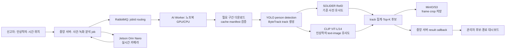
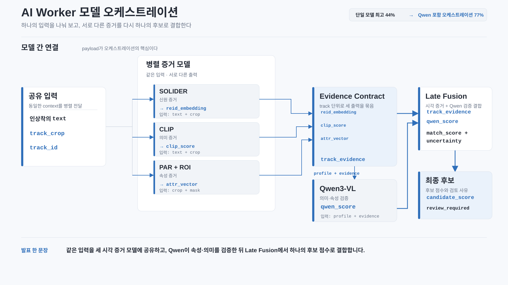
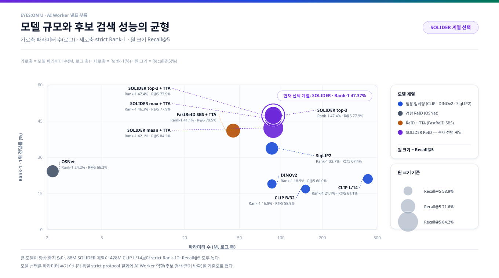
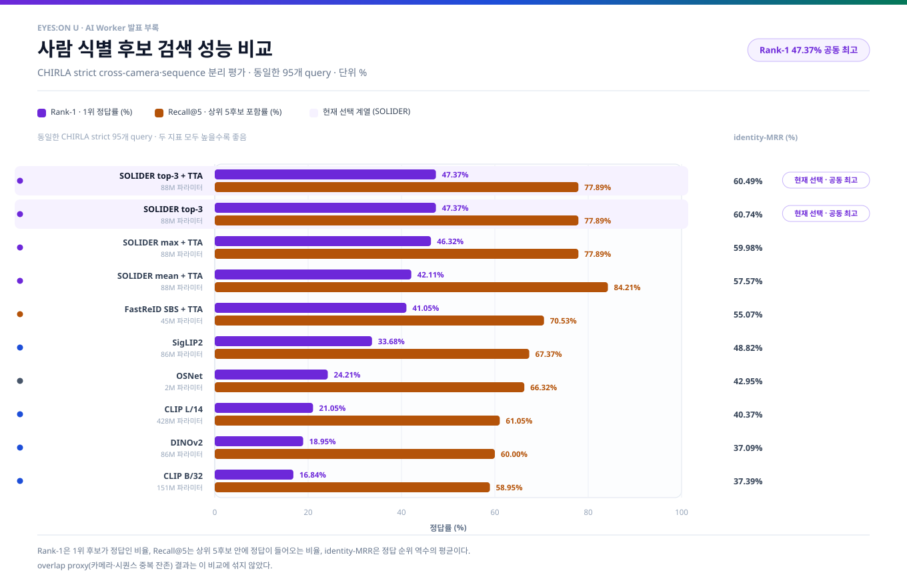
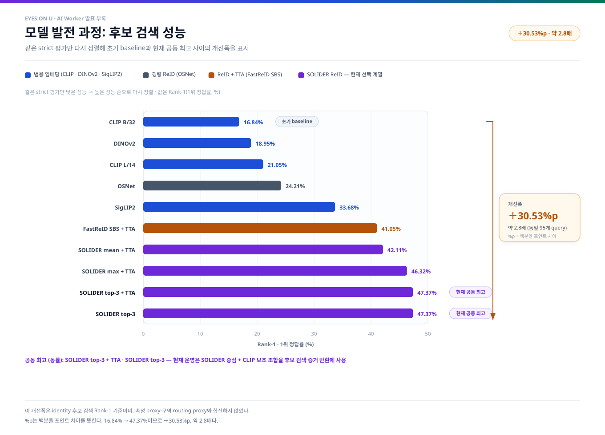
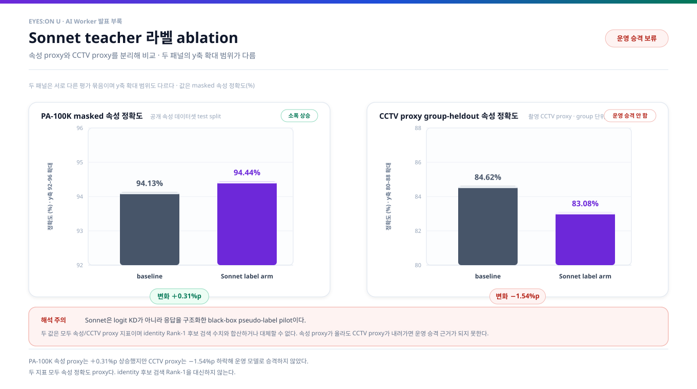
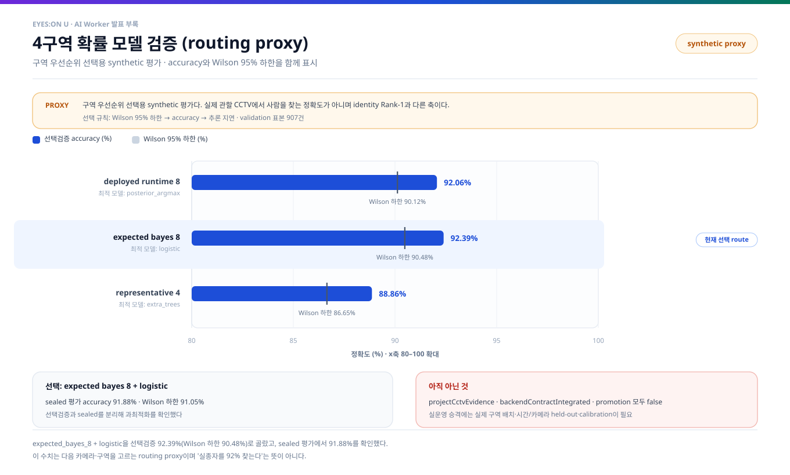

# EYES:ON U AI Worker 발표·학습용 부록

> 생성 기준: 2026-08-09
>
> 이 문서는 팀이 AI Worker를 처음부터 다시 공부하고, 발표에서 시스템 구현과 실험 결과를 재현 가능하게 설명하기 위한 부록이다. 차트와 수치는 저장소에 보존된 실험 결과에서 생성했다.

## 0. 발표 전에 먼저 기억할 결론

현재 AI Worker는 **과거 녹화본에서 후보를 좁히고 위치·시간·crop 증거를 반환하는 검색기**다. 이 역할을 기준으로 지금까지 비교한 모델 중 최선의 조합을 확정했으며, 최종 수사 판단은 관리자와 중앙 서버가 맡는다.

## 발표 핵심 메시지

- 동일한 strict 95개 query 비교에서 CLIP ViT-B/32 **16.84%** → SOLIDER 공동 최고 **47.37%**: **+30.53%p, 약 2.8배 개선**
- Top-5 후보 포함률 **77.89%**로 후보를 좁히고, 시간·bbox·crop 증거를 반환하는 현재 AI Worker 역할에 맞는 모델을 선택
- 최종 선택: `hybrid-solider-clip-v1` (**SOLIDER 중심 + CLIP 보조**)
- 4구역 routing proxy의 현재 선택 route는 validation **92.39%**로 구역 우선순위 결정에 사용
- Sonnet은 속성 proxy **+0.31pp**였지만 CCTV proxy **-1.54pp**여서 core retrieval에는 넣지 않음
- 모델 오케스트레이션은 YOLO→ByteTrack→CLIP/SOLIDER/속성·보조 계층→track late fusion→Top-K 증거 반환의 역할 분담으로 구성

이 발표의 결론은 **“현재 역할에 필요한 후보 검색기 중 검증된 최선의 조합을 선택했고, 초기 baseline 대비 충분히 발전했다”**는 것이다. 85%는 후보 검색기의 선택 결과와 섞지 않고, 향후 자동 신원확정을 별도로 검증할 때 사용하는 sealed gate로 표시한다.

| 구분 | 검증된 결과 | 발표 해석 |
|---|---:|---|
| CHIRLA strict cross-camera identity | SOLIDER top-3 Rank-1 **47.37%**, Recall@5 **77.89%**, identity-MRR **60.74%** | 같은 카메라·시퀀스 겹침을 제거한 비교군 중 최고값. Top-K 후보 검색기 선택 근거 |
| 프로젝트 자체 영상 | 6개 영상, 다중 인물 영상 3개, person crop 395개, 검수 track 10개 | same-camera temporal pilot. cross-camera identity 일반화 증거가 아님 |
| 4구역 위치 확률 proxy | selection validation **92.39%**, Wilson 95% 하한 **90.48%**; sealed **91.88%** | synthetic proxy에서 가장 좋은 구역 우선순위 route. AI Worker routing 계층의 선택 근거 |
| Sonnet response-level teacher | PA-100K **+0.31pp**, CCTV proxy group-heldout **-1.54pp** | 속성 보조 teacher로는 기록하되 core retrieval에는 넣지 않음 |
| 운영 선택 | `hybrid-solider-clip-v1` | SOLIDER 중심 ReID + CLIP 보조의 Top-K 후보 검색 경로 |

핵심은 현재 선택 모델의 **비교군 내 최고 성능·발전 폭·실제 역할 충족**을 한눈에 보여주는 것이다. 각 수치는 데이터·split·단위와 함께 제시하며, 자동 신원확정 85%는 별도 후속 gate로 분리한다.

## 1. 시스템을 한 문장으로 이해하기

중앙 서버가 사건·검색 조건·녹화 작업을 RabbitMQ로 발행하면, 노트북의 AI Worker가 작업을 claim하고 필요한 녹화 구간만 내려받아 사람을 검출·track·검색한 뒤, crop/frame과 후보 점수를 MinIO/S3 및 중앙 서버에 반환한다.



### AI Worker와 Jetson을 나누는 이유

- AI Worker는 과거 녹화본을 시간 구간 단위로 분석한다. 한 작업이 수십 초에서 수분 걸릴 수 있으므로 노트북/GPU 서버의 계산 자원을 사용한다.
- Jetson은 관할 카메라의 실시간 화면에서 빠르게 후보를 찾고 bbox·frame 식별 정보를 보내는 엣지 경로다.
- 두 경로는 후보 증거를 중앙 서버에 모으지만, **과거 검색과 실시간 탐지의 모델·지연·자원 제약은 동일하지 않다.**
- AI Worker가 반환하는 유사도는 calibrated identity probability가 아니다. 관리자에게 후보 우선순위를 제공하는 점수다.

## 2. 실제 구현 흐름

### 2.1 작업 생명주기

```text
QUEUED
  -> RabbitMQ jobId 메시지 수신
  -> claim + lease 획득
  -> target API에서 recording 메타데이터·signed URL 확인
  -> searchFromMs~searchToMs 구간만 local segment로 준비
  -> YOLO person detection
  -> ByteTrack으로 frame 간 동일 track 연결
  -> track별 crop 품질 집계
  -> SOLIDER/CLIP 점수 계산
  -> frame/crop signed PUT upload
  -> 후보·bbox·시간·score result callback
  -> complete 후 RabbitMQ ACK
```

Worker가 실패하면 fail callback을 보내고, lease·heartbeat·retry/DLQ 정책에 따라 재처리 여부를 결정한다. 결과 callback 전에 ACK하지 않는 이유는 **메시지는 살아 있지만 결과 증거가 사라지는 상황**을 막기 위해서다.

### 2.2 중앙 서버와 맞물리는 API 계약

현재 문서와 Worker 구현이 기준으로 삼는 `RecordingAnalysisWorkerController` 흐름은 다음과 같다.

| 순서 | API 역할 | Worker가 얻거나 보내는 값 |
|---:|---|---|
| 1 | `POST /api/v1/internal/recording-analysis-jobs/{jobId}/claim` | `X-Worker-Key`, claim/lease 상태 |
| 2 | `GET /api/v1/internal/recording-analysis-jobs/{jobId}/target` | 녹화 object key, 검색 시간, signed download 정보 |
| 3 | `POST .../{jobId}/heartbeat` | lease 연장 및 생존 신호 |
| 4 | `POST .../{jobId}/upload-urls` | frame/crop signed PUT URL |
| 5 | signed `PUT` | Worker가 MinIO/S3에 증거 이미지 직접 업로드 |
| 6 | `POST .../{jobId}/result` | 후보 track, frame offset, bbox, similarity, 저장 경로 |
| 7 | `POST .../{jobId}/fail` | 실패 code와 재시도 가능한지 여부 |

RabbitMQ 메시지는 routing 목적의 `jobId` 중심으로 유지하고, 비밀키·signed URL·원본 객체 전체를 메시지에 넣지 않는다. 실제 데이터는 target API에서 lease 검증 후 받는다.

### 2.3 영상 다운로드와 cache

전체 원본 1분 또는 30초를 무조건 매번 받는 방식이 아니라, 중앙 서버가 제공하는 `searchFromMs`~`searchToMs` 범위에 맞춰 segment를 만든다.

- `recordingObjectKey`를 녹화본의 논리적 식별자로 사용한다.
- local cache sidecar에 object key, 시간 범위, 파일 크기, 완료 여부를 기록한다.
- 동일 object key라도 시간 구간·파일 크기·manifest가 다르면 재사용하지 않는다.
- Worker 생명주기 동안 YOLO·CLIP·SOLIDER를 cache해 매 job마다 checkpoint를 다시 읽지 않는다.
- segment 준비가 지원되지 않는 개발 환경에서는 전체 파일 fallback이 가능하지만, 운영 모델 경로는 필요한 구간 분석을 우선한다.

### 2.4 모델 파이프라인

#### 1) YOLO: 사람 후보 검출

YOLO는 “이 영역이 사람인가?”를 담당한다. 현재 문서상 기본 경로는 사람 class만 사용하고, 검출 결과를 `left, top, right, bottom` bbox로 보존한다. 사람 외 배경을 ReID/CLIP에 넣지 않는 것이 중요한 이유는 간판·벽·차량이 유사도에 영향을 주는 것을 줄이기 위해서다.

#### 2) ByteTrack: frame 중복을 track으로 묶기

매 frame에서 같은 사람 bbox가 계속 나오면 `tracker_id`를 연결해 하나의 track으로 만든다. 따라서 결과가 frame 수만큼 반복되는 대신, track마다 대표 crop과 관측 시간 구간을 반환할 수 있다.

단, `tracker_id`는 **한 영상 실행 안에서의 연결 ID**이지, 여러 카메라·여러 영상에 걸친 전역 identity ID가 아니다. 동일인 deduplication은 track 시간·카메라·후보 score·증거 그룹을 별도로 사용해야 한다.

#### 3) SOLIDER-ReID: 기준 사진과 사람 crop 비교

SOLIDER는 사람 crop을 embedding으로 바꾸고, 신고자가 준 기준 사진과의 ReID 유사도를 계산한다. 옷의 전체 실루엣·사람 외형처럼 “사진 대 사진” 비교가 필요한 경우가 CLIP보다 주 역할에 가깝다.

#### 4) CLIP ViT-L/14: 인상착의 문장과 crop 비교

CLIP은 `“안경을 쓴 회색 반팔 검은색 바지 남자”`와 사람 crop을 같은 embedding 공간에서 비교한다. 색상·복장·문장 조건을 후보 검색에 보조로 반영하지만, 미세한 신원 식별을 단독으로 확정하는 모델은 아니다.

#### 5) 두 증거가 함께 있을 때

현재 후보 runtime의 검증된 기본 조합은 다음과 같다.

```text
combined_score = 0.75 * SOLIDER_score + 0.25 * CLIP_score
```

기준 사진이 없으면 CLIP text-image 검색만 사용하고, 인상착의 문장과 사진이 모두 없으면 후보 검색을 안전하게 제한한다. track 안에서는 상위 3개 frame score를 집계하고, 이후 전체 track을 Top-K로 반환한다.

Qwen·Sonnet·Florence-2·Grounding DINO·SAM2.1은 현재 과거 후보 검색의 필수 운영 모델로 묶지 않았다. 이 모델들은 속성 설명·teacher label·geometry/mask 생성 연구에 사용할 수 있지만, 서로 다른 목적의 모델을 하나의 “90% 확정 모델”로 포장하면 안 된다.

### 2.5 모델 오케스트레이션: 하나의 모델이 아니라 역할별 신호를 결합



도식 원본은 Claude CLI로 생성한 `tools/assets/claude_model_orchestration.svg`이며, 모든 비ASCII 문자를 XML 숫자 문자참조로 보존해 Windows 콘솔 인코딩에 영향을 받지 않도록 했다. 발표 산출물은 빌드 시 이 원본을 복사한다.

발표에서 반드시 보여줘야 하는 핵심 구성은 **모델 목록**이 아니라 **실행 순서와 결합 경계**다.

| 단계 | 담당 모델/계층 | 반환 신호 | 다음 단계로 넘어가는 조건 |
|---|---|---|---|
| 사람 증거 생성 | YOLO person class 0 + ByteTrack | bbox, track, crop, frame offset | 사람이 검출되고 crop 품질 gate를 통과 |
| 후보 점수 branch | CLIP ViT-L/14, SOLIDER ReID | text-image 점수, reference 유사도 | 입력 프로필에 해당 신호가 있을 때만 사용 |
| 속성·이력 branch | ROI color, SOLIDER-PAR, historical retrieval | 색상/속성, 과거 gallery, temporal/spatial 신호 | 모델과 자료가 준비된 경우만 late fusion에 참여 |
| 보조 검토 | Qwen top-K review | 저신뢰·충돌 설명 | 후보가 이미 생성된 뒤 조건부 실행; 1차 신원 분류기가 아님 |
| 최종 조합 | availability-aware deterministic fusion | track score, Top-K, review 상태 | 누락 필수 증거는 fail-closed |
| 구역 routing | `expected_bayes_8 + logistic` | 4구역 우선순위 | identity score와 별도로 다음 카메라를 고름 |

참조 사진과 인상착의가 모두 있으면 핵심 점수는 `0.75 × SOLIDER + 0.25 × CLIP`으로 결합하고, track 안의 상위 frame과 temporal/spatial/quality 신호를 함께 집계한다. Qwen은 후보를 만든 뒤 낮은 신뢰도나 모델 충돌을 설명하는 보조 계층이며, Sonnet·Grounding DINO·SAM2.1·Florence-2는 현재 요청마다 실행하는 모델이 아니라 오프라인 teacher/라벨 계층이다. 이 구분이 있어야 모델을 교체해도 중앙 API와 후보 결과 계약을 유지할 수 있다.

## 3. 실험을 어떻게 설계했는가

### 3.1 데이터셋과 평가 단위

| 데이터 | 규모 | split/protocol | 주 지표 | 해석 |
|---|---:|---|---|---|
| 프로젝트 직접 촬영 CCTV | 6 videos, 다중 인물 3 videos, crop 395개, 검수 track 10개 | same-camera temporal track proxy | Rank-1 pilot | 우리 시야와 조명 확인용. cross-camera 일반화가 아님 |
| CHIRLA public proxy | 11 identities, strict query 95개 | camera·sequence overlap 제거 | Rank-1, Recall@5, identity-MRR | 후보 검색 모델을 공정 비교하는 주 identity proxy |
| PA-100K | train 80,000 / validation 10,000 / test 10,000 | attribute split | mA, instance accuracy, InsF1, label macro-F1 | 모자·가방·색상 등 속성 head 평가. identity 정확도가 아님 |
| 4-zone synthetic proxy | validation 907, sealed 4,484 | route별 model selection | accuracy, Wilson 95% 하한 | 구역 우선순위 모델 평가. project CCTV 근거가 아님 |
| Sonnet response labels | response-level structured labels | group-heldout CCTV proxy + PA-100K ablation | masked attribute accuracy | Sonnet logit KD가 아니라 black-box 응답 pseudo-label 실험 |

### 3.2 지표를 쉽게 설명하면

- **Rank-1**: 가장 높은 점수의 1위 후보가 정답인 비율. 자동 신원확정에 가까운 엄격한 지표다.
- **Recall@5**: 상위 5명 후보 안에 정답이 들어오는 비율. 수사 후보 검색에는 Rank-1보다 실무적으로 유용할 수 있다.
- **identity-MRR**: 정답 순위의 역수를 평균낸 값. 정답이 1위에 가까울수록 높다.
- **mA**: 여러 속성별 정확도를 평균낸 값. “사람을 찾았다”와 “모자/상의 색상을 읽었다”를 구분한다.
- **InsF1**: 한 이미지의 속성 집합을 instance 단위로 얼마나 맞췄는지 보는 F1이다.
- **macro-F1**: 각 label의 F1을 동일하게 평균낸다. 빈도가 낮은 속성도 빠지지 않게 보는 지표다.
- **Wilson 95% 하한**: 관측 accuracy만 보지 않고 표본 불확실성을 고려한 보수적 하한이다. 모델 선택 때 하한이 높은 모델을 우선한다.

### 3.3 후속 자동 신원확정 gate의 의미

이 프로젝트에서 “일반화 85%”라고 말하려면 최소한 다음이 같은 sealed test에 있어야 한다.

1. 여러 identity의 gallery와 distractor 후보
2. camera/time/track held-out split
3. identity 정답 라벨과 독립 검수
4. Rank-1 0.85 이상, Recall@5 0.95 이상 등 사전에 정한 gate
5. false match/false reject와 confidence calibration

이 gate는 현재 후보 검색기 선택을 부정하는 기준이 아니라, 후보 검색 이후 자동 신원확정까지 승격할 때 추가로 확인하는 기준이다. 현재 발표에서는 모델 선택 결과와 자동 확정 gate를 서로 다른 층위로 설명한다.

## 4. 실험 결과와 차트 읽는 법

### 4.1 전체 모델 trade-off 버블차트



차트 해석:

- x축은 파라미터 수, y축은 CHIRLA strict Rank-1이다.
- 버블 크기는 Recall@5다. 단일 Rank-1만 보지 않고 “정답을 후보군 안에 넣는 힘”도 함께 본다.
- 현재 비교군 최고는 SOLIDER 공동 **47.37%**이며, 이 차트는 후보 검색 모델 선택용이다.
- 버블 크기까지 함께 보면 SOLIDER가 현재 후보 포함 능력과 1위 정답률의 균형에서 가장 좋은 선택임을 확인할 수 있다.
- 모델 규모만으로 선택하지 않고 동일한 strict protocol의 결과와 AI Worker 역할을 함께 기준으로 삼는다.

### 4.2 strict 모델 순위



| 모델/방법 | Rank-1 | Recall@5 | identity-MRR |
|---|---:|---:|---:|
| SOLIDER top-3 mean | 47.37% | 77.89% | 60.74% |
| SOLIDER top-3 mean + hflip | 47.37% | 77.89% | 60.49% |
| SOLIDER max + hflip | 46.32% | 77.89% | 59.98% |
| FastReID SBS top-3 + hflip | 41.05% | 70.53% | 55.07% |
| SOLIDER mean + hflip | 42.11% | 84.21% | 57.57% |
| SigLIP2 top-3 | 33.68% | 67.37% | 48.82% |
| OSNet mean | 24.21% | 66.32% | 42.95% |
| CLIP ViT-L/14 mean | 21.05% | 61.05% | 40.37% |
| DINOv2 mean | 18.95% | 60.00% | 37.09% |
| CLIP ViT-B/32 mean | 16.84% | 58.95% | 37.39% |

같은 이름의 `overlap proxy` 결과 중 SOLIDER max + hflip 64.21%는 strict 결과보다 높지만, gallery/query에 camera·sequence 중복이 남아 있어 발표의 주 성능 숫자로 사용하지 않는다.

### 4.3 모델 발전 과정



이 차트는 지금까지의 **strict identity 후보 검색 실험만** 같은 기준으로 다시 정렬해, 초기 baseline과 현재 선택 모델 사이의 발전 폭을 보여준다.

- CLIP ViT-B/32 mean **16.84%** → 현재 strict 최고인 SOLIDER top-3 mean **47.37%**
- 동일 95개 query 기준 **+30.53%p**, 초기 baseline 대비 약 **2.8배**
- 이 수치는 후보 검색 Rank-1이며, Sonnet 속성 proxy·SOLIDER 속성 head·4구역 routing proxy와 섞어 계산하지 않았다.
- 현재 모델은 초기 baseline 대비 **+30.53%p, 약 2.8배** 개선되었고 동일 strict 비교군의 공동 최고다.
- 따라서 현재 AI Worker에는 `hybrid-solider-clip-v1`을 후보 검색·증거 반환 모델로 사용한다. 자동 신원확정이 필요한 시점의 85%는 별도 sealed gate로 검증한다.

### 4.4 Sonnet 증류/teacher ablation



| 평가 | baseline | Sonnet label arm | 변화 | 결정 |
|---|---:|---:|---:|---|
| PA-100K masked attribute accuracy | 94.13% | 94.44% | +0.31pp | 속성 proxy 소폭 상승 |
| CCTV proxy group-heldout | 84.62% | 83.08% | -1.54pp | 운영 승격하지 않음 |

여기서 Sonnet은 내부 logit을 받은 전통적인 logit KD가 아니다. Claude CLI/API 응답을 구조화된 response-level pseudo-label로 사용한 black-box teacher pilot이다. 속성 proxy에서 상승했다고 identity retrieval도 상승한다고 말할 수 없으며, 현재 결과는 오히려 CCTV proxy에서 하락했다.

### 4.5 SOLIDER 속성 head와 파인튜닝

PA-100K 전체 원본 frame에서 SOLIDER 속성 head를 학습한 별도 실행은 다음과 같다.

| 지표 | 값 | 무엇을 뜻하는가 |
|---|---:|---|
| mA | 77.33% | 속성별 평균 정확도 |
| instance accuracy | 77.59% | 이미지 단위 속성 집합 정답률 |
| instance F1 | 86.67% | 이미지 단위 속성 집합 F1 |
| label macro-F1 | 63.46% | 속성 label별 F1 평균 |

이 표는 “모델이 안경·가방·색상 같은 속성을 얼마나 읽는가”의 자료다. 같은 사람을 CCTV에서 찾는 Rank-1과 직접 합산하면 안 된다. 발표에서는 속성 학습과 identity 검색을 **두 개의 평가 트랙**으로 나란히 보여준다.

### 4.6 4구역 확률 모델



현재 선택된 경로는 `expected_bayes_8 + logistic`이다.

- selection validation: accuracy 92.39%, Wilson 95% 하한 90.48%
- sealed evaluation: accuracy 91.88%, Wilson 95% 하한 91.05%
- 선택 규칙: Wilson 95% 하한 → accuracy → inference latency
- 단, `projectCctvEvidence=false`, `backendContractIntegrated=false`, `promotion accepted=false`

즉 발표에서는 “4구역 synthetic routing 알고리즘을 92.39% proxy accuracy로 선택했다”고 말할 수 있지만, “실제 관할 구역에서 실종자를 92% 찾는다”고 말할 수 없다. 실제 운영 승격에는 4개 구역·카메라 배치·독립 시간/카메라 held-out·false zone switch·calibration 자료가 필요하다.

## 5. 지금 모델을 이렇게 결정한 이유

### 후보 검색 경로

```text
기준 사진 있음
  -> SOLIDER-ReID Swin-Base 중심
인상착의 문장 있음
  -> CLIP ViT-L/14 보조
둘 다 있음
  -> 0.75 * SOLIDER + 0.25 * CLIP
결과
  -> track 대표 crop·시간·bbox와 함께 Top-K 후보 반환
  -> 관리자 검토
```

`hybrid-solider-clip-v1`을 선택한 이유는 strict CHIRLA에서 SOLIDER 계열이 현재 비교군 중 가장 높은 후보 검색 성능을 기록했고, CLIP을 보조 증거로 결합할 수 있기 때문이다. 이 조합은 AI Worker의 현재 목표인 **후보 우선순위화와 시간·bbox·crop 증거 반환**에 사용한다. 자동 신원확정은 별도 후속 gate로 관리한다.

### 발표에서 Qwen을 어떻게 설명할 것인가

현재 Worker의 core retrieval은 YOLO·ByteTrack·SOLIDER·CLIP 조합이다. Qwen은 추후 후보 crop 여러 장의 설명·속성 정규화·모델 간 충돌 요약을 담당하는 별도 계층으로 붙일 수 있지만, Qwen 하나의 응답을 최종 신원 ground truth로 사용하지 않는다.

최종 판정은 다음 요소를 가진 규칙/검토 계층으로 남긴다.

- 후보의 ReID/text-image 점수
- track 시간 일관성
- 카메라·구역 이동 경로
- 여러 frame의 증거 수
- false match를 줄이는 threshold와 review 상태
- 관리자 승인/보류/반려

## 6. 발표 슬라이드 구성안

| 슬라이드 | 핵심 메시지 | 사용할 시각자료 |
|---:|---|---|
| 1 | 문제: 과거 CCTV에서 후보와 이동 경로를 좁혀야 한다 | `architecture_pipeline.svg`의 입력·결과 흐름 |
| 2 | AI Worker와 Jetson은 시간·자원·역할이 다르다 | 과거 분석 vs 실시간 경로 Mermaid |
| 3 | 중앙 서버가 job을 만들고 Worker가 결과 증거를 반환한다 | claim → download → infer → upload → complete 단계 |
| 4 | YOLO/ByteTrack으로 배경과 frame 중복을 줄인다 | person bbox → track → representative crop |
| 5 | 모델별 역할을 나누고 late fusion으로 오케스트레이션한다 | `model_orchestration.svg` |
| 6 | SOLIDER와 CLIP을 서로 다른 증거로 결합한다 | `0.75 SOLIDER + 0.25 CLIP` 다이어그램 |
| 7 | 모델 비교는 같은 strict protocol로 해야 한다 | `identity_model_bubble.svg`, `identity_strict_ranked.svg`, `model_evolution.svg` |
| 8 | Sonnet은 무조건 개선하지 않았다 | `sonnet_ablation.svg` |
| 9 | 구역 확률은 routing proxy이며 identity 정확도와 다르다 | `zone_proxy_validation.svg` |
| 10 | 현재 결론: 비교군 중 최선의 Top-K 후보 검색기와 적용 역할 | `evidence_status.svg` |
| 11 | 자동 신원확정으로 승격할 때의 별도 검증 | 데이터 수집 및 sealed gate 표 |

### 발표용 30초 요약 멘트

> “저희 AI Worker는 중앙 서버가 발행한 과거 녹화 분석 작업을 받아 필요한 시간 구간만 다운로드하고, YOLO와 ByteTrack으로 사람 track을 만든 뒤 SOLIDER와 CLIP으로 후보를 정렬합니다. 동일한 CHIRLA strict 95개 query에서 초기 CLIP ViT-B/32 16.84%에서 SOLIDER 공동 최고 47.37%까지 +30.53%p, 약 2.8배 개선했고 Top-5 후보 포함률은 77.89%입니다. 그래서 현재는 `hybrid-solider-clip-v1`을 후보·시간·bbox·crop 증거를 관리자에게 제공하는 검색기로 선택했습니다. Sonnet과 4구역 routing은 각각 보조 teacher와 구역 우선순위 계층으로 분리해 검증했으며, 자동 신원확정은 별도 후속 sealed gate로 관리합니다.”

## 7. 팀 학습 순서

1. `AI_WORKER_CORE_MISSION.md`로 AI Worker와 Jetson의 역할을 구분한다.
2. `AI_WORKER_COMPLETE_GUIDE.md`로 전체 lifecycle과 모델 파이프라인을 읽는다.
3. `AI_SEARCH_RUNTIME_INTEGRATION.md`로 API 계약과 `hybrid-solider-clip-v1` 선택 근거를 확인한다.
4. `recording_job_executor.py`와 `central_client.py`에서 claim → target → inference → result 흐름을 따라간다.
5. `video_tracks.py`에서 frame detection이 track/crop으로 어떻게 줄어드는지 확인한다.
6. `solider_clip_engine.py`에서 model cache와 0.75/0.25 결합을 확인한다.
7. `cctv_generalization_method_matrix_20260728.json`을 읽고 metric unit과 protocol이 다른 행을 섞지 않는다.
8. 마지막으로 본 부록의 차트를 직접 다시 생성해 수치가 같은지 확인한다.

## 8. 재현 방법

### 발표 자료 생성

저장소 루트가 `S15P11A204-deploy-ai-worker-env-fix`일 때:

```powershell
cd ai-worker
python tools/build_ai_presentation.py
```

또는 `uv`를 사용할 수 있다.

```powershell
cd ai-worker
uv run tools/build_ai_presentation.py
```

생성물:

- `output/ai-presentation/presentation_data.json`: 원본 JSON을 모은 수치 snapshot과 SHA-256
- `output/ai-presentation/identity_model_bubble.svg`: 모델 규모·strict Rank-1·Recall@5 버블차트
- `output/ai-presentation/model_orchestration.svg`: 모델별 역할·late fusion·routing·offline teacher 구성
- `output/ai-presentation/identity_strict_ranked.svg`: strict 모델 순위 차트
- `output/ai-presentation/model_evolution.svg`: 초기 baseline부터 현재 공동 최고 모델까지의 발전 폭
- `output/ai-presentation/sonnet_ablation.svg`: Sonnet ablation 차트
- `output/ai-presentation/zone_proxy_validation.svg`: 4구역 synthetic proxy 차트
- `output/ai-presentation/architecture_pipeline.svg`: 전체 시스템 구조도
- `output/ai-presentation/evidence_status.svg`: 발표용 검증 상태표
- `output/jupyter-notebook/ai_worker_presentation_evidence.ipynb`: Jupyter 재현 노트북
- `output/ai-presentation/v4_par_model_selection.svg`: v1~v5 PAR 비교와 v4 선정 근거
- `output/ai-presentation/v4_par_pipeline.svg`: v4 4-head와 CCTV 후보 탐색 오케스트레이션 연결
- `output/ai-presentation/v4_par_evidence.json`: yopar-train README 테스트 수치와 출처 범위

### 검증 명령

현재 로컬 번들에는 `pytest`와 Jupyter 실행기가 설치되어 있지 않아 전체 pytest/Jupyter 실행은 이 컴퓨터에서 수행할 수 없다. 대신 생성 후 다음 정적 검증을 수행한다.

```powershell
python -c "from pathlib import Path; import runpy, xml.etree.ElementTree as ET, json; root=Path('ai-worker'); ns=runpy.run_path(str(root/'tests'/'test_ai_presentation_artifacts.py')); ns['test_presentation_package_contains_separated_evidence'](); out=root/'output'/'ai-presentation'; [ET.parse(p) for p in out.glob('*.svg')]; nb=json.loads((root/'output'/'jupyter-notebook'/'ai_worker_presentation_evidence.ipynb').read_text(encoding='utf-8')); assert nb['nbformat']==4; print('artifact_test=PASS')"
```

GPU 서버의 Jupyter에서 노트북을 열면 셀 3에서 snapshot 수치를 읽고, 셀 5에서 8개 SVG를 표시한다. 원본 GPU 실행 자체를 다시 돌리는 노트북이 아니라 **저장된 실험 근거와 모델 오케스트레이션 구성을 동일하게 읽고 시각화하는 재현 노트북**이다.

## 9. 발표 표현 가이드: 성과와 범위를 함께 말하기

| 피해야 할 표현 | 바꿔 말할 표현 |
|---|---|
| “모든 CCTV에서 동일인을 자동 확정한다” | “동일 strict 비교군에서 SOLIDER가 현재 최고이며, 후보·시간·bbox·crop 증거를 반환한다” |
| “4구역 확률 92%가 실제 위치 정확도다” | “synthetic zone routing validation에서 92.39%로 현재 route를 선택했고, 운영 구역 prior로 사용한다” |
| “Sonnet을 넣으면 무조건 좋아진다” | “PA-100K 속성 proxy는 +0.31pp였지만 CCTV proxy는 -1.54pp라 core retrieval에는 넣지 않았다” |
| “CLIP이 색상·질감을 완벽히 읽는다” | “CLIP은 인상착의 text-image 후보 점수를 제공하고, 미세 속성은 별도 속성 head/검수로 평가한다” |
| “tracker_id가 동일인 ID다” | “tracker_id는 한 실행 안의 track 연결 ID이며, 전역 identity는 별도 evidence aggregation이 필요하다” |

## 10. 다음 실험의 승격 조건

현재 자료의 다음 단계는 모델을 더 많이 붙이는 것이 아니라, 같은 기준의 실제 데이터를 확보하는 것이다.

- 최소 10명 이상 identity와 유사한 distractor를 구성한다.
- 카메라와 시간, recording 단위로 gallery/query를 분리한다.
- 각 track에 identityGroupId와 속성 정답을 독립 검수한다.
- 동일한 query에서 SOLIDER·CLIP·fusion·Qwen 보조 계층을 비교한다.
- Rank-1, Recall@5, false-match, false-reject, review rate, calibration ECE를 함께 기록한다.
- 모델 선택 후에도 sealed test를 한 번만 열고, 선택에 사용한 validation과 분리한다.
- 모든 gate가 통과하기 전에는 `automatic_identity_match` 모델 key로 승격하지 않는다.

## Appendix A. 구현 파일 지도

| 파일 | 공부할 내용 |
|---|---|
| `src/qwen_backend/recording_job_executor.py` | 작업 claim부터 complete/fail까지의 실행 흐름 |
| `src/qwen_backend/central_client.py` | 중앙 API 호출, envelope 해제, 인증, 응답 검증 |
| `src/qwen_backend/rabbit_consumer.py` | RabbitMQ 연결과 `prefetch=1` |
| `src/qwen_backend/rabbit_worker.py` | ACK/requeue/DLQ/retry 분류 |
| `src/qwen_backend/worker_transfer.py` | signed download/upload 계약 |
| `src/qwen_backend/recording_cache.py` | object key·시간 구간·manifest 검증 |
| `src/qwen_backend/video_tracks.py` | 사람 bbox에서 track/crop 추출 |
| `src/qwen_backend/solider_clip_engine.py` | YOLO·CLIP·SOLIDER cache와 후보 점수 |
| `src/qwen_backend/candidate_runtime.py` | 모델 교체 가능한 입력·출력 계약 |
| `configs/realtime_model_manifest.json` | 모델 weight SHA-256과 사용 목적 |
| `configs/model_selection.json` | 선택 상태, metric unit, 승격 조건 |
| `tests/` | API, retry, cache, dedup, runtime contract 테스트 |

## Appendix B. 원본 근거와 provenance

발표용 snapshot은 다음 원본에서 자동 생성되며, 각 파일의 SHA-256은 `output/ai-presentation/presentation_data.json`에서 확인한다.

- `experiments/results/cctv_generalization_method_matrix_20260728.json`
- `experiments/results/solider_ft_sonnet_comparison_20260724.json`
- `experiments/results/zone_region_model_comparison_20260802.json`
- `docs/AI_WORKER_COMPLETE_GUIDE.md`
- `docs/AI_SEARCH_RUNTIME_INTEGRATION.md`

`tests/fixtures/cctv_promotion/metrics.valid.json`의 90%/97% 수치는 승격 schema와 테스트용 fixture다. 실제 프로젝트 CCTV 실험 결과로 발표하지 않는다.

## Appendix C. 저장된 시각자료 링크

- [발표용 차트·도식 폴더](../output/ai-presentation/)
- [실험 근거 snapshot](../output/ai-presentation/presentation_data.json)
- [Jupyter 재현 노트북](../output/jupyter-notebook/ai_worker_presentation_evidence.ipynb)
- [전체 구현·학습 안내서](AI_WORKER_COMPLETE_GUIDE.md)
- [모델 선택·Sonnet 판정 문서](AI_SEARCH_RUNTIME_INTEGRATION.md)

