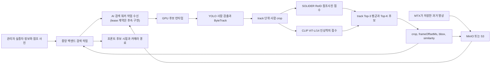

# 과거 CCTV 실종자 후보 검색 런타임 적용

> 제품 임무의 기준 문서는
> [AI Worker 핵심 임무와 중앙 작업 등록 계약](AI_WORKER_CORE_MISSION.md)이다. 이 워커는
> 과거 녹화본의 지정 구간에서 후보 근거를 반환하고, 중앙 서버가 경로 조립과 후속
> 녹화본 작업 계획·등록을 담당한다. Jetson은 실시간 4개 화면 탐지를 담당하며, 아래
> 구역 확률 경로는 운영 핵심이 아닌 비교 실험으로만 유지한다.

현재 이 체크아웃에서 검증한 후보 런타임 조합은 `hybrid-solider-clip-v1`이다.
MinIO/S3 다운로드, 중앙 작업 소비, 후보 결과 반환은 아직 연결되지 않았으며,
향후 중앙 워커가 녹화 영상과 참조 사진을 로컬 경로로 준비해 GPU 런타임을 호출한다.
GPU 런타임은 사람 track별 후보와 crop, 시점, bbox, 점수를 반환한다. 모델 프로세스는 중앙 워커와
분리되어 있어 SOLIDER, CLIP, Qwen 체크포인트를 바꿔도 Spring API와 저장소
계약은 바뀌지 않는다.

중앙 adapter는 planner의 절대 `searchFrom/searchTo`를 녹화 시작 시각 기준
`searchFromMs/searchToMs`로 변환해 런타임 요청에 넣는다. 런타임은 이 구간 밖
프레임을 후보로 반환하지 않으며, 모델 backend가 구간 밖 후보를 반환해도 계약
검증에서 거부한다.

Sonnet 보조 헤드는 운영 경로에 승격하지 않았다. 동일한 group-heldout 비교에서
baseline `0.856410`보다 Sonnet `0.830769`가 낮았기 때문이다. 비교 결과와
원격 체크포인트 경로는
[`experiments/results/solider_ft_sonnet_comparison_20260724.json`](../experiments/results/solider_ft_sonnet_comparison_20260724.json)에
고정했다. 이 결과 파일에는 체크포인트 SHA-256이 없으므로 해시가 봉인된 운영
모델 아티팩트로 간주하지 않는다.

## 서비스 안에서 맡는 역할



이 런타임의 출력은 후보 검색 결과다. `similarity` 하나만으로 동일인을 자동
확정하지 않는다. 중앙 서비스는 임계값 이상 후보를 보여주고, 운영 검수 또는
별도의 calibrated decision 단계가 최종 판정을 맡아야 한다.

## 모델 처리 순서

1. YOLO11s가 영상에서 `person`만 검출한다.
2. ByteTrack이 프레임의 검출 결과를 사람 track으로 묶는다.
3. 각 track에서 최대 12장의 사람 crop을 0.75초 간격으로 저장한다.
4. 참조 사진이 있으면 SOLIDER-ReID Swin-Base가 같은 사람 유사도를 계산한다.
5. 인상착의 문장이 있으면 CLIP ViT-L/14가 문장과 crop의 의미 유사도를 계산한다.
6. 두 증거가 모두 있으면 `SOLIDER 0.75 + CLIP 0.25`로 결합한다.
7. track 안에서 점수가 높은 3개 프레임을 평균하고 전체 Top-20 track을 반환한다.

사건에 참조 사진이 없으면 CLIP 문장 검색만 사용한다. 사진과 인상착의가 모두
없으면 추론을 거부한다. crop은 워커가 만든 임시 작업 디렉터리 안에서만
허용되며 중앙 워커가 `ai-results/{jobId}/...` 경로로 업로드한다.

## GPU 서버 환경

GPU 서버의 `qwen3vl` Python 환경에서 다음 런타임이 필요하다.

- CUDA가 활성화된 PyTorch와 torchvision
- transformers, Pillow, NumPy
- ultralytics, opencv-python-headless
- SOLIDER-ReID 저장소와 MSMT17 Swin-Base 체크포인트
- 이 저장소를 editable 설치한 `qwen_backend` 패키지

환경변수는 `.env.example`의 `QWEN_CANDIDATE_*` 항목을 기준으로 설정한다.
비밀키는 이 런타임에 넣지 않는다. S3/MinIO 자격증명과 중앙 서버 Device Key는
중앙 워커의 비밀 저장소에서 주입한다.

```bash
cd /home/j-i15a204/qwen3vl-backend
/home/j-i15a204/.conda/envs/qwen3vl/bin/python -m pip install -e .

export QWEN_CANDIDATE_MODEL_KEY=hybrid-solider-clip-v1
export QWEN_CANDIDATE_DEVICE=cuda
export QWEN_CANDIDATE_YOLO_WEIGHTS=yolo11s.pt
export QWEN_CANDIDATE_REID_CHECKPOINT=/home/j-i15a204/models/solider_reid/swin_base_msmt17.pth
export SOLIDER_REID_ROOT=/home/j-i15a204/SOLIDER-REID
export QWEN_CANDIDATE_CLIP_CHECKPOINT=openai/clip-vit-large-patch14

/home/j-i15a204/.conda/envs/qwen3vl/bin/python \
  -m qwen_backend.candidate_runtime_cli --health
```

정상 preflight는 `ready: true`와 빈 `reasons` 배열을 출력하고 종료 코드 0을
반환한다. CUDA, SOLIDER 저장소, 체크포인트 중 하나라도 없으면 종료 코드 2로
실패한다.

## 중앙 AI 워커 설정과 구역 확률 실험 경계

향후 중앙 워커가 연결할 후보 분석 경로는 저장소에서 녹화본을 내려받아
후보를 반환하는
`CandidateRuntimeEngine.analyze()`다. 이 체크아웃에서 구역 확률·카메라 선택
계산기를 직접 실행하는 경로는 기본 앱과 분리된
`qwen_backend.research_app:app`의 `POST /v1/search-routing/probability`다. 중앙
구역 확률 비교 실험을 실행할 때만 별도 연구 runner가 저장소 poll·영상 다운로드·후보
crop 생성 뒤 이 내부 API를 호출한다. 운영 `apps/ai-search-worker`의 필수 호출이 아니다.
현재 후보 런타임은 원시 `similarity`까지만 반환하므로 실제 calibrator 실행과 이 API
호출을 잇는 caller는 연구 승격 조건이며 핵심 제품 흐름의 선행 조건이 아니다. 원시
`similarity`만으로는 호출하지 않는다.
AI 워커 모델 단계가 다음 값을 함께 만들어야 한다.

- `correlationGroupId`: 카메라 간 동일 물리 track association 키
- `observationGroupId`: 같은 카메라·녹화 세그먼트의 Top-K 후보 묶음 키
- `trackId`: `recordingId` 또는 tracker-run 범위를 포함한 카메라 내 고유 track 키
- 보정된 `probability`, base rate, 모델·보정기·manifest SHA-256
- 사건 DB의 `activeRoutingRevision`과 새 `routingRevision`
- 매 요청의 UUID `requestId`와 timezone이 있는 `issuedAt`
- 앞 revision 응답의 `previousDeduplicationState`(event/correlation/observation SHA-256
  digest); 2,000건 window 사이의 동일 증거 재적용 방지
- 16대 카메라의 `zoneId`, `position`, health/coverage/freshness
- 검증된 sensitivity/FPR operating-point ID·SHA-256·표본 수

누락·위조 provenance, 잘못된 HMAC-SHA256 요청 서명, 누락된 continuation dedup 상태,
불완전한 4×4 토폴로지는 422로 fail-closed 된다. 만료·재전송·사건별 stale revision은
409로 거부한다. 서명은
사건·revision·후보 확률·그룹 키·dedup 상태·카메라 운영값을 포함한 요청 전체를
결속한다. 저장된 후보 이벤트의 `similarity`만 있는 과거
레코드는 확률로 변환하지 않고
`uncalibrated_similarity` 검토 경로에 남긴다. 개발 요청은 다음 명령으로 생성한다.

서명은 전송 중 확률 변조를 막는 장치이지 calibration 정확도의 증거는 아니다. 서명
권한은 실제 봉인 calibrator를 실행하는 producer에만 주고, CLI에서 임의 숫자에 운영
서명을 붙이는 경로는 허용하지 않는다. 현재 워커의 nonce/revision guard는 프로세스 내
방어이며, 실제 연결 전 중앙 백엔드가 `(caseId, requestId)`와 최신 revision을 DB에
영속화하고 compare-and-set으로 중복 요청을 차단해야 한다.

`candidateAssessments`에는 후보군 전체가 보정 확률순으로 남는다. 같은
`observationGroupId`의 후보는 한 영상 세그먼트에서 서로 경쟁하는 Top-K이므로
`zonePosterior`에는 가장 강한 후보 한 건만 사용한다. 나머지는
`suppressedAlternativeEventIds`와 `usedForZoneUpdate=false`로 표시해 후보 화면에는
보존하면서 구역 확률의 중복 곱셈을 막는다. 응답의 `zoneCandidateSummaries`와
`mostLikelyZoneProbability`가 각각 구역별 후보 요약과 해당 구역에 실종자가 있을
posterior를 제공한다.

```bash
export QWEN_PROBABILITY_EVIDENCE_SIGNING_KEY='development-only-key-at-least-32-characters'
uv run uvicorn qwen_backend.research_app:app --host 127.0.0.1 --port 8081
uv run python scripts/sample_zone_probability_request.py | \
  curl -sS -X POST http://127.0.0.1:8081/v1/search-routing/probability \
  -H 'Content-Type: application/json' --data-binary @-
```

### 후속 중앙 워커 연동 계약 예시

아래 `apps/ai-search-worker` 경로와 실행 명령은 **현재 체크아웃에 존재하지 않으며
실행할 수 없다**. 중앙 작업 claim/lease와 저장소 adapter를 구현하는 후속 단계에서
사용할 구성 계약 예시다.

향후 `S15P11A204/apps/ai-search-worker/.env`에 다음 값을 설정한다.

```dotenv
QWEN_PROBABILITY_EVIDENCE_SIGNING_KEY=inject-from-secret-store
EYESONU_AI_MODEL_BACKEND=eyesonu_ai_worker.command_candidate_model:create_model
EYESONU_AI_COMMAND_MODEL_KEY=hybrid-solider-clip-v1
EYESONU_AI_COMMAND_MODEL_EXECUTABLE=/home/j-i15a204/.conda/envs/qwen3vl/bin/python
EYESONU_AI_COMMAND_MODEL_ARGUMENTS=["-m","qwen_backend.candidate_runtime_cli"]
EYESONU_AI_COMMAND_MODEL_WORKING_DIRECTORY=/home/j-i15a204/qwen3vl-backend
EYESONU_AI_COMMAND_MODEL_TIMEOUT_SECONDS=1800

EYESONU_AI_STORAGE_BACKEND=s3
EYESONU_AI_S3_REGION=ap-northeast-2
EYESONU_AI_S3_BUCKET=eyesonu-media
EYESONU_AI_S3_PATH_STYLE=false
EYESONU_AI_AUTO_POLL=true
```

AWS S3는 IAM role 또는 AWS 기본 자격증명 체인을 사용한다. MinIO를 쓸 때만
endpoint, path-style, access key, secret key를 추가한다. 중앙 서버에서 발급한
AI worker 전용 Device Key는 `EYESONU_AI_DEVICE_KEY`로 주입한다.

```bash
# 후속 구현에서 apps/ai-search-worker가 추가된 뒤에만 실행
cd /path/to/S15P11A204/apps/ai-search-worker
uv sync --frozen
uv run uvicorn eyesonu_ai_worker.main:app --host 0.0.0.0 --port 8000
```

확인은 다음 순서로 한다.

```bash
curl -fsS http://127.0.0.1:8000/health/live
curl -fsS http://127.0.0.1:8000/health/ready
curl -fsS -X POST http://127.0.0.1:8000/v1/worker/run-once
```

`ready`가 503이면 모델 명령, 작업 디렉터리 또는 실행 파일 경로가 잘못된
상태다. 추론 프로세스의 비정상 종료는 작업에
`MODEL_INFERENCE_FAILED`, 시간 초과는 `MODEL_TIMEOUT`, 계약이 다른 JSON은
`MODEL_RESPONSE_INVALID`로 기록된다.

## Sonnet 승격 기준

Sonnet은 API/CLI 응답으로 속성 pseudo-label을 만드는 black-box teacher다.
teacher의 logit이나 내부 feature를 받는 전통적인 logit KD가 아니다. 따라서
후보 검색 모델에 넣을 때도 새 이름이나 PA-100K 훈련 점수만 보고 승격하지
않는다.

| 기준 | baseline | Sonnet | 판정 |
|---|---:|---:|---|
| 같은 checkpoint replay의 CCTV proxy group-heldout | 0.856410 | 0.830769 | baseline 유지 |
| 차이 |  | -0.025641 | 개선 없음 |
| promotion gate |  | false | 승격 금지 |
| project CCTV gate |  | false | 승격 금지 |

`candidate_model_selection.select_candidate_model()`은 Sonnet 점수가 같은
held-out 프로토콜에서 baseline보다 높고, promotion gate와 project CCTV
gate가 모두 통과할 때만 `selected_attribute_head=sonnet`을 반환한다. 새
Sonnet 학습 결과를 같은 JSON 계약으로 넣으면 이 테스트를 그대로 재사용할 수
있다.

## 모델 교체

중앙 워커가 의존하는 출력은 다음 여섯 필드뿐이다.

- `candidateKey`
- `frameOffsetMs`
- `similarity`
- `cropPath`
- `boundingBox`
- `attributeSummary`

새 Qwen, Gemma, ReID 모델을 적용할 때
`CandidateRuntimeEngine.analyze()`가 이 계약을 반환하게 만들고
`EYESONU_AI_COMMAND_MODEL_KEY`를 새 버전으로 바꾼다. 중앙 백엔드, S3/MinIO
경로, 프론트 응답은 수정하지 않는다. 동일 데이터 split과 같은 threshold
정책에서 기존 모델보다 좋아졌다는 결과가 있어야 운영 key를 바꾼다.

## 검증 명령

```bash
cd /path/to/S15P11A204/ai-worker
uv run pytest
uv run ruff check .
uv run basedpyright
```

`apps/ai-search-worker`는 현재 체크아웃에 없으므로 해당 앱의 테스트나
`run-once`를 현재 검증 명령으로 제시하지 않는다. 후속 중앙 워커 구현 뒤에는 그
앱의 작업 claim·저장소 다운로드·결과 반환 검증을 위 모델 런타임 검증과 분리해
실행한다. 현재 preflight 통과는 로컬 모델·파일·crop 반환 계약이 준비됐다는
뜻이며 서비스 연결 완료를 의미하지 않는다. 일반화 85%는 별도의
identity/track-heldout 평가 결과로만 판정한다.
