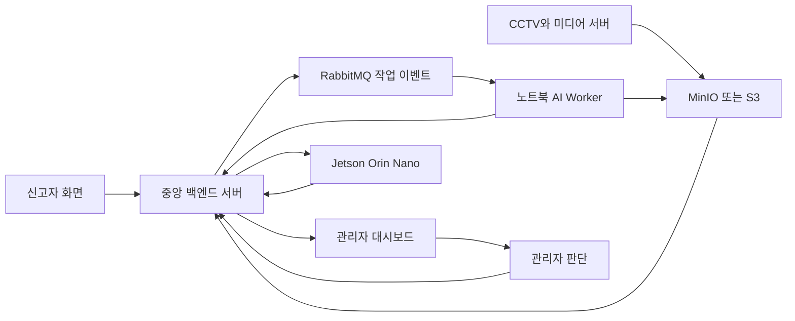

# EYES:ON U AI Worker 전체 제작·연결·학습 안내서

> 작성 기준일: 2026-08-10
> 저장소: `S15P11A204-deploy-ai-worker-env-fix`
> 기준 구현: ServerAI AI Worker (`hybrid-solider-clip-v1`)

## 이 문서를 먼저 읽어야 하는 이유

이 문서는 AI Worker를 처음 보는 사람도 전체 흐름을 이해할 수 있도록 작성한
설명서다. 특히 “모델을 학습했다”, “실험에서 잘 나왔다”, “현재 워커가 실제로
그 모델을 사용한다”는 서로 다른 말이라는 점을 먼저 기억해야 한다.

문서 안의 표시는 다음 뜻이다.

| 표시 | 뜻 |
| --- | --- |
| **현재 실행됨** | 현재 저장소의 코드와 설정에 들어 있고, 워커 실행 경로에서 사용되는 기능 |
| **계약·테스트 확인** | 실제 모델을 오래 돌리지 않아도 API, 데이터 형식, 오류 처리까지 자동 테스트로 확인한 기능 |
| **프록시 실험** | 공개 데이터나 제한된 CCTV 샘플에서 비교한 결과. 서비스 정확도와 같지 않음 |
| **연구 후보** | 코드는 있거나 실험 설계가 있지만 현재 기본 워커에 승격하지 않은 기능 |
| **미확정·차후** | 실제 가중치, 라벨, 운영 왕복이 더 필요해 아직 결론을 내릴 수 없는 기능 |

이 구분을 하는 이유는 간단하다. 예를 들어 사진 100장으로 90%가 나와도, CCTV
동영상에서 같은 사람의 여러 프레임이 섞인 시험이면 진짜 다른 날·다른 카메라에서
90%라는 뜻이 아닐 수 있다. 이 문서는 좋은 결과만 모아 보여 주지 않고, 결과가
어디까지 증명하는지도 함께 적는다.

---

## 1. 한 문장으로 설명하면 무엇인가

AI Worker는 **중앙 서버가 “이 시간 구간의 녹화 영상에서 신고된 인상착의와 비슷한
사람을 찾아 달라”고 일을 맡기면, 이 노트북 또는 지정된 GPU 컴퓨터에서 영상을
분석하고 후보 사진·시간·위치 정보를 중앙 서버에 돌려주는 프로그램**이다.

쉽게 비유하면 다음과 같다.

- 중앙 서버는 탐정 사무실의 접수 담당자다.
- RabbitMQ는 “새 사건이 접수되었다”는 호출벨이다.
- AI Worker는 영상을 실제로 돌려 보는 수사 보조원이다.
- YOLO는 화면 속 사람에게 네모 상자를 그리는 사람이다.
- ByteTrack은 프레임이 바뀌어도 “이 사람은 아까 그 사람”이라고 이어 붙이는
  메모장이다.
- CLIP과 SOLIDER는 신고 내용 또는 기준 사진과 비슷한 후보를 점수로 정렬한다.
- MinIO/S3는 영상과 후보 사진을 보관하는 창고다.
- 관리자는 후보를 보고 다음 조사 방향을 결정한다.

AI Worker는 후보를 **찾아 주는 역할**이지, 사람의 얼굴을 보고 법적으로 신원을
자동 확정하는 역할이 아니다. 점수가 높아도 비슷한 옷을 입은 다른 사람일 수
있으므로, 최종 서비스에서는 관리자 검토와 안전한 판정 규칙을 둔다.

---

## 2. 우리 프로젝트에서 각 장치가 맡는 일

### 2.1 전체 구성



### 2.2 역할표

| 구성 요소 | 하는 일 | 하지 않는 일 |
| --- | --- | --- |
| 신고자 화면 | 전화번호, 사건, 마지막 목격 시각·장소, 인상착의·기준 사진 입력 | 모델 추론 |
| 중앙 백엔드 | 사건과 녹화 작업 등록, 작업 상태 관리, 결과 저장, 후보·경로 화면 제공 | 노트북의 GPU로 영상 직접 분석 |
| 미디어 서버 | CCTV 스트림 수신, 녹화 세그먼트 생성 | 후보 최종 판정 |
| MinIO/S3 | 원본 녹화와 AI 근거 이미지 저장 | 어떤 사람이 실종자인지 판단 |
| RabbitMQ | 작업이 생겼다는 신호 전달과 지연 재처리 | 영상 저장·추론 |
| AI Worker | 녹화본의 지정 구간 다운로드, 사람 track 생성, 후보 점수 계산, 근거 업로드, 결과 콜백 | 관리자 대신 자동 신원 확정 |
| Jetson Orin Nano | 관할 카메라의 실시간 후보 탐색과 bbox/crop 전송 | 과거 영상 전체를 고성능으로 재검색 |
| 관리자 | 유력 후보 확인, 후보 확정·제외, 다음 구역 조사 결정 | 점수만 보고 무조건 확정 |

AI Worker와 Jetson을 나눈 이유는 속도와 위치가 다르기 때문이다. 과거 영상은
시간이 조금 걸려도 여러 구간을 순서대로 분석할 수 있으므로 Worker가 맡는다.
반대로 Jetson은 카메라 옆에서 계속 화면을 봐야 하므로 작은 모델과 실시간 처리가
중요하다.

---

## 3. 작업 하나가 끝나는 전체 과정

아래 순서는 현재 저장소의 워커 계약을 사람이 이해하기 쉽게 풀어 쓴 것이다.

### 3.1 접수와 작업 등록

1. 신고자가 실종자의 정보와 마지막 목격 시각을 입력한다.
2. 중앙 서버가 사건번호, 검색 조건, 카메라, 녹화본의 객체 키, 검색 시작·끝
   시간을 확인한다.
3. 중앙 서버가 분석 작업을 `QUEUED` 상태로 만든다.
4. 중앙 서버의 outbox가 작업 이벤트를 RabbitMQ에 발행한다.
5. RabbitMQ 메시지는 원칙적으로 “어떤 jobId를 깨워야 하는가”를 전달하는
   routing 신호다. 비밀번호나 서명 URL을 메시지에 넣지 않는 것이 안전하다.

### 3.2 Worker가 작업을 맡는 과정

6. 노트북의 AI Worker는 RabbitMQ에 계속 연결된 상태로 대기한다.
7. 메시지를 하나 받으면 `prefetch=1` 설정 때문에 한 GPU 프로세스가 작업 하나만
   잡는다.
8. Worker가 중앙 서버의 claim API를 호출하고 `X-Worker-Key`로 자신을 인증한다.
9. 중앙 서버는 작업을 이 Worker가 처리 중이라고 기록한다. 이를 lease라고 한다.
   lease는 “이 작업을 잠시 내가 맡았다”는 임대증과 같다.
10. 같은 작업을 이미 다른 Worker가 처리 중이면 Worker는 다시 추론하지 않고,
    정해진 지연 재처리 또는 안전한 ACK 규칙을 따른다.

### 3.3 영상 다운로드와 로컬 추론

11. Worker가 target API에서 검색 조건과 signed URL을 받는다. signed URL은
    영상 창고에서 특정 파일을 일정 시간 동안 읽을 수 있는 임시 열쇠다.
12. 기본 설정은 전체 원본을 무조건 받는 대신 `searchFromMs`부터 `searchToMs`까지
    필요한 구간을 FFmpeg로 잘라 로컬 임시 파일을 만드는 `segment` 방식이다.
13. 저장소가 시간 구간 읽기를 지원하지 않는 개발 환경에서만 `analyze` 방식으로
    전체 파일을 받을 수 있다. 그래도 실제 모델 분석은 요청된 시간 범위만 한다.
14. Worker가 영상에서 사람을 찾고, 프레임 사이의 같은 사람을 track으로 묶고,
    사람만 잘라 crop을 만든다.
15. CLIP, SOLIDER 같은 모델이 crop을 신고 문장 또는 기준 사진과 비교한다.
16. 한 프레임의 우연한 오판을 줄이기 위해 track 안의 여러 관측을 합쳐 후보 점수를
    계산한다.

동일 녹화본을 여러 작업이 다시 요청하는 경우에는 `recordingObjectKey`를 녹화본의
식별자로 사용한다. Worker는 이 키를 안전한 파일명으로 변환한 로컬 캐시와 sidecar
manifest를 확인한 뒤, 키·다운로드 모드·검색 구간·파일 크기·완료 여부가 모두 맞을
때만 재사용한다. 따라서 단순히 `job-*.window.mp4`라는 파일명이 같거나 비슷하다는
이유로 다른 영상을 재사용하지 않는다. 캐시가 검증되지 않으면 signed URL에서 다시
받는다.

### 3.4 결과 저장과 관리자 화면

17. Worker가 후보별 원본 프레임과 사람 crop을 업로드할 signed PUT URL을 중앙
    서버에서 받는다.
18. Worker가 이미지 파일을 MinIO/S3에 직접 업로드한다. 중앙 서버로 이미지 바이트를
    다시 중계하지 않아 서버 부담을 줄인다.
19. Worker가 후보의 `trackId`, 프레임 시점, bbox, similarity, 업로드된 객체 키를
    result API에 보낸다.
20. 중앙 서버가 결과를 DB에 저장하고 관리자 화면에 후보를 보여 준다.
21. Worker는 중앙 서버가 결과를 받았다는 응답을 확인한 뒤에만 RabbitMQ 메시지를
    ACK한다. 결과 콜백 전에 ACK하면, 프로그램이 죽을 때 작업이 사라질 수 있다.
22. 관리자 판단과 과거 후보 경로에 따라 중앙 서버가 다음 카메라·구역 작업을
    등록한다. Worker가 중앙 서버의 DB를 임의로 바꾸지는 않는다.

### 3.5 핵심 흐름 그림

```text
신고 접수
  -> 중앙 서버가 분석 job 생성
  -> RabbitMQ가 작업 신호 발행
  -> Worker가 메시지 수신
  -> claim과 lease
  -> target과 signed URL 조회
  -> 필요한 영상 구간을 로컬로 준비
  -> YOLO 사람 검출
  -> ByteTrack track 연결
  -> SOLIDER/CLIP 점수 계산
  -> 후보 frame/crop 업로드
  -> 중앙 서버 result 콜백
  -> DB와 관리자 후보 화면
  -> ACK
```

---

### 3.6 ServerAI 서비스 연계와 추론 경량화

현재 ServerAI의 실행 경로는 다음처럼 고정한다.

```text
중앙 서버
  -> RabbitMQ에 jobId routing 이벤트 발행
  -> 노트북/지정 Worker가 claim
  -> Worker가 중앙의 target API에서 녹화본 정보와 signed URL 조회
  -> 로컬 캐시 확인 후 필요한 구간만 준비
  -> YOLO11x + ByteTrack + SOLIDER/CLIP 추론
  -> 후보 crop/frame을 signed PUT으로 MinIO/S3에 업로드
  -> 중앙 result API에 후보·점수·좌표·시간 전달
  -> 중앙 DB와 관리자 화면에서 후보/경로 표시
```

중앙 서버는 영상 전체를 모델에 직접 넘기지 않는다. 중앙 서버는 사건·녹화본·작업
상태를 관리하고, Worker는 로컬 컴퓨터의 GPU/CPU에서 실제 영상을 분석한다.
RabbitMQ는 작업 신호를 전달하고, 영상·이미지는 MinIO/S3가 보관한다. Jetson은 이
과거 녹화본 검색 Worker와 분리된 실시간 카메라 후보 탐지 경로다.

경량화는 정확도를 먼저 훼손하지 않는 순서로 적용했다.

1. `searchFromMs`~`searchToMs` 구간만 FFmpeg로 준비한다.
2. Worker 생명주기 동안 YOLO, CLIP, SOLIDER를 캐시해 작업마다 모델을 다시 읽지 않는다.
3. YOLO는 사람 class만 처리하고 ByteTrack으로 같은 관측을 track 단위로 묶는다.
4. track마다 최대 12개 crop을 샘플링하고, 상위 3개 프레임 점수를 최종 집계에 사용한다.
5. 기준 사진이 있으면 SOLIDER를 중심으로, 인상착의 prompt가 있으면 CLIP을 사용하며,
   둘 다 있으면 SOLIDER 0.75와 CLIP 0.25의 검증된 기본 조합을 사용한다.
6. FP16·INT8·TensorRT 가중치 변환은 별도 실험 항목이며, 현재 ServerAI 기본 경로의
   검증 완료 최적화라고 표현하지 않는다.

이 구조 덕분에 모델을 바꿀 때 중앙 API·RabbitMQ·MinIO 계약은 유지하고
`CandidateRuntimeEngine` 또는 모델 설정만 교체할 수 있다.

## 4. 저장소 안에서 기능이 어디에 있는가

| 위치 | 내용 |
| --- | --- |
| `src/qwen_backend/recording_job_executor.py` | claim된 작업의 다운로드 -> 추론 -> 증거 업로드 -> complete/fail 흐름 |
| `src/qwen_backend/central_client.py` | 중앙 API 호출, 응답 envelope 해제, 인증 헤더, 결과 검증 |
| `src/qwen_backend/rabbit_consumer.py` | RabbitMQ 연결, 메시지 소비, `prefetch=1` |
| `src/qwen_backend/rabbit_worker.py` | 메시지 하나를 어떤 경로로 처리하고 언제 ACK/DLQ/retry할지 결정 |
| `src/qwen_backend/rabbit_retry.py` | 오류를 ACK, 지연 retry, dead-letter로 분류 |
| `src/qwen_backend/worker_protocol.py` | API 요청·응답의 Pydantic 데이터 모델과 불변식 |
| `src/qwen_backend/worker_transfer.py` | signed 녹화 다운로드와 후보 증거 업로드 조정 |
| `src/qwen_backend/recording_cache.py` | `recordingObjectKey`·검색 구간·파일 크기를 검증하는 로컬 녹화본 캐시와 manifest |
| `src/qwen_backend/storage_transfer.py` | URL 검증, FFmpeg 구간 추출, 제한된 파일 전송 |
| `src/qwen_backend/solider_clip_engine.py` | 현재 후보 모델 조합과 모델 cache |
| `src/qwen_backend/video_tracks.py` | YOLO track 결과에서 프레임·사람 crop 추출 |
| `src/qwen_backend/candidate_runtime.py` | 모델 엔진과 워커 사이의 교체 가능한 입력·출력 계약 |
| `src/qwen_backend/worker_status*.py` | GUI 상태창과 진행 단계 표시 |
| `scripts/Start-NotebookAiWorker.ps1` | 환경 파일을 읽고 상주 Worker를 시작하는 PowerShell 실행기 |
| `scripts/Build-DesktopAiWorkerLauncher.ps1` | 바탕화면 GUI 실행 파일 생성기 |
| `configs/realtime_model_manifest.json` | 가중치 SHA-256과 용도 목록 |
| `configs/model_selection.json` | 모델 선택 상태, 평가 단위, 승격 조건 |
| `docs/` | 역할, API, 모델, 학습, 실험, 운영 설명 |
| `tests/` | API 계약, 오류, retry, 모델 설정, 데이터 보호, GUI 상태 테스트 |

`hybrid-solider-clip-v1`은 하나의 거대한 신경망 이름이 아니다. 서로 잘하는 일이
다른 모델을 한 파이프라인으로 묶은 **조합 이름**이다. 따라서 모델을 바꿀 때
중앙 서버 API와 결과 형식을 바꾸지 않고 `CandidateRuntimeEngine` 뒤쪽만 교체할
수 있다.

---

## 5. 현재 후보 탐색 모델과 원리

### 5.1 YOLO11x: 사람 바운딩 박스 찾기

YOLO는 한 화면을 보고 “사람이 어디에 있는가?”를 빠르게 찾는다. 결과는 보통
`left, top, right, bottom` 네 숫자로 된 상자와 검출 신뢰도다. 현재 기본 설정은
`models/yolo11x.pt`, 사람 클래스만 분석하고 검출 confidence 기본값은 `0.25`다.

YOLO가 하는 일은 “이 사람이 실종자인가?”가 아니다. 화면에 사람 후보를 빠르게
발견하는 첫 단계일 뿐이다. 사람이 아닌 배경을 CLIP과 SOLIDER에 넣지 않도록 하여
계산량과 오탐을 줄인다.

> 주의: 일부 오래된 문서에는 속도 중심 `YOLO11s`라고 적힌 부분이 있다. 현재
> 소스의 `CandidateEngineSettings`와 `.env.example`의 기본값은 정확도 우선
> `YOLO11x`다. 실제 배포에서는 가중치 파일과 manifest 해시를 함께 확인해야 한다.

### 5.2 ByteTrack: 프레임 사이의 사람 이어 붙이기

CCTV 영상은 사진이 한 장씩 들어오는 것이 아니라 빠르게 연속해서 들어온다.
ByteTrack은 첫 프레임의 사람 상자와 다음 프레임의 사람 상자를 비교해 같은
사람에게 같은 `track_id`를 붙인다.

```text
프레임 1: 사람 A -> track 7
프레임 2: 조금 움직인 사람 A -> track 7
프레임 3: 잠깐 가려졌지만 다시 나타난 사람 -> 가능한 범위에서 track 7 유지
```

현재 `video_tracks.py`는 다음 일을 한다.

- 사람이 아닌 class는 제외한다.
- `bytetrack.yaml`을 사용한다.
- 기본 `frame_stride=3`으로 처리한다.
- 같은 track에서 약 `0.75초`보다 가까운 crop은 중복 저장하지 않는다.
- 한 track당 최대 `12`개 crop을 저장한다.
- crop 상자에 기본 `5%` margin을 추가한다.
- 원본 프레임과 crop을 로컬 job output 폴더에 저장한다.

이 방식은 “프레임마다 같은 사람을 10번 중앙 서버에 보내는 문제”를 줄인다.
다만 `track_id=7`은 한 영상 안에서의 임시 번호이지, 모든 영상에서 같은 사람을
뜻하는 전역 신분증이 아니다. 전역 동일인 판단은 별도의 ReID·gallery·held-out
평가가 필요하다.

### 5.3 CLIP ViT-L/14: 문장과 사진의 의미 비교

CLIP은 사진과 문장을 각각 숫자 벡터로 바꾼 뒤 두 벡터가 얼마나 가까운지 계산한다.

예를 들어 신고 문장이 다음과 같다고 하자.

```text
회색 반팔, 검은색 바지, 안경, 넘긴 머리를 한 남자
```

CLIP은 crop 사진과 이 문장을 비교해 의미 유사도를 계산한다. 현재 코드에서는
비슷한 점수를 `[-1, 1]`에서 `[0, 1]` 범위로 옮겨 후보 정렬에 사용한다. 이 값은
자동으로 보정된 확률이 아니다. 0.8이라고 해서 “80% 확률로 실종자”라고 읽으면
안 된다.

CLIP이 잘하는 것과 약한 것은 다르다.

- 강점: 전체 인상착의 문장, 큰 색상·복장·물체 의미, text-to-image 검색
- 약점: CCTV의 작은 안경, 흐린 질감, 조명에 따른 색상, 비슷한 옷을 입은 사람의
  미세한 차이, 법적 신원 확인

### 5.4 SOLIDER-ReID Swin-Base: 기준 사진과 사람 crop 비교

ReID는 “같은 사람이 다른 카메라나 시간에 다시 나타났는가?”를 찾는 분야다.
SOLIDER는 사람 사진을 긴 숫자 벡터인 embedding으로 바꾸고, 기준 사진과 crop의
벡터 방향이 가까운지 cosine 유사도로 비교한다.

현재 기본 checkpoint는 `models/solider_reid/swin_base_msmt17.pth`이며,
SOLIDER runtime checkout은 고정 commit `8c08e1c3255e8e1e51e006bf189e52cc57b009ed`
를 사용하도록 검증한다. 기준 사진이 없는 현재 `RecordingAnalysisWorkerController`
경로에서는 Worker가 `reference_path=None`으로 요청을 만들기 때문에 내부 후보
경로가 CLIP-only가 될 수 있다. 기준 사진을 받는 Device API 경로에서는 SOLIDER와
CLIP을 함께 사용할 수 있다.

두 점수가 모두 있으면 현재 조합의 기본 가중치는 다음과 같다.

```text
combined = (0.75 * SOLIDER_score + 0.25 * CLIP_score) / 1.0
```

track의 점수는 최고 점수 하나만 믿지 않고 기본적으로 점수가 높은 상위 3개
프레임의 평균으로 만든다. 그 뒤 전체 track 중 Top-20을 중앙 서버에 반환한다.

### 5.5 Qwen: 설명·속성 분석 후보이지 현재 Worker의 필수 최종 판정기가 아님

Qwen 계열 VLM은 이미지와 질문을 읽고 JSON 형태로 색상, 옷, 물건, 후보 판정을
설명할 수 있다. Qwen을 사용하면 “왜 이 후보를 검토해야 하는가?”를 사람이 읽기
쉬운 구조화 결과로 만들 수 있다.

하지만 현재 저장소의 녹화 작업 핵심 경로는 `recording_job_executor.py`에서
`CandidateRuntimeEngine`을 실행한다. 즉, 현재 워커의 핵심 후보 생성 단계가 매
작업마다 Qwen을 필수로 호출하는 구조는 아니다. Qwen3-VL-8B, Qwen3.5-9B,
Qwen2.5-VL-7B는 서버 속성·설명·연구 비교 후보로 문서화되어 있으며, 프로젝트
CCTV track-heldout에서 자동 신원 정확도가 검증되어 production primary로 승인된
상태는 아니다.

현재 안전한 역할은 다음과 같다.

- 낮은 신뢰도 후보의 설명
- 여러 모델 결과가 충돌할 때 검토용 요약
- 오프라인 teacher-like 라벨 후보 생성 후 사람 검수
- 결정 엔진이 이미 계산한 증거를 사람이 이해하기 쉬운 JSON으로 변환

Qwen 한 번의 자연어 답변을 그대로 “최종 진실”로 쓰지 않는 이유는 답변이
그럴듯해도 사진에서 확인할 수 없는 내용을 만들어 낼 수 있기 때문이다.

### 5.6 Grounding DINO, SAM2.1, Florence-2, Sonnet 5의 위치

| 모델 | 원래 잘하는 일 | 현재 AI Worker 기본 온라인 경로 |
| --- | --- | --- |
| Grounding DINO | 문장으로 지정한 객체의 box 찾기 | 오프라인 box teacher/geometry 후보. 현재 워커 필수 모델 아님 |
| SAM2.1 | 객체 mask와 영상 tracking 보조 | 오프라인 mask·track 라벨 생성 후보. 현재 워커 필수 모델 아님 |
| Florence-2 | 이미지 설명·속성·OCR 등 멀티태스크 | 오프라인 속성 라벨 후보. `QWEN_FLORENCE_ENABLED=false`가 기본 |
| Sonnet 5 | 강한 외부 VLM teacher-like 응답 | 별도 CLI response-level 라벨 pilot. 현재 온라인 워커 모델 아님 |
| NanoOWL/CLIP 계열 | Jetson에서 가벼운 실시간 후보 검색 | Jetson 별도 경로. 노트북 과거 영상 Worker와 같은 모델이 아님 |

Grounding DINO와 SAM2.1의 결과를 학습 데이터에 넣을 수는 있지만, 모델 가중치와
원본 영상이 준비되지 않은 상태에서 실행했다고 기록하지 않았다. 현재
`annotation_cli`의 `manifest` 경계는 이미 생성되고 검수된 geometry 결과를 엄격한
형식으로 읽는 단계다.

---

## 6. 현재 Worker가 실제로 사용하는 설정

현재 `CandidateEngineSettings`의 기본값은 다음과 같다. 환경 파일에 값이 있으면
검증된 범위 안에서 덮어쓸 수 있다.

| 항목 | 기본값 | 의미 |
| --- | --- | --- |
| `model_key` | `hybrid-solider-clip-v1` | 후보 엔진 계약 이름 |
| `device` | `cuda` | GPU 사용 기본값 |
| YOLO weights | `models/yolo11x.pt` | 사람 검출 |
| tracker | `bytetrack.yaml` | 사람 track 연결 |
| SOLIDER checkpoint | `models/solider_reid/swin_base_msmt17.pth` | 기준 사진 ReID |
| SOLIDER root | `external/SOLIDER-REID-runtime-8c08e1c` | 고정 runtime 코드 |
| CLIP | `openai/clip-vit-large-patch14` | 인상착의 text-image 비교 |
| CLIP revision | `32bd64288804d66eefd0ccbe215aa642df71cc41` | 재현용 고정 revision |
| `top_k` | `20` | 반환할 최대 track 수 |
| `max_crops_per_track` | `12` | 한 사람 track에서 저장할 최대 crop 수 |
| detector confidence | `0.25` | YOLO 사람 검출 기준 |
| `frame_stride` | `3` | 몇 프레임마다 추적 모델을 호출할지 |
| sample interval | `0.75`초 | 같은 track crop 저장 간격 |
| crop margin | `0.05` | 사람 상자 주변 여유 |
| SOLIDER weight | `0.75` | 기준 사진 점수 비중 |
| CLIP weight | `0.25` | 문장 점수 비중 |
| top frame aggregation | `3` | track 상위 프레임 평균 개수 |
| ReID batch size | `32` | GPU 추론 묶음 크기 |

모델은 Worker 생명주기 동안 cache된다. 첫 작업에서는 YOLO, CLIP, SOLIDER를 GPU나
CPU 메모리에 올리는 시간이 들지만, 다음 작업에서는 같은 프로세스가 재사용한다.
`cache_loads`와 `cache_hits`가 상태 창과 로그에 남으므로 “매 작업마다 모델을
다시 로딩하는지” 확인할 수 있다.

가중치 파일은 `configs/realtime_model_manifest.json`에 기록된 SHA-256과 일치해야
한다. 모델 파일이 바뀌었는데 manifest를 같이 바꾸지 않으면 실행을 막는다. 이는
누군가 실수로 다른 파일을 넣어 결과가 변하는 일을 줄이는 장치다.

---

## 7. 중앙 서버와 AI Worker가 맞춰야 하는 API 계약

### 7.1 기본 Worker Controller 경로

현재 주 계약은 중앙 서버의 `RecordingAnalysisWorkerController` 계열 내부 API다.

| 순서 | HTTP | 경로의 의미 | 인증 |
| --- | --- | --- | --- |
| 1 | `POST` | `/api/v1/internal/recording-analysis-jobs/{jobId}/claim` | `X-Worker-Key` |
| 2 | `GET` | `/api/v1/internal/recording-analysis-jobs/{jobId}/target` | Worker Key + 있으면 claim token |
| 3 | `POST` | `/api/v1/internal/recording-analysis-jobs/{jobId}/heartbeat` | Worker Key + 있으면 claim token |
| 4 | `POST` | `/api/v1/internal/recording-analysis-jobs/{jobId}/upload-urls` | Worker Key + 있으면 claim token |
| 5 | signed `PUT` | 중앙이 준 MinIO/S3 URL | signed URL 자체 |
| 6 | `POST` | `/api/v1/internal/recording-analysis-jobs/{jobId}/result` | Worker Key + 있으면 claim token |
| 7 | `POST` | `/api/v1/internal/recording-analysis-jobs/{jobId}/fail` | Worker Key + 있으면 claim token |

여기서 `leaseToken`은 백엔드 버전에 따라 있을 수도, 없을 수도 있다. 현재 Worker
프로토콜은 선택 필드로 받아들이고, 없다고 즉시 실패시키지 않는다. 중앙 서버의
소유권 확인은 기본적으로 `X-Worker-Key`와 `claimedBy` 계약에 맞춘다.

### 7.2 응답 envelope와 구형 필드 호환

중앙 응답이 다음처럼 포장될 수 있다.

```json
{
  "data": {
    "jobId": 10,
    "status": "RUNNING",
    "duplicate": false
  }
}
```

Worker는 먼저 `data`를 꺼낸 뒤 claim 모델에 넣는다. 중앙이 `disposition`을 보내지
않고 `duplicate`만 보내는 구버전 응답이면 다음처럼 변환한다.

```text
duplicate=false -> disposition=CLAIMED
duplicate=true  -> disposition=LEASE_HELD
```

이 변환은 모델의 의미를 바꾸는 것이 아니라, 같은 뜻을 가진 두 API 버전을 한동안
함께 이해하기 위한 호환 계층이다. 파싱에 실패하면 실제 받은 필드 목록과 Pydantic
오류를 로그에 남기고 dead-letter한다. 비밀값이나 signed URL 전체는 로그에 남기지
않는다.

### 7.3 현재 Device API 호환 경로

저장소에는 기존 미디어 서버와의 호환을 위한 별도 경로도 있다.

```text
POST /api/v1/device/ai/jobs/claim
POST /api/v1/device/ai/jobs/{jobId}/heartbeat
POST /api/v1/device/ai/jobs/{jobId}/complete
POST /api/v1/device/ai/jobs/{jobId}/fail
```

이 경로는 `X-Device-Key`와 `leaseToken`을 사용하는 계약이다. 여기서 중요한 점은
**Device Key와 Worker Key를 같은 키라고 가정하면 안 된다는 것**이다.

- `X-Worker-Key`: `RecordingAnalysisWorkerController`용 Worker 인증
- `X-Device-Key`: 기존 디바이스/미디어 서버 계약용 인증
- `X-Worker-Claim-Token`: 백엔드가 발급한 lease token이 있을 때만 추가

현재 `auth_mode=worker`가 기본이며, 실제 중앙 서버가 어느 컨트롤러를 노출하는지에
따라 환경 설정으로 경로를 선택한다. 백엔드 코드를 임의로 바꾸어 키 의미를 섞지
않는 것이 안전하다.

---

## 8. RabbitMQ 연결과 재처리 원리

### 8.1 기본 큐

현재 기본 설정은 다음과 같다.

```text
main exchange: search.target.exchange
main routing:  search.target.recording.created
main queue:    search.target.recording.queue
prefetch:      1
retry exchange: search.target.recording.retry.exchange
retry buckets:  5s, 15s, 30s, 60s, 300s
max retry attempts: 20
```

`prefetch=1`은 Worker 하나가 RabbitMQ에서 메시지를 여러 개 미리 가져와 GPU
작업을 쌓아 두지 않게 한다. 한 작업의 lease와 메모리를 관리하기 쉬워진다.

### 8.2 ACK, retry, dead-letter

| 상황 | Worker 동작 |
| --- | --- |
| 정상 complete 응답 확인 | 메시지 ACK |
| 이미 성공·실패·취소된 오래된 메시지 | 추가 추론 없이 ACK |
| 다른 Worker가 lease를 보유 | 정해진 지연 후 retry. retry 예산은 보통 소비하지 않음 |
| 네트워크 오류·HTTP 5xx | TTL retry queue로 지연 재발행 |
| 형식 오류·인증 오류·영구적인 4xx | DLQ로 이동 |
| `CASE_NOT_SEARCHABLE` | 사건이 검색 상태가 될 수 있으므로 명시적 지연 retry |

무조건 `requeue=true`만 하면 RabbitMQ가 같은 작업을 매우 빠르게 다시 주어 큐가
막힐 수 있다. 반대로 모든 4xx를 즉시 버리면 중앙 서버가 사건을 아직
`SEARCHING`으로 바꾸기 전 발생한 일시적인 업무 상태 오류도 사라진다. 그래서
`rabbit_retry.py`에 재시도할 비즈니스 오류를 좁게 allowlist로 두었다.

### 8.3 실제로 발견하고 고친 문제

관찰된 job 10 로그의 핵심은 다음과 같았다.

```text
claim HTTP 200
target HTTP 200
recording download finished elapsed_ms=4864
candidate model cached component=YOLO
local inference finished candidates=3 elapsed_ms=24878
evidence upload URLs HTTP 200
MinIO/S3 PUT HTTP 200
result POST HTTP 422
CentralWorkerError: Case is not searchable
```

즉, 모델 추론이나 영상 다운로드가 실패한 것이 아니라 **중앙 서버가 후보 결과를
저장하려는 순간 사건 상태가 아직 검색 가능 상태가 아니어서 422를 반환한 것**이다.
예전 Worker는 4xx를 모두 즉시 DLQ로 보내 작업을 잃을 수 있었다.

현재 Worker에서는 `CASE_NOT_SEARCHABLE`만 명시적으로 retry 대상으로 분류했다.
인증 실패나 잘못된 요청까지 모두 재시도하지 않도록 범위를 좁혔다.

이미 DLQ로 이동한 작업은 Worker가 사건 상태를 바꿀 수 없다. 중앙 운영자가 사건을
`SEARCHING`으로 활성화한 뒤 RabbitMQ 재발행 또는 관리자 retry를 해야 한다. 이
복구 절차를 문서에 적는 이유는 Worker 코드만으로 과거에 사라진 메시지를 되살릴
수 없기 때문이다.

---

## 9. 다운로드, 업로드, 결과의 보안

### 9.1 signed URL

중앙 서버는 원본 영상의 실제 저장소 비밀번호를 Worker에 알려 주지 않고, 짧은
시간만 유효한 signed URL을 준다. Worker는 다음 규칙을 지킨다.

- URL은 `http` 또는 `https`만 허용한다.
- URL을 로그에 그대로 출력하지 않는다.
- 파일 크기 상한을 확인한다.
- URL이 만료되면 같은 작업의 target을 한 번 새로 받아 재시도한다.
- 로컬 절대 경로와 서버가 이해할 객체 키를 섞지 않는다.
- 결과에는 로컬 `C:\...` 경로가 아니라 중앙이 이해할 객체 키만 보낸다.

### 9.2 후보 증거 업로드

후보마다 원본 frame과 사람 crop이 필요하다. Worker는 중앙 서버에 upload URL을
요청하고, 받은 URL로 파일을 올린 다음 result payload에 다음 정보를 넣는다.

```text
candidateKey
frameOffsetMs
similarity
cropObjectKey
boundingBox
attributeSummary
```

현재 업로드는 한 번에 지나치게 많은 URL을 요청하지 않도록 배치로 나누고,
이미지 업로드 동시성 기본값은 4이다. 업로드가 끝나기 전에는 complete 콜백을
보내지 않는다.

---

## 10. GUI와 상주 Worker

CLI만 실행하면 사용자가 “지금 대기 중인지, 영상 분석 중인지” 알기 어렵다. 그래서
상주 Worker를 바탕화면에서 볼 수 있는 GUI 상태창으로 만들었다.

### 10.1 화면에 표시하는 단계

```text
대기 중
-> 작업 수신
-> 작업 점유
-> target 조회
-> 녹화본 다운로드
-> 로컬 모델 추론
-> 후보 이미지 업로드
-> 중앙 서버 결과 전송
-> 완료 또는 재시도/실패
```

GUI의 일반 Python `INFO` 로그는 오류처럼 보이지 않게 표시하고, 실제 `ERROR`,
`CRITICAL`, `Traceback`, `Exception`, 중앙 완료 미확인, lease 손실만 오류 색상으로
강조한다. signed URL의 `X-Amz-Signature`, `Credential`, `Security-Token` 값은
화면 로그에서 가린다.

### 10.2 실행 예

프로젝트의 `ai-worker` 폴더에서 다음처럼 실행한다.

```powershell
uv sync --extra realtime --frozen
.\scripts\Start-NotebookAiWorker.ps1 `
  -EnvFile <worker-env-file>
```

바탕화면 실행 파일을 만들 때는 다음 스크립트를 사용한다.

```powershell
powershell.exe -NoProfile -ExecutionPolicy Bypass -File `
  .\scripts\Build-DesktopAiWorkerLauncher.ps1 `
  -OutputPath C:\Users\SSAFY\Desktop\EyesOnU-AI-Worker.exe
```

실행 전에 모델 파일, FFmpeg, Worker Key, 중앙 URL, RabbitMQ URL을 점검한다.
키 값 자체는 문서나 Git에 넣지 않는다.

---

## 11. AI 학습과 증류는 정확히 무엇인가

### 11.1 파인튜닝

이미 세상에 공개된 모델은 많은 일반 사진을 보고 기본 능력을 배운다. 파인튜닝은
그 모델에게 우리 문제의 예시를 추가로 보여 주어, “CCTV에서 회색 상의와 검은
바지를 어떻게 읽는가” 같은 세부 습관을 조정하는 것이다.

```text
기본 모델
  + 우리 데이터와 정답
  -> 손실 계산
  -> 가중치 조금 수정
  -> validation으로 확인
  -> test로 최종 확인
```

### 11.2 지식 증류

Teacher는 큰 모델 또는 여러 모델을 의미하고, Student는 배포하려는 작고 빠른
모델이다. Teacher가 만든 답을 Student가 따라 배우면 Student가 Teacher의 일부
지식을 물려받을 수 있다.

#### 전통적인 logit 증류

Teacher가 각 클래스에 대해 “이 답일 가능성”을 숫자로 출력하고 Student가 그
숫자 분포까지 흉내 낸다.

```text
teacher logits -> soft target
정답 label    -> hard target
student 출력  -> 두 target을 동시에 따라감
```

#### 현재 저장소의 실제 증류

현재 구현의 중심은 전통적인 logit만 복사하는 구조가 아니라 **검수된 hard label을
사용하는 데이터 증류와 response-level 학습**이다.

1. 사람 crop과 영상 위치를 준비한다.
2. CLIP, Grounding DINO, SAM2.1, Florence, Sonnet 또는 사람이 후보 속성을
   제안할 수 있다.
3. 사람이 색상, 옷, 객체 속성, 후보 판정을 검수한다.
4. `DistillationSample` JSONL에 이미지 hash, source kind, teacher 이름, prompt
   version, 검수자, confidence, bbox, mask, track ID를 저장한다.
5. 승인된 샘플만 Qwen 형식 JSONL로 변환한다.
6. Student가 사진을 보고 같은 JSON 구조를 출력하도록 SFT 또는 LoRA 학습을 한다.

따라서 현재 증류를 “Sonnet의 내부 logit을 그대로 CLIP에 복사했다”고 말하면
정확하지 않다. Sonnet pilot은 구조화된 응답 라벨을 만드는 teacher-like 실험이며,
실제 Sonnet 내부 logit을 가져온 실험이 아니다.

### 11.3 데이터 레코드의 안전 장치

`DistillationSample`은 다음 정보를 요구한다.

```json
{
  "schemaVersion": "distillation-v1",
  "sampleId": "cam01-000001",
  "imagePath": "cam01/000001.jpg",
  "attributes": {
    "color": "red",
    "clothing": "jacket",
    "objectName": "person"
  },
  "decision": "match",
  "confidence": 0.91,
  "provenance": {
    "sourceKind": "human",
    "teacherModel": "human-reviewed",
    "promptVersion": "candidate-v1",
    "sourceHash": "실제 이미지의 SHA-256 64자리",
    "approvalStatus": "approved",
    "reviewedBy": "operator-001"
  },
  "geometry": {
    "bbox": {"bbox2d": [120, 80, 420, 780]},
    "trackId": 17
  }
}
```

학습 변환 전에 다음을 검사한다.

- 이미지가 지정한 image root 밖으로 나가지 않는가?
- 현재 이미지 SHA-256이 레코드에 적힌 값과 같은가?
- bbox의 좌표 순서가 맞는가?
- teacher와 prompt version이 allowlist에 있는가?
- 승인 상태가 `approved`이거나 teacher agreement가 있는가?
- `match`, `review`, `reject` 중 하나의 결정인가?

이 검사를 통과해야 Qwen 학습 JSONL이 만들어진다. 이 과정은 잘못된 라벨이나
몰래 바뀐 이미지를 학습 데이터에 넣는 것을 막는다.

---

## 12. 사용한 데이터와 데이터 준비 방법

### 12.1 프로젝트 영상

프로젝트에서 제공된 여러 MOV/MP4 CCTV 촬영본을 기준으로 사람 crop과 track을
만들었다. 현재 저장된 평가 manifest의 주요 수치는 다음과 같다.

| 항목 | 기록된 수치 또는 상태 |
| --- | --- |
| 프로젝트 source video | 6개로 기록된 proxy 평가 묶음 |
| 다인 영상 | 3개 |
| 추출된 사람 crop | 395개 |
| raw track fragment | 57개 |
| 사람이 검수한 안정 track | 10개 |
| 프로젝트 same-camera temporal proxy | 10 identity-like tracks, Rank-1 1.0 |
| 프로젝트 cross-camera identity label | 없음 또는 불충분하여 승격 불가 |

여기서 10개 track의 1.0은 같은 촬영 맥락 안에서 분리한 제한적 proxy다. “다른
카메라·다른 날의 10명도 100%”라는 뜻이 아니다.

프로젝트 영상에 여러 사람이 보이더라도, 사람 A가 영상 1과 영상 2에서 같은 사람인지
독립 검수자가 `identityGroupId`로 연결하지 않으면 cross-camera identity test가
되지 않는다. 이 라벨이 없어서 일반화 85%를 마음대로 확정하지 않았다.

### 12.2 PA-100K

PA-100K는 보행자 속성 데이터다. 모자, 안경, 상의·하의, 가방, 소매 등 26개
속성 label을 사용해 CLIP 또는 SOLIDER의 속성 head를 학습하는 데 사용했다.
공식 split을 기준으로 기록된 대규모 실험 레시피는 train 80,000, validation
10,000, test 10,000이다.

중요한 한계:

- PA-100K에는 우리 프로젝트의 사건번호가 없다.
- `identityGroupId`, CCTV track, 카메라 시간 분리가 없다.
- PA-100K 속성 mA나 InsF1은 실종자 동일인 Rank-1과 같은 지표가 아니다.

따라서 PA-100K에서 85%가 나와도 “CCTV에서 같은 사람을 85% 찾는다”는 뜻이
아니다. 속성 모델의 보조 학습과 상한선 확인용으로만 사용한다.

### 12.3 CHIRLA 공개 CCTV proxy

CHIRLA는 CCTV ReID 비교를 위한 공개 proxy로 사용했다. 여러 모델을 같은 strict
protocol에 넣기 위해 query와 같은 카메라·같은 sequence의 gallery를 제외하는
평가를 했다. 기록상 identity는 11명이고 strict query는 95개다.

이 데이터는 프로젝트와 비슷한 CCTV 조건을 보는 데 유용하지만, 우리 관할 카메라의
실제 배치·조명·옷·촬영 높이를 완전히 대신하지는 않는다.

### 12.4 PRID2011 및 기타 공개 ReID proxy

PRID2011은 cross-camera ReID와 distractor를 확인하는 공개 proxy로 사용했다. 이
실험은 “기준 사진이 있는 경우, 같은 사람과 방해 인물을 구분하는가”를 보는 데
도움이 되지만 프로젝트 서비스의 실제 85%를 증명하지 않는다.

ServerAI 모델 비교와 데이터 보강에는 아래 공개 데이터와 직접 촬영 데이터를
구분해 사용했다. 공개 데이터의 수치는 프로젝트 CCTV의 identity 정확도로 합치지
않고, 각 데이터셋의 목적에 맞는 proxy 지표로만 기록한다.

| 데이터 | 성격 | ServerAI에서의 사용 |
| --- | --- | --- |
| 프로젝트 직접 촬영 영상 (`IMG_*.mov`, `20260729_*.mp4` 등) | 우리 CCTV 시야·높이·조명에 맞춘 자체 데이터 | 사람 crop·track·실행 smoke test와 프로젝트 도메인 점검. identity/camera/time held-out 라벨이 충분하지 않으므로 일반화 85% 근거로 단독 사용하지 않음 |
| **PA-100K** | 대규모 보행자 속성 데이터셋 | 모자·안경·가방·상의/하의 등 26개 속성 head의 파인튜닝·mA/InsF1/macro-F1 비교 |
| **Simuletic/CCTV-Pedestrian-1K-Person-Attribute-Dataset** | CCTV 보행자 crop·속성 데이터 | 프로젝트 촬영과 비슷한 CCTV 인물 crop을 보강하고 속성/도메인 적응 실험에 사용 |
| **CHIRLA** | 공개 CCTV cross-camera ReID proxy | identity/camera·sequence held-out Rank-1, Recall@5 비교 |
| **PRID2011** | 공개 cross-camera video ReID·distractor proxy | multi-shot gallery/query, known identity·distractor·open-set 판단 검증 |
| **Market-1501 / Market1501-attributes** | 공개 person ReID·속성 비교 데이터 | FastReID/feature adapter와 ReID·속성 head 비교 및 공개 데이터 기준선 확인 |

각 결과는 데이터셋 이름·split·metric이 다르면 서로 같은 숫자처럼 합치지 않는다.
현재 문서에서 PETA 등 다른 데이터셋을 실제 학습에 사용했다고 적지 않은 이유도
동일하다. 다운로드·라벨 검수·split·실험 결과가 저장소에 함께 남은 데이터만 실제
사용 데이터로 분류한다.

### 12.5 라벨이 필요한 이유

영상에서 사람이 10명 보인다는 것과 identity가 10개라는 것은 다르다.

```text
사람이 많이 찍힌 영상
  != 같은 사람인지 표시된 gallery/query
  != 독립 검수된 속성 정답
  != camera/time held-out test
```

진짜 일반화를 측정하려면 최소한 다음이 필요하다.

- 10명 이상 identity group
- 각 identity의 여러 카메라 또는 시간대
- 같은 옷의 다른 사람 distractor
- query와 gallery의 시간·카메라 분리
- 사람별 track ID와 frame timestamp
- 색상·복장·안경·가방 등 독립 검수 속성
- train/validation/test에 같은 사람의 인접 프레임이 섞이지 않는 split

---

## 13. 파인튜닝·증류 실험을 실제로 어떻게 했는가

### 13.1 CLIP ViT-L/14 hard-label head

CLIP 전체를 처음부터 다시 학습한 것이 아니라, CLIP image feature를 뽑고 그 위에
속성 분류 head를 붙이는 실험이 구현되어 있다. head는 속성별 binary logit을
출력하고, class imbalance를 고려한 weighted BCE를 사용한다.

실험 흐름은 다음과 같다.

1. PA-100K train/validation/test split을 읽는다.
2. CLIP ViT-L/14의 image feature를 추출한다.
3. 26개 속성 head를 학습한다.
4. validation에서 속성별 threshold를 0.20부터 0.80 범위에서 선택한다.
5. test에서 mA, InsF1, label macro-F1, instance IoU를 기록한다.
6. hard target과 SOLIDER teacher logits를 섞은 KD head도 별도로 비교한다.

이 실험의 목적은 “CLIP이 속성을 얼마나 더 잘 읽게 만들 수 있는가”이지,
“이 head만으로 CCTV 동일인을 확정하는가”가 아니다.

### 13.2 SOLIDER 속성 head 파인튜닝

SOLIDER Swin-Base backbone 위에 PA-100K 속성 head를 붙이는 방법을 비교했다.
기록된 한 원격 arm은 30 epoch full fine-tune으로 PA-100K test `mA=0.7733`,
`InsF1=0.8667`, label macro-F1 `0.6346`을 기록했다. 이 값은 실행 arm의
속성 metric이며 CCTV identity metric이 아니다.

또 다른 Sonnet response-level 보조 loss 실험은 PA-100K 일부 지표를 올렸지만,
같은 group-heldout CCTV attribute proxy에서 baseline `0.84615` 대비 Sonnet
`0.83077`로 내려갔다. 저장된 결과의 결론은 “Sonnet을 붙이면 항상 좋아진다”가
아니라 “현재 proxy에서는 promotion하지 않는다”다.

### 13.3 Qwen LoRA SFT recipe

Qwen 증류 문서와 training runner에 기록된 서버용 기본 recipe는 다음과 같다.
이 값들은 **runner에 설정된 학습 레시피**이며, 모든 항목을 실제 운영 weight로
학습·승격했다는 뜻은 아니다.

| 항목 | 설정된 값 |
| --- | --- |
| student 후보 | Qwen3-VL-8B-Instruct |
| 학습 방식 | LoRA supervised fine-tuning |
| vision tower | 고정 |
| multimodal projector | 고정 |
| LLM LoRA rank | 8 |
| LoRA alpha | 16 |
| dropout | 0.05 |
| GPU당 batch | 1 |
| gradient accumulation | 8 |
| precision | bf16 |
| learning rate | `2e-7` |
| maximum length | 4096 |
| 최대 이미지 해상도 | `576 * 28 * 28` |
| 최소 이미지 해상도 | `16 * 28 * 28` |
| 첫 smoke test | 20-100건 권장 |

학습 데이터는 다음 질문과 JSON 답을 한 쌍으로 만든다.

```text
질문: 이 사람 crop의 색상, 복장, 객체 속성, 후보 판정을 JSON으로 출력하라.
답:   {"decision":"review", "attributes":{...}, "confidence":0.72}
```

학습 후에는 자연어 문장 포함 여부가 아니라 JSON valid rate와 필드별 정확도를
검사한다. 이미지 한 장에서 본 적 없는 속성을 모델이 지어내면 confidence가
높아도 자동 match로 쓰지 않는다.

### 13.4 ArcFace, CosFace, Circle, hard-negative, temporal, TTA

여러 개선 방법도 같은 평가 틀에서 비교했다.

| 방법 | 원리 | 현재 기록 |
| --- | --- | --- |
| ArcFace | 같은 사람 embedding을 각도상 더 가깝게, 다른 사람을 더 멀게 | adapter proxy에서 실행 |
| CosFace | cosine 분류 경계에 margin 추가 | adapter proxy에서 실행 |
| Circle Loss | 쉬운 pair보다 어려운 positive/negative pair에 집중 | adapter proxy에서 실행 |
| hard-negative Triplet | 가장 헷갈리는 다른 사람을 집중 학습 | adapter proxy에서 실행 |
| part-based/HSV | 머리·상체·하체처럼 부분별 색/특징 사용 | 네 구역 HSV branch 실행. 학습 attention은 아님 |
| occlusion-aware attention | 가려지지 않은 부위에 더 집중 | occlusion label 부족으로 유효 학습 결과 아님 |
| spatial-temporal pooling | 좋은 프레임을 더 크게 반영 | quality-weighted pooling proxy 실행. learned attention 아님 |
| TTA hflip | 원본·좌우 반전 특징을 평균 | SOLIDER/FastReID strict 비교에 포함 |
| PAR auxiliary task | 모자·가방·상의 등 속성 head를 함께 학습 | PA-100K/Sonnet 속성 실험. identity 정답 대체 아님 |
| feature KD | teacher feature와 student feature 거리도 줄임 | adapter proxy에서 실행. 자동 승격 안 됨 |

적은 데이터에서 이런 기법을 많이 붙이면 숫자가 오히려 내려갈 수 있다. 실제
CHIRLA strict 결과에서도 CLIP+HSV+ArcFace+hard-triplet 계열 track Rank-1이
`0.225-0.275` 범위였고, false-match가 크게 남았다. 그래서 “기법을 많이 넣은
모델이 무조건 최고”가 아니라 같은 held-out split에서 실제로 이긴 경우만
승격하는 규칙을 유지했다.

---

### 13.5 쉽게 이해하고 실제 코드로 보는 파인튜닝

먼저 어려운 단어를 아주 쉽게 바꾸면 다음과 같다.

- **파인튜닝**: 이미 공부한 모델에게 우리 사진과 정답을 더 보여주고, 틀린 부분만 조금 고치는 것
- **증류**: 잘하는 선생님 모델의 답을 학생 모델이 따라 배우는 것
- **오케스트레이션**: 한 모델이 모든 일을 하는 대신, 여러 모델이 역할을 나누고 결과를 합치는 것
- **검수**: 모델의 답을 사람이 확인해서 학습에 써도 되는지 결정하는 것

코드에서 자주 나오는 말도 이렇게 읽으면 된다.

- `feature`: 사진을 숫자로 요약한 값
- `head`: 그 숫자를 보고 색상·속성·동일인 여부를 판단하는 작은 층
- `loss`: 모델의 답이 정답에서 얼마나 틀렸는지를 나타내는 점수
- `logit`: 아직 확률로 바꾸기 전의 원점수
- `embedding`: 사람 사진의 특징을 모아 만든 숫자 지문
- `track`: 영상에서 같은 사람으로 묶은 여러 프레임

이 절에서는 “파인튜닝을 했다”는 말을 실제 코드로 확인한다. 모델을 처음부터
새로 만드는 것이 아니라, 사진을 넣고 정답과 얼마나 다른지(`loss`)를 계산한 뒤
`backward()`와 `optimizer.step()`으로 필요한 부분의 가중치만 조금씩 바꾼다.
발표를 준비하는 사람은 각 설명과 결과 표를 먼저 읽고, 아래 코드는 재현이 필요할
때 확인하면 된다. 현재 저장소에서는 서로 목적이 다른 세 가지 학습 방법을 따로 관리한다.

#### A. CLIP ViT-L/14 속성 head와 SOLIDER logit KD

`scripts/train_clip_vitl14_distill.py`는 CLIP에게 사진의 특징을 뽑게 한 뒤,
CLIP 본체는 그대로 두고 **속성을 읽는 작은 head**만 학습한다. 예를 들어
“상의가 파란색인가?” 같은 답을 맞히도록 고친다. 드문 속성이 학습에서 묻히지
않도록 weighted BCE를 쓰고, SOLIDER가 낸 점수가 있으면 그 점수도 참고한다.

```python
# scripts/train_clip_vitl14_distill.py의 실제 학습 핵심
features = _clip_features(clip, pixel_values)
head = BinaryAttributeHead(features.shape[1]).to(device)
optimizer = torch.optim.AdamW(head.parameters(), lr=2e-3, weight_decay=1e-4)
logits = head(features)

hard_loss = _weighted_bce(logits, labels, positive_ratio)
if teacher_logits is not None and distill_alpha > 0:
    soft_target = (teacher_logits / temperature).sigmoid()
    soft_loss = F.binary_cross_entropy_with_logits(
        logits / temperature, soft_target
    ) * temperature**2
    loss = (1 - distill_alpha) * hard_loss + distill_alpha * soft_loss
else:
    loss = hard_loss

optimizer.zero_grad(set_to_none=True)
loss.backward()
optimizer.step()
```

기본 원격 실험값은 `distill_alpha=0.35`, `temperature=2.0`이다. 쉽게 말해
정답을 직접 맞히는 힘을 65%, 선생님 점수를 따라가는 힘을 35%로 두었다는 뜻이다.
여기서 선생님 점수는 Sonnet API가 아니라 SOLIDER의 PA-100K 속성 head에서 나온다.
따라서 이 방법은 “점수(logit)를 따라 배우는 증류”이고, 아래 Sonnet 응답을 배우는
방법과는 다르다. 마지막으로 검증 데이터에서 속성별 기준값을 정하고 mA, InsF1,
macro-F1, IoU를 기록한다. PA-100K에는 같은 사람을 여러 카메라에서 찾는 identity와
track 정답이 없으므로, 이 결과를 CCTV 동일인 정확도라고 부르면 안 된다.

#### B. CLIP ViT-L/14 부분 파인튜닝 + Sonnet 속성 보조 loss

`scripts/finetune_clip_l14_sonnet_aux.py`는 CLIP 전체를 다시 학습하지 않는다.
가장 뒤의 vision block 두 개와 projection만 열고, 사람을 구분하는 부분과 속성을
판단하는 head를 새로 맞춘다. 학습할 때는 네 가지 신호를 함께 사용한다.

1. 같은 사람인지 맞히기
2. 같은 사람의 사진은 특징 공간에서 가깝게 만들기
3. 다른 사람의 사진은 멀리 떨어뜨리기
4. Sonnet이 알려준 색상·복장 등의 속성을 맞히기

Sonnet은 CLIP의 가중치를 직접 주는 것이 아니라, 이미지별로 정리된 속성 답변을
제공한다. 그 답변을 속성 head의 정답으로만 사용한다.

```python
# 실제 파인튜닝 범위: 앞단은 고정, 마지막 두 블록과 projection만 업데이트
for parameter in model.parameters():
    parameter.requires_grad = False
for layer in model.vision_model.encoder.layers[-2:]:
    for parameter in layer.parameters():
        parameter.requires_grad = True
for parameter in model.visual_projection.parameters():
    parameter.requires_grad = True

identity_loss = F.cross_entropy(classifier(features), identity_labels)
contrastive_loss = supervised_contrastive(features, identity_labels)
triplet_loss = batch_hard_triplet(features, identity_labels)
sonnet_aux, used = sonnet_loss(heads, features, batch_rows, label_map, categories)
loss = (
    identity_loss
    + 0.20 * contrastive_loss
    + 0.20 * triplet_loss
    + 0.35 * sonnet_aux
)
optimizer.zero_grad(set_to_none=True)
loss.backward()
torch.nn.utils.clip_grad_norm_(parameters, 1.0)
optimizer.step()
```

학습 데이터는 먼저 사람(identity) 단위로 나눈 뒤 학습용, 기준값 조정용,
최종 확인용으로 분리한다. 그래야 같은 사람의 거의 똑같은 사진이 학습과 시험에
동시에 들어가는 실수를 막을 수 있다. 이 방법에서 Sonnet은 전체 모델을 복사하는
선생님이 아니라 **속성 답변을 알려주는 선생님**이다. 그래서 결과 metadata에도
“응답 형태의 속성만 사용했고, Sonnet의 내부 점수나 feature는 사용하지 않았다”고
기록된다.

#### C. SOLIDER ReID backbone 파인튜닝

`scripts/finetune_prid2011_solider_backbone.py`는 “이 사진과 저 사진이 같은 사람인가?”를
잘 판단하는 ReID 전용 학습이다. 이미 잘하는 SOLIDER 선생님은 고정하고, 학생 모델의
마지막 부분만 학습한다. 한 batch 안에 같은 사람 사진과 다른 사람 사진을 함께 넣어
비교하게 만든다.

```python
# 실제 SOLIDER loss 조합
arc_loss = F.cross_entropy(
    arc_head(features, labels), labels, label_smoothing=0.10
)
triplet_loss = batch_hard_triplet(features, labels, margin=0.20)
local_loss = part_triplet(final_map, labels, parts=4, margin=0.20)
preservation_loss = 1.0 - F.cosine_similarity(
    features, teacher_features
).mean()
loss = (
    arc_loss
    + triplet_weight * triplet_loss
    + part_weight * local_loss
    + teacher_weight * preservation_loss
)
scaler.scale(loss).backward()
scaler.step(optimizer)
scaler.update()
```

코드의 각 항을 쉽게 말하면 다음과 같다. `ArcMarginHead`는 사람 사이에 더 넓은
간격을 만든다. batch-hard triplet은 가장 헷갈리는 같은 사람·다른 사람 쌍을 골라
집중적으로 학습한다. `part_triplet`은 머리·몸·다리처럼 사진을 가로 네 부분으로
나눠 옷이나 가방 같은 세부 특징도 보게 한다. `teacher_preservation`은 학생이
파인튜닝 후 기존 SOLIDER의 장점을 잃지 않게 붙잡아 준다. 이 결과는 사람 찾기용
결과이므로 PA-100K 속성 mA와 섞어 하나의 정확도로 말하지 않는다.

### 13.6 쉽게 이해하고 실제 코드로 보는 증류

증류는 **선생님 모델이 낸 정보를 학생 모델에게 보여주며 학습시키는 방법**이다.
다만 선생님이 주는 정보의 종류가 서로 다르다. 점수를 주는 경우, 글로 정리된
속성 답변을 주는 경우, 이미지와 JSON 정답을 주는 경우를 구분해야 한다.
그래서 이번 프로젝트의 증류는 아래 세 가지 경로로 나누어 기록한다.

| 경로 | 선생님이 주는 정보 | 학생이 배우는 방법 | 저장소 상태 |
| --- | --- | --- | --- |
| SOLIDER -> CLIP head | 속성 logit | temperature soft target + hard label | 코드와 PA-100K proxy 결과 기록 |
| Sonnet -> CLIP/SOLIDER attribute head | 구조화된 categorical 응답 | 속성별 cross-entropy auxiliary loss | Claude Code CLI pilot과 proxy 결과 기록 |
| 검수 레코드 -> Qwen3-VL | 이미지 + 승인된 JSON 답 | multimodal LoRA SFT | 데이터 계약과 변환 코드는 확인, 장시간 weight 학습은 미검증 |

#### A. Sonnet 답변을 안전한 학습 자료로 바꾸는 코드

Sonnet이 답했다고 해서 그 내용을 바로 학습시키지 않는다. 먼저 “어떤 사진을
봤는지”, “어떤 선생님이 답했는지”, “어떤 질문을 사용했는지”, “사람이 확인했는지”를
함께 적는다. 사진이 나중에 바뀌지 않았는지도 SHA-256이라는 지문으로 확인한다.
이 한 줄짜리 기록이 `DistillationSample`이다. 아래 명령은 Sonnet 답변을 학습 자료로
등록하는 예시다.

```bash
uv run python -m qwen_backend.annotation_cli \
  --image datasets/candidate/images/cam01/000001.jpg \
  --image-root datasets/candidate/images \
  --sample-id cam01-000001 \
  --teacher-model claude-sonnet-5 \
  --source-kind sonnet \
  --prompt-version sonnet-candidate-v1 \
  --approval-status approved \
  --reviewed-by operator-001 \
  --decision review \
  --confidence 0.72 \
  --color gray --clothing shirt --object-name person \
  --track-id 17 \
  --output datasets/candidate/distillation.jsonl
```

`distillation.py`와 `annotation_cli.py`에는 Sonnet을 사용할 수 있도록 등록해 두었다.
하지만 `approvalStatus=approved` 또는 `teacherAgreement=true`가 없으면 다음 단계에서
거부된다. 명령어를 실행했다고 자동으로 학습 승인이 생기지는 않는다. 이 장치는
잘못된 답변이나 검수하지 않은 답변이 학생 모델에 들어가는 것을 막는다.

#### B. 승인·사진 지문 확인 후 Qwen 학습 형식으로 변환

Qwen은 이미지와 질문, JSON 답변이 한 묶음으로 있어야 학습할 수 있다.
`distillation.py`는 승인된 기록만 골라 이 형식으로 바꾼다. 사진 폴더 밖을 가리키거나,
사진 지문이 달라졌거나, 승인되지 않은 자료는 Qwen 학습 자료로 만들지 않는다.

```python
samples = read_distillation_samples(input_jsonl)
records = tuple(
    to_qwen_record(sample, image_root, verify_hash=True)
    for sample in samples
)
write_qwen_jsonl(records, output_jsonl)
```

결과 파일의 한 줄에는 사진, “이 사람이 실종자 특징과 맞는가?”라는 질문,
`decision`·`attributes`·`confidence`가 들어 있는 JSON 답변이 함께 들어간다.
즉 Qwen이 나중에 배울 수 있는 “사진-질문-답변” 한 세트가 된다.

```bash
uv run python -m qwen_backend.distillation_cli validate \
  --input datasets/candidate/distillation.jsonl \
  --image-root datasets/candidate/images

uv run python -m qwen_backend.distillation_cli prepare \
  --input datasets/candidate/distillation.jsonl \
  --image-root datasets/candidate/images \
  --output datasets/candidate/qwen_train.jsonl
```

#### C. Qwen LoRA는 현재 저장소와 GPU 서버를 나누어 기록한다

LoRA는 Qwen 전체를 다시 학습하지 않고, 작은 추가 층만 학습하는 방법이다.
그래서 학습 비용과 저장 공간을 줄일 수 있다. Qwen3-VL-8B 설정은
`DISTILLATION_TRAINING_GUIDE.md`에 GPU 서버용 실행 예시로 적혀 있다.
다만 이 저장소의 `ai-worker/training` 폴더에는 `train_qwen_lora.sh`가 없다.
따라서 아래 명령은 “GPU 서버에 runner가 준비된 경우의 실행 방법”이지,
이 저장소에서 이미 Qwen 가중치 학습을 끝냈다는 증거가 아니다.

```bash
cd /home/j-i15a204/qwen3vl-backend
DRY_RUN=1 bash training/train_qwen_lora.sh
DRY_RUN=0 NPROC_PER_NODE=4 bash training/train_qwen_lora.sh \
  2>&1 | tee /home/j-i15a204/outputs/qwen3vl-train.log
```

현재 recipe는 사진을 읽는 부분은 고정하고, 언어 모델에 LoRA를 붙인다. GPU 한 장당
작은 batch를 사용하고 여러 번 누적해 학습한다. 실제로 사용 가능한 모델로 올리려면
① 짧은 smoke test, ② validation/test 결과, ③ checkpoint 지문, ④ GPU 학습 로그를
모두 저장해야 한다. 현재 이 자료가 없으므로 문서에서도 Qwen 가중치 학습 완료라고
말하지 않는다.

### 13.7 쉽게 이해하고 실제 오케스트레이션 코드 보기

오케스트레이션은 여러 모델을 하나로 섞어 거대한 모델을 만드는 것이 아니다.
각 모델에게 잘하는 일을 맡기고, 마지막에 결과를 모아 판단하는 **역할 분담**이다.
우리 AI Worker는 다음 순서로 움직인다.

1. YOLO가 영상에서 사람을 찾는다.
2. 너무 작거나 잘린 사람 사진은 버린다.
3. CLIP은 인상착의와 비슷한 정도를 보고, 색상 모델은 색을 확인한다.
4. SOLIDER와 속성 모델은 같은 사람인지, 옷·가방 같은 특징이 맞는지 확인한다.
5. 여러 프레임의 결과를 사람 한 명의 `track_id`로 묶는다.
6. 점수가 높은 소수의 후보만 Qwen에게 자세히 설명하게 한다.
7. 모든 증거를 합쳐 후보로 등록하고, 마지막 확정은 관리자가 한다.

현재 `MultiModelCandidateEngine.analyze()`의 핵심 코드는 다음과 같다.

```python
detected = detect_person_tracks(video, output_dir, weights=yolo_weights, ...)
frames = tuple(
    frame for frame in detected
    if frame.right > frame.left
    and frame.bottom > frame.top
    and crop_quality(frame.crop_path) >= minimum_person_crop_quality
)

semantic = _contrastive_clip_scores(frames, prompt, exclusion_prompt, clip, device)
color = _track_color_values(frames, attributes)
fine = fine_runtime.score(frames) if fine_runtime else {}
identity = score_solider(frames, identity_anchor, config, solider_encoder)
par = solider_par.score(frames, solider_encoder) if solider_par else {}

base = aggregate_track_scores(frame_rows, attributes, top_frames=3)
fused = fuse_track_scores(base, historical=historical_score)
for track_id in top_tracks(fused, qwen_top_k):
    qwen_score[track_id] = qwen_review(review_frame(track_id), prompt)
fused = fuse_track_scores(base, historical=historical_score, qwen=qwen_score)
decision = decide_track(fused, attributes, minimum_output_score, ...)
```

실제 구현은 모든 모델이 항상 켜져 있다고 가정하지 않는다. 예를 들어 SOLIDER 기준
사진이 없으면 그 항목은 비워 둔다. Qwen도 모든 프레임을 보지 않고 점수가 높은
후보의 대표 사진 `top_k`개만 본다. 어떤 모델이 빠져도 전체 점수가 갑자기 0이 되지
않도록, 있는 증거만으로 다시 비율을 계산한다. 이것이 `fuse_track_scores()`가 하는
일이다. 기본 비율은 semantic `.16`, temporal `.06`, spatial `.04`, quality `.04`,
필수 색상 `.18`, PAR `.20` 또는 fine attribute `.12`, identity `.28`, historical
`.16`, Qwen `.12`이다. 숫자는 모델의 “확률” 자체가 아니라 여러 증거를 합칠 때의
가중치다.

모델 결과는 아래와 같은 `RuntimeCandidate` 형식으로 중앙 서버에 전달된다.
중앙 서버는 이 자료로 “언제, 어디서, 어떤 후보가 나왔는지”를 화면에 보여준다.

```json
{
  "candidateKey": "track-17",
  "frameOffsetMs": 18400,
  "similarity": 0.731204,
  "framePath": "candidates/track-17/frame-018400.jpg",
  "cropPath": "candidates/track-17/crop-018400.jpg",
  "boundingBox": {"x": 120, "y": 80, "width": 300, "height": 700},
  "attributeSummary": "models=YOLO=used;SOLIDER=used;Qwen=used:top1;candidateMode=operator_review"
}
```

`track_id`는 같은 영상 안에서 같은 사람의 여러 프레임을 묶는 번호다. 서로 다른
카메라에서 같은 사람이라는 뜻은 아니다. 따라서 최종 상태를 `operator_review`로
남기고, 모델 점수만으로 실종자를 자동 확정하지 않는다. Grounding DINO, SAM2.1,
Florence-2, Sonnet은 현재 워커가 매번 반드시 부르는 모델이 아니라, 필요할 때
오프라인에서 위치·속성 정답을 만드는 선생님 경로다.

### 13.8 현재 상태와 다시 실행하는 방법

이 표의 목적은 “코드가 준비되어 있다”와 “학습을 끝내 실제 서비스 모델로 채택했다”를
구분하는 것이다. 문서에 명령어가 있다고 해서 그 명령을 이미 실행했다는 뜻은 아니다.

| 경로 | 이 checkout에서 확인한 것 | 현재 상태 |
| --- | --- | --- |
| `scripts/train_clip_vitl14_distill.py` | frozen CLIP feature, weighted BCE, SOLIDER logit KD, threshold와 artifact 저장 | PA-100K proxy arm과 원격 결과 manifest 확인 |
| `scripts/finetune_clip_l14_sonnet_aux.py` | 마지막 2개 vision block, CE/SupCon/triplet, Sonnet auxiliary CE | synthetic CCTV proxy pilot; production 승격 아님 |
| `scripts/finetune_prid2011_solider_backbone.py` | ArcMargin, global/part triplet, teacher preservation, checkpoint 저장 | 연구용 코드와 테스트 확인; 프로젝트 CCTV 85% 증거 아님 |
| `src/qwen_backend/distillation.py` / `distillation_cli.py` | schema, allowlist, image-root, SHA-256, approval, Qwen JSONL | unit test로 계약 확인 |
| `src/qwen_backend/multi_model_candidate_engine.py` | YOLO -> crop quality -> CLIP/ROI/PAR/SOLIDER -> track fusion -> Qwen top-k -> decision | 런타임 경로와 candidate contract 확인 |
| 외부 `training/train_qwen_lora.sh` | Qwen3-VL LoRA 실행 형식만 문서화 | 이 checkout에 파일 없음; 장시간 weight 학습 미검증 |

GPU 서버에서 실제로 재현할 때의 최소 순서는 다음이다. 먼저 smoke를 돌리고,
검증·test 결과와 checkpoint를 함께 보관한 뒤에만 전체 실행으로 넘어간다.

```bash
# 1) CLIP hard/KD attribute arm
uv run scripts/train_clip_vitl14_distill.py \
  --output experiments/results/clip-vit-l14-distillation.json \
  --data-root experiments/data/pa100k_full \
  --clip-checkpoint openai/clip-vit-large-patch14 \
  --teacher-checkpoint experiments/models/solider_swin_base.pth \
  --train-rows 80000 --val-rows 10000 --test-rows 10000 \
  --distill-alpha 0.35 --temperature 2.0

# 2) 승인된 annotation 검증 -> Qwen JSONL 준비
uv run python -m qwen_backend.distillation_cli validate \
  --input datasets/candidate/distillation.jsonl \
  --image-root datasets/candidate/images
uv run python -m qwen_backend.distillation_cli prepare \
  --input datasets/candidate/distillation.jsonl \
  --image-root datasets/candidate/images \
  --output datasets/candidate/qwen_train.jsonl

# 3) 후보 결과 평가
uv run python -m qwen_backend.evaluation_cli \
  --reference datasets/candidate/distillation.jsonl \
  --prediction experiments/results/qwen_predictions.jsonl \
  --output experiments/results/qwen_report.json
```

파인튜닝 arm의 승격 기준은 PA-100K mA 하나가 아니라, 같은 identity-held-out
protocol의 Rank-1, Recall@5, distractor false-match, false-reject, review rate와
latency를 함께 비교하는 것이다. 현재 저장소의 기록만으로는 프로젝트 CCTV 전체
일반화 85%를 확정하지 않는다.

## 14. Sonnet teacher를 사용한 결과와 한계

Sonnet은 별도 연구 pilot에서 Claude Code CLI를 통해 구조화된 속성 응답을 만들고,
그 응답을 auxiliary label처럼 사용했다. 이것은 Sonnet 내부 logit을 받은 것이
아니며, provider 응답을 그대로 자동 정답으로 믿은 것도 아니다.

기록된 비교 결과는 다음과 같다.

| 평가 | baseline | Sonnet label arm | 해석 |
| --- | ---: | ---: | --- |
| PA-100K 일부 masked attribute accuracy | 약 0.9413 | 약 0.9444 | 속성 proxy에서는 소폭 상승 |
| CCTV proxy group-heldout 평균 | 0.8462 | 0.8308 | 일반화 proxy에서는 하락 |
| 저장된 79% checkpoint replay group-heldout | 0.8564 | 0.8308 | 85% promotion 실패 |

따라서 Sonnet을 사용해도 다음 순서가 필요하다.

```text
Sonnet 응답 수집
  -> 실제 이미지 hash와 prompt 버전 기록
  -> 사람 검수 또는 teacher agreement
  -> train/validation/test group split
  -> baseline과 같은 seed·metric으로 비교
  -> held-out에서 좋아질 때만 promotion
```

Sonnet을 운영 Worker에 항상 호출하면 비용·지연·외부 의존성이 늘어난다. 현재는
offline teacher 또는 검토용으로만 분리해 두었고, 프로젝트 CCTV에서 일반화가
확인되기 전에는 기본 후보 엔진에 넣지 않았다.

---

## 15. 모델 비교 결과: 무엇을 선택했는가

### 15.1 작은 person-crop 속성 proxy

기존 로컬 person-crop 비교에서 기록된 값은 다음과 같다. 이 결과는 사람인지
여부가 아니라 제한된 속성 필드 정답률이다.

| 모델 | 속성 proxy 정확도 | p95 지연 | 뜻 |
| --- | ---: | ---: | --- |
| Qwen3-VL-2B | 39.30% | 8.298초 | 구조화 VLM baseline |
| CLIP ViT-B/32 | 38.60% | 0.723초 | zero-shot field scoring |
| CLIP ViT-L/14 | 41.40% | 4.141초 | 이 작은 proxy에서 가장 높은 CLIP 속성 점수 |
| SigLIP base | 24.21% | 0.778초 | 비교 후보 |
| BLIP base | 20.35% | 0.468초 | caption 후 속성 추출 |

이 표를 근거로 CLIP ViT-L/14를 text-image 후보 점수의 기본으로 선택했다. 단,
작은 샘플·proxy 결과이므로 “모든 CCTV 조건에서 최고”라는 뜻은 아니다.

### 15.2 CHIRLA strict CCTV ReID proxy

동일 camera와 sequence가 query gallery에 섞이는 누수를 막은 strict 결과의 핵심은
다음과 같다.

| 방법 | Rank-1 | Recall@5 | 평가 단위 |
| --- | ---: | ---: | --- |
| CLIP ViT-L/14 mean | 0.2105 | 0.6105 | frame |
| SigLIP2 top-3 mean | 0.3368 | 0.6737 | frame |
| FastReID SBS top-3 + hflip | 0.4105 | 0.7053 | frame |
| SOLIDER top-3 mean + hflip | 0.4737 | 0.7789 | frame |
| SOLIDER top-3 mean | 0.4737 | 0.7789 | frame |

strict 최고는 SOLIDER-ReID Swin-Base top-3 mean이었으므로 서버 후보 retrieval에
SOLIDER를 선택했다. 그러나 목표 Rank-1 0.85에는 도달하지 못했다. 따라서 현재
결정은 “Top-K 후보 검색에 사용”이지 “자동 동일인 확정에 사용”이 아니다.

### 15.3 PRID2011 open-set 재검증

PRID2011 proxy의 validation에서는 자동 결정 정확도 `0.9474`가 기록되었지만,
sealed test에서는 다음처럼 내려갔다.

| 지표 | test |
| --- | ---: |
| automatic decision accuracy | 0.7903 |
| known Rank-1 | 0.90 |
| known Recall@5 | 0.95 |
| distractor false-match rate | 0.1351 |
| false-reject rate | 0.32 |

validation 숫자만 보고 85%가 넘었다고 말하지 않고, test에서 내려간 이유를 함께
기록한 것이 중요하다. 이것이 실제 서비스에서 방해 인물과 비슷한 옷을 구분해야
하는 이유다.

### 15.4 현재 선택

```text
임베디드 실시간 후보: NanoOWL/CLIP 계열 경량 경로
ServerAI 운영 기본: YOLO11x + ByteTrack + SOLIDER Swin-Base + CLIP ViT-L/14
  - 기준 사진이 있으면 SOLIDER 0.75 중심
  - 인상착의 prompt가 있으면 CLIP 0.25 보조
  - track별 상위 3개 frame을 집계해 Top-K 후보 반환
Qwen: 설명·속성·충돌 검토 연구 후보
Sonnet/Florence/Grounding DINO/SAM2: offline teacher·label 생성 연구 후보
Jetson: NanoOWL/CLIP 계열의 별도 실시간 후보 경로
최종 자동 확정: 아직 production 승인하지 않음; 중앙 서버·관리자 검토로 닫음
```

---

## 16. 85% 목표를 어떻게 해석해야 하는가

“일반화 85%”는 한 개의 숫자만 올리는 문제가 아니다. 프로젝트에서 최소한 다음
검증을 통과해야 한다.

| 항목 | 목표 예 |
| --- | --- |
| identity Rank-1 | 0.85 이상 |
| Recall@5 | 0.95 이상 |
| false-match rate | 0.05 이하 |
| false-reject rate | 0.15 이하 |
| 속성 mA | 별도 기록 |
| 속성 InsF1 | 별도 기록 |
| track-level exact match | 별도 기록 |
| review rate | 운영자가 감당 가능한 수준 |
| JSON valid rate | Qwen을 호출할 때 100%에 가깝게 |
| p50/p95 latency | 노트북·GPU별 실제 측정 |

현재 저장된 strict CHIRLA 최고 Rank-1 `0.4737`은 85%보다 낮으므로 자동 match
승격을 하지 않았다. 프로젝트 영상 same-camera temporal proxy의 Rank-1 `1.0`도
cross-camera 증거가 아니므로 전체 일반화 85% 증거가 아니다.

이 판단은 모델을 못 써서가 아니라 **측정 단위를 속이지 않기 위한 안전장치**다.
새로운 identity·camera·time held-out 데이터가 생기면 같은 표의 빈칸을 채우고,
baseline, 파인튜닝, 증류, 여러 모델 조합을 동일 조건에서 다시 비교한다.

---

## 17. 네 구역·카메라 탐색 로직과 AI Worker의 관계

우리 관할을 네 구역으로 나누고 각 구역에 네 대의 카메라가 있다고 가정했다.

```text
1구역: 1-1, 1-2, 1-3, 1-4
2구역: 2-1, 2-2, 2-3, 2-4
3구역: 3-1, 3-2, 3-3, 3-4
4구역: 4-1, 4-2, 4-3, 4-4
```

기본 과거 검색은 각 구역의 대표 카메라 `1-1`, `2-1`, `3-1`, `4-1`을 먼저
비교하고, 후보가 발견되면 관리자가 확인한다. 관리자가 4구역 후보를 유력하다고
판단하면 중앙 서버가 Jetson에 `4-1`부터 `4-4`까지 주변 카메라를 보라는
명령을 내린다.

AI Worker가 할 수 있는 일과 중앙 서버가 할 일은 구분한다.

```text
AI Worker
  -> 녹화본에서 후보 발견
  -> 후보의 cameraId, zoneId, timestamp, bbox, crop, similarity 반환

중앙 서버
  -> 후보 이벤트와 DB 저장
  -> 구역 posterior 계산
  -> 관리자 화면 표시
  -> 관리자 확정 시 Jetson 주변 카메라 작업 등록
  -> 후보 경로와 다음 녹화 분석 작업 계획
```

구역 확률은 후보 점수 자체와 다르다. 모델 score를 그대로 확률이라고 부르지
않고, 독립 validation 데이터로 calibration을 해야 `zone posterior`라는 이름을
쓸 수 있다. `outside`와 `unknown` 상태도 두어 관할 밖 이동이나 카메라 장애를
확률 0으로 숨기지 않는다.

---

## 18. 자주 발생하는 문제와 해결 방법

### 문제 A. Claim은 200인데 Worker가 DLQ로 감

가능한 원인은 claim 응답의 모양이 백엔드와 Worker 모델에서 달랐기 때문이다.

- 응답에 `data` envelope가 있는데 바로 모델에 넣음
- 백엔드는 `duplicate`를 보내는데 Worker는 `disposition`만 요구함
- 백엔드가 lease token을 보내지 않는데 Worker가 필수로 요구함

현재 Worker는 data envelope를 먼저 해제하고, duplicate를 disposition으로 호환하며,
lease token을 선택 필드로 처리한다. 파싱 오류에는 받은 key 목록과 검증 오류를
기록한다.

### 문제 B. 결과 POST가 422가 됨

job 10에서 실제로 발생한 사례처럼, 영상 다운로드와 추론이 성공해도 중앙 사건이
검색 가능 상태가 아니면 후보 저장을 거절할 수 있다. 이것은 모델 오류가 아니라
중앙 업무 상태 오류다.

현재 Worker는 `CASE_NOT_SEARCHABLE`만 지연 retry한다. 사건이 실제로 `SEARCHING`
상태가 되었는지는 중앙 DB와 관리자 화면에서 확인해야 하며, Worker가 중앙 DB를
직접 수정하지 않는다.

### 문제 C. 같은 사람이 프레임마다 중복 전송됨

현재는 YOLO track ID, 0.75초 간격, track당 최대 12 crop, 상위 3 frame aggregation,
candidate key를 사용해 중복을 줄인다. 하지만 track ID가 영상 전체의 전역 identity는
아니다. 카메라가 달라지거나 tracker가 끊기면 새 track이 생길 수 있으므로 중앙
서버에서 후보를 시간·카메라·identity evidence로 다시 묶어야 한다.

### 문제 D. 작업이 너무 오래 걸림

한 번의 관찰 로그에서 다운로드 약 4.864초, 로컬 추론 약 24.878초가 기록되었다.
이 숫자는 특정 영상·장치·캐시 상태의 한 실행이며 일반 평균이 아니다. 지연이
발생하는 지점을 다음처럼 나눠서 확인한다.

```text
claim/target HTTP
  + 영상 다운로드 또는 FFmpeg segment
  + 첫 모델 로딩
  + YOLO tracking
  + SOLIDER/CLIP batch inference
  + frame/crop upload
  + central result callback
```

첫 작업은 모델 cache가 비어 있어 느릴 수 있다. 다음 작업에서도 매번 `cached` 로그가
다시 나오면 cache 수명주기 문제가 있는 것이다. 결과 callback만 느리다면 추론이
끝난 뒤 중앙 API, DB transaction, object metadata 저장을 별도로 확인한다.

#### 녹화본 다운로드를 줄이는 현재 캐시 기준

로컬에 같은 영상이 있다는 이유만으로 재사용하면 다른 사건·다른 구간의 파일을
잘못 분석할 수 있다. 현재는 `recordingObjectKey`의 SHA-256 기반 canonical path와
`.manifest.json`을 함께 저장한다. manifest에는 원본 object key, 원본 파일 크기,
로컬 파일 크기, `full`/`segment` 모드, 검색 시작·끝 시각, `complete` 상태를 남긴다.

다음 조건을 모두 만족할 때만 백엔드 다운로드를 생략한다.

```text
recordingObjectKey 일치
  + cache manifest 존재 및 complete=true
  + 로컬 영상 파일 존재
  + manifest의 local_file_size와 실제 파일 크기 일치
  + 원본 파일 크기를 받았다면 그 값도 일치
  + 요청 모드와 검색 구간이 일치
```

`full` 캐시가 검증되면 같은 object key의 구간 검색 요청에도 사용할 수 있지만,
추론에는 target의 원래 시간 오프셋을 유지한다. 과거에 남은 `job-*.window.mp4`처럼
manifest가 없는 파일은 안전한 cache hit로 취급하지 않는다.

### 문제 E. Worker가 종료되어 결과가 안 감

complete 콜백 전에 프로그램이 종료되면 RabbitMQ ACK를 하지 않는 것이 원칙이다.
Broker가 메시지를 되돌리거나 lease recovery가 필요하다. 결과가 이미 중앙에
저장된 뒤 ACK만 유실된 stale 메시지는 claim에서 terminal로 판단해 추가 추론하지
않고 ACK해야 무한 재처리를 막을 수 있다.

---

## 19. 처음 실행하는 사람을 위한 준비 순서

### 19.1 소프트웨어

```powershell
cd C:\Users\SSAFY\Desktop\2학기\S15P11A204-deploy-ai-worker-env-fix\ai-worker
uv sync --extra realtime --frozen
ffmpeg -version
uv run eyesonu-ai-worker --help
```

### 19.2 모델 파일

```text
models/yolo11x.pt
models/solider_reid/swin_base_msmt17.pth
external/SOLIDER-REID-runtime-8c08e1c/
artifacts/ai-worker/model-cache/clip/
```

CLIP은 `QWEN_CANDIDATE_CLIP_LOCAL_FILES_ONLY=true`가 기본이다. 인터넷에서 작업
중에 몰래 다른 revision을 받지 않고, 준비된 로컬 snapshot만 사용한다.

### 19.3 환경 파일

`ai.env.txt` 같은 실제 비밀 파일은 문서에 복사하지 않는다. 다음 종류의 값이
필요하다.

```text
EYESONU_AI_WORKER_CENTRAL_API_URL
EYESONU_AI_WORKER_API_KEY
EYESONU_AI_WORKER_AUTH_MODE=worker
EYESONU_AI_WORKER_ID
EYESONU_AI_WORKER_MODEL_KEY
EYESONU_AI_WORKER_RABBITMQ_URL
EYESONU_AI_WORKER_RABBITMQ_QUEUE
```

legacy Device API 또는 private MinIO를 사용할 때만 해당 Device Key·storage
자격증명을 추가한다. 키의 존재 여부와 연결 성공만 검증하고, 키 값·전체 URL을
로그나 Git에 출력하지 않는다.

### 19.4 안전한 smoke test

실제 사건을 잡기 전에 다음을 확인한다.

```powershell
uv run python -m qwen_backend.candidate_runtime_cli --health
uv run pytest -q
uv run ruff check src tests
uv lock --check
```

실제 서버 왕복은 테스트용 사건 하나와 disposable recording으로 다음 순서를
readback한다.

```text
Rabbit 수신
-> claim 200
-> target 200
-> download
-> local inference
-> upload URL
-> signed PUT
-> result 200
-> central DB 후보 확인
-> GUI 완료 확인
```

---

## 20. 모델을 바꾸고 싶을 때 지켜야 할 규칙

새 모델을 넣을 때 중앙 서버 계약부터 바꾸지 않는다. 다음 adapter 경계를 지킨다.

```python
class CandidateRuntimeEngine(Protocol):
    model_key: str

    def analyze(
        self,
        request: CandidateRuntimeRequest,
    ) -> CandidateRuntimeResponse:
        ...
```

새 모델은 입력으로 local `video_path`, optional `reference_path`, prompt, search
window를 받고 출력으로 후보 tuple을 반환해야 한다. 후보마다 최소한 다음이 있어야
한다.

```text
candidate_key
frame_offset_ms
similarity: 0..1 범위의 정렬 점수
frame_path
crop_path
bounding_box
attribute_summary
```

변경 순서는 다음이 안전하다.

1. 새 모델의 별도 adapter 작성
2. 동일한 fixture로 candidate contract test 작성
3. 모델 파일 manifest와 SHA-256 등록
4. 같은 held-out 데이터에서 기존 모델과 비교
5. p50/p95, GPU memory, download/upload를 포함한 실제 왕복 측정
6. false-match와 false-reject가 허용 범위인지 검토
7. `model_key`를 명시적으로 바꾼 뒤에만 운영 후보로 선택

모델 파일 이름만 바꾸거나 proxy 점수만 높다고 기본값을 바꾸지 않는다.

---

## 21. 현재 검증된 것과 남은 위험

### 21.1 현재 확인된 것

- Worker API claim 응답의 `data` envelope 해제
- `duplicate`와 `disposition` 호환
- 선택적인 `leaseToken`
- Worker Key와 Device Key 분리
- signed URL과 파일 크기·경로 검증
- 검색 시간 구간 segment 다운로드 경로
- `recordingObjectKey` 기반 로컬 녹화본 cache와 manifest 검증·재사용
- 동일 object key의 full cache가 유효할 때 구간 다운로드를 생략하는 경로
- YOLO/CLIP/SOLIDER 생명주기 cache
- track 단위 crop 저장과 상위 프레임 평균
- heartbeat와 lease 손실 처리
- 결과 콜백이 확인된 뒤 Rabbit ACK
- 오류 유형별 ACK/retry/DLQ 분류
- `CASE_NOT_SEARCHABLE`의 좁은 지연 retry
- GUI에서 대기·추론·업로드·오류 상태 표시
- 계약·프로토콜·retry·상태·업로드 테스트

### 21.2 아직 자동으로 확정할 수 없는 것

- 여러 실제 identity의 cross-camera 일반화 85%
- 모든 조명·가림·옷 변화에서의 동일인 정확도
- Sonnet 5가 현재 데이터에서 항상 개선한다는 사실
- Qwen3.5-9B가 Qwen3-VL-8B보다 프로젝트 CCTV에서 높다는 사실
- Grounding DINO+SAM2.1을 노트북 Worker에 넣었을 때의 실시간 latency
- 전체 서비스에서 어떤 임계값이 확률 85%를 의미한다는 보정 증거
- 중앙 서버와 RabbitMQ·MinIO의 장시간 장애 복구를 포함한 무제한 안정성

### 21.3 다음 실험의 합격 기준

다음 데이터가 준비되면 모델마다 같은 조건으로 재실험한다.

```text
identityGroupId/caseId 기준 train-val-test 분리
cameraId와 시간 분리
같은 영상의 인접 프레임 분리 금지
known identity와 distractor 동시 포함
reference gallery와 query 분리
Rank-1, Recall@5, MRR
false match, false reject, review rate
속성 mA, InsF1, macro-F1, track exact match
p50/p95, GPU memory, JSON valid rate
```

이 조건을 통과하지 못하면 어떤 모델도 “일반화 85% 달성”으로 적지 않는다. 대신
어느 proxy에서 얼마가 나왔는지와 다음 개선 항목을 기록한다.

---

## 22. 중학교 2학년용 용어사전

| 용어 | 쉬운 뜻 |
| --- | --- |
| AI Worker | 영상을 대신 살펴보는 컴퓨터 프로그램 |
| 모델 | 사진이나 영상을 보고 숫자나 답을 만드는 학습된 계산기 |
| 가중치 | 모델이 여러 예시를 보며 조정한 내부 숫자 |
| 파인튜닝 | 이미 배운 모델을 우리 문제에 맞게 조금 더 공부시키는 것 |
| Teacher | 더 크거나 강한 모델, 또는 정답을 만들어 주는 선생님 역할 |
| Student | 실제 장치에 올리기 위해 가볍게 만든 학습 모델 |
| 증류 | Teacher의 답을 Student가 따라 배우게 하는 것 |
| logit | 모델이 답마다 내놓는 학습 전 숫자 |
| embedding | 사진의 특징을 숫자 벡터로 표현한 것 |
| ReID | 다른 카메라에서 같은 사람인지 다시 찾는 기술 |
| bbox | 사람 주위에 그린 네모 상자 |
| crop | 사람 부분만 잘라 낸 사진 |
| track | 영상 속 같은 사람의 연속 관측 묶음 |
| gallery | 비교할 기준 사진 모음 |
| query | gallery에서 찾으려는 질문 사진 |
| distractor | 실종자는 아니지만 비슷해서 헷갈리는 사람 |
| Rank-1 | 가장 높은 1위 후보가 정답인 비율 |
| Recall@5 | 상위 5개 안에 정답이 들어오는 비율 |
| false match | 다른 사람을 실종자라고 잘못 고르는 것 |
| false reject | 실종자를 못 찾았다고 잘못 버리는 것 |
| held-out test | 학습에 보지 못하게 숨겨 둔 시험 데이터 |
| proxy | 실제 상황과 비슷하게 만든 비교용 데이터 |
| lease | 한 Worker가 작업을 맡고 있다는 임시 소유권 |
| heartbeat | “아직 작업 중이다”라고 중앙에 보내는 생존 신호 |
| ACK | RabbitMQ 메시지를 정상 처리했다고 알리는 표시 |
| DLQ | 계속 실패해 따로 보관하는 dead-letter queue |
| signed URL | 잠깐만 사용할 수 있는 안전한 파일 열쇠 |

---

## 23. 근거로 사용한 저장소 자료

이 문서는 다음 코드·설정·기존 기록을 교차 확인해 작성했다.

### 현재 코드와 설정

- `src/qwen_backend/solider_clip_engine.py`
- `src/qwen_backend/video_tracks.py`
- `src/qwen_backend/candidate_runtime.py`
- `src/qwen_backend/recording_job_executor.py`
- `src/qwen_backend/central_client.py`
- `src/qwen_backend/worker_protocol.py`
- `src/qwen_backend/rabbit_worker.py`
- `src/qwen_backend/rabbit_retry.py`
- `src/qwen_backend/worker_transfer.py`
- `src/qwen_backend/recording_cache.py`
- `src/qwen_backend/storage_transfer.py`
- `src/qwen_backend/distillation.py`
- `src/qwen_backend/distillation_cli.py`
- `src/qwen_backend/annotation_cli.py`
- `src/qwen_backend/multi_model_candidate_engine.py`
- `src/qwen_backend/attribute_ensemble.py`
- `src/qwen_backend/worker_settings.py`
- `configs/realtime_model_manifest.json`
- `configs/model_selection.json`
- `.env.example`
- `pyproject.toml`

### 기존 설계·운영 문서

- `docs/AI_WORKER_CORE_MISSION.md`
- `docs/AI_SEARCH_RUNTIME_INTEGRATION.md`
- `docs/NOTEBOOK_AI_WORKER_RUNTIME.md`
- `docs/RABBITMQ_NOTEBOOK_WORKER_TRANSPORT.md`
- `docs/AI_WORKER_HARDENING.md`
- `docs/DISTILLATION_TRAINING_GUIDE.md`
- `docs/MODEL_SELECTION_AND_DISTILLATION_DECISION.md`
- `docs/MODEL_COMPARISON_AND_QWEN_RUNTIME.md`
- `docs/REALTIME_SOLIDER_CLIP_WEBCAM.md`
- `docs/REALTIME_WEBCAM_DEMO.md`
- `docs/SOLIDER_SERVER_ATTRIBUTE_INTEGRATION.md`
- `docs/ZONE_CAMERA_SEARCH_ROUTING.md`
- `docs/ZONE_MISSING_PERSON_PROBABILITY.md`

### 실험 결과

- `experiments/results/cctv_generalization_method_matrix_20260728.json`
- `experiments/results/solider_ft_sonnet_comparison_20260724.json`
- `experiments/results/evidence/prid2011_solider_open_set_v3_revalidated_summary.json`
- `scripts/train_clip_vitl14_distill.py`
- `scripts/finetune_clip_l14_sonnet_aux.py`
- `scripts/finetune_prid2011_solider_backbone.py`
- `scripts/run_solider_finetune.py`
- `scripts/run_solider_sonnet_head_pilot.py`
- `scripts/run_broad_model_comparison.py`
- `scripts/plot_cctv_reid_bubble.py`

---

## 마지막 정리

현재 AI Worker는 중앙 서버가 RabbitMQ로 작업을 깨우고, 노트북 또는 지정된 ServerAI
컴퓨터가 MinIO/S3의 과거 영상을 로컬에서 분석한 뒤 후보 근거를 중앙 서버에
반환하는 파이프라인이다. 운영 기본 후보 엔진은
`YOLO11x + ByteTrack + SOLIDER Swin-Base + CLIP ViT-L/14`이며, 기준 사진·prompt
입력에 따라 두 임베딩 점수를 결합한다. 같은 녹화본을 다시 분석할 때는
`recordingObjectKey`와 manifest로 로컬 파일의 동일성을 확인해 불필요한 다운로드를
줄인다. Qwen, Sonnet, Grounding DINO, SAM2.1, Florence-2는 각각 설명·속성·geometry·
teacher 연구 역할로 분리되어 있고, 현재 ServerAI의 필수 실행 경로에는 포함하지 않는다.

파인튜닝과 증류 코드는 준비되어 있고 여러 proxy 비교도 남아 있지만, 현재 실험
기록만으로 프로젝트 CCTV의 모든 상황에서 일반화 85%를 증명했다고 말할 수는 없다.
이것은 작업이 끝나지 않았다는 뜻이 아니라, 실제 identity·camera·time held-out
데이터에서 false match까지 확인해야 서비스에 안전하게 올릴 수 있다는 뜻이다.

가장 안전한 운영 원칙은 다음 한 줄이다.

```text
AI는 후보를 넓게 찾고, 여러 프레임·여러 모델·시간·카메라 증거를 모으고,
확신이 부족하면 검토로 닫으며, 중앙 서버와 관리자가 최종 흐름을 통제한다.
```
