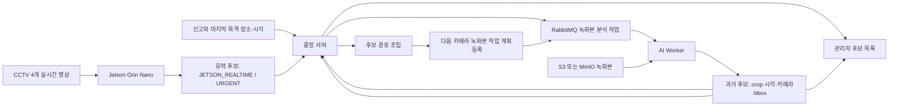

# AI Worker 핵심 임무와 중앙 작업 등록 계약

이 문서는 중간발표 기획과 시스템 구성도를 기준으로 AI Worker의 제품 임무를 고정한다.
핵심은 구역 확률 자체가 아니라 **중앙 서버가 등록한 녹화본 작업을 분석해 과거 후보
근거를 반환하는 것**이다. 경로 조립과 다음 작업 계획·등록은 중앙 서버가 맡는다.

## 역할 경계

| 구성요소 | 핵심 책임 | 하지 않는 일 |
| --- | --- | --- |
| 중앙 서버 | 사건·검색 조건 관리, 후보 경로 조립, 후속 녹화본 계획·등록, 중복 제거, 후보 우선순위, 관리자 판정 | 영상 추론 실행 |
| AI Worker | 중앙 작업 수신, S3/MinIO 과거 녹화본의 지정 구간 분석, 후보 근거 반환 | 경로 확정·작업 등록, Jetson 직접 제어, 동일인 자동 확정 |
| Jetson Orin Nano | 관할 4개 카메라 실시간 탐지, bbox·crop·시각 반환 | 과거 전체 녹화본 일괄 검색 |
| 미디어 서버 | 실시간 스트림 제공, 1분 세그먼트 업로드, 녹화 메타데이터 등록 | 후보 판정 |
| 관리자 | Jetson 유력 후보 최우선 검토, 후보 확정·제외, 경로 해석 | AI 점수만으로 자동 확정 |

## 기준 흐름

아래는 **목표 아키텍처**다. 이번 단계에서 실제 연결한 범위는 순수 planner와 관리자
후보 우선순위이며, 메시지 발행·과거 후보 수신·경로 조립은 아래 미연결 목록에 남긴다.

## 후보 우선순위

관리자 목록은 아래 순서를 강제한다.

1. `JETSON_REALTIME / URGENT`: 현재 관할 화면에서 발견된 후보
2. `ARCHIVE_AI_WORKER / NORMAL`: 과거 녹화본에서 발견된 후보
3. 같은 우선순위 안에서는 선택한 정렬 기준과 후보 ID로 안정 정렬

`URGENT`는 동일인 확정이나 보정 확률이 아니다. 관리자가 먼저 확인해야 한다는 운영
우선순위다. 후보 출처는 `candidates.evidence_source`에
`JETSON_REALTIME` 또는 `ARCHIVE_AI_WORKER`로 명시 저장한다. 실시간 후보 이벤트
엔드포인트는 서버가 `JETSON_REALTIME`을 지정하므로 호출자가 긴급도를 임의로 선택할
수 없다. V11 이전의 출처 미지정 후보는 탐지 상세 행이 있더라도 안전하게
`ARCHIVE_AI_WORKER / NORMAL`로 이관한다. 관리자 정렬도 탐지 테이블 존재 여부가
아니라 이 저장값만 사용한다.

## 후속 녹화본 작업 계획 알고리즘

중앙 서버의 `ArchivedSearchFollowUpPlanner`는 사건·검색 조건 ID를 함께 보존하는
최신 경로 관측 한 건을 기준으로
AI Worker에 등록할 다음 녹화본 작업 후보를 만든다. AI Worker 내부 로직이 아니다.

1. 최신 관측 카메라에서 나가는 `CameraTransition`만 선택한다.
2. 관측 시각에 최소·최대 이동 시간을 더해 카메라별 도달 가능 구간을 만든다.
3. 해당 구간과 겹치는 다음 카메라 녹화본만 남긴다.
4. 같은 사건·검색 조건에서 이미 `QUEUED` 또는 `RUNNING`인 녹화본은 제외한다.
5. `경로 근거 점수 × 전이 가중치 × 녹화본 구간 겹침 비율`로 `routingScore`를 계산한다.
6. 점수, 탐색 시작 시각, 녹화본 ID 순으로 안정 정렬하고 상한 개수만 반환한다.
7. planner가 반환하는 `follow-up:{caseId}:{conditionId}:{recordingId}` 값은 향후
   adapter의 추적용 `idempotencyKey` 제안이다. 현재 API가 수신하거나 DB에 저장하는
   키가 아니며, 실제 중복 판정의 단일 기준은 중앙 서버의
   `(jobType, caseId, conditionId, recordingId)` 활성 작업 unique key다.

`routingScore`는 사람이 그 카메라에 있을 확률이 아니다. 한정된 GPU 시간을 어느
녹화본부터 쓸지 정하는 작업 순서 점수다. 0점 작업은 생성하지 않으며, 근거가 없는
전체 탐색이 필요하면 이 planner가 아니라 별도의 fallback 정책으로 등록한다.

## 상태와 실패 처리

- 최초 작업: 마지막 목격 카메라·시각부터 현재까지 등록
- 과거 후보 발견: 즉시 후보 목록 등록 후, 경로 최신 관측으로 후속 작업 재계획
- Jetson 후보 발견: 경로 여부와 관계없이 `URGENT`로 최우선 노출
- Jetson 미탐지: 과거 탐색은 계속하고 과거 경로를 보존
- 작업 중복: 중앙 서버에서 동일 사건·조건·녹화본의 활성 작업을 한 건만 유지
- 저장소 누락·작업 실패: 중앙 서버에 추가할 claim/heartbeat/fail/retry 계약으로 처리하고 감사 로그 기록
- 관리자 제외: 해당 후보는 확정 경로에서 제외하되 이미 생성한 분석 근거는 감사용 보존

## 중앙 작업 등록 adapter 계약

후속 연결 단계의 adapter는 planner 결과를 곧바로 RabbitMQ에 발행하지 않는다.

1. 기존 `RecordingAnalysisJobCreateRequest`는 planner의 분석 구간과 우선순위를 보존하지
   못하므로 그대로 재사용하지 않는다. 내부 작업 명령과 snapshot에 `caseId`,
   `conditionId`, `recordingId`, `searchFrom`, `searchTo`, `routingScore`,
   `routeObservationId`, `idempotencyKey`를 함께 저장한다.
2. AI Worker는 전체 녹화본이 아니라 저장된 `searchFrom`부터 `searchTo`까지만 분석한다.
3. `recordingsWithActiveJobs` 입력은 반드시 현재 `caseId + conditionId`로 한정해 조회한다.
4. 중앙 서비스의 녹화 객체 존재 여부와 사건·카메라 활성 상태 검증을 그대로 사용한다.
5. 중앙 DB의 활성 작업 unique key가 중복이면 기존 작업을 유지하고 새 메시지를 발행하지 않는다.
6. 중앙 등록이 성공한 작업만 `routingScore` 내림차순으로 RabbitMQ publisher에 전달한다.
7. planner의 `idempotencyKey`는 이 호출을 추적하는 값일 뿐, 중앙 서비스의 DB
   중복 판정을 대체하지 않는다. 실제 API 계약으로 승격할 때는 별도 DTO·저장·충돌 검증을 추가한다.
8. 이 체크아웃에는 작업 claim/leaseToken/heartbeat/complete/fail/retry API가 없다.
   연동 단계에서 중앙 서버 소유 계약으로 구현하고, AI Worker는 발급된 lease를 소비만 한다.

## 아직 연결하지 않는 항목

이번 단계는 planner와 후보 우선순위 계약까지 준비한다. 다음 항목은 중앙 서버·RabbitMQ·
프론트 통합 작업에서 연결한다.

- 카메라 전이 그래프 관리 API와 DB 테이블
- AI Worker 과거 후보 결과 DTO·수신 서비스와 `ARCHIVE_AI_WORKER` 출처 지정
- 과거 후보를 시간순 경로와 `RouteObservation`으로 만드는 검증·보존 서비스
- 확정 경로 갱신 이벤트에서 planner 자동 호출
- planner의 구간·점수·관측 ID를 보존하는 작업 DTO/DB snapshot과 우선순위 queue
- planner 결과를 `RecordingAnalysisJobService`와 RabbitMQ publisher에 연결
- 중앙 서버 소유 claim/leaseToken/heartbeat/complete/fail/retry API
- 관리자 화면의 `유력 후보` 배지와 실시간 알림
