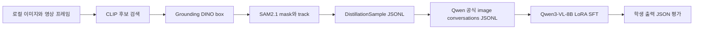

# Qwen3-VL 사전 증류·학습 작업 가이드

이 문서는 Claude API가 아직 없는 상태에서 먼저 완료할 수 있는 작업과, GPU 서버에서 실제로 입력해야 하는 명령을 정리한 문서다. 운영 백엔드 구현은 Sonnet을 자동 호출하지 않으며, 별도 research pilot에서 인증된 Claude Code CLI를 Sonnet teacher로 사용한 결과는 synthetic CCTV proxy로만 기록한다.

## 0. Sonnet pilot 범위

이 문서의 “Sonnet을 호출하지 않는다”는 표현은 운영 백엔드 경로에 대한 설명이다. 별도 연구용 pilot에서는 인증된 Claude Code CLI를 Sonnet teacher로 사용해 response-level label을 만들고, 원격 Jupyter L40S에서 SOLIDER auxiliary loss weight를 비교했다. 이 결과는 synthetic CCTV proxy이며, 실제 CCTV의 reviewed `identityGroupId`·`trackId` held-out 평가를 대체하지 않는다. 원격 실행 증거와 네 arm 비교표는 `docs/SOLIDER_SONNET_HEAD_PILOT_20260723.md` 및 `experiments/results/solider_gpu_sweep_remote_manifest.json`에 기록한다.

## 1. 이번에 만든 범위



완료된 코드는 다음과 같다.

- `src/qwen_backend/distillation.py`: 레코드 계약, 이미지 경로 탈출 방지, SHA-256 확인, Qwen JSONL 변환
- `src/qwen_backend/annotation_cli.py`: CLIP·Grounding DINO·SAM2.1의 결과를 최종 학습 레코드로 저장
- `src/qwen_backend/distillation_cli.py`: 학습 전 레코드 검증과 Qwen 형식 변환
- `src/qwen_backend/evaluation.py`: 학생 모델의 JSON 유효성, 판정, 색상, 복장 정확도 계산
- `src/qwen_backend/evaluation_cli.py`: 평가 명령행 진입점
- `training/train_qwen_lora.sh`: Qwen 공식 fine-tuning 저장소를 이용한 4-GPU LoRA 실행기. 기본값은 dry-run이다.

현재 구현은 Qwen3-VL-8B-Instruct를 백엔드 학생 모델로 전제한다. GPU 서버에서 확인한 4x L40S 환경에서는 먼저 vision tower와 multimodal projector를 고정하고 LLM LoRA만 학습하는 구성이 안전하다.

## 2. 증류의 정확한 의미

이번 단계는 전통적인 logit 증류가 아니다. Claude의 logit은 API로 받을 수 없고, 현재는 Claude API도 없기 때문이다. 지금 구현하는 것은 다음의 오프라인 hard-label SFT다.

1. CLIP은 검색 후보를 좁힌다.
2. Grounding DINO는 후보의 box를 만든다.
3. SAM2.1은 mask와 영상 track을 만든다.
4. 사람이 확인하거나 공개·로컬 모델의 결과를 검수해 색상, 복장, 객체명, 판정을 하나의 `DistillationSample`로 확정한다.
5. Qwen3-VL 학생은 이미지와 정답 JSON을 보고 다음 JSON을 생성하도록 LoRA SFT한다.

따라서 지금 얻는 것은 `teacher logits -> student logits`가 아니라 `검수된 teacher-like 정답 -> student 출력`의 학습이다. Sonnet이 나중에 승인되면 같은 계약의 `provenance`만 추가하고, 기존 파이프라인은 그대로 사용할 수 있다.

## 3. 데이터 계약

이미지 경로는 `--image-root` 내부에 있어야 하고, SHA-256이 현재 파일과 일치해야 한다. 아래는 한 줄짜리 JSONL 예시다.

```json
{"schemaVersion":"distillation-v1","sampleId":"cam01-000001","imagePath":"cam01/000001.jpg","attributes":{"color":"red","clothing":"jacket","objectName":"person"},"decision":"match","confidence":0.91,"provenance":{"sourceKind":"open_model","teacherModel":"clip-grounding-dino-sam2.1-local","promptVersion":"candidate-v1","sourceHash":"PUT_REAL_64_HEX_SHA256_HERE","approvalStatus":"approved","reviewedBy":"operator-001"},"geometry":{"bbox":{"bbox2d":[120,80,420,780]},"maskPath":"cam01/000001.mask.png","trackId":17}}
```

허용되는 `sourceKind`는 `human`, `open_model`, `synthetic_fixture`, `sonnet`이다. 다만 현재 명령행 도구에서는 `sonnet`을 선택지에서 제외했다. 실제 Sonnet 호출이 없는데 Sonnet이라고 기록하면 provenance가 오염되므로 금지한다.

`decision`은 `match`, `review`, `reject` 중 하나다. `confidence`는 0부터 1 사이이며, 현재는 학생이 출력해야 하는 JSON 필드로 포함된다. 이후 confidence-weighted loss를 추가할 수 있지만 이번 코드에서는 아직 loss 가중치로 사용하지 않는다.

`provenance`의 teacher와 prompt는 allowlist를 통과해야 한다. 기본 `approvalStatus`는 `pending`이며, `approvalStatus=approved`와 `reviewedBy` 또는 `teacherAgreement=true`가 없는 샘플은 Qwen 학습 JSON으로 변환되지 않는다. 즉 annotation 생성과 학습 승인 단계를 분리한다.

## 4.5 provider-neutral manifest 모드

현재 로컬에 CLIP·Grounding DINO·SAM2.1 weight가 없으므로 자동 추론 adapter는 호출하지 않는다. 대신 `manifest` adapter가 이미 생성·검수된 open-model geometry 결과를 strict하게 읽고 다시 저장한다. `clip`, `grounding-dino`, `sam2` 같은 모드를 넣으면 typed error로 거부된다. 이것은 모델 실행을 했다고 속이지 않으면서 나중에 adapter를 연결할 수 있는 경계다.

```powershell
uv run python scripts/build_geometry_manifest.py `
  --mode manifest `
  --input D:\dataset\annotations\distillation.jsonl `
  --output D:\dataset\annotations\distillation.normalized.jsonl
```

이 명령이 성공한 뒤에 5절의 `validate`와 `prepare`를 실행한다. 실제 CLIP·Grounding DINO·SAM2.1 실행기는 해당 모델 weight와 영상 데이터가 준비된 뒤 이 인터페이스 뒤에 별도 추가한다.

## 4. 로컬에서 데이터 한 건 만들기

PowerShell에서 저장소 루트로 이동하고 의존성을 준비한다.

```powershell
cd <local-user-path>\Desktop\2학기\qwen3vl-backend
uv sync
uv run python -m qwen_backend.annotation_cli --help
```

예를 들어 실제 이미지가 `D:\dataset\images\cam01\000001.jpg`에 있고, 이미지 루트가 `D:\dataset\images`라면 다음을 실행한다.

```powershell
uv run python -m qwen_backend.annotation_cli `
  --image D:\dataset\images\cam01\000001.jpg `
  --image-root D:\dataset\images `
  --sample-id cam01-000001 `
  --teacher-model clip-grounding-dino-sam2.1-local `
  --source-kind open_model `
  --prompt-version candidate-v1 `
  --approval-status approved `
  --reviewed-by operator-001 `
  --decision match `
  --confidence 0.91 `
  --color red `
  --clothing jacket `
  --object-name person `
  --bbox 120 80 420 780 `
  --track-id 17 `
  --output D:\dataset\annotations\distillation.jsonl
```

이 명령은 이미지의 SHA-256을 자동 계산한다. `--bbox` 순서는 `left top right bottom`이고, 잘못된 box나 이미지 루트 밖 경로는 거부된다. 여러 샘플에 대해 같은 명령을 반복하면 JSONL에 한 줄씩 추가된다.

## 5. 학습 전 검증과 Qwen 데이터 변환

먼저 모든 파일과 hash를 검증한다.

```powershell
uv run python -m qwen_backend.distillation_cli validate `
  --input D:\dataset\annotations\distillation.jsonl `
  --image-root D:\dataset\images
```

검증이 성공하면 Qwen 공식 형식으로 변환한다.

```powershell
uv run python -m qwen_backend.distillation_cli prepare `
  --input D:\dataset\annotations\distillation.jsonl `
  --image-root D:\dataset\images `
  --output D:\dataset\annotations\qwen_train.jsonl
```

변환 결과는 Qwen 공식 fine-tuning README의 단일 이미지 형식과 동일한 다음 구조다.

```json
{"image":"cam01/000001.jpg","conversations":[{"from":"human","value":"<image>\n객체의 색상, 복장, 객체 속성과 후보 판정을 JSON으로 출력하라."},{"from":"gpt","value":"{\"sampleId\":\"cam01-000001\",\"decision\":\"match\",\"attributes\":{\"color\":\"red\",\"clothing\":\"jacket\",\"objectName\":\"person\"},\"confidence\":0.91}"}]}
```

Qwen 공식 문서는 이미지 하나당 질문에 `<image>` 태그 하나를 넣고, `image`와 `conversations`를 JSON 또는 JSONL로 제공하도록 규정한다. [Qwen3-VL fine-tuning README](https://github.com/QwenLM/Qwen3-VL/blob/main/qwen-vl-finetune/README.md)의 데이터 형식과 등록 규칙을 기준으로 했다.

## 6. GPU 서버에서 등록할 내용

서버의 Qwen fine-tuning 저장소의 `qwenvl/data/__init__.py`에 다음 항목을 추가한다. 기존 `data_dict` 안에 이미 같은 이름이 있으면 중복 등록하지 않는다.

```python
CANDIDATE_DISTILL = {
    "annotation_path": "/home/j-i15a204/datasets/candidate/annotations.jsonl",
    "data_path": "/home/j-i15a204/datasets/candidate/images",
}

data_dict["candidate_distill"] = CANDIDATE_DISTILL
```

실제 파일 경로가 다르면 이 두 경로만 바꾼다. 이미지 경로가 annotation 안에서 절대 경로라면 `data_path`는 비워도 되지만, 이번 구현은 상대 경로와 고정된 `data_path`를 사용한다.

## 7. GPU 서버에서 실행할 명령

서버에 이 저장소를 올린 뒤, 먼저 dry-run으로 경로와 실행 인자를 확인한다.

```bash
cd /home/j-i15a204/qwen3vl-backend
DRY_RUN=1 bash training/train_qwen_lora.sh
```

기본값은 다음 서버 경로를 사용한다.

```text
model: /home/j-i15a204/models/Qwen3-VL-8B-Instruct
Qwen fine-tune repo: /home/j-i15a204/Qwen3-VL/qwen-vl-finetune
images: /home/j-i15a204/datasets/candidate/images
annotations: /home/j-i15a204/datasets/candidate/annotations.jsonl
output: /home/j-i15a204/outputs/qwen3vl-8b-candidate-lora
GPU: 4
```

경로를 확인한 뒤 실제 학습은 명시적으로 `DRY_RUN=0`을 넣어 실행한다.

```bash
cd /home/j-i15a204/qwen3vl-backend
DRY_RUN=0 NPROC_PER_NODE=4 bash training/train_qwen_lora.sh 2>&1 | tee /home/j-i15a204/outputs/qwen3vl-train.log
```

현재 실행기는 다음 구성을 사용한다.

- Qwen3-VL-8B-Instruct
- `tune_mm_llm=True`, `tune_mm_vision=False`, `tune_mm_mlp=False`
- LoRA `r=8`, `alpha=16`, `dropout=0.05`
- GPU당 batch 1, gradient accumulation 8
- `bf16`, learning rate `2e-7`, 최대 길이 4096
- 이미지 최대 해상도 `576 * 28 * 28`, 최소 해상도 `16 * 28 * 28`

첫 실험은 전체 데이터가 아니라 별도 `candidate_distill_smoke`를 등록해 20~100건으로 시작한다. 학습이 장시간 걸리는 작업이므로 이 문서의 구현 단계에서는 실제 weight 학습을 자동으로 시작하지 않았다.

## 8. 학생 모델 평가

학생 추론 결과는 한 줄에 다음 형식으로 저장한다. `output`은 모델이 출력한 JSON 문자열 전체여야 하며, 자연어 앞뒤를 붙이지 않는다.

```json
{"sampleId":"cam01-000001","output":"{\"decision\":\"match\",\"attributes\":{\"color\":\"red\",\"clothing\":\"jacket\",\"objectName\":\"person\"},\"confidence\":0.88}"}
```

평가 명령은 다음과 같다.

```bash
python -m qwen_backend.evaluation_cli \
  --reference /home/j-i15a204/datasets/candidate/annotations.jsonl \
  --prediction /home/j-i15a204/eval/qwen_predictions.jsonl \
  --output /home/j-i15a204/eval/qwen_report.json
```

반드시 별도 validation/test split에서 `json_valid_rate`, `decision_accuracy`, `color_accuracy`, `clothing_accuracy`를 기록한다. 같은 카메라·같은 영상의 인접 프레임을 train과 test에 나누면 누수가 생기므로 시간 또는 카메라 단위로 분리한다.

## 9. 아직 하지 않은 것과 다음 연결점

- Sonnet API 호출과 Sonnet label 생성: API 키가 없으므로 하지 않았다.
- Qwen weight 학습: 실행기를 만들었지만 서버에서 장시간 학습은 자동으로 시작하지 않았다.
- CLIP, Grounding DINO, SAM2.1 실제 추론: 모델 weight와 원본 영상 데이터가 이 저장소에 없으므로 실행하지 않았다. 이 세 모델의 결과를 `annotation_cli`로 계약화하면 된다.
- NanoOWL weight 변경: 임베디드 모델은 별도 Jetson 학습·TensorRT 검증 트랙이므로 이번 Qwen 백엔드 작업에서 건드리지 않았다.

Sonnet API를 나중에 사용할 수 있게 되면, Sonnet 응답을 직접 학습시키는 대신 먼저 사람이 승인한 샘플만 `sourceKind=sonnet`과 실제 모델·프롬프트 버전·실제 SHA-256으로 기록한다. 그 뒤 같은 `validate -> prepare -> train -> evaluate` 경로를 재사용한다. API 사용 약관과 경쟁 모델 학습 허용 여부는 실제 호출 전에 별도로 확인해야 한다.

