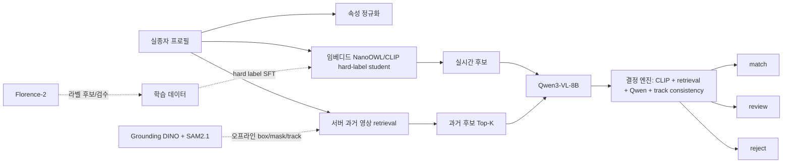

# 증류·다중 모델 비교 결과와 현재 기본 경로

> **2026-07-22 재결정:** 이 문서의 기존 Qwen 중심 서버 경로는 초기 provisional 기록이다. 85% 속성 목표를 위한 현재 결정과 구조는 [`BASE_MODEL_AND_ARCHITECTURE_DECISION.md`](BASE_MODEL_AND_ARCHITECTURE_DECISION.md)를 우선한다.

## 결론

현재 저장된 실험 범위에서 임베디드 기본값은 `student_CLIP_hard`로 고정한다. CLIP 특징에 검수된 hard label을 학습시키는 방식이 현재 프록시에서 soft target, DINO feature hint, SupCon, prototype, KNN, 온도별 KD, feature fusion보다 우수하거나 같았고, 동률은 낮은 복잡도로 결정했다.

서버 속성 인식의 현재 기본 후보는 `SOLIDER Swin-B + PAR head`로 재결정한다. 동일인 판단은 SOLIDER/TransReID 계열 ReID embedding branch가 담당하며, `Qwen3-VL-8B`는 충돌 설명·저신뢰 보완·teacher-label 후보 생성에만 사용한다. CrossPAR는 PA-100K에서 mA 86.9를 보고한 성능 reference/teacher이고, 프로젝트 CCTV 배포 모델로 성능이 확정된 것은 아니다.

단, 최종 CCTV 정확도가 확정된 것은 아니다. CCTV의 실제 입력은 동영상에서 추출한 시간순 프레임과 사람 track으로 정의해야 하는데, 현재 저장소와 원격 실험 폴더에는 프로젝트 영상·track manifest가 없다. 기존 GPU 서버 산출물은 공개 데모 이미지와 결정적 변형을 사용한 프록시다. 따라서 아래 결과는 **현재 기본 경로를 정하는 근거**이지, 실종자 식별 정확도 보증이 아니다.

영상 실험의 평가 단위는 개별 사진이 아니라 `person_track`으로 고정한다. 한 사람의 연속 프레임을 무작위로 train/test에 나누면 같은 장면을 재학습하는 누수가 생기므로 `caseId`, `identityGroupId`를 1차 격리키로 사용하고, `cameraId`, `trackId`, 동일 영상 이벤트의 인접 프레임을 추가로 격리한다. 필요한 입력과 지표는 [`configs/model_selection.json`](../configs/model_selection.json)의 `videoEvaluation`에 기록했다.

## 실제로 확인한 비교

### 1. 임베디드 증류 ablation

원격 Jupyter에서 다음 산출물을 확인했다. 이 산출물은 현재 로컬 저장소에 복사하지 않고 인증된 Jupyter 링크로 남겨 두었으므로, 아래 수치는 프록시 결과이며 독립 재현용 raw artifact mirror가 아니다.

- `distillation_ablation_results.csv`
- `distillation_extended_results.csv`
- `distillation_ablation_summary.csv`
- `distillation_ablation_all_methods_corrected.csv`
- `distillation_final_decision.csv`

동일 프록시·동일 leave-one-base-image-out 검증에서 핵심 결과는 다음과 같다. 이 결과는 영상 track 검증을 대체하지 않으며, 영상 데이터가 들어오면 아래 arm을 track 단위로 다시 평가한다.

| 경로 | proxy accuracy | proxy F1 | flip recall | 판정 |
| --- | ---: | ---: | ---: | --- |
| CLIP + hard label | 1.00 | 0.60 | 1.00 | 임베디드 기본값 |
| CLIP + soft ensemble | 0.40 | 0.20 | 1.00 | 제외 |
| CLIP + DINO hint / SupCon / prototype / KNN / KD | 우위 없음 | 우위 없음 | 우위 없음 | 제외 |
| CLIP + DINO feature fusion | 우위 없음 | 우위 없음 | 우위 없음 | 제외 |

원시 DINO prototype이 전체 프록시 점수에서 좁은 의미의 우승으로 기록된 경우가 있지만, 이는 CLIP/NanoOWL 임베디드 배포 후보와 동일한 비교 대상이 아니다. 임베디드 범위의 최종 선택은 `student_CLIP_hard`이며, DINO는 서버 검색·오프라인 geometry teacher로 남긴다.

### 2. 백엔드 생성 모델 비교

사람 crop 프록시에서 6개 속성을 2개 샘플에 대해 검사한 기존 결과는 다음과 같다. 이는 12개 필드 검사이지, 실제 동일인 식별 정확도가 아니다.

| 모델 | 필드 정답 | 평균 응답 시간 | 현재 판단 |
| --- | ---: | ---: | --- |
| Qwen3-VL-8B | 10/12 (83.3%) | 6.06초 | historical baseline |
| Gemma-4-12B-it | 10/12 (83.3%) | 8.71초 | 동률·느림, 기본 제외 |
| Qwen2.5-VL-7B | 5/12 (41.7%) | 3.34초 | 제외 |

Qwen과 Gemma를 둘 다 매 요청에 실행하는 방식은 이 데이터에서 정확도 우위를 증명하지 못했고, Qwen 단독보다 계산량만 늘어난다. 두 모델을 나중에 다시 비교할 수는 있지만, 같은 프로젝트 test split에서 `identity accuracy`, `false match rate`, `review rate`, `p95 latency`를 동시에 이겨야 승격한다.

## 이전 구조와 현재 구조

아래 기존 구조는 Qwen을 서버 생성 분석 주 모델로 두었던 historical baseline이다. 새 구현의 authoritative 구조와 역할 분리는 [`BASE_MODEL_AND_ARCHITECTURE_DECISION.md`](BASE_MODEL_AND_ARCHITECTURE_DECISION.md)에 있다.



핵심은 증류와 런타임 조합의 역할을 섞지 않는 것이다.

- 임베디드: `student_CLIP_hard`만 기본 배포한다. DINO/SAM2를 Jetson 안에 억지로 합치지 않는다.
- 서버 현재 경로: SOLIDER Swin-B PAR와 ReID를 필수 증거로 사용하고, Qwen은 호출되었을 때만 충돌 설명·검토에 사용한다.
- Florence-2: 온라인 두 번째 생성 모델이 아니라 오프라인 속성 라벨 후보로만 둔다.
- Sonnet 5: 실제 API와 사용 조건이 확인된 뒤, 검수된 label batch로만 추가한다. 지금 결과에 Sonnet을 사용했다고 기록하지 않았다.

## 재현·승격 조건

현재 결과를 실제 프로젝트 결론으로 승격하려면 GPU 서버에서 CCTV 영상에서 추출한 동일 track 데이터로 다음 arm을 다시 실행해야 한다.

1. `student_CLIP_hard`
2. `student_CLIP_soft_ensemble`
3. `student_CLIP_extended_variants`
4. `student_FUSED_variants`
5. `solider_swin_b_attribute_plus_qwen_deterministic_fusion`
6. `qwen3vl_8b_historical_baseline` (기존 Qwen 중심 경로의 historical baseline)
7. `qwen_plus_gemma_runtime_ensemble` (실제 ensemble 실행 arm)

분할은 `caseId/identityGroupId/cameraId/trackId` 그룹 기준으로 격리하고, 인접 프레임과 같은 사람의 다른 시점을 train/test에 섞지 않는다. 이 정책은 [`training/attribute_head_config.json`](../training/attribute_head_config.json)에 반영했다. 승격 지표는 단순 평균 정확도 하나가 아니라 다음을 모두 기록한다.

```text
identity accuracy
false match rate  <- 가장 중요
false reject rate
review rate
attribute macro-F1 (color/clothing/texture)
attribute mA
attribute InsF1
attribute track-level exact match
JSON valid rate
p50/p95 latency and GPU memory
```

`false match rate`가 목표를 통과하지 못하면 정확도가 높아도 배포하지 않는다. 1위와 2위가 구분되지 않거나 증거가 부족하면 현재 결정 엔진이 `review`로 닫히는 상태를 유지한다.

## 원격 산출물 링크

- [최종 증류 판정 CSV](http://70.12.130.105/user/i15a204/lab/tree/qwen3vl-backend/distillation_final_decision.csv)
- [증류 ablation 요약 CSV](http://70.12.130.105/user/i15a204/lab/tree/qwen3vl-backend/distillation_ablation_summary.csv)
- [증류 확장 결과 CSV](http://70.12.130.105/user/i15a204/lab/tree/qwen3vl-backend/distillation_extended_results.csv)
- [백엔드 모델 재평가 보고서](http://70.12.130.105/user/i15a204/lab/tree/qwen3vl-backend/backend_model_selection_reassessment_report.md)

실험 설정의 기계 판독 가능한 사본은 [`configs/model_selection.json`](../configs/model_selection.json)에 있다.
