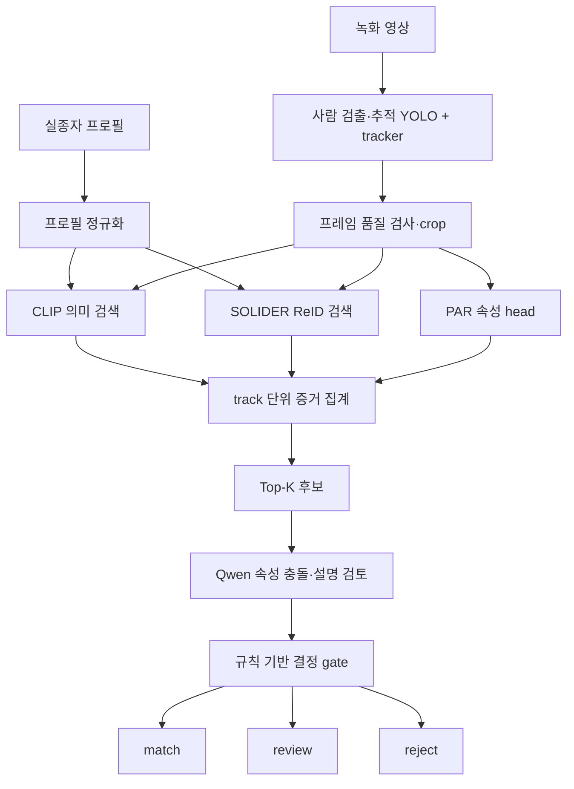

# EyesOnU 모델 학습·증류·성능 개선 플레이북

작성일: 2026-08-11

이 문서는 EyesOnU AI Worker의 모델을 어떻게 학습하고, 어떤 실험으로 성능을 높이며, 언제 운영 모델로 승격할지를 한 곳에 모은 실행 문서다. 목표는 숫자를 크게 보이는 것이 아니라, **새로운 카메라·시간·인물에서도 같은 결과가 나오는지 확인하면서 후보 검색과 동일인 1위 판정을 개선하는 것**이다.

## 1. 먼저 고정할 목표

AI Worker의 결과는 두 단계로 나뉜다.

1. `후보 검색`: 정답 인물이 Top-K 후보 안에 들어왔는가? → `Recall@5`
2. `최우선 일치`: Top-1이 정답 인물인가? → `Rank-1`

`Recall@5 100%`는 “후보 목록 안에는 들어왔다”는 뜻이지 “AI가 100% 동일인이라고 확정했다”는 뜻이 아니다. 운영에서는 SOLIDER가 후보를 검색하고, 속성·시간·카메라·품질 근거를 합친 뒤, 애매하면 관리자 검토로 보낸다.

현재 기록된 수치는 다음처럼 서로 다른 평가다.

| 평가 | 현재 값 | 의미 | 운영 승격 여부 |
| --- | ---: | --- | --- |
| 프로젝트 CCTV cross-video Recall@5 | 100% (11/11, 역방향 14/14) | 제한된 track 후보 검색 | 후보 검색 point estimate |
| 프로젝트 strict Rank-1 | 81.82% 정방향 / 50% 역방향 | 1위 동일인 판정 | 자동 확정 불가 |
| CHIRLA track Recall@5 | 87.5% (35/40) | 공개 데이터셋 proxy | 프로젝트 일반화 아님 |
| v4 PAR 속성 평균 | 88.5% | 15장 속성 분류 | identity와 별도 |
| 외부 Recall@5 85% | 원본 로그 미검증 | 사용자 제공 보고값 | 검증 전 수치 |

근거와 분모는 [`METRIC_RECONCILIATION_AND_UPGRADE_20260811.md`](METRIC_RECONCILIATION_AND_UPGRADE_20260811.md)에 고정한다.

## 2. 전체 학습·추론 구조



각 모델의 역할은 분리한다.

- YOLO + tracker: 사람을 찾고 같은 영상 안의 프레임을 하나의 track으로 묶는다.
- CLIP: 텍스트 인상착의와 이미지의 의미 유사도로 빠른 후보를 만든다.
- SOLIDER: 사람 재식별 특징 벡터로 gallery와 query를 비교한다. 현재 주 검색기다.
- SOLIDER-PAR 또는 별도 attribute head: 상의·하의·성별·소매 등의 구조화된 속성 증거를 만든다.
- Qwen3-VL: 후보의 속성 충돌과 검토 사유를 설명한다. 현재 자동 동일인 확정 모델이 아니다.
- 결정 engine: 모델 점수와 시간·공간·품질 증거를 재현 가능한 규칙으로 합친다.

## 3. 데이터 준비: 성능의 가장 큰 레버

### 3.1 학습용 데이터

각 인물 track은 아래 정보를 가진 JSONL 또는 manifest 한 줄로 관리한다.

```json
{
  "identityGroupId": "person-001",
  "cameraId": "zone1-cam2",
  "eventId": "event-20260811-001",
  "trackId": "track-00017",
  "frames": ["cam2/track-00017/000120.jpg"],
  "attributes": {
    "upperColor": "gray",
    "lowerColor": "black",
    "gender": "male",
    "glasses": true,
    "bag": false
  },
  "quality": {"occlusion": 0.15, "blur": 0.08}
}
```

필수 원칙:

- 같은 identity의 프레임이 train과 test에 동시에 들어가지 않게 한다.
- 같은 영상의 연속 프레임만으로 높은 점수를 만들지 않도록 camera·시간·event를 분리한다.
- 정답 인물만 넣지 말고 옷 색·체형·가방이 비슷한 distractor를 hard negative로 넣는다.
- 가려짐, 역광, 저해상도, 옆·뒤·정면, 이동 방향 반전을 모두 포함한다.
- 속성 정답은 사람 검수 또는 승인된 teacher 결과와 provenance를 함께 저장한다.

### 3.2 실제 프로젝트 평가용 split

```text
train identities  !=  validation identities  !=  test identities
train cameras/events != test cameras/events
gallery: 사건 발생 전 또는 별도 영상
query: 다른 카메라·다른 시간대의 track
distractor: 동일한 색상·복장·체형 후보
```

새로 추출한 CCTV 29개 영상의 456개 track과 3,541개 crop은 학습·검수 준비 데이터다. identity 라벨이 없는 상태에서는 이 숫자로 정확도 개선을 주장하지 않는다. 먼저 `identityGroupId`, camera, event, 검수자 판정을 붙인다.

## 4. 단계별 학습 방법

### 단계 A — SOLIDER 기본 검색기

공식 SOLIDER Swin-B MSMT17 checkpoint를 고정하고 프레임 embedding을 만든다. 같은 `tracker_id`의 프레임을 모아 track embedding을 만든 뒤 gallery identity별 점수를 집계한다.

```text
frame crop
  -> SOLIDER embedding
  -> track mean pooling
  -> gallery identity score aggregation
  -> Top-K candidate list
```

실험 스크립트:

- `scripts/run_cctv_model_comparison.py`
- `scripts/benchmark_chirla_reid.py`
- `scripts/evaluate_85_gate.py`
- `scripts/evaluate_chirla_track_gate.py`

### 단계 B — track pooling과 품질 가중치

프레임 하나의 오판을 줄이기 위해 mean, median, max, top-2/top-3/top-5, quality-weighted pooling을 비교한다. 기본 선택은 validation에서 정하고 test에서는 고정한다.

현재 결과에서는 Recall@5가 모든 pooling에서 이미 100%였고, Rank-1은 영상 방향에 따라 크게 변했다. 그래서 운영 후보 검색은 mean pooling을 기본으로 두고, median·max를 결과를 좋게 보이게 하는 용도로 임의 선택하지 않는다.

### 단계 C — metric head fine-tuning

SOLIDER embedding 위에 작은 metric head를 붙여 같은 사람은 가까워지고 다른 사람은 멀어지게 학습한다.

권장 loss 구성:

```text
L = L_arcface
  + λ1 * L_batch_hard_triplet
  + λ2 * L_part_triplet
  + λ3 * L_teacher_preservation
  + λ4 * L_attribute_auxiliary
```

- ArcFace/CosFace: identity 간 각도 마진을 만든다.
- Batch-hard Triplet: 가장 헷갈리는 negative를 골라 학습한다.
- Part Triplet: 상체·하체·가방 등 부위별 단서를 보조한다.
- Teacher preservation: 기존 SOLIDER의 일반 ReID 능력을 망가뜨리지 않도록 embedding 변화량을 제한한다.
- Attribute auxiliary: 색상·성별·가방 등의 정답이 있을 때만 사용한다.

관련 코드:

- `scripts/finetune_prid2011_solider_backbone.py`
- `scripts/train_prid2011_metric_adapter.py`
- `scripts/tune_prid2011_metric_head.py`
- `scripts/run_solider_finetune.py`
- `scripts/run_solider_simuletic_method_sweep.py`

이번 GPU probe에서는 정방향 Rank-1이 81.82%에서 90.91%로 올랐지만 역방향은 50%에서 57.14%였다. 따라서 “한 방향에서 90.91%”를 일반화 90%라고 발표하지 않고, 양방향·새 identity test를 통과할 때만 승격한다.

### 단계 D — hard-negative mining

매 epoch마다 오답 중 점수가 높은 후보를 모아 다음 학습에 다시 넣는다.

```python
for query in validation_like_training_batch:
    scores = model(query, gallery_candidates)
    hard_negative = highest_scoring_wrong_identity(scores)
    loss += triplet(query, positive_identity, hard_negative)
```

주의할 점:

- test 정답을 보고 hard negative를 고르면 데이터 누수다.
- hard negative는 train split 안에서만 선택한다.
- validation은 margin·learning rate·pooling 선택에만 사용한다.
- test는 마지막에 한 번만 열고 승격 판정에 사용한다.

### 단계 E — PAR 보조 학습

v4 PAR은 상의색·하의색·성별·소매 길이를 별도 head로 예측한다. 이 결과는 identity 검색을 보조할 수 있지만, PAR 88.5%를 identity 88.5%로 바꾸어 말하지 않는다.

속성 label이 없으면 이 단계를 실행하지 않는다. pseudo-label을 사용할 때는 `sourceKind`, teacher model, prompt, hash, 검수 상태를 기록한다.

관련 코드:

- `scripts/expand_cctv_attribute_samples.py`
- `scripts/finetune_clip_l14_sonnet_aux.py`
- `src/qwen_backend/attribute_ensemble.py`
- `docs/AI_PRESENTATION_AND_STUDY_APPENDIX.md`

### 단계 F — 지식 증류

현재 구현의 핵심은 세 종류를 구분하는 것이다.

1. **Logit KD**: teacher와 student의 logit을 직접 맞춘다. teacher logit을 받을 수 있을 때만 사용한다.
2. **Feature KD**: teacher·student embedding의 방향 또는 거리를 맞춘다.
3. **Response-level SFT**: teacher가 만든 JSON 정답·설명을 승인한 뒤 student가 같은 JSON을 출력하게 한다.

Sonnet API가 없을 때 `sonnet` provenance를 임의로 붙이지 않는다. 지금 가능한 경로는 공개 모델·로컬 모델·사람 검수 기반 response-level SFT다.

```text
teacher/local model output
  -> human/adjudicator approval
  -> provenance + SHA-256 기록
  -> train/validation 분리
  -> student fine-tuning
  -> untouched identity-heldout 평가
```

관련 코드·문서:

- `scripts/train_clip_vitl14_distill.py`
- `src/qwen_backend/distillation.py`
- `src/qwen_backend/distillation_cli.py`
- `docs/DISTILLATION_TRAINING_GUIDE.md`

Qwen3-VL LoRA 실행기는 별도 `qwen3vl-backend` 작업공간의 공식 fine-tuning 저장소에서 실행한다. 이 checkout에는 데이터 계약·검증·변환 코드만 포함하며, 실행기를 현재 저장소에 있다고 잘못 표시하지 않는다.

Sonnet 실험의 저장 결과에서는 PA-100K 속성 지표가 +1.05%p 개선됐지만, CCTV group-heldout proxy는 -2.56%p 하락했다. Sonnet 사용 사실만으로 identity 성능 개선을 주장하지 않는다.

### 단계 G — TTA와 오케스트레이션

좌우 반전·조도 변화·여러 프레임을 테스트 시점에 평균하는 TTA는 분산을 줄일 수 있지만, test에 맞춰 조합을 고르면 과적합이다. validation에서 조합을 고정한다.

오케스트레이션은 모델을 많이 붙이는 것이 목적이 아니다.

```text
SOLIDER: 신원 후보 검색
CLIP: 의미 유사도 보조
PAR: 속성 충돌 확인
Qwen: 설명·검토 사유 생성
rule gate: 점수·품질·시간·카메라 일관성 최종 결합
```

Qwen과 CLIP이 같은 후보를 독립적으로 확인했다고 해서 정답 확률을 곱하지 않는다. 각각의 score calibration을 validation에서 확인하고, 신호가 없으면 해당 branch를 제외한 뒤 uncertainty를 올린다.

## 5. GPU 서버 재현 순서

비밀값이나 개인 서버 주소는 저장소에 넣지 않는다. GPU 서버에서는 별도 `.env`를 준비하고 아래 순서를 실행한다.

```bash
# 1. 데이터 manifest 검증
uv run python scripts/validate_cctv_training_manifest.py \
  --manifest /data/cctv/manifest.enriched.jsonl

# 2. 모델·데이터 비교
uv run python scripts/run_cctv_model_comparison.py --help
uv run python scripts/benchmark_chirla_reid.py --help

# 3. SOLIDER fine-tuning 또는 metric head sweep
uv run python scripts/finetune_prid2011_solider_backbone.py --help
uv run python scripts/tune_prid2011_metric_head.py --help

# 4. 증류/보조 loss 비교
uv run python scripts/train_clip_vitl14_distill.py --help
uv run python scripts/finetune_clip_l14_sonnet_aux.py --help

# 5. 엄격한 gate 평가
uv run python scripts/evaluate_85_gate.py \
  --mode track-proxy --target 0.85 --minimum-tracks 40
```

실제 프로젝트 평가에서는 반드시 identity-heldout, cross-camera, cross-time 조건을 사용한다. CHIRLA proxy를 통과했다고 프로젝트 CCTV 통과로 바꾸지 않는다.

## 6. 수치를 높이는 실험 우선순위

효과와 위험을 함께 고려한 순서다.

| 우선순위 | 방법 | 기대 효과 | 주의점 |
| ---: | --- | --- | --- |
| 1 | 다중 카메라·시간 identity label 추가 | 일반화 신뢰도 자체를 높임 | 가장 중요, 대체 불가 |
| 2 | distractor hard-negative mining | 비슷한 사람의 Rank-1 개선 | test 누수 금지 |
| 3 | SOLIDER metric head + ArcFace/Triplet | identity 경계 개선 | 방향·카메라 편향 확인 |
| 4 | track quality/temporal pooling | 흐린 프레임 영향 감소 | test에서 선택 금지 |
| 5 | camera/조도/가림 augmentation | CCTV domain gap 완화 | 실제 분포와 맞춰야 함 |
| 6 | PAR auxiliary head | 색상·복장 근거 보강 | 독립 속성 label 필요 |
| 7 | feature/response distillation | 작은 모델·속성 설명 개선 | teacher provenance 필요 |
| 8 | CLIP/Qwen late fusion | 검토 설명과 충돌 탐지 | 단일 모델 정확도로 합산 금지 |

현재 가장 현실적인 다음 실험은 **새로 추출한 track에 identity·camera·event 라벨을 붙이고, SOLIDER metric head를 train/validation/test identity 분리로 다시 학습하는 것**이다. 라벨 없이 epoch·threshold만 조절해 수치를 올리는 것은 개선이 아니라 평가 과적합이다.

## 7. 승격 gate

모델은 아래 조건을 모두 만족할 때만 자동 동일인 판정 경로로 승격한다.

```text
Rank-1                 >= 0.85
Recall@5               >= 0.95
false-match rate       <= 서비스 기준
false-reject rate      <= 서비스 기준
95% confidence lower bound >= 사전에 정한 기준
방향·카메라·시간 split 모두 통과
독립 검수자 2명 이상 일치
```

하나라도 실패하면 모델은 `candidate_retriever` 또는 `review_assistant`로만 사용한다. 현재 저장소의 안전한 운영 해석은 다음과 같다.

```text
SOLIDER = primary Top-K retriever
CLIP/PAR/Qwen = supporting evidence and review
rule gate = match/review/reject
automatic identity match = promotion gate 통과 전 금지
```

## 8. 저장소에 포함하지 않는 것

- 실제 CCTV 영상·프레임·crop·개인 식별 라벨
- `.env`, `ai.env.txt`, RabbitMQ/S3/MinIO 자격증명
- private GPU/Jupyter 주소와 내부 절대 경로
- 모델 weight와 대용량 embedding cache
- 원본 로그가 없는 외부 성능 수치의 임의 재현물

저장소에는 코드·설정 예시·검증된 JSON evidence·문서만 넣는다. 실제 데이터를 사용한 실험은 데이터 fingerprint와 결과 파일로 재현 범위를 설명한다.

## 9. 관련 파일 지도

### 핵심 문서

- `docs/DISTILLATION_TRAINING_GUIDE.md`
- `docs/CHIRLA_TRACK_85_METHOD_20260810.md`
- `docs/PROJECT_CCTV_CROSS_CAMERA_85_METHOD_20260810.md`
- `docs/ORCHESTRATED_MODEL_UPGRADE_LOOP.md`
- `docs/ORCHESTRATED_GPU_RESULTS_20260810.md`
- `docs/METRIC_RECONCILIATION_AND_UPGRADE_20260811.md`
- `docs/PROJECT_AI_ARCHIVE_INDEX.md`

### 핵심 실행 코드

- `scripts/run_cctv_model_comparison.py`
- `scripts/benchmark_chirla_reid.py`
- `scripts/finetune_prid2011_solider_backbone.py`
- `scripts/tune_prid2011_metric_head.py`
- `scripts/train_clip_vitl14_distill.py`
- `scripts/finetune_clip_l14_sonnet_aux.py`
- `scripts/evaluate_85_gate.py`
- `scripts/evaluate_chirla_track_gate.py`

### 결과 근거

- `docs/evidence/project_cctv_cross_camera_gate_20260810.json`
- `docs/evidence/chirla_solider_track_evidence_20260810.json`
- `docs/evidence/orchestration_gpu_evidence_20260810.json`
- `experiments/results/cctv_generalization_method_matrix_20260728.json`
- `output/ai-presentation/v4_par_evidence.json`

이 문서의 숫자는 저장소에 실제로 기록된 결과만 사용하며, 데이터가 없는 구간은 다음 실험의 입력으로 남긴다.
