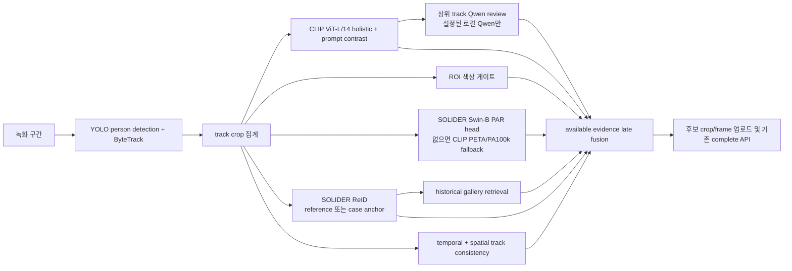

# 녹화본 AI Worker 다중 모델 추론 경로

이 변경은 중앙 서버 API, RabbitMQ 메시지, claim/lease/heartbeat, evidence upload,
complete/fail callback 계약을 변경하지 않고 `ai-worker`의 로컬 추론 엔진만 교체한다.

## 실제 job 경로



`notebook_worker.py`의 기본 `create_engine()`은 이제
`MultiModelCandidateEngine`을 생성한다. 따라서 이전처럼
`SoliderClipCandidateEngine`의 단일 CLIP 점수만으로 모든 person track을 후보로
보내지 않는다.

## 속성 게이트

프롬프트에서 상의·하의 색상이 명시된 경우 색상과 의복 위치를 분리한다.
예를 들어 `white shirt, black pants`에서 상의 ROI가 남색이면 holistic CLIP 점수가
높더라도 `required_color_mismatch`로 제외한다. 색상 조건이 없는 프롬프트에서는
ROI 게이트를 적용하지 않는다.

기본값은 다음과 같다.

- `QWEN_CANDIDATE_MIN_OUTPUT_SCORE=0.30`
- `QWEN_CANDIDATE_COLOR_REJECT_THRESHOLD=0.35`
- `QWEN_CANDIDATE_AGGREGATE_TOP_FRAMES=3`

이는 보정된 확률이 아니라 후보 ranking score다. 0.35를 프로젝트의 자동 일치
확률 85%로 해석하면 안 되며, 실제 identity/track-heldout 데이터로 다시 calibration해야
한다.

## 사진이 없는 사건의 처리

사진이 없다고 SOLIDER를 동일인 모델처럼 억지로 호출하지 않는다. 두 branch를
분리한다.

- `SOLIDER-PAR`: 사진 없이도 crop에서 안경·헤어·상의 스타일 같은 속성 보조 신호를
  계산한다. `QWEN_CANDIDATE_SOLIDER_PAR_HEAD`에 검증된 로컬 linear head가 있으면
  이를 사용하고, 없을 때만 CLIP PETA/PA100k head를 fallback으로 사용한다. fallback은
  trace에 성공한 SOLIDER로 기록하지 않는다.
- `SOLIDER` ReID: reference photo 또는 관리자가 확인해 둔
  `case-<caseId>/` anchor crop이 있을 때만 동일인 embedding 점수를 계산한다. 둘 다
  없으면 `identity=na`, `identityAnchor=not_configured/not_found`로 남기고 속성 기반
  후보·관리자 검토 모드로 유지한다.

따라서 사진 없는 초기 신고도 후보 탐색은 가능하지만 자동 동일인 확정의 증거로
승격하지 않는다. 젯슨 또는 관리자가 확인한 crop을 anchor 디렉터리에 넣고 다음
작업을 재실행하면 SOLIDER ReID와 historical gallery branch가 활성화된다.

## SOLIDER와 fine head

`QWEN_CANDIDATE_SOLIDER_PAR_HEAD`가 있거나 `QWEN_CANDIDATE_MODEL_DIRECTORY`의
형제 경로인 `experiments/models`에서 SOLIDER PAR head를 자동 탐색한다. 없거나
shape/schema가 맞지 않으면 trace에 `SOLIDER-PAR=unavailable:*`를 남긴다.
그 경우 PETA/PA100k CLIP ViT-L/14 head를 fallback으로 사용할 수 있지만,
`SOLIDER-PAR=used`로 포장하지 않는다.

## historical retrieval · 시공간 융합 · Qwen

- `QWEN_CANDIDATE_HISTORICAL_GALLERY_DIR` 아래의 `case-<caseId>/` gallery는
  identity anchor가 있을 때만 CLIP crop retrieval로 사용한다. gallery가 없거나
  anchor가 없으면 `unavailable`/`skipped`를 기록하고 점수에 0을 넣지 않는다.
- track의 timestamp 간격 규칙성과 box 중심·크기 안정성을 별도 temporal/spatial
  evidence로 계산한다. 둘은 identity 확률이 아니라 관측 품질 신호다.
- `QWEN_PROVIDER=qwen`이고 로컬 Qwen checkpoint가 준비된 경우 상위 track 최대
  `QWEN_CANDIDATE_QWEN_REVIEW_TOP_K`개를 Qwen이 검토한다. GPU 서버에
  OpenAI-compatible vLLM endpoint를 띄운 경우에는
  `QWEN_CANDIDATE_QWEN_REVIEW_PROVIDER=remote`와
  `QWEN_CANDIDATE_QWEN_REMOTE_BASE_URL=http://gpu-host:8000/v1`을 사용해
  crop을 data URL로 보내고 서버의 비양자화 Qwen을 호출할 수 있다. 미설정·mock이면
  `unavailable`을 기록하며 CLIP 점수를 Qwen 결과로 위조하지 않는다.
- 로컬 provider는 기존 `qwen3vl-backend` 비교 실행기의
  `Qwen3VLForConditionalGeneration + AutoProcessor` 로더를 재사용한다. 따라서
  `qwen_vl_utils`가 없어도 동작하며, 노트북에서는
  `QWEN_MODEL_PATH=.../Qwen3-VL-2B-Instruct`와 `QWEN_PROVIDER=qwen`을 private env에
  설정한다.
- 최종 `similarity`는 후보 ranking score이며 calibrated identity probability가
  아니다. 사진·gallery·Qwen 증거가 빠진 작업은 `candidateMode=operator_review`로
  표시된다.

## 모델별 실행 증거

각 job의 worker 로그에는 다음 상태가 남는다.

`YOLO`, `CLIP-ViT-L/14`, `ROI-color`, `SOLIDER`, `SOLIDER-PAR`,
`CLIP-PETA-PA100k`, `Historical-retrieval`, `Temporal-fusion`, `Spatial-fusion`,
`Grounding-DINO`, `SAM2.1`, `Florence-2`, `Qwen`, `Sonnet`.

Grounding DINO/SAM2는 현재 워커에 검증된 runtime weight가 없고 Florence/Sonnet은
offline teacher 역할이므로 `offline_teacher_not_runtime`로 표시된다. Qwen은 로컬
checkpoint 또는 원격 endpoint가 실제 응답한 경우에만 `used`가 된다. 이들을 사용했다고 거짓으로 기록하지
않으며, 실제 weight/provider와 동일한 held-out 평가가 공급되기 전에는 자동 확정
모델로 승격하지 않는다.

### GPU 서버 Qwen 연결 조건

Jupyter 주소는 개발 환경 접속 주소일 뿐 Qwen 추론 API가 아니다. 서버에서 vLLM을
`/v1`로 실행하고 노트북에서 접근 가능한 주소·방화벽·API key를 별도로 준비해야
한다. 현재 워커는 중앙 서버 인증키를 Qwen 서버 인증키로 재사용하지 않는다.

```env
QWEN_CANDIDATE_QWEN_REVIEW_PROVIDER=remote
QWEN_CANDIDATE_QWEN_REMOTE_BASE_URL=http://gpu-host:8000/v1
QWEN_CANDIDATE_QWEN_REMOTE_MODEL=qwen-active
QWEN_CANDIDATE_QWEN_REMOTE_API_KEY=<GPU 추론 서버 전용 키>
```

서버 모델을 비양자화로 띄우는 것 자체는 가능하지만, 실제 후보 정확도는 같은
identity/track-heldout split에서 양자화·비양자화를 각각 측정해야 한다. Qwen은
상위 후보의 의미 검토 신호이고 SOLIDER/PAR·색상·track evidence를 대체하지 않는다.

## 기준 사진이 중앙 응답에 포함되는 경우

기존 필드만 보내는 중앙 서버와 호환된다. 새 additive 필드를 보낼 수 있는 서버는
다음 모양을 사용한다.

```json
{
  "referencePhotoObjectKey": "cases/10/reference.jpg",
  "referencePhotoDownloadUrl": "https://storage.example/signed-reference",
  "referencePhotoDownloadUrlExpiresInSeconds": 900,
  "similarityThreshold": 0.70
}
```

중앙 서버 코드를 변경하지 않아도 필드가 없으면 기존 동작을 유지한다. 실제 기준 사진이
없을 때 identity 점수를 합성하지 않는 것이 핵심이다.

## 검증 명령

```powershell
uv run pytest tests/test_multi_model_candidate_engine.py tests/test_solider_clip_engine.py tests/test_candidate_runtime_contract.py tests/test_notebook_worker.py -q
uv run ruff check src/qwen_backend/attribute_ensemble.py src/qwen_backend/fine_attribute_runtime.py src/qwen_backend/multi_model_candidate_engine.py
```

GPU에서 실제 모델 cache preflight를 할 때는 비밀값을 출력하지 않고 다음 상태만 확인한다.

```powershell
uv run python -c "from dotenv import load_dotenv; load_dotenv('C:/path/to/ai.env.txt'); from qwen_backend.multi_model_candidate_engine import create_engine; e=create_engine(); b=e._base._get_clip_bundle(); e._base._get_detector(); print(e._get_fine(b) is not None)"
```
