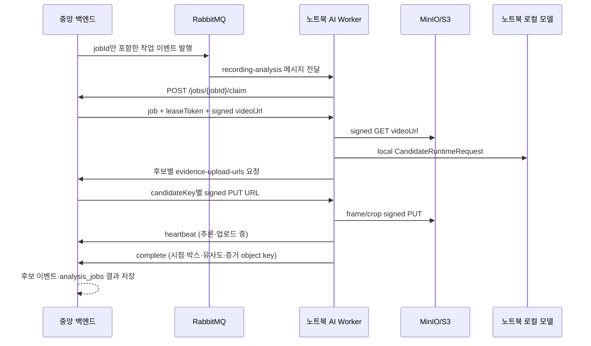

# 노트북 상주 AI Worker 실행 계약

이 문서는 AI Worker 추론을 GPU 서버가 아니라 이 노트북에서 계속 실행하는 운영 경계를 고정한다. 중앙 백엔드는 작업을 등록하고, 노트북 워커는 작업을 선점한 뒤 서명된 녹화 URL을 내려받아 로컬 모델로 추론한다.

## 책임 분리



- 중앙 백엔드: `RECORDING_ANALYSIS` 작업을 `QUEUED`로 등록한 뒤 RabbitMQ에 jobId만 발행하고, 단일 작업을 한 워커에게만 lease한다.
- 노트북 워커: 영상과 기준 자료를 로컬 캐시에 저장하고 `CandidateRuntimeEngine`을 호출한다.
- 모델: 현재 `create_engine()`이 가리키는 SOLIDER+CLIP 어댑터이며, 나중에 다른 엔진으로 교체할 수 있다.
- Jetson: 이 계약을 사용하지 않는다. Jetson은 기존 `X-Device-Key` 기반 실시간 후보 이벤트 경로를 유지한다.

## 중앙 API

모든 요청은 `X-AI-Worker-Key`와 `X-AI-Worker-ID` 헤더를 사용한다. 중앙 서버의 `AI_WORKER_API_KEY`가 비어 있으면 인증은 fail-closed로 거절된다.

| Method | Path | 역할 |
| --- | --- | --- |
| POST | `/api/v1/ai-worker/jobs/{jobId}/claim` | RabbitMQ가 전달한 정확한 작업만 선점 및 signed video URL 수신 |
| POST | `/api/v1/ai-worker/jobs/claim` | RabbitMQ를 사용하지 않는 호환 폴링 모드의 대기 작업 선점 |
| POST | `/api/v1/ai-worker/jobs/{jobId}/heartbeat` | 추론 중 lease 연장 |
| POST | `/api/v1/ai-worker/jobs/{jobId}/evidence-upload-urls` | 후보별 frame/crop signed PUT URL 발급 |
| POST | `/api/v1/ai-worker/jobs/{jobId}/complete` | 로컬 추론 결과 반납 및 `SUCCEEDED` 저장 |
| POST | `/api/v1/ai-worker/jobs/{jobId}/fail` | 오류 반납, 재시도 또는 `FAILED` 전환 |
| GET | `/api/v1/admin/cases/{caseId}/recording-analysis-jobs/{jobId}/result` | 관리자용 저장 결과 조회 |

작업 선점 응답의 `searchFromMs`·`searchToMs`는 녹화 파일 시작 기준 상대 시간이다. 워커는 이 범위를 `CandidateRuntimeRequest`에 그대로 전달하므로 작업 구간 밖 후보가 중앙으로 올라가지 않는다.

RabbitMQ 메시지에는 인상착의·S3 URL·카메라 정보가 들어가지 않는다. 워커는 메시지의 jobId로 중앙 서버에 정확히 claim한 뒤에만 민감한 작업 정보를 받는다. 메시지를 ACK하기 전에는 중앙 lease가 이미 저장되어 있으며, stale 메시지는 빈 claim 응답으로 ACK한다.

완료 payload에는 노트북의 절대 경로를 넣지 않는다. 후보마다 프레임 시점, 바운딩 박스, 유사도, 속성 요약과 중앙이 발급한 crop/frame object key를 보낸다. 중앙 서버는 object key가 **해당 job·재시도·candidateKey** 조합으로 발급된 JPEG/PNG 키와 정확히 일치하는지 및 저장소에 실제로 존재하는지를 확인한 뒤 후보 이벤트와 `analysis_jobs.result_payload`를 함께 저장한다.

## 노트북 설정

`ai-worker/.env.example`을 `.env`로 복사하고 실제 키는 파일 외부 secret store에서 주입한다.

```powershell
cd ai-worker
uv sync --extra realtime --frozen
uv run eyesonu-ai-worker --once
```

`--once`는 작업 하나만 처리하고 종료한다. 계속 대기하려면 다음처럼 실행한다.

```powershell
uv run eyesonu-ai-worker --log-level INFO
```

`.env`에 `EYESONU_AI_WORKER_RABBITMQ_URL`을 넣으면 위 명령은 RabbitMQ 소비 모드로 동작한다. 이 값이 없을 때만 기존 폴링 모드로 호환 실행한다. 브로커는 공인 평문 AMQP 포트를 열지 않고 VPN·AMQPS·SSH 터널 중 하나로 노트북에서 도달 가능해야 한다. RabbitMQ vhost가 `/eyesonu`처럼 슬래시로 시작하면 URL path에는 `/%2Feyesonu`처럼 인코딩한다. 환경 변수의 전체 목록과 운영 점검은 [RabbitMQ 전송 계약](RABBITMQ_NOTEBOOK_WORKER_TRANSPORT.md)을 따른다.

Windows에서는 다음 스크립트로 같은 상주 워커를 시작할 수 있다.

```powershell
powershell.exe -NoProfile -ExecutionPolicy Bypass -File .\scripts\Start-NotebookAiWorker.ps1
```

스크립트는 `.env`와 `uv`가 없으면 시작하지 않으며, Windows 작업 스케줄러를
자동으로 등록하지 않는다.

실제 모델 가중치는 기존 `QWEN_CANDIDATE_*` 설정을 따른다. 노트북에서 실행하므로 GPU 서버의 `/home/...` 경로를 그대로 복사하지 말고, 노트북의 `models/` 또는 로컬 절대 경로로 바꿔야 한다.

## 실패와 재시도

- 워커는 정확한 jobId claim이 성공한 뒤에만 RabbitMQ 메시지를 ACK한다. ACK 직후 노트북이 중단되어도 lease 복구기가 만료 작업을 새 outbox 이벤트로 다시 발행한다.
- lease가 만료된 작업은 다른 워커가 다시 선점할 수 있다.
- heartbeat가 실패하면 현재 결과를 완료 처리하지 않고 lease 손실로 기록한다.
- 영상 다운로드·저장소 통신 오류는 재시도 가능으로 반납한다.
- 모델 설정·입력 검증 오류는 기본적으로 재시도하지 않고 `FAILED`로 반납한다.
- 중앙 서버는 `AI_WORKER_MAX_RETRY_COUNT`를 넘으면 재시도 요청도 `FAILED`로 닫는다.

## 현재 확인 범위

- Python 계약 테스트는 RabbitMQ 메시지 검증·정확한 claim·재전달/DLQ 처리와 claim → signed download → evidence PUT → complete 왕복을 `MockTransport`로 검증한다.
- 중앙 Java 테스트는 RabbitMQ routing-only 이벤트, lease 복구 재발행, 서명 evidence URL, 후보 이벤트 투영, 다른 candidate용 object key 거절을 검증한다.
- 실제 RabbitMQ·MinIO/S3·중앙 API의 네트워크 왕복은 이 노트북에서 브로커 endpoint와 worker API key가 주입된 뒤에 실행한다. 코드 테스트 통과는 운영 연결 성공의 주장으로 대체하지 않는다.
