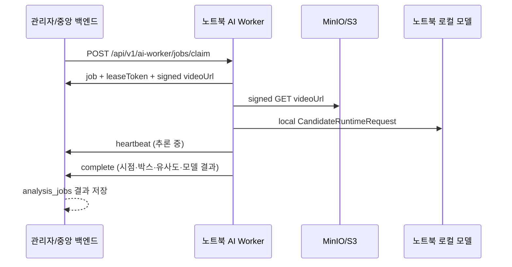

# 노트북 상주 AI Worker 실행 계약

이 문서는 AI Worker 추론을 GPU 서버가 아니라 이 노트북에서 계속 실행하는 운영 경계를 고정한다. 중앙 백엔드는 작업을 등록하고, 노트북 워커는 작업을 선점한 뒤 서명된 녹화 URL을 내려받아 로컬 모델로 추론한다.

## 책임 분리



- 중앙 백엔드: `RECORDING_ANALYSIS` 작업을 `QUEUED`로 등록하고, 단일 작업을 한 워커에게만 lease한다.
- 노트북 워커: 영상과 기준 자료를 로컬 캐시에 저장하고 `CandidateRuntimeEngine`을 호출한다.
- 모델: 현재 `create_engine()`이 가리키는 SOLIDER+CLIP 어댑터이며, 나중에 다른 엔진으로 교체할 수 있다.
- Jetson: 이 계약을 사용하지 않는다. Jetson은 기존 `X-Device-Key` 기반 실시간 후보 이벤트 경로를 유지한다.

## 중앙 API

모든 요청은 `X-AI-Worker-Key`와 `X-AI-Worker-ID` 헤더를 사용한다. 중앙 서버의 `AI_WORKER_API_KEY`가 비어 있으면 인증은 fail-closed로 거절된다.

| Method | Path | 역할 |
| --- | --- | --- |
| POST | `/api/v1/ai-worker/jobs/claim` | 대기 작업 선점 및 signed video URL 수신 |
| POST | `/api/v1/ai-worker/jobs/{jobId}/heartbeat` | 추론 중 lease 연장 |
| POST | `/api/v1/ai-worker/jobs/{jobId}/complete` | 로컬 추론 결과 반납 및 `SUCCEEDED` 저장 |
| POST | `/api/v1/ai-worker/jobs/{jobId}/fail` | 오류 반납, 재시도 또는 `FAILED` 전환 |
| GET | `/api/v1/admin/cases/{caseId}/recording-analysis-jobs/{jobId}/result` | 관리자용 저장 결과 조회 |

작업 선점 응답의 `searchFromMs`·`searchToMs`는 녹화 파일 시작 기준 상대 시간이다. 워커는 이 범위를 `CandidateRuntimeRequest`에 그대로 전달하므로 작업 구간 밖 후보가 중앙으로 올라가지 않는다.

완료 payload에는 노트북의 절대 경로를 넣지 않는다. 후보마다 프레임 시점, 바운딩 박스, 유사도, 속성 요약을 보내며 crop/frame object key는 저장소 업로드 어댑터가 준비된 경우에만 채운다. 현재 중앙 서버는 전체 구조화 결과를 `analysis_jobs.result_payload`에 보존한다.

## 노트북 설정

`ai-worker/.env.example`을 `.env`로 복사하고 실제 키는 파일 외부 secret store에서 주입한다.

```powershell
cd ai-worker
uv sync --extra realtime --frozen
uv run eyesonu-ai-worker --once
```

`--once`는 작업 하나만 처리하고 종료한다. 계속 대기하려면 다음처럼 실행한다.

```powershell
uv run eyesonu-ai-worker --log-level INFO
```

Windows에서는 다음 스크립트로 같은 상주 워커를 시작할 수 있다.

```powershell
powershell.exe -NoProfile -ExecutionPolicy Bypass -File .\scripts\Start-NotebookAiWorker.ps1
```

스크립트는 `.env`와 `uv`가 없으면 시작하지 않으며, Windows 작업 스케줄러를
자동으로 등록하지 않는다.

실제 모델 가중치는 기존 `QWEN_CANDIDATE_*` 설정을 따른다. 노트북에서 실행하므로 GPU 서버의 `/home/...` 경로를 그대로 복사하지 말고, 노트북의 `models/` 또는 로컬 절대 경로로 바꿔야 한다.

## 실패와 재시도

- lease가 만료된 작업은 다른 워커가 다시 선점할 수 있다.
- heartbeat가 실패하면 현재 결과를 완료 처리하지 않고 lease 손실로 기록한다.
- 영상 다운로드·저장소 통신 오류는 재시도 가능으로 반납한다.
- 모델 설정·입력 검증 오류는 기본적으로 재시도하지 않고 `FAILED`로 반납한다.
- 중앙 서버는 `AI_WORKER_MAX_RETRY_COUNT`를 넘으면 재시도 요청도 `FAILED`로 닫는다.

## 현재 확인 범위

- Python 계약 테스트는 claim → signed download → local inference → complete 왕복을 `MockTransport`로 검증한다.
- 중앙 Java 게이트웨이는 Flyway V12와 MyBatis lease/result 매퍼를 포함한다.
- MinIO/S3 실제 endpoint와 운영 API key가 이 환경에 없으므로, 실제 중앙 서버·저장소에 대한 수동 왕복은 키 주입 후 실행해야 한다.
