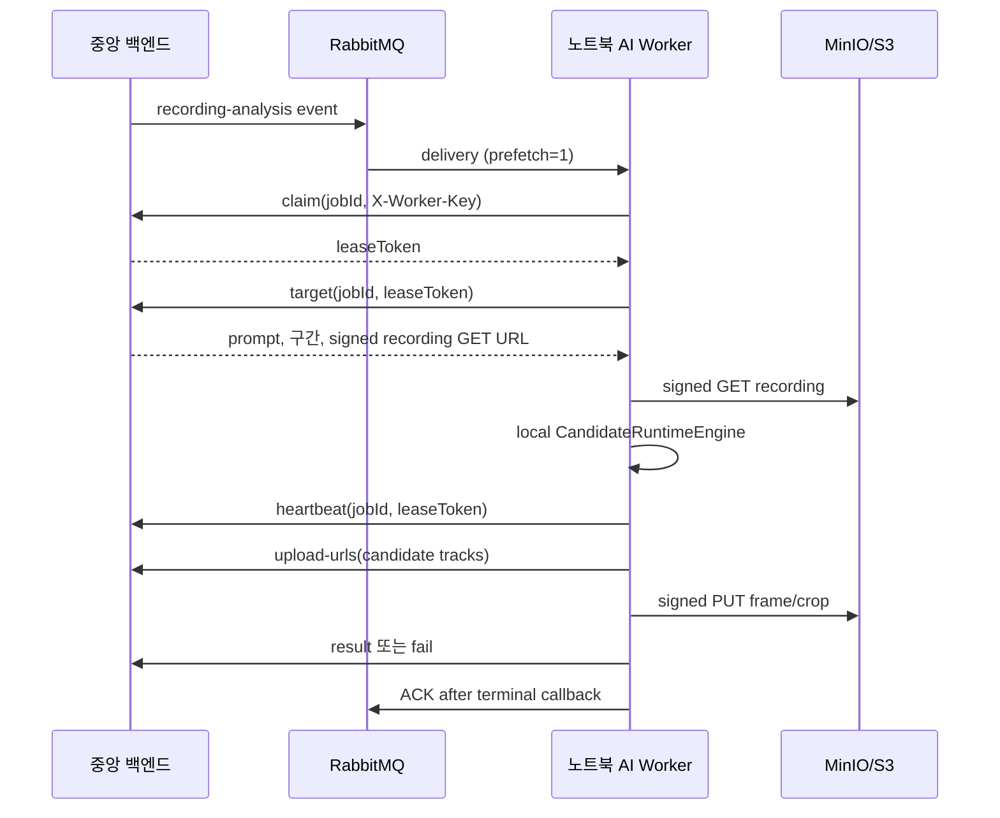

# 노트북 상주 AI Worker 런타임

노트북 AI Worker는 중앙 서버가 등록한 **과거 녹화본 분석 job**을 RabbitMQ에서 받아 이
노트북의 SOLIDER+CLIP 후보 엔진으로 처리한다. Jetson의 실시간 탐지와 역할이 다르며,
이 Worker는 과거 영상 후보·증거와 시간순 후보 경로를 만들기 위한 입력을 중앙 서버에
반납한다.



## 현재 중앙 API

모든 경로의 base는 `/api/v1/internal/recording-analysis-jobs`이고 인증 헤더는
`X-Worker-Key`이다. claim 이후의 모든 요청에는 추가로
`X-Worker-Claim-Token: <leaseToken>`이 필요하다.

| Method | Path | 용도 |
| --- | --- | --- |
| POST | `/{jobId}/claim` | 정확한 RabbitMQ job을 `RUNNING`으로 lease claim |
| GET | `/{jobId}/target` | prompt, 녹화 구간, signed 원본 녹화 GET URL 조회 |
| POST | `/{jobId}/heartbeat` | 긴 추론·업로드 동안 lease 연장 |
| POST | `/{jobId}/upload-urls` | 후보 track별 frame/crop signed PUT URL 발급 |
| POST | `/{jobId}/result` | 업로드된 증거 object key와 후보 결과를 멱등 반납 |
| POST | `/{jobId}/fail` | 안전한 실패 결과를 멱등 반납 |

RabbitMQ만으로 prompt나 URL을 신뢰하지 않는다. 모든 민감한 데이터는 성공한 claim의
lease token을 통해 중앙 서버에서 다시 읽는다. 예전 폴링 호환 경로는 없다.

## 실행

`.env.example`을 복사해 `.env`를 쓰거나, 이미 전달받은 별도 dotenv 파일을 실행 시 지정한다.
키·RabbitMQ URI·모델 가중치·CCTV 데이터는 Git에 넣지 않는다.

```powershell
cd ai-worker
uv sync --extra realtime --frozen

# 연결과 설정만 먼저 검증할 때: 한 delivery만 처리
powershell.exe -NoProfile -ExecutionPolicy Bypass -File .\scripts\Start-NotebookAiWorker.ps1 `
  -EnvFile C:\Users\SSAFY\Desktop\ai.env.txt `
  -Once

# 상주 소비
powershell.exe -NoProfile -ExecutionPolicy Bypass -File .\scripts\Start-NotebookAiWorker.ps1 `
  -EnvFile C:\Users\SSAFY\Desktop\ai.env.txt `
  -LogLevel INFO
```

환경 파일에는 최소한 아래 값이 필요하다.

```dotenv
CENTRAL_API_BASE_URL=https://central.example
CENTRAL_API_WORKER_KEY=<secret>
RABBITMQ_URL=amqps://<user>:<password>@<host>/<vhost>
RABBITMQ_QUEUE=search.target.recording.queue
```

`CENTRAL_API_*`와 `RABBITMQ_*`는 기존 노트북 파일 호환 이름이다. 같은 값은
`EYESONU_AI_WORKER_*` 이름으로도 받을 수 있다. `RABBITMQ_URL`이 빠지면 Worker는
오래된 API polling으로 전환하지 않고 안전하게 실행을 거부한다.

## 결과와 실패 안전성

- runtime은 동일 tracker의 여러 frame을 track 단위 후보 하나로 집계한다. `tracker_id`는
  전역 신원 ID가 아니므로 서로 다른 녹화본·카메라의 후보를 자동으로 같은 사람으로 합치지 않는다.
- 결과 payload에는 로컬 절대 경로를 보내지 않는다. 중앙이 발급한 frame/crop object key,
  frame offset에서 계산한 절대 시각, bounding box, similarity, attribute summary만 보낸다.
- signed 녹화 GET URL이 `401/403`으로 만료되면 동일 job·attempt·case·recording인지 검증한
  target을 한 번 다시 받아 재시도한다. 임의 URL·다른 recording으로 바꾸지 않는다.
- heartbeat 또는 terminal callback이 확정되지 않으면 ACK하지 않는다. delivery는 broker confirm 뒤
  fixed-TTL retry queue에 지연 재발행하여 중앙의 lease·멱등 result 정책으로 안전하게 재처리한다.
- `WORKER_LEASE_CONFLICT`는 다른 Worker가 소유권을 얻었거나 lease가 끝났다는 뜻이다. 이 경우
  result/fail을 더 보내지 않고 즉시 재큐잉 대신 확인된 지연 재발행으로 새 claim을 기다린다.

상세 JSON schema, RabbitMQ event, object-store PUT 규칙은 각각
[중앙 Worker API 계약](../../docs/recording-analysis-worker-api.md),
[증거 업로드 계약](../../docs/recording-analysis-upload-url-api.md),
[RabbitMQ 전송 계약](RABBITMQ_NOTEBOOK_WORKER_TRANSPORT.md)을 따른다.

## 검증 범위

```powershell
uv run pytest -q
uv run ruff check src tests
uv run basedpyright
uv lock --check
```

Python 계약 테스트는 `claim → target → signed download → local inference → signed PUT → result`
흐름, lease heartbeat, URL 만료 재발급, 100개 초과 후보 URL 분할, ACK/requeue 순서를
MockTransport와 Rabbit delivery fake로 검증한다. Java 테스트는 Worker Key, lease token,
target signing, upload URL, 결과·실패 멱등성과 DB migration을 검증한다.

실제 중앙 서버·RabbitMQ·MinIO/S3의 전체 왕복은 코드 테스트와 별도다. broker endpoint·동일
Worker Key·테스트 사건이 모두 준비된 뒤 한 건의 실제 trace로 검증해야 한다.

## 재처리 규칙 (현재 계약)

이 문서의 과거 `requeue` 표현은 즉시 재큐잉이 아니라
[RabbitMQ 전송 계약](RABBITMQ_NOTEBOOK_WORKER_TRANSPORT.md)의 **확인된 지연 재발행**을 뜻한다.
`LEASE_HELD_BY_SELF`/`LEASE_HELD_BY_OTHER`와 `WORKER_LEASE_CONFLICT`는 lease 만료 후 새 claim이 가능하도록 fixed TTL retry
queue에 넣고, `JOB_NOT_RUNNABLE`은 stale delivery로 ACK한다. HTTP 4xx는 DLQ, 네트워크 오류와
HTTP 5xx만 지연 재시도한다. `LEASE_HELD_BY_SELF`/`LEASE_HELD_BY_OTHER`/`RETRY_PENDING`은 retry budget을 소비하지 않으며,
중앙 서버 lease-recovery scheduler가 만료 `RUNNING` job을 새 outbox로 복구하므로 delivery가
사라져도 작업이 영구 정지하지 않는다.
