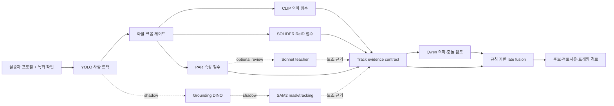
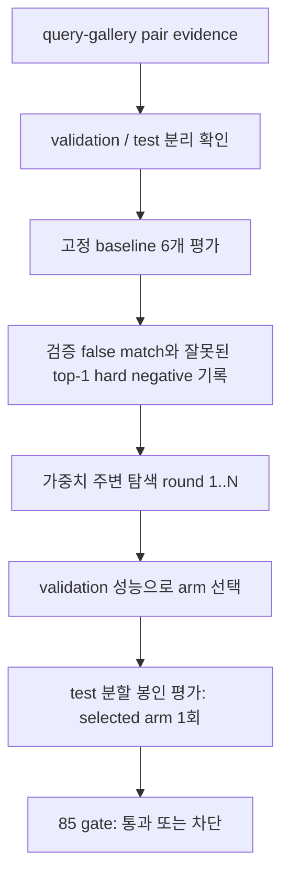

# AI Worker 오케스트레이션 성능 개선 루프

이 문서는 현재 워커에 있는 YOLO·CLIP·SOLIDER/PAR·Qwen 경로를 같은 실험 계약으로 비교하고, GPU 서버에서 다시 실행할 때 결과를 재현하기 위한 문서다.

핵심은 **모델을 무작정 하나로 합치는 것**이 아니다. 각 모델을 하네스로 감싸서 같은 입력을 받고, 그래프가 실행 순서를 관리하며, 루프가 검증 데이터에서만 조합과 임계값을 고른다. 마지막 테스트 데이터는 선택이 끝난 뒤 한 번만 읽는다.

## 1. 서비스에서의 실제 흐름



`src/qwen_backend/orchestration_graph.py`의 기본 그래프는 이 순서를 DAG로 고정한다. DINO·SAM2·Sonnet은 shadow branch다. 준비되지 않은 teacher가 있다고 해서 확정 매칭으로 바뀌지 않으며, 결과가 없으면 `unavailable`로 남는다.

현재 기존 `MultiModelCandidateEngine`의 운영 경로를 바로 덮어쓰지 않았다. 새 계층은 먼저 동일 입력을 재생해 비교하는 안전한 실험 경계다. 검증된 arm이 생긴 뒤에만 런타임 fusion 설정으로 승격한다.

## 2. 모델 하네스

`src/qwen_backend/model_harness.py`의 `ModelHarness`는 모든 모델 결과를 다음 공통 형태로 바꾼다.

```python
ModelObservation(
    model=AgentModel.SOLIDER,
    status=HarnessStatus.READY,
    score=0.82,
    latency_ms=12.4,
    input_sha256="...64자리 해시...",
    output_sha256="...선택적 결과 해시...",
)
```

모델이 없거나 실패했을 때는 점수를 0.0으로 위조하지 않는다.

- 설정되지 않은 모델: `unavailable`, `score=None`
- 모델 예외: `failed`, `score=None`
- 성공한 모델: `ready`, `0~1` 점수

이 구분 덕분에 Qwen이나 Sonnet API가 끊겼을 때 “낮은 점수”와 “실행되지 않음”을 구분할 수 있다.

## 3. 그래프 엔지니어링

기본 노드는 다음과 같다.

| 단계 | 모델 | 필수 여부 | 역할 |
|---|---|---:|---|
| `detect_tracks` | YOLO | 필수 | 사람 후보와 track 생성 |
| `quality_gate` | 없음 | 필수 | 너무 작은·가려진 크롭 제거 |
| `clip_retrieval` | CLIP | 필수 | 프로필과 의미가 가까운 후보 검색 |
| `solider_reid` | SOLIDER | 필수 | 사람 재식별 근거 |
| `par_attributes` | SOLIDER-PAR/속성 head | 선택 | 상의·하의·성별 등 속성 근거 |
| `evidence_contract` | 없음 | 필수 | track 단위로 근거 묶기 |
| `qwen_review` | Qwen | 선택 | 속성 충돌과 설명 검토 |
| `late_fusion_decision` | 없음 | 필수 | 확률·검토필요·불일치 출력 |

DAG는 중복 노드, 없는 의존성, 순환 의존성을 시작 시 거부한다. 필수 단계가 실패하면 뒤 단계가 `blocked`가 되므로 실패한 입력을 성공 후보로 내보내지 않는다.

## 4. 루프 엔지니어링

루프는 모델 가중치를 임의로 바꾸는 장치가 아니라, **검증 분할에서 조합을 고르는 장치**다.



고정 비교 arm은 다음 6개다.

1. `clip_only`
2. `solider_only`
3. `par_only`
4. `clip_solider_equal`
5. `clip_solider_par`
6. `clip_solider_par_qwen_review`

그 뒤 각 라운드에서 선택된 가중치 주변을 탐색한다. 고정 arm과 loop 후보는 validation에서만 비교하고 임계값도 validation에서만 계산한다. test는 최종 선택 arm에 대해 정확히 한 번만 봉인 평가한다. test를 보고 다시 가중치를 바꾸면 실험이 오염되므로 코드에서 그렇게 하지 않는다.

## 5. 입력 데이터 계약

실험 입력은 프레임별 예측값이 아니라 track-query와 gallery-track의 비교 결과 JSONL이다. 영상과 원본 이미지는 서버에 남겨도 되고, 이 실험 계층에는 경로 대신 식별자와 점수만 전달한다.

```json
{
  "schemaVersion": "eyesonu-orchestration-pair-evidence-v2",
  "protocol": "cross_camera_event_heldout",
  "queryTrackId": "query-cam02-001",
  "queryIdentity": "person-007",
  "queryKnown": true,
  "queryCaseId": "case-001",
  "queryVideoId": "video-query-001",
  "queryEventGroupId": "event-001",
  "queryTimestampMs": 120000,
  "queryCamera": "2-1",
  "galleryTrackId": "gallery-cam04-033",
  "galleryIdentity": "person-007",
  "galleryCaseId": "case-001",
  "galleryVideoId": "video-gallery-004",
  "galleryEventGroupId": "event-001",
  "galleryTimestampMs": 135000,
  "galleryCamera": "4-1",
  "split": "validation",
  "clipScore": 0.81,
  "soliderScore": 0.88,
  "parScore": 0.76,
  "qwenScore": 0.84
}
```

주의할 점:

- 같은 query track이 validation과 test에 동시에 나오면 거부한다.
- 같은 query/gallery pair가 중복되면 거부한다.
- identity가 알려진 query는 gallery에 같은 identity가 있어야 한다. 없다면 false reject로 계산한다.
- distractor query도 반드시 포함해야 한다. known query만으로는 자동 거절 성능을 측정할 수 없다.
- 기본 승격 기준은 known query 100개 이상, distractor query 100개 이상이다. 이것은 작은 fixture에서 통과하도록 낮추는 값이 아니다.

## 6. 실행 방법

로컬에서 계약과 알고리즘만 확인할 때:

```powershell
cd C:\Users\SSAFY\Desktop\2학기\S15P11A204-deploy-ai-worker-env-fix\ai-worker
uv run python scripts/run_orchestration_experiment.py `
  --manifest <pair-evidence.jsonl> `
  --output experiments/results/orchestration-upgrade.json `
  --rounds 3
```

GPU 서버에서는 먼저 기존 모델 학습·임베딩 추출 스크립트를 실행하고, 각 arm의 점수를 위 JSONL로 만든 뒤 같은 CLI를 실행한다.

```bash
cd "$AI_WORKER_ROOT"
conda run -n qwen3vl --no-capture-output python \
  scripts/run_orchestration_experiment.py \
  --manifest experiments/evidence/pair-evidence-v1.jsonl \
  --output experiments/results/orchestration-upgrade-v1.json \
  --rounds 5
```

후보 모델의 학습은 기존 스크립트를 사용한다.

```bash
python scripts/finetune_prid2011_solider_backbone.py --help
python scripts/finetune_clip_l14_sonnet_aux.py --help
python scripts/train_clip_vitl14_distill.py --help
python scripts/prepare_qwen_fair_dataset.py --help
```

각 학습 arm은 반드시 다음을 함께 저장해야 한다.

1. 학습·검증·테스트 manifest의 SHA-256
2. checkpoint SHA-256
3. 모델 버전과 prompt 버전
4. GPU·CUDA·패키지 버전
5. pair-evidence JSONL의 SHA-256
6. 결과 JSON과 실행 로그

## 7. 현재 검증 상태

이번 변경으로 확인한 것은 **오케스트레이션 계층의 코드 동작과 GPU 속성 proxy 재실험**이다.

- 새 하네스·그래프·루프 테스트: 9 passed
- 새 소스 ruff: 통과
- 새 소스 basedpyright strict: 0 errors, 0 warnings, 0 notes
- 작은 fixture에서 validation-only 선택과 sealed-test 계산: 통과
- 작은 fixture 결과의 gate: 실제 데이터 수가 부족하면 의도적으로 차단

이번 턴에는 `.env.txt`를 사용해 JupyterHub에 로그인하고 L40S GPU에서 SOLIDER Swin-B + PA-100K 속성 head를 실제 실행했다. test mA는 `0.7567232847213745`, InsF1은 `0.8584181666374207`이었다. 추가로 CLIP ViT-L/14 5 epoch partial fine-tune을 실행해 epoch 2 validation 선택 arm의 test mA `0.7827170491218567`을 확인했고, SOLIDER KD(`alpha=0.15`, `temperature=1.5`)도 동일한 공식 split에서 재실행했다. KD 결과는 validation 선택 hard arm test mA `0.7271912693977356`, KD arm test mA `0.7255619764328003`으로 개선되지 않았다. 모든 수치는 PA-100K 속성 proxy이며 identity CCTV 성능이 아니다. 새 identity pair-evidence를 원격에 올려 실행한 결과는 아직 없으므로, 새 모델의 일반화 성능을 주장하지 않는다.

상세한 GPU 실행 명령·해시·비교표는 `docs/ORCHESTRATED_GPU_RESULTS_20260810.md`에 기록한다.

또한 기존 저장소의 strict CHIRLA 결과는 프로젝트 CCTV 일반화 결과가 아니다. 기존 기록상 SOLIDER strict proxy의 Rank-1과 Recall@5가 각각 0.4737, 0.7789였고, 이 값으로 85% 자동 판정을 주장하지 않는다. 이번 루프가 85 gate를 통과하려면 실제 다중 identity·distractor·카메라/시간 분리 track evidence가 필요하다.

## 8. 승격 규칙

`selected_test`가 다음을 모두 만족할 때만 후보 승격을 검토한다.

- known Rank-1 `>= 0.85`
- known Recall@5 `>= 0.95`
- automatic decision accuracy `>= 0.85`
- distractor false-match rate `<= 0.05`
- false-reject rate `<= 0.15`
- known/distractor query 수가 각각 100개 이상

하나라도 실패하면 결과 JSON의 `promotionGate.passed=false`로 남고 운영 자동 매칭으로 승격하지 않는다. Qwen·Sonnet을 사용했다는 사실 자체는 성능 증거가 아니며, 동일한 held-out 분할에서 점수로 검증되어야 한다.
