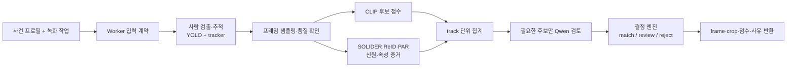

# EyesOnU AI Worker 자료실 안내

이 문서는 지금까지 만든 CCTV 실종자 후보 탐색 자료를 한 번에 찾아볼 수 있도록 정리한 공개용 색인입니다. 핵심 구현은 `ai-worker/` 아래에, 발표용 결과물은 `presentation/` 아래에 모읍니다.

## 한 줄 요약

AI Worker는 녹화 영상에서 사람을 검출·추적하고, 여러 모델이 만든 서로 다른 증거를 track 단위로 모아 실종자 후보를 우선순위화합니다. 모델 하나가 모든 판단을 독점하지 않으며, 근거가 충돌하거나 부족하면 관리자 검토로 넘깁니다.

## 실제 처리 흐름



## 모델별 역할

| 모델 또는 모듈 | 하는 일 | 최종 판정 권한 |
| --- | --- | --- |
| YOLO + tracker | 사람만 검출하고 같은 영상 안의 track을 묶음 | 없음 |
| CLIP | 텍스트 인상착의와 crop의 의미 유사도를 빠르게 계산 | 없음 |
| SOLIDER ReID | 사람의 신원 특징 벡터를 만들고 Top-K 후보를 검색 | 자동 확정은 gate 통과 시에만 |
| SOLIDER PAR / fine attribute head | 상의·하의·성별·부가 속성의 구조화된 근거를 생성 | 없음 |
| Qwen3-VL 계열 | 상위 후보의 속성 충돌과 낮은 신뢰도를 설명하는 검토 보조 | primary classifier 아님 |
| 결정 엔진 | 모델 점수, 시간·공간·품질 근거를 재현 가능한 규칙으로 결합 | match / review / reject |

Sonnet·Grounding DINO·SAM2·Florence 계열은 학습·라벨 검수·비교 실험의 teacher 또는 보조 도구로 정리되어 있습니다. 현재 공개 runtime의 필수 모델로 포장하지 않았습니다.

## 학습·증류 자료

전체 학습 순서와 수치 개선 실험을 처음부터 재현하려면 [`MODEL_TRAINING_AND_METRIC_UPGRADE_PLAYBOOK.md`](MODEL_TRAINING_AND_METRIC_UPGRADE_PLAYBOOK.md)를 먼저 읽는다. 이 문서는 실제 수치의 평가 단위, 데이터 split, fine-tuning, metric head, hard-negative, 증류, 오케스트레이션, 승격 gate를 한 흐름으로 연결한다.

- `scripts/train_clip_vitl14_distill.py`: CLIP feature와 weighted BCE, teacher logit distillation
- `scripts/finetune_clip_l14_sonnet_aux.py`: CLIP 마지막 vision layer와 projection을 열고 identity·contrastive·triplet·teacher 보조 loss를 함께 학습
- `scripts/finetune_prid2011_solider_backbone.py`: ArcFace, batch-hard triplet, part triplet, teacher-preservation loss
- `src/qwen_backend/distillation.py`: teacher provenance, 승인 상태, hash 검증, Qwen JSONL 변환
- `scripts/prepare_qwen_fair_dataset.py`: 이미지·질문·응답 형식의 Qwen 학습 데이터 준비
- `docs/DISTILLATION_TRAINING_GUIDE.md`: 증류 원리와 실행 순서
- `docs/AI_WORKER_STUDY_GUIDE_MIDDLE_SCHOOL.md`: 파인튜닝·증류·추론을 쉬운 말과 코드로 설명한 독립 학습 자료

증류는 teacher의 지식을 그대로 복사하는 작업이 아닙니다. teacher가 만든 승인된 정답·logit·설명 중 어떤 신호를 student의 loss에 넣을지 정하고, student가 실제 배포 입력에서 같은 판단을 하도록 다시 학습하는 과정입니다.

## 실험·평가 자료

- `scripts/run_cctv_model_comparison.py`: CCTV crop 기반 후보 모델 비교
- `scripts/benchmark_chirla_reid.py`, `scripts/benchmark_prid2011_tracks.py`: 공개 ReID proxy와 track 지표 실행
- `scripts/run_solider_*`, `scripts/tune_prid2011_*`: SOLIDER head·metric·camera invariant·open-set 비교
- `scripts/benchmark_zone_probability_policy.py`, `scripts/train_zone_region_models.py`: 구역 우선순위와 확률 정책 실험
- `output/jupyter-notebook/ai_worker_presentation_evidence.ipynb`: 발표용 evidence 요약 노트북
- `configs/model_selection.json`: 역할·후보·평가 범위·출처를 고정한 설정
- `docs/MODEL_COMPARISON_AND_QWEN_RUNTIME.md`: CLIP·Qwen·속성 모델의 비교 해석과 runtime 경계
- `docs/ZONE_POLICY_EXPERIMENT_20260801.md`, `docs/ZONE_REGION_MODEL_EXPERIMENT_20260802.md`: 구역 검색 정책의 실험 기록

### 수치 읽는 법

발표 자료의 Recall@5는 정답 identity가 상위 5개 후보 안에 포함되었는지를 보는 후보 검색 지표입니다. Rank-1 자동 동일인 확정률이나 프로젝트 전체 CCTV 일반화 정확도와 같은 뜻이 아닙니다. 원본 identity·track-heldout 라벨과 독립 검수가 없는 수치는 proxy 또는 발표용 evidence로만 표시하며, production 승인 근거로 바꾸지 않습니다.

## 발표 자료

`presentation/`에는 아래 자료를 원본 데이터 없이 볼 수 있는 형태로 보관합니다.

- 모델 버전별 비교와 v4 선택 근거
- v4 속성별 정확도와 혼동행렬
- 학습 곡선과 validation 대비 실전 domain gap
- 모델 오케스트레이션과 데이터 흐름
- 성능 개선 전후 비교
- 발표용 PDF와 재현용 SVG/PNG

도표의 출처·범위·proxy 여부는 각 이미지와 함께 있는 evidence JSON 또는 문서에서 확인합니다. 실제 CCTV 영상, 프레임, 개인 식별자, 모델 가중치, API key, 사설 서버 주소는 포함하지 않습니다.

## AI Worker runtime 자료

- `src/qwen_backend/multi_model_candidate_engine.py`: YOLO → 품질 → CLIP/SOLIDER/PAR → track 집계 → Qwen 검토 → 결정 엔진
- `src/qwen_backend/video_tracks.py`: 프레임 샘플링과 track crop 생성
- `src/qwen_backend/attribute_ensemble.py`: 증거별 가중치·누락 신호 재정규화·결정 gate
- `src/qwen_backend/candidate_runtime.py`: 요청·응답 계약과 경로·시간 범위 검증
- `src/qwen_backend/rabbit_worker.py`: RabbitMQ 작업 수신과 재처리 경계
- `src/qwen_backend/recording_job_executor.py`: claim → target → download → local inference → upload → complete/fail 흐름
- `docs/AI_WORKER_COMPLETE_GUIDE.md`: 전체 구현 안내서
- `output/pdf/AI_WORKER_STUDY_GUIDE_MIDDLE_SCHOOL.pdf`: 처음부터 공부할 때 사용하는 독립 PDF

## 공개 저장소에 넣지 않은 것

다음은 재현에 필요한 설명이 아니라 보안·개인정보·대용량 문제 때문에 제외합니다.

- 실제 CCTV 영상·프레임·crop과 개인 식별 라벨
- `.env`, `ai.env.txt`, RabbitMQ·S3·MinIO 자격증명
- private GPU/Jupyter 주소와 내부 서버 경로
- SOLIDER·CLIP·Qwen 등의 모델 가중치
- `__pycache__`, 브라우저 QA profile, `tmp` 산출물

## 검증 명령

AI Worker checkout에서 다음 명령으로 문서·runtime 계약·증류 관련 테스트를 확인할 수 있습니다.

```powershell
uv run pytest tests/test_ai_worker_study_guide_document.py tests/test_ai_worker_guide_document.py tests/test_distillation.py tests/test_cctv_annotation.py tests/test_candidate_runtime_contract.py -q
uv run ruff check src/qwen_backend/annotation_cli.py tests/test_ai_worker_study_guide_document.py tests/test_ai_worker_guide_document.py scripts/Build-AiWorkerGuidePdf.py
python -m py_compile scripts/Build-AiWorkerGuidePdf.py src/qwen_backend/annotation_cli.py
```

검증이 통과했다는 사실은 코드와 문서 계약이 맞는다는 뜻입니다. 이것만으로 실제 관할 CCTV 전체에 대한 일반화 정확도를 주장하지 않습니다.

## 발표·면접용 핵심 문장

> 우리는 여러 모델을 무작정 합친 것이 아니라, 탐지·검색·속성·검토의 역할을 나누고 track 단위의 증거 계약과 fail-closed 결정 gate를 둔 AI Worker를 만들었습니다. 그래서 모델을 바꾸어도 중앙 작업 계약은 유지되고, 근거가 부족한 후보는 자동 확정되지 않습니다.
