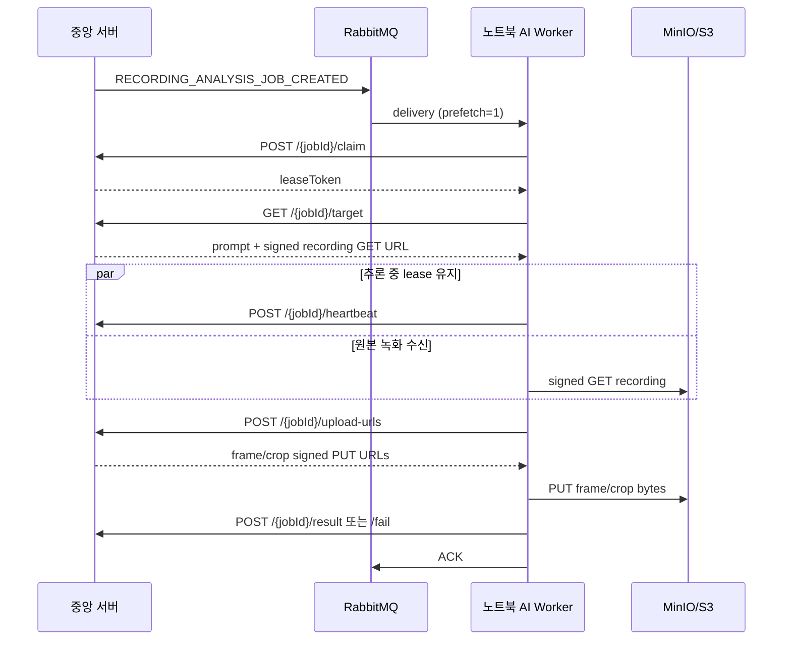

# RabbitMQ 기반 노트북 AI Worker 전송 계약

이 문서는 중앙 서버가 녹화본 분석 작업을 RabbitMQ로 알리고, 노트북의 `ai-worker`가
로컬 추론·증거 업로드·결과 반납을 하는 현재 운영 계약을 설명한다. REST 요청과 payload의
정본은 [녹화본 분석 AI Worker 계약](../../docs/recording-analysis-worker-api.md)이다.



## RabbitMQ 이벤트

- exchange: `search.target.exchange`
- routing key: `search.target.recording.created`
- queue: `search.target.recording.queue`
- event type: `RECORDING_ANALYSIS_JOB_CREATED`

이벤트에는 `commandId`, `eventType`, `jobId`, `caseId`, `recordingId`, `cameraId`,
`cameraCode`, `cameraName`, `recordingObjectKey`, `attempt`, `occurredAt`만 들어간다.
인상착의 prompt, exclusion prompt, presigned URL, MinIO/S3 자격 증명은 이벤트에 넣지
않고 Worker가 lease를 획득한 뒤 `/target`에서만 받는다.

## 처리·ACK 규칙

1. Worker는 메시지의 `jobId`로만 `POST /api/v1/internal/recording-analysis-jobs/{jobId}/claim`을 호출한다.
2. `duplicate: true`이면 이미 다른 delivery가 처리 중이므로 로컬 추론 없이 ACK한다.
3. `duplicate: false`이면 응답의 `leaseToken`을 `X-Worker-Claim-Token`으로 사용한다.
4. 원본 영상은 `/target`의 `recordingDownloadUrl`로만 받으며, 만료된 서명 URL의 `401/403`은
   동일 job·attempt·case·recording인지 검증한 후 `/target`을 한 번 다시 조회해 재시도한다.
5. frame/crop은 중앙 서버가 발급한 URL에 직접 PUT한다. 이 PUT에는 `X-Worker-Key`나 lease
   token을 붙이지 않는다.
6. 중앙 서버가 `/result` 또는 `/fail`을 수락한 뒤에만 ACK한다. claim·heartbeat·terminal callback이
   확정되지 않거나 `WORKER_LEASE_CONFLICT`이면 ACK하지 않고 requeue한다.
7. 형식이 깨진 RabbitMQ 메시지만 `requeue=false`로 거절한다. 정상 메시지의 일시적 네트워크 오류는
   데이터 유실보다 재처리를 우선한다.

후보는 runtime track 단위로 집계한다. 같은 tracker ID에서 연속 프레임이 잡혀도 프레임마다
후보를 등록하지 않으며, 한 track의 대표 frame/crop과 시간·bounding box를 결과에 보낸다.

## 노트북 설정과 실행

```dotenv
CENTRAL_API_BASE_URL=https://central.example
CENTRAL_API_WORKER_KEY=<secret>
RABBITMQ_URL=amqps://<user>:<password>@<host>/<vhost>
RABBITMQ_QUEUE=search.target.recording.queue
EYESONU_AI_WORKER_HEARTBEAT_INTERVAL_SECONDS=20
```

`EYESONU_AI_WORKER_CENTRAL_API_URL`, `EYESONU_AI_WORKER_API_KEY`,
`EYESONU_AI_WORKER_RABBITMQ_URL`, `EYESONU_AI_WORKER_RABBITMQ_QUEUE`도 같은 값의
지원 이름이다. 중앙 백엔드에는 같은 키를 `WORKER_AUTHENTICATION_KEY` 또는 호환 변수
`AI_WORKER_API_KEY`로 주입해야 한다.

기존 `ai.env.txt`를 그대로 쓰려면 파일 내용을 출력하거나 저장소에 복사하지 말고 경로만
전달한다.

```powershell
cd ai-worker
uv sync --extra realtime --frozen
powershell.exe -NoProfile -ExecutionPolicy Bypass -File .\scripts\Start-NotebookAiWorker.ps1 `
  -EnvFile C:\Users\SSAFY\Desktop\ai.env.txt `
  -Once
```

`--once`는 한 delivery만 처리하고 종료한다. RabbitMQ URL이 없으면 Worker는 예전 폴링 호환
경로로 전환하지 않고 시작 단계에서 명확하게 실패한다.

## 운영 전 확인

1. 중앙 백엔드의 `recording.analysis.backend-consumer.auto-start`가 `false`인지 확인한다.
   이 consumer가 켜져 있으면 백엔드가 노트북 Worker보다 먼저 lease를 선점할 수 있다.
2. 노트북에서 RabbitMQ endpoint를 VPN, AMQPS 또는 SSH tunnel로 접근하고 queue를 passive declare할
   수 있는지 확인한다. 공인 평문 AMQP 포트를 새로 열지 않는다.
3. 중앙 서버의 Worker Key와 노트북의 `CENTRAL_API_WORKER_KEY`가 같은 secret인지 secret store에서
   확인한다. `INVALID_WORKER_KEY`를 코드에서 우회하지 않는다.
4. 별도 테스트 사건으로 `claim → target → signed GET → 추론 → signed PUT → result` trace를
   한 번 끝까지 남긴다. 코드 단위 테스트 통과는 실제 broker·MinIO·배포 key 성공을 대신하지 않는다.
