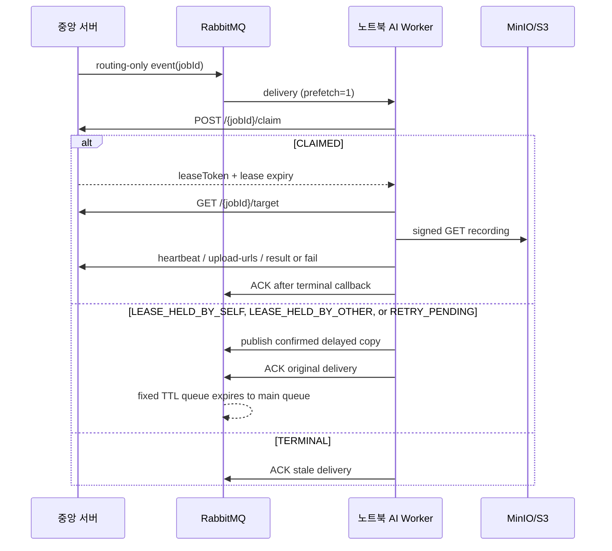

# RabbitMQ 기반 노트북 AI Worker 전송 계약

이 문서는 중앙 서버가 녹화본 분석 작업을 RabbitMQ로 발행하고, 노트북의 `ai-worker`가
로컬 추론·증거 업로드·결과 반납을 수행하는 전송 계약을 정의한다. 상세 REST 요청과 payload는
[녹화본 분석 AI Worker 계약](../../docs/recording-analysis-worker-api.md)을 따른다.



## RabbitMQ 토폴로지

- main exchange: `search.target.exchange`
- main routing key: `search.target.recording.created`
- main queue: `search.target.recording.queue`
- retry exchange: `search.target.recording.retry.exchange`
- retry routing-key prefix: `search.target.recording.retry`
- retry queues: `search.target.recording.queue.retry.5s`, `.15s`, `.30s`, `.60s`, `.300s`
- DLQ exchange/queue: `search.target.dlx` / `search.target.recording.dlq`

각 retry queue는 자체 `x-message-ttl` 후 main exchange/routing key로 dead-letter한다. Worker는
요청한 지연 시간보다 같거나 큰 가장 작은 버킷을 고른다. 따라서 서로 다른 지연의 메시지가
한 큐에서 FIFO로 막히지 않는다.

## 이벤트 최소화

발행 메시지는 아래 네 필드만 가진다. `caseId`, 카메라 정보, 녹화 object key, prompt,
presigned URL, 저장소 자격 증명은 RabbitMQ에 싣지 않는다.

```json
{
  "commandId": "01K1...",
  "eventType": "RECORDING_ANALYSIS_JOB_CREATED",
  "jobId": 42,
  "occurredAt": "2026-08-04T00:31:00Z"
}
```

Worker는 성공한 claim의 lease token으로만 `/target`을 호출해 인상착의, 검색 구간,
signed recording URL을 받는다. 이전 배포에서 남은 확장 메시지는 호환을 위해 읽되 무시한다.

## Claim disposition과 ACK 규칙

| Claim disposition / 오류 | Worker 동작 |
| --- | --- |
| `CLAIMED` | `leaseToken`으로 분석을 수행하고 `/result` 또는 `/fail` 수락 뒤 ACK |
| `LEASE_HELD_BY_SELF` | 같은 Worker의 stale delivery이므로 `claimExpiresAt + 1초`까지 지연 버킷에 재발행한 뒤 원본 ACK |
| `LEASE_HELD_BY_OTHER` | 다른 Worker가 active lease를 소유하므로 `claimExpiresAt + 1초`까지 지연 버킷에 재발행한 뒤 원본 ACK |
| `RETRY_PENDING` | 짧은 지연 버킷에 재발행한 뒤 원본 ACK |
| `TERMINAL`, `JOB_NOT_RUNNABLE` | stale 메시지이므로 재발행 없이 ACK |
| HTTP 4xx (위 terminal 제외) | 설정·권한·요청 오류이므로 `reject(requeue=false)`로 DLQ |
| 네트워크 오류 또는 HTTP 5xx | 지연 재발행이 broker confirm되면 원본 ACK |

지연 메시지 publish가 confirm되지 않으면 원본 delivery를 ACK하지 않고 `reject(requeue=true)`한다.
`x-eyesonu-retry-count` 상한(기본 20회)은 네트워크·HTTP 5xx 같은 **실패 재시도**에만 적용한다.
`LEASE_HELD_BY_SELF`, `LEASE_HELD_BY_OTHER`, `RETRY_PENDING`은 실패가 아니라 소유권/경쟁 상태이므로 같은 카운터를 보존한 채
지연 재발행한다. 따라서 오래 실행 중인 정상 Worker가 있어도 stale delivery가 상한 때문에 사라지지
않는다. 구형 `RUNNING` job의 lease 만료 시각이 비어 있으면 중앙 서버는 응답에
`startedAt + worker claim lease`를 다음 claim 가능 시각으로 채운다. `startedAt`까지 비어 있는
깨진 구형 행은 즉시 회수 가능하다. retry 상한으로 delivery가 DLQ에 들어가거나 broker publish가
유실된 뒤에도 중앙 서버의 lease-recovery scheduler가 만료 `RUNNING` job을 `QUEUED`로 원자적으로
되돌리고 transactional outbox를 새로 만들어 작업 이벤트를 복구한다.

## 노트북 설정과 실행

```dotenv
CENTRAL_API_BASE_URL=https://central.example
CENTRAL_API_WORKER_KEY=<redacted>
RABBITMQ_URL=amqps://<user>:<password>@<host>/<vhost>
RABBITMQ_QUEUE=search.target.recording.queue
EYESONU_AI_WORKER_RABBITMQ_RETRY_EXCHANGE=search.target.recording.retry.exchange
EYESONU_AI_WORKER_RABBITMQ_RETRY_ROUTING_KEY_PREFIX=<redacted>
EYESONU_AI_WORKER_HEARTBEAT_INTERVAL_SECONDS=20
```

```powershell
cd ai-worker
uv sync --extra realtime --frozen
powershell.exe -NoProfile -ExecutionPolicy Bypass -File .\scripts\Start-NotebookAiWorker.ps1 `
  -EnvFile <local-user-path>\Desktop\<worker-env-file> `
  -Once
```

`prefetch=1`은 한 GPU 프로세스가 여러 lease를 동시에 잡지 않게 강제한다. RabbitMQ는 VPN,
AMQPS 또는 SSH tunnel로만 접근하고, public AMQP port를 열지 않는다.

## 롤아웃과 운영 검증

1. 작업 발행/소비를 잠시 멈춘다. 이 구간에는 retry exchange가 아직 없을 수 있다.
2. Worker 코드를 먼저 배포한다. 확장된 구 메시지는 무시하므로 기존 publisher와 공존할 수 있다.
3. backend를 배포해 retry exchange/queue와 routing-only publisher를 선언한 뒤 작업 발행/소비를 재개한다.
4. 기존 backend Rabbit consumer는 `recording.analysis.backend-consumer.auto-start=false`로 유지한다.
5. 테스트 사건 하나로 `claim → target → signed GET → inference → signed PUT → result`와
   `LEASE_HELD_BY_SELF`/`LEASE_HELD_BY_OTHER → delayed retry → reclaim`을 broker·MinIO/S3까지 실제 왕복으로 확인한다.

코드 단위 테스트는 race, stale ACK, 4xx DLQ, publisher-confirm 이전 ACK 금지, fixed TTL bucket
binding을 검증한다. 실제 broker/MinIO/S3 endpoint와 worker key를 이용한 end-to-end trace는
배포 환경에서 별도로 수행해야 한다.

