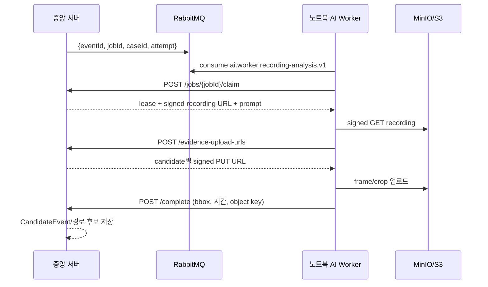

# RabbitMQ 기반 노트북 AI Worker 전송 계약

이 문서는 중앙 서버가 녹화본 분석 작업을 RabbitMQ로 알리고, 노트북의 `ai-worker`가 실제 추론과 결과 반납을 수행하는 경로를 정의한다. RabbitMQ 메시지에는 인상착의, 서명 URL, S3 키를 넣지 않는다. 메시지는 작업을 찾아갈 **식별자**만 전달하고, 민감한 작업 상세 정보는 노트북이 중앙 서버 API에서 lease-claim 할 때만 받는다.



## 보장하는 동작

- `jobId` 기반 정확 claim: RabbitMQ의 오래된 중복 메시지는 빈 응답으로 ACK하고, 다른 대기 작업을 대신 claim하지 않는다.
- ACK 순서: 중앙 서버가 lease를 저장한 뒤에만 ACK한다. ACK 직후 노트북이 꺼지면 중앙 서버의 만료 lease 복구기가 작업을 `QUEUED`로 되돌려 outbox 메시지를 다시 발행한다.
- 추론 실패: 워커가 retryable 오류를 `/fail`로 반납하면 중앙 서버가 새 outbox 메시지를 만든다.
- 후보 증거: 후보별 frame/crop은 중앙 서버가 발급한 signed PUT URL에만 업로드한다. 완료 전에는 업로드된 객체의 경로, 이미지 유형, 파일 시그니처를 중앙 서버가 검증한다.
- 결과 투영: 완료된 후보는 기존 `CandidateEvent`와 `RecordingAnalysisResult`에 저장되어 관리자 후보 목록·경로 화면에서 사용할 수 있다.

## 노트북 설정

`ai-worker/.env.example`을 복사한 뒤 아래 값만 실제 secret store 또는 로컬 `.env`에 주입한다. URL·계정 정보는 Git에 넣지 않는다.

```dotenv
EYESONU_AI_WORKER_CENTRAL_API_URL=https://central.example
EYESONU_AI_WORKER_API_KEY=<central-ai-worker-key>
# 예: RabbitMQ vhost가 /eyesonu이면 URI path는 %2Feyesonu이다.
EYESONU_AI_WORKER_RABBITMQ_URL=amqps://<user>:<password>@<broker-host>/%2Feyesonu
EYESONU_AI_WORKER_RABBITMQ_QUEUE=ai.worker.recording-analysis.v1
```

현재 배포 Compose는 RabbitMQ의 AMQP 포트를 외부 공개하지 않는 구성이므로, 노트북에서 브로커까지 다음 중 하나가 필요하다.

1. 사설망/VPN에서 접근 가능한 AMQPS endpoint
2. 중앙 서버로 만든 SSH tunnel 뒤의 `amqp://127.0.0.1:<local-port>/<vhost>`

관리 포트나 raw AMQP 5672을 인터넷에 공개하는 방식은 사용하지 않는다.

## 실행과 검증

```powershell
cd ai-worker
uv sync --extra realtime --frozen
uv run eyesonu-ai-worker --log-level INFO
```

`--once`는 RabbitMQ가 설정된 경우 메시지 한 건을 처리하고 종료한다. RabbitMQ URL이 비어 있으면 기존 중앙 API polling fallback을 사용한다.

실제 운영 연결 전에는 다음 순서로 확인한다.

1. 중앙 서버가 `ai.worker.analysis.v1` exchange와 `ai.worker.recording-analysis.v1` queue를 선언했는지 확인한다.
2. 노트북에서 broker endpoint를 TLS/VPN 또는 tunnel을 통해 TCP 연결할 수 있는지 확인한다.
3. 테스트 사건을 등록해 `jobId` 이벤트, signed recording download, frame/crop PUT, `/complete` 후보 투영까지 한 번의 trace로 확인한다.
4. 추론 중 워커를 종료해 lease 만료 뒤 새 outbox 이벤트가 발행되는지 확인한다.
