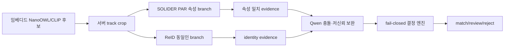

# SOLIDER 서버 속성 branch 적용 기준

## 적용 판정

원격 Jupyter L40S의 `SOLIDER Swin-B + Sonnet response-level auxiliary loss` 최신 arm은 PA-100K 공식 test에서 mA `78.156%`, InsF1 `87.020%`, label macro-F1 `65.210%`, synthetic person-crop proxy `94.359%`를 기록했다. 따라서 서버 속성 branch의 연구 후보로는 채택하지만, 프로젝트 전체 모델이나 CCTV 동일인 최종 판정 모델로는 채택하지 않는다.

이 판단은 다음 이유로 고정한다.

- PA-100K에는 프로젝트 `identityGroupId`와 `trackId`가 없다.
- synthetic proxy는 실제 CCTV identity/track-heldout 지표가 아니다.
- SOLIDER의 26개 PA 속성은 정확한 색상·질감 전체를 표현하지 않는다.
- 원격 head와 backbone은 아직 로컬 또는 서버 운영용 완전한 inference package로 회수되지 않았다.
- Sonnet은 응답-level label teacher이며 logit KD가 아니다. teacher output 사용 권한은 별도 승인 대상이다.

## 백엔드에 반영한 경계

`training/solider_server_attribute_candidate.json`을 후보 artifact manifest로 등록했고, `QWEN_SERVER_ATTRIBUTE_ENABLED=true`일 때만 `/health`가 준비 상태를 운영 상태에 반영한다. 다음 항목 중 하나라도 충족하지 않으면 `serverAttributeReady=false`와 `status=degraded`가 반환된다.

- head checkpoint, SOLIDER backbone checkpoint, 결과 manifest가 같은 workspace의 파일이다.
- 각 파일의 SHA-256이 manifest와 일치한다.
- inference package가 완전하다.
- artifact가 `promoted` 상태다.

현재 manifest는 의도적으로 `remote_only`, `completeInferencePackage=false`, `candidate_not_production`이므로 readiness는 `false`다. 이는 모델을 적용하지 못한 누락이 아니라, 회수되지 않은 원격 결과가 운영 경로에 섞이지 않게 하는 fail-closed 상태다.

## 런타임 역할

SOLIDER는 서버 속성 evidence만 제공한다. ReID embedding, track temporal consistency, image quality, 임베디드 CLIP score가 없으면 최종 `match`를 만들지 않는다. Qwen 결과는 설명·충돌 검토용이며 SOLIDER의 PA score 하나로 동일인을 확정하지 않는다.

## 승격 절차

1. Jupyter 서버에서 head, backbone, 결과 JSON, 실행 script hash를 같은 artifact package로 회수한다.
2. 후보 manifest의 실제 SHA-256을 0 placeholder가 아닌 값으로 교체하고 `artifactLocation=local_package`, `completeInferencePackage=true`로 갱신한다.
3. 실제 CCTV reviewed manifest에서 `identityGroupId`, `trackId`, camera/view holdout을 봉인한다.
4. SOLIDER-only, SOLIDER+Sonnet, ReID, 최종 fusion을 같은 track-heldout split과 metric 코드로 측정한다.
5. 색상·복장·질감 label의 macro-F1과 identity top-1, false-match rate, review rate, p95 latency를 함께 확인한다.
6. 모든 gate가 통과하기 전에는 `artifactStatus=promoted` 또는 `QWEN_SERVER_ATTRIBUTE_ENABLED=true`로 바꾸지 않는다.

현재 적용 결과는 “서버 속성 branch 후보 등록 + readiness fail-closed 연결”까지다. 최종 identity branch 적용은 실제 reviewed CCTV 측정 전에는 의도적으로 보류한다.

