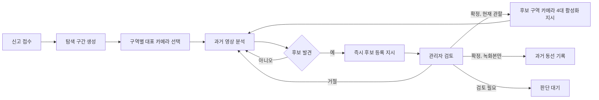

# 구역별 과거 영상 탐색과 젯슨 전환 정책

## 결론

AI 워커는 각 구역에서 분석 가치가 가장 높은 카메라 한 대를 선택해 과거 영상을
탐색하고, 후보를 발견하는 즉시 백엔드가 후보 목록에 등록할 수 있는 지시를 반환한다.
관리자가 현재 관할 내 후보를 확정하면 해당 후보가 발견된 구역의 카메라 4대를 젯슨
탐색 대상으로 지정한다.

AI 워커는 후보와 명령 계약을 계산하지만 DB 저장, 관리자 화면 갱신, 메시지 큐 발행,
젯슨 제어를 직접 수행하지 않는다. 이 부수 효과의 소유자는 중앙 백엔드다.



## 카메라 배치

각 구역은 다음 순서의 2×2 카메라를 가진다.

```text
1-1  1-2  |  2-1  2-2
1-3  1-4  |  2-3  2-4
-----------+-----------
3-1  3-2  |  4-1  4-2
3-3  3-4  |  4-3  4-4
```

기본 상태가 동일하면 각 구역의 1번 카메라, 즉 `1-1`, `2-1`, `3-1`, `4-1`이
선택된다. 그러나 1번 카메라가 끊겼거나 녹화 누락이 많으면 더 나은 카메라로
자동 대체한다.

## 대표 카메라 선택 알고리즘

사람 일치 점수와 카메라 선택 점수는 서로 다른 값이다. 카메라 선택 점수는 다음
운영 신호만 사용한다.

| 신호 | 가중치 | 의미 |
|---|---:|---|
| 녹화 구간 커버리지 | 0.30 | 요청한 시간 범위에서 실제 영상이 존재하는 비율 |
| 카메라 상태 | 0.25 | 연결, 디코딩, 프레임 손상 상태를 합친 값 |
| 이동 경로 중심성 | 0.20 | 출입구·교차로 등 사람 통과 가능성이 높은 정도 |
| 영상 최신성 | 0.10 | 업로드 지연이 작고 최신 세그먼트가 준비된 정도 |
| 직전 탐지 신호 | 0.10 | 최근 인접 구역·카메라 후보 발생 정보 |
| 1번 카메라 기본 보너스 | 0.05 | 운영상 대표 카메라를 우선하는 작은 보너스 |
| 중복 시야 패널티 | -0.10 | 다른 선택 카메라와 시야가 지나치게 겹치는 정도 |

```text
selectionScore =
  0.30 × recordingCoverage
+ 0.25 × healthScore
+ 0.20 × routeCentrality
+ 0.10 × freshnessScore
+ 0.10 × priorDetectionScore
+ representativeBonus
- 0.10 × overlapPenalty
```

선택 규칙은 다음과 같다.

1. `available=false` 카메라는 제외한다.
2. 각 구역에서 가장 높은 점수의 카메라 한 대를 고른다.
3. 동점이면 낮은 `position`, 그다음 카메라 ID 순으로 결정한다.
4. 예상 구역이 있으면 그 구역의 처리 우선순위만 올린다.
5. 예상 구역이 확실해도 나머지 구역을 검색 대상에서 제거하지 않는다.
6. 한 구역의 모든 카메라가 사용 불가능하면 잘못된 계획으로 거부한다.
7. 사용 가능한 카메라의 모든 운영 신호가 0이면 낮은 `position`을 선택하고
   동일 가중치로 표시해 0 나눗셈이나 임의 선택을 방지한다.

응답의 `scoreBreakdown`에는 각 항목의 가중 기여도가 포함되어 관리자가 선택 이유를
확인할 수 있다. `routingWeight`는 같은 구역 내 후보 카메라 점수 합에 대한 선택
카메라의 상대 비중이다.

## API 계약

모든 엔드포인트는 기존 AI 워커와 동일하게 설정된 경우
`X-Internal-API-Key`를 요구한다.

운영 신호만으로 최초 대표 카메라를 고르는 이 문서의 `plan` 계약 뒤에는
`POST /v1/search-routing/probability`를 사용한다. 이 확률 계약은 provenance가 있는
ReID/semantic LR, `outside`/`unknown` 포함 posterior, posterior 가중 다음 카메라
순위를 반환한다. 실험 결과와 증거 경계는
[`ZONE_POLICY_EXPERIMENT_20260801.md`](ZONE_POLICY_EXPERIMENT_20260801.md)를 따른다.

### 1. 최초 탐색 계획

`POST /v1/search-routing/plan`

백엔드는 사건의 실종 예상 시각, 현재 시각, 카메라 상태와 토폴로지를 전달한다.
AI 워커는 구역별 대표 카메라와 처리 순서를 반환한다.

- 현재 관할 탐색 병행: `segmentOrder=newest_first`
- 녹화본 전용 탐색: `segmentOrder=oldest_first`
- 후보 발견 후에도 `continueAfterCandidate=true`

현재 관할 탐색은 최신 위치 확보를 우선하므로 최신 세그먼트부터 보고, 녹화본만
대상인 경우는 동선 복원을 위해 시작 시점부터 순서대로 본다.

### 2. 후보 발견

`POST /v1/search-routing/candidate-events`

응답은 중앙 백엔드가 실행할 지시이며, 저장 완료 응답이 아니다.

- `registrationAction=register_immediately`
- `registrationCompleted=false`
- `eventKey={caseId}:candidate:{candidateId}`
- `operatorReviewRequired=true`
- `continueRecordingAnalysis=true`

즉, 1-1에서 후보가 발견되어도 2-1, 3-1, 4-1 과거 영상 분석은 중단하지 않는다.
중앙 백엔드는 `eventKey`로 멱등 upsert를 수행하고 후보 목록 재조회에서 보이는 것을
확인한 뒤 등록 완료로 처리해야 한다.

후보 이벤트에는 `cameraPosition`과 해당 구역의 `zoneCameras` 4대를 함께 전달한다.
후보 카메라 ID·구역·위치가 토폴로지와 다르면 422로 거부한다.

`calibratedMatchProbability`가 제공되면 화면에는 이를 확률로 사용하고
`scoreKind=calibrated_match_probability`를 반환한다. 보정값이 없으면 모델 유사도를
그대로 표시하되 `scoreKind=uncalibrated_similarity`라고 명시한다. 원시 유사도는
확률로 표현해서는 안 된다.

### 3. 관리자 판단

`POST /v1/search-routing/operator-decision`

| 관리자 판단 | 현재 탐색 | 반환 동작 |
|---|---|---|
| 확정 | 켜짐 | 후보 구역 카메라 4대 활성화 |
| 확정 | 꺼짐 | 과거 동선만 기록 |
| 거절 | 무관 | 과거 영상 분석 계속 |
| 검토 필요 | 무관 | 젯슨 명령 없이 대기 |

예를 들어 4-1 후보를 관리자가 확정하면 응답은 다음 핵심 필드를 갖는다.

```json
{
  "action": "activate_candidate_zone",
  "decisionAt": "2026-07-31T03:05:00Z",
  "routingRevision": 2,
  "commandKey": "case-77:zone-routing:2",
  "targetZoneId": 4,
  "replaceActiveZone": true,
  "targetCameraIds": ["4-1", "4-2", "4-3", "4-4"],
  "continueRecordingAnalysis": true
}
```

`replaceActiveZone=true`이므로 중앙 백엔드는 기존 1구역 명령이 있더라도 4구역을
현재 활성 구역으로 교체해야 한다. 요청의 `routingRevision`은 사건별 단조 증가값이고
`activeRoutingRevision`은 중앙 백엔드가 저장한 최신값이다. 요청 revision이 최신값보다
크지 않으면 AI 워커는 `ignore_stale_decision`을 반환한다. 젯슨 소비자도 응답의
revision을 비교해 늦게 도착한 이전 명령을 무시해야 한다.

요청에 다른 구역 카메라가 섞이거나 카메라가 4대가 아니면 AI 워커는 요청을 거부한다.

## 상황별 동작

| 상황 | 탐색 정책 | 젯슨 동작 |
|---|---|---|
| 실종자가 녹화본에만 있음 | 시작 시점부터 구역별 대표 영상 검색 | 확정해도 활성화하지 않고 동선 기록 |
| 실종자가 현재 관할에 있음 | 최신 영상부터 검색하며 과거 분석 병행 | 관리자 확정 구역의 4대 활성화 |
| 한 구역에서만 움직임 | 해당 구역 후보가 반복되더라도 다른 구역 검색 유지 | 같은 구역을 계속 집중 탐색 |
| 예상 위치가 확실함 | 예상 구역을 먼저 처리하되 4개 구역 모두 유지 | 확정 이후에만 구역 집중 |
| 예상 위치가 불확실함 | 4개 구역 대표 카메라를 동일 시작점에서 검색 | 후보 확정 전에는 구역 집중 없음 |

## 중앙 백엔드가 연결해야 하는 부분

AI 워커 응답만으로 실제 젯슨이 전환되지는 않는다. 중앙 백엔드는 다음을 담당한다.

1. MinIO/S3의 카메라별 세그먼트 목록과 커버리지를 계산한다.
2. 계획 API 결과에 따라 분석 작업을 큐에 넣는다.
3. 각 세그먼트 분석 결과가 나오자마자 후보 이벤트 API를 호출하고 `eventKey`로
   DB에 멱등 등록한 뒤 후보 목록 가시성을 재확인한다.
4. 관리자 판단을 판단 API에 전달한다.
5. `activate_candidate_zone`이면 기존 활성 구역을 교체하고 젯슨 명령을 발행한다.
6. 사건별 revision을 DB에서 CAS로 갱신하고, AI 워커와 젯슨 모두 최신 이하 revision을
   무시해 늦게 도착한 이전 구역 명령이 최신 구역을 덮어쓰지 못하게 한다.
7. 후보·관리자 판단·젯슨 명령을 사건번호와 함께 감사 로그에 남긴다.

현재 구현은 1~4번에서 사용하는 계산 및 응답 계약까지다. 5~7번의 실제 DB·메시지
큐·젯슨 연결은 중앙 백엔드 통합 작업에서 구현해야 한다.

## 테스트 범위

다음 조건을 자동 테스트한다.

- 기본 4×4 구성에서 `1-1`, `2-1`, `3-1`, `4-1` 선택
- 대표 카메라 장애 시 같은 구역의 차선 카메라 선택
- 운영 신호가 모두 0인 구역의 결정적 대체 선택
- 예상 위치 우선 처리와 나머지 구역 보존
- 현재 탐색과 녹화본 전용 탐색의 시간 순서 차이
- 후보 즉시 등록 지시 반환과 과거 분석 지속
- 후보 카메라 ID·구역·위치의 토폴로지 교차검증
- 관리자 확정 시 정확히 같은 구역 카메라 4대 선택
- 역순·중복 revision의 이전 구역 재활성화 차단
- 다른 구역 카메라가 섞인 요청 거부
- 선언한 4×4 토폴로지 밖의 카메라 요청 거부
- 거절·검토·녹화본 전용 확정에서 젯슨 미활성화
- 내부 API 키 인증 유지
