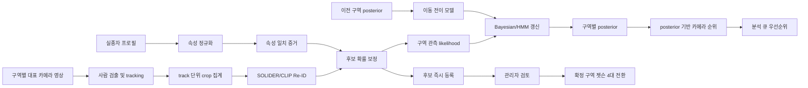

# 구역별 실종자 확률과 다음 카메라 선택 설계

## 결론

AI 워커가 반환해야 하는 값은 하나의 점수가 아니라 다음 세 종류다.

| 값 | 의미 | 화면에서 확률로 표시 |
|---|---|---|
| `candidateMatchProbability` | 특정 사람 트랙이 신고 대상과 같은 사람일 확률 | 보정된 경우만 가능 |
| `zonePosterior` | 현재 증거까지 반영했을 때 대상이 각 구역에 있을 확률 | 가능 |
| `cameraUtility` | 다음에 어느 카메라를 분석하면 탐색 효율이 높은지 나타내는 우선순위 | 불가 |

원시 CLIP/SOLIDER 유사도나 카메라 운영 점수를 그대로 확률이라고 부르면 안 된다.
운영 기본값은 **보정된 SOLIDER/CLIP·속성 점수를 likelihood ratio(LR)로 바꾸고,
Bayesian/HMM 필터로 구역 posterior를 갱신한 뒤, `posterior × 카메라 운영계수`로
다음 카메라를 고르는 구조**다. 예상 정보이득(EIG)은 동률 해소에만 쓴다. Qwen은
인상착의 증거를 구조화하지만 최종 확률 계산기는 아니다. 이 선택은
[`ZONE_POLICY_EXPERIMENT_20260801.md`](ZONE_POLICY_EXPERIMENT_20260801.md)의 GPU 서버
정책당 6,000회 sealed paired replay 결과를 따른다.

기존 [`ZONE_CAMERA_SEARCH_ROUTING.md`](ZONE_CAMERA_SEARCH_ROUTING.md)의 대표 카메라
선택과 관리자 확정 후 젯슨 전환 계약은 유지한다. 이 문서는 그 앞단의 후보 확률,
구역 확률, 분석 순서를 계산하는 방법을 정의한다.

## 전체 흐름



## 1. 사람 후보 확률

### 평가 단위

연속 프레임을 각각 독립 후보로 세지 않는다. 단일 카메라 tracker의 `trackId`와 별도로
multi-camera association이 발급한 `correlationGroupId`를 필수로 받는다. 같은 물리
track으로 연결된 fragment에서는 화질이 좋은 한 건만 쓰고, 서로 다른 카메라가 우연히
같은 로컬 `trackId`를 쓴 경우에는 다른 correlation group으로 보존한다.
같은 트랙의 프레임을 `noisy-or`로 합치면 상관된 증거를 여러 번 세어 확률이 과도하게
높아진다.

한 카메라의 같은 녹화 세그먼트에서 나온 Top-K에는 동일한 `observationGroupId`를
부여한다. 이 후보들은 독립 관측이 아니라 서로 경쟁하는 데이터 연관 가설이다. 후보
목록과 개별 보정 확률은 모두 보존하되, 구역 posterior 갱신에는 그룹에서 appearance
LR이 가장 큰 한 건만 사용한다. 별도 시간 세그먼트나 별도 카메라 관측만 서로 다른
observation group으로 발급할 수 있으며, 한 group ID가 여러 카메라·구역에 걸치면
API가 422로 거부한다.

`trackId`는 카메라 안에서도 녹화/추적 실행 범위를 포함한 고유 키로 만든다. 예를 들어
`recording-31:track-7`처럼 발급하며, 같은 `(cameraId, trackId)`가 요청 안에서 서로
다른 `correlationGroupId`를 사용하면 중복 증거 주입으로 보고 422로 거부한다.

track 특징은 다음을 포함한다.

- `reidSimilarity`: SOLIDER/CLIP gallery와 track embedding의 유사도
- `attributeAgreement`: 상·하의 색, 안경, 가방, 모자, 머리 형태 등의 일치도
- `trackQuality`: 사람 crop 크기, 선명도, 노출, 가림, 정면성, 유효 프레임 수
- `occlusionPenalty`, `blurPenalty`: 외형 증거의 관측 품질 저하

카메라 위치·시간·운영 신뢰도는 외형 후보 보정 모델에 넣지 않는다. 이 값들은 이후
HMM prior와 카메라 관측모델에서 한 번만 반영하여 같은 prior를 이중 계산하지 않는다.

### 보정 모델

첫 버전은 해석과 교체가 쉬운 logistic calibration head를 사용한다.

```text
calibratedProbability = calibrator(appearanceEvidence)
appearanceLR = odds(calibratedProbability) / odds(calibrationBaseRate)
candidatePosteriorOdds = odds(operatingPrior) * appearanceLR
candidateMatchProbability = candidatePosteriorOdds / (1 + candidatePosteriorOdds)
```

계수는 `identityGroupId`, `trackId`, `cameraId`, 시간 구간을 분리한 검증 데이터로
학습한다. 데이터가 충분해지면 logistic head와 LightGBM을 비교하되, test set으로
모델이나 임계값을 재선택하지 않는다. 최종 출력 확률은 별도 calibration split에서
temperature scaling, Platt scaling 또는 isotonic regression으로 보정한다.

Qwen의 역할은 `회색 반팔`, `검은색 바지`, `안경`, `넘긴 머리` 같은 자연어를
구조화하고 crop에서 속성 증거를 반환하는 것이다. Qwen의 문장형 판단을 곧바로
`candidateMatchProbability`로 사용하지 않는다.

## 2. 구역 존재확률

상태 공간은 `zone-1`, `zone-2`, `zone-3`, `zone-4`, `outside`, `unknown`으로 둔다.
`outside`가 없으면 관할에서 빠져나간 사람의 확률이 억지로 네 구역에 배분되고,
`unknown`이 없으면 카메라 장애나 증거 부족을 오판으로 바꾸게 된다.

### 전이 사전확률

직전 posterior와 경과 시간으로 현재 prior를 만든다.

```text
prior_t(z) = sum(previousPosterior(z_prev) * transition(z_prev -> z, deltaTime))
```

API의 `motionElapsedSeconds / motionStepSeconds`만큼 전이 행렬을 반복 적용하고,
나머지 소수 step은 identity와 1-step 전이를 선형 보간한다. 전이 행렬은 실제 구역
인접 관계, 출입구, 평균 이동시간으로 구성한다. 짧은 시간에
대각선 반대편 구역으로 이동하는 전이는 0에 가깝게 두되 완전히 0으로 만들지는 않는다.
마지막 목격 위치가 확실한 경우 초기 prior를 높일 수 있지만 다른 구역 검색은 계속한다.

### 관측 likelihood

인접한 track fragment는 먼저 하나로 병합한다. 같은 `correlationGroupId`의 반복 이벤트는
`|eventLogLR|`가 가장 큰 한 건만 남긴다. `eventLogLR` 계산에 이미 `trackQuality`가
한 번 반영되므로 중복 가중하지 않으며, 억제한 event ID를 응답에
기록한다. 시간·카메라가 충분히 분리된 track만 독립 증거로 보고, 각 사건의 LR을
구역 prior odds에 곱한다.

```text
eventLogLR = trackQuality * weightedMean(log(signalLR_i), reliability_i)
signalLR_i = odds(signalProbability_i) / odds(calibrationBaseRate_i)
unnormalized(z_event) = prior(z_event) * clamp(exp(eventLogLR), 0.001, 1000)
```

카메라 MATCH/NO_MATCH는 카메라별 sensitivity/FPR로 likelihood를 만들고,
validation 선택군에서 고정한 `cameraObservationReliability=0.40`을 지수로 적용한다.
이는 서로 가까운 CCTV의 잔여 상관과 작은 검증 표본으로 인한 과신을 완화한다.

```text
cameraUpdateLikelihood = rawCameraLikelihood ^ 0.40
```

미검출은 다음 조건이 모두 만족될 때만 약한 음성 증거로 사용한다.

- 요청 시간대의 녹화 커버리지가 충분함
- 카메라와 detector 상태가 정상임
- 사람이 지나갈 시간을 포함할 만큼 관측함
- 가림·야간·저해상도 조건에서 검출 recall을 추정할 수 있음

그 외 미검출은 `unknown`을 높이지, 해당 구역을 강하게 배제하지 않는다.

### Bayesian/HMM 갱신

```text
unnormalized(z) = observationLikelihood(evidence_t | z) * prior_t(z)
zonePosterior(z) = unnormalized(z) / sum(unnormalized(all states))
```

모든 상태 확률의 합은 1이어야 한다. 응답에는 posterior뿐 아니라 `entropy`, 최근
증거 시각, 상위 근거 track, score model version을 포함해 판단 근거를 남긴다.

## 3. 다음 카메라 선택

다음 카메라는 현재 구역 posterior와 실제 분석 가능성을 함께 반영해 고른다. 가용하지
않거나 이미 분석한 카메라는 제외한다.

```text
operationalFactor(c) =
    recordingCoverage(c)
  * healthScore(c)
  * freshnessScore(c)
  * (0.5 + 0.5 * routeCentrality(c))

cameraUtility(c) = zonePosterior(zone(c)) * operationalFactor(c)
```

`cameraUtility`가 같을 때만 검증된 sensitivity/FPR 관측모델로 계산한 EIG가 큰
카메라를 먼저 둔다. 그래도 같으면 구역·위치·카메라 ID 순으로 결정해 재현성을
보장한다. 이 정책은 paired replay에서 고정 대표 카메라와 순수 EIG보다 성공률과
오집중률이 좋았다. 다만 실제 동기화 16카메라 replay가 생기기 전까지 그 차이를
프로젝트 CCTV 인과 효과로 주장하지 않는다.

## 4. 판단과 젯슨 전환

자동으로 동일인을 확정하지 않는다. 다음 세 상태를 사용한다.

| 상태 | 조건 | 동작 |
|---|---|---|
| `candidate_found` | 검증에서 정한 후보 임계값 또는 세그먼트 Top-K 충족 | 후보 목록에 즉시 등록, 다른 구역 분석 지속 |
| `review_required` | 증거 상충, 화질 부족, 구역 posterior 불확실 | 관리자 검토, 젯슨 전환 없음 |
| `search_broadly` | 유력 후보 없음 또는 entropy 높음 | 네 구역 대표 카메라 탐색 유지 |

관리자가 `confirmed_match`를 반환한 경우에만 해당 구역 네 카메라를 젯슨 대상으로
전환한다. 이후 다른 구역에서 더 최신 후보가 발견되어도 자동 전환하지 않고 후보로
등록한 뒤 관리자 판단과 `routingRevision`을 거친다.

임계값은 숫자를 하드코딩하지 않고 validation set에서 목표 FAR과 review capacity로
결정한다. 예를 들어 `TPR@FAR=1%`와 하루 관리자 검토 가능 건수를 함께 만족하는
후보 임계값을 선택하고, 운영 전 calibration set을 봉인한다.

## 5. 실제 API 응답

`POST /v1/search-routing/probability`는 기존 `plan`, `candidate-events`,
`operator-decision` 계약과 함께 다음 posterior 응답을 반환한다.

```json
{
  "caseId": "case-77",
  "schemaVersion": "eyesonu-zone-search-v1",
  "routingRevision": 2,
  "candidateAssessments": [
    {
      "eventId": "event-11",
      "trackId": "track-11",
      "zoneId": 1,
      "cameraId": "1-1",
      "observationGroupId": "recording-31:camera-1-1:segment-7",
      "observedAt": "2026-08-01T03:00:00Z",
      "matchProbability": 0.87,
      "likelihoodRatio": 60.23,
      "priorityBand": "high_priority",
      "signalCount": 2,
      "usedForZoneUpdate": true
    }
  ],
  "candidatePoolStatus": "candidate_found",
  "deduplicationState": {
    "sourceRoutingRevision": 2,
    "eventIdDigests": ["aaaaaaaaaaaaaaaaaaaaaaaaaaaaaaaaaaaaaaaaaaaaaaaaaaaaaaaaaaaaaaaa"],
    "correlationGroupDigests": ["bbbbbbbbbbbbbbbbbbbbbbbbbbbbbbbbbbbbbbbbbbbbbbbbbbbbbbbbbbbbbbbb"],
    "observationGroupDigests": ["cccccccccccccccccccccccccccccccccccccccccccccccccccccccccccccccc"]
  },
  "suppressedReplayedEventIds": [],
  "suppressedCorrelatedEventIds": ["event-11-frame-2"],
  "suppressedAlternativeEventIds": ["event-12"],
  "zonePosterior": [
    {"zoneId": 1, "probability": 0.62},
    {"zoneId": 2, "probability": 0.06},
    {"zoneId": 3, "probability": 0.05},
    {"zoneId": 4, "probability": 0.05}
  ],
  "zoneCandidateSummaries": [
    {
      "zoneId": 1,
      "candidateCount": 2,
      "topCandidateEventId": "event-11",
      "topCandidateMatchProbability": 0.87,
      "zonePresenceProbability": 0.62
    }
  ],
  "mostLikelyZoneId": 1,
  "mostLikelyZoneProbability": 0.62,
  "posteriorEntropy": 1.21,
  "outsideProbability": 0.09,
  "unknownProbability": 0.13,
  "rankedCameras": [
    {
      "cameraId": "1-2",
      "zoneId": 1,
      "position": 2,
      "zoneProbability": 0.62,
      "expectedInformationGain": 0.14,
      "operationalFactor": 0.91,
      "utility": 0.5642
    }
  ],
  "nextCameraId": "1-2",
  "cameraSelectionPolicy": "posterior_weighted_coverage_with_eig_tiebreak",
  "operatorReviewRequired": true,
  "autoMatchAllowed": false
}
```

필수 불변조건은 다음과 같다.

- 네 구역 + `outside` + `unknown` 확률의 합은 허용 오차 안에서 1이다.
- `uncalibrated_similarity`는 확률 필드에 넣지 않는다.
- 동일 `correlationGroupId`의 카메라 간 fragment는 한 번만 집계한다.
- 연속 window는 이전 응답의 `deduplicationState`를 그대로 전달해야 하며, SHA-256
  digest로 기억한 event·correlation·observation group은 다시 posterior에 반영하지
  않는다. 상태의 `sourceRoutingRevision`은 `activeRoutingRevision`과 같아야 한다.
- 동일 `(cameraId, trackId)`는 요청 안에서 하나의 `correlationGroupId`만 사용할 수
  있다.
- 동일 `observationGroupId`의 경쟁 후보는 후보군에는 남기고 구역 갱신에는 한 번만
  집계한다.
- 늦게 도착한 이전 `routingRevision`은 상태를 되돌리지 못한다.
- 요청 evidence마다 모델·보정기·calibration manifest SHA-256을 기록하고 API가 신뢰
  레지스트리의 정확한 tuple과 대조한다.
- 요청 전체는 HMAC-SHA256으로 서명해 사건·revision·확률·그룹 키·카메라 값의 전송
  중 변조를 막는다. 서명 키가 없거나 본문과 서명이 다르면 422로 거부한다.
- 서명 본문에는 매 요청의 `requestId`와 timezone이 있는 `issuedAt`도 포함한다. 워커는
  5분 freshness window, nonce 중복, 사건별 최신 `routingRevision`을 원자적으로 검사하고
  만료·재전송·stale 요청을 409로 거부한다. 향후 중앙 프록시는 같은 nonce/revision CAS를
  DB에 영속화해야 하며, 그 전에는 외부 연결을 활성화하지 않는다.
- `eventId`는 한 요청 안에서 유일해야 하며, 중앙 DB도 `(caseId, eventId)`를 영속
  idempotency key로 사용한다.
- 한 요청은 evidence 2,000건, topology edge 400건, 이동 전이 1,000 step 이하로
  제한한다. 더 긴 시간 구간은 `motionStepSeconds`를 키워 집계한다.

evidence가 2,000건을 넘으면 임의 절단하지 않는다. `observedAt` 순서로 2,000건 이하
window를 만들고, 앞 window 응답의 posterior와 `deduplicationState`를 다음 요청의
`previousZonePosterior`·`previousOutsideProbability`·`previousUnknownProbability`·
`previousDeduplicationState`로 전달한다. `activeRoutingRevision`은 앞 응답 revision,
`routingRevision`은 그보다 큰 새 revision으로 설정한다. continuation state는 종류별
digest 10,000개를 상한으로 하며 초과 시 API가 fail-closed 한다. 중앙 DB도 별도로
`(caseId, eventId)`를 영속 보관해 재시작·장기 작업에서 재적용하지 않는다.
- 카메라 sensitivity/FPR마다 operating-point ID·SHA-256·검증 표본 수를 기록하고,
  요청 sensitivity/FPR 값 자체도 신뢰 레지스트리 값과 일치해야 한다.

## 6. 상황별 기대 동작

| 상황 | posterior 동작 | 카메라 정책 |
|---|---|---|
| 실종자가 녹화본에만 있음 | 시간순 증거로 과거 구역 posterior와 동선 생성 | 젯슨 전환 없이 archive 분석 지속 |
| 현재 관할에 있음 | 최신 후보와 이동 전이를 함께 반영 | 관리자 확정 구역 네 대에 집중 |
| 한 구역에서만 움직임 | 같은 구역 posterior가 누적되지만 1로 고정하지 않음 | 중복 시야를 피하며 구역 내 카메라 교대 |
| 예상 위치가 확실함 | 초기 prior만 높이고 다른 구역 확률 유지 | 해당 구역 우선, 다른 대표 카메라 병행 |
| 예상 위치가 불확실함 | 균등 prior + `unknown`으로 시작 | 네 구역 대표 카메라 병렬 분석 |
| 유사한 후보 3명 | 각 track 후보 확률과 상충 속성을 별도 유지 | 식별력이 큰 다른 각도 카메라를 우선 |
| 카메라 장애·녹화 누락 | 미검출을 음성 증거로 쓰지 않고 `unknown` 증가 | 같은 구역의 다음 가용 카메라로 대체 |
| 관할 밖 이동 가능 | `outside` posterior 증가 | 출구·경계 카메라 정보이득 우선 |

## 7. 학습·검증 기준

데이터 분할은 frame 무작위 분할이 아니라 다음 키를 함께 봉인한다.

- `identityGroupId`: 같은 사람의 train/test 중복 방지
- `trackId`: 같은 연속 장면의 프레임 누수 방지
- `cameraId`: 카메라 고유 배경 학습 방지
- 시간 구간: 같은 사건의 인접 장면 누수 방지

필수 지표는 다음과 같다.

| 단계 | 지표 |
|---|---|
| 후보 식별 | Rank-1, mAP, TPR@FAR, macro-F1, false-match rate |
| 후보 확률 | Brier score, log-loss, ECE, reliability diagram |
| 구역 추정 | Top-1 accuracy, Top-2 recall, Brier, ECE, zone log-loss |
| 카메라 정책 | 최초 정답 구역 도달시간, 분석 영상 분량, GPU-minute, miss rate |
| 안전성 | 잘못된 구역 전환률, stale revision 차단률, 관리자 review rate |

`85%` 목표는 어떤 지표인지 반드시 함께 적는다. 프로젝트 승격 기준은 최소한
identity/track-heldout 구역 Top-1과 후보 TPR@정해진 FAR을 분리해 보고하고, ECE와
false zone switch rate가 허용 범위를 넘으면 정확도가 85%여도 자동 전환에 사용하지
않는다.

## 구현 상태와 다음 승격 조건

1. 완료: provenance가 있는 evidence·카메라 operating-point schema.
2. 완료: LR 변환, cross-camera correlation 중복 억제, 경과시간 기반
   `outside`·`unknown` 포함 HMM posterior, 연속 window dedup 상태와 요청 연산량 상한.
3. 완료: posterior 기반 카메라 순위와 관측모델 기반 EIG 동률 해소.
4. 완료: 관리자 검토 강제와 자동 동일인 확정 차단.
5. 완료: 공개 PRID2011 operating point를 사용한 정책당 6,000회 sealed paired replay.
6. 완료: 선택 cohort와 밀봉 test cohort 분리, 배포 `nextCameraId` 직접 replay.
7. 완료: 내부 API 키 fail-closed, HMAC 요청 freshness·nonce·사건별 revision replay guard.
8. 대기: 후보 런타임의 원시 similarity를 봉인 calibrator로 변환하는 운영 caller.
9. 대기: 실제 16대 카메라 동기화 영상의 sealed shadow replay, 구역별 이동시간으로
   학습한 transition matrix, 운영 calibration.

8~9번 데이터가 생기기 전에도 API는 안전 모드로 사용할 수 있지만, 자동 동일인 확정과
프로젝트 CCTV 일반화 85% 주장은 계속 차단한다.

