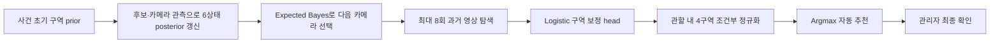

# 4구역 실종자 존재확률 모델 비교와 확정안 (2026-08-02)

## 결론

AI Worker가 관할 내 4개 구역 중 실종자 후보가 있을 가능성이 가장 높은 구역을
자동 추천하는 proxy 실험 후보로 `expected_bayes_8 + logistic` 조합을 선택한다. 현재
운영 runtime에는 연결하지 않았으며 모델 로더·48개 feature 계약·실제 CCTV 승격
게이트를 통과한 뒤 활성화한다.

저장소의 공식 MVP는 현재 2구역 범위이므로 이 4구역 결과는 사용자 시나리오용 사전
실험이다. 공식 요구사항·백엔드 API·Jetson 계약은 이 작업에서 변경하지 않으며, 4구역
범위가 승인되기 전에는 운영 승격할 수 없다.

- 독립 sealed Top-1: `91.8822%` (`4,120 / 4,484`)
- Wilson 95% 신뢰구간: `91.0466% ~ 92.6462%`
- 합격 기준: Wilson 95% 하한 `85% 이상`
- 판정: proxy 기준 통과

이 수치는 합성 CCTV topology replay의 결과다. 프로젝트 실제 영상의
identity/track-heldout 일반화 정확도로 표현하면 안 된다. 실제 운영 승격은 서로 다른
카메라와 시간의 track을 분리한 실데이터로 같은 게이트를 다시 통과한 뒤 결정한다.

## 61%와 이번 91.88%가 다른 이유

기존 `61.45%`는 4개 구역 중 정답 구역을 고르는 정확도가 아니었다. 여섯 상태
`1구역, 2구역, 3구역, 4구역, 관할 밖, 정보 부족` 중 최고 상태의 확률이 제한된
8회 탐색 안에 `0.55` 이상이 되는지를 측정한 해결률이었다.

이번 지표는 사용자가 대시보드에서 실제로 요구한 문제와 동일하게 정의했다.

1. 정답이 관할 내 1~4구역인 episode만 평가한다.
2. 네 구역의 확률을 합계 100%로 조건부 정규화한다.
3. 가장 높은 확률의 구역을 자동 추천한다.
4. 정답 구역과 추천 구역이 같으면 Top-1 성공으로 계산한다.
5. 점추정치가 아니라 Wilson 95% 하한이 85%를 넘어야 통과한다.

따라서 61%와 91.88%는 같은 지표가 아니며 서로 직접 비교할 수 없다.

## 실험 후보 처리 순서



Expected Bayes는 각 미분석 카메라에 대해 `탐지`와 `미탐지`가 발생할 확률을
계산하고, 두 결과 이후 posterior의 최고 상태 확률을 가중 평균한다. 이 값이 가장
큰 카메라를 다음 분석 대상으로 고른다. 생성형 모델의 문장형 확신을 직접 확률로
사용하지 않고, 카메라 민감도·오탐률·가동률과 현재 posterior를 사용한다.

Logistic head는 다음 48개 실행 시점 특징을 사용한다.

- 초기·최종 4구역 조건부 posterior
- outside·unknown 확률과 entropy
- 후보 구역·후보 확률·track 품질
- 구역별 scan/match/no-match 수와 카메라 가동 상태
- 사건 위치 확실성 시나리오와 카메라 operating point

`cohort`, 정답 `targetZone`, seed, episode ID, route 이름은 입력에서 제외했다.

## 데이터 분리

| 항목 | 값 |
|---|---:|
| 전체 행 | 27,048 |
| route별 selection 행 | 4,532 |
| route별 sealed 행 | 4,484 |
| selection 내부 검증 | 907 |
| 시나리오 | 4종 |
| 카메라 operating point | 3종 |
| 탐색 route | 3종 |
| 비교 모델 | 7종 |
| 총 비교 조합 | 21 |

selection cohort의 80%로 각 모델을 학습하고 20%에서 조합을 선택했다. 선택 규칙은
`Wilson 95% 하한 최대 → 정확도 최대 → 추론 지연 최소`다. sealed cohort는 선택된
한 조합을 전체 selection cohort로 다시 학습한 뒤 한 번만 평가했다.

## Selection 검증 비교

### Expected Bayes, 최대 8회

| 모델 | Top-1 | Wilson 95% 하한 | 추론 ms/행 | 장치 |
|---|---:|---:|---:|---|
| Logistic | 92.393% | 90.483% | 0.0005 | CPU |
| CatBoost | 92.393% | 90.483% | 0.0056 | CUDA 학습, CPU 추론 |
| ExtraTrees | 92.172% | 90.241% | 0.3540 | CPU |
| Posterior argmax | 92.172% | 90.241% | 0.0001 | CPU |
| XGBoost | 91.290% | 89.276% | 0.0077 | CUDA 학습, CPU 추론 |
| MLP | 91.180% | 89.156% | 0.0004 | CUDA |
| HistGradientBoosting | 91.069% | 89.036% | 0.0458 | CPU |

Logistic과 CatBoost의 정답 수가 같아서 추론 지연이 더 작은 Logistic을 선택했다.
이번 문제에서는 더 큰 생성형 모델이나 복잡한 부스팅 모델이 추가 정확도를 주지
않았다.

### 현재 runtime 방식, 최대 8회

| 모델 | Top-1 | Wilson 95% 하한 |
|---|---:|---:|
| Posterior argmax | 92.062% | 90.120% |
| Logistic | 91.510% | 89.517% |
| CatBoost | 91.069% | 89.036% |
| ExtraTrees | 90.849% | 88.796% |
| XGBoost | 90.628% | 88.557% |
| HistGradientBoosting | 90.518% | 88.437% |
| MLP | 90.408% | 88.318% |

### 구역별 대표 1번 카메라, 최대 4회

| 모델 | Top-1 | Wilson 95% 하한 |
|---|---:|---:|
| ExtraTrees | 88.864% | 86.651% |
| CatBoost | 88.313% | 86.059% |
| XGBoost | 87.982% | 85.704% |
| HistGradientBoosting | 87.762% | 85.468% |
| Logistic | 87.652% | 85.350% |
| Posterior argmax | 86.990% | 84.644% |
| MLP | 86.990% | 84.644% |

대표 1번 카메라만 보는 방식도 일부 조합은 85% 하한을 넘지만, Expected Bayes 방식보다
약 3%p 낮다. 따라서 1번 카메라 고정은 초기 병렬 스캔의 단순 fallback으로만 남기고,
자동 우선순위는 카메라 관측 품질과 posterior를 반영한다.

## GPU 서버 실행 기록

- 서버 작업 경로: `~/codex-zone-region-20260802-final`
- 환경: `~/.conda/envs/qwen3vl/bin/python`
- GPU: NVIDIA L40S 4장, 각 46,068 MiB
- Python: 3.11.15
- PyTorch: 2.6.0+cu124
- 추가 비교기: XGBoost 3.2.0, CatBoost 1.2.10

```bash
export PYTHONPATH=src:.

uv sync --project training/zone-region-lock --frozen

uv run --project training/zone-region-lock --frozen python -m scripts.build_zone_region_dataset \
  --episodes-per-cell 500 \
  --selection-output artifacts/zone_region_selection_20260802_v2.jsonl \
  --sealed-output artifacts/zone_region_sealed_20260802_v2.jsonl \
  --manifest artifacts/zone_region_dataset_manifest_20260802_v2.json

uv run --project training/zone-region-lock --frozen python -m scripts.train_zone_region_models \
  --selection-dataset artifacts/zone_region_selection_20260802_v2.jsonl \
  --sealed-dataset artifacts/zone_region_sealed_20260802_v2.jsonl \
  --dataset-manifest artifacts/zone_region_dataset_manifest_20260802_v2.json \
  --output-dir artifacts/models_v6 \
  --result artifacts/zone_region_model_comparison_20260802_v6.json

uv run --frozen basedpyright -p training/zone-region-lock/pyrightconfig.json
```

`training/zone-region-lock/uv.lock`은 Python 3.11.15와 CUDA 12.4용 PyTorch 2.6.0을
포함한 46개 패키지의 배포물 해시를 고정한다. GPU 실행 당시 `qwen3vl` 환경의 직접
의존성 버전도 이 lock과 일치하는지 실행 전에 대조했다.

## 산출물과 무결성

| 산출물 | SHA-256 |
|---|---|
| `experiments/results/zone_region_model_comparison_20260802.json` | `cd35d7393cff99e3bedbbc8c05bbd23eabb893f35e813c0a7446e06508fdd178` |
| `experiments/results/evidence/zone_region_model_comparison_20260802_v7_safe.json` | `41266140874a4964457e07bf9b57a9364fdae57b01d87abe0e74db97aade8bee` |
| `experiments/results/evidence/zone_region_dataset_manifest_20260802.json` | `f4dfed92c98410ea03853e74619fbf9e8e99336125696d70b17b0254986a657a` |
| `experiments/results/evidence/zone_region_logistic_20260802.joblib.gz` | `4f333fa7d9337f8b4e18728a4d58906fe08646165c2346cbc506e1bd27fcb610` |
| `experiments/results/evidence/zone_region_logistic_20260802.safe.json` | `1ea1e3e8a8f0f78fd2ca794ff9fd77fef273e43b7275805846ed3efc457903ee` |
| `experiments/results/evidence/zone_region_selection_20260802_v2.jsonl.gz` | `5b99b3d212d09cf9a3fce2fbfe8e7bd6e32075923346030afd27148283058438` |
| `experiments/results/evidence/zone_region_sealed_20260802_v2.jsonl.gz` | `e8c4b46e05229619944808cf169947586b9da919589951639d22933f0d5b4caa` |
| `experiments/results/evidence/selection_commitment_20260802.json.gz` | `426259c2004e3cb65c52a926816e144799bb0c13cbd4a21d87408158aea38886` |

자동 검증은 실행 가능한 Joblib/Pickle을 역직렬화하지 않는다. 원본 Joblib은 GPU 실행 증거로만 보존하고,
`safe.json`의 계수·절편·클래스를 NumPy로 계산해 sealed 4,484건을 재현한다.
학습기는 동일한 인메모리 Logistic 모델에서 두 산출물을 함께 쓰고, 행별 예측 digest
`be68d1bd5de9eec50d1c21ff499ce763da17dda5d2c0e1ec0ca768c88aa14dff`도 고정한다.
GPU 서버에서 이 안전 산출물 생성 경로를 21개 조합 전체에 다시 실행한 결과도
`expected_bayes_8 + logistic`, `4,120/4,484`로 같았다. 재실행 결과 JSON SHA는
`eb7c58134d0b25253e760135feb1a3cdb39876460fc3c889b1f2fd0844d7f5c6`이며,
Joblib SHA `75cd8b…e11f`, safe JSON SHA `1ea1e3…03ee`, 예측 digest가 기존 증거와
모두 일치했다. 원격 경로와 전체 해시는 evidence bundle의
`gpuGenerationAttestation`에 고정한다.
저장소 사본은 텍스트 파일 규칙에 따라 마지막 LF 한 바이트를 추가해 SHA가
`412661…8bee`다. 테스트는 이 LF를 정확히 한 바이트 제거한 23,662바이트의 SHA가
GPU 원격 원본 `eb7c58…f5c6`인지 먼저 확인한 뒤, 3개 경로 × 7개 모델과 선택 결과 내부의
Joblib·safe JSON·예측 해시를 직접 교차 검증한다.

`.gz` 파일은 GPU 실행 원본을 `gzip -n -9`로 결정론적으로 압축한 검증 사본이다.
`zone_region_evidence_bundle_20260802.json`은 저장 파일과 압축 해제한 원본의 바이트 수·SHA,
저장소 상대 경로, GPU 원격 경로를 함께 고정한다. 테스트는 압축을 풀어 원본 SHA를 검증한 뒤
sealed 4,484건을 모델로 다시 추론한다. `joblib`은 합성 proxy 검증용 산출물일 뿐 운영 런타임에는
연결하지 않는다. 원격 원본도 GPU 서버
`artifacts/models_v6/sealed_selected/expected_bayes_8/logistic/logistic.joblib`에 보존한다.
모델을 교체할 때는 결과 JSON의 `selected.route`, `selected.model`, selection·sealed
dataset SHA, selection commitment SHA, 모델 SHA와 feature schema SHA가 모두 일치하는지
확인해야 한다. 현재 활성 상태는 `experiment_selected_not_integrated`이며 운영 API는 기존
runtime을 유지한다.

## 수정 후 런타임 감사

| 실패 가설 | 수정 전 관측 | 수정 후 런타임 증거 | 판정 |
|---|---|---|---|
| 관할 이탈 우세인데 특정 구역을 자동 추천한다 | outside 55% 시나리오에서도 1구역을 추천 | 실제 Chrome 375/768/1280px에서 `보류 · 관할 이탈 우세`, `관할 밖 55.0%`를 확인 | 해결 |
| manifest SHA가 실제 JSONL 바이트와 다르고 sealed가 선택 전에 메모리에 올라간다 | Windows CRLF 변환과 단일 파일 `_load`에서 재현 | `write_bytes()`로 고정하고 selection/sealed 파일을 분리했다. selection commitment를 쓴 뒤 sealed 파일을 읽도록 변경했으며 원격 `sha256sum`과 결과 JSON이 일치 | 해결 |
| 엄격 분리 후에는 91.88% 조합이 재현되지 않는다 | 기존 한 파일 실험만 존재 | L40S 서버에서 21개 조합을 다시 실행해 같은 `expected_bayes_8 + logistic`, `4,120/4,484`, 모델 SHA `75cd8b…e11f`를 재현 | 기각 |

## 운영 승격 조건

현재 결론은 “4구역 topology proxy에서 85%를 통과한 최적 조합”이다. 실제 CCTV에
탑재할 때는 아래 조건을 모두 통과해야 한다.

1. 같은 사람의 frame이 train/test 양쪽에 들어가지 않도록 track 단위로 분리한다.
2. 카메라와 시간이 다른 identity/track-heldout sealed set을 만든다.
3. 최소 10명 이상과 유사 복장 distractor를 포함한다.
4. 구역 Top-1뿐 아니라 후보 TPR@고정 FAR, ECE, 관할 밖 오집중률, false-zone-switch,
   검토율과 후보 recall을 함께 측정한다.
5. selection과 sealed 양쪽에서 현행 runtime 대비 paired 개선 신뢰구간이 0보다 큰지
   확인한다.
6. 실제 sealed Wilson 95% 하한이 85% 이상이고 4~5번을 모두 통과할 때만 운영 모델로
   승격한다.
7. 48개 feature를 생성하는 운영 caller와 모델 로더가 구현·검증되어 있어야 한다.
8. 공식 요구사항과 API 계약에 4구역 범위가 반영되어 있어야 한다.
9. 게이트 미달 시 현재 안전한 posterior/관리자 확인 경로를 유지한다.

대시보드의 관할 내 질량 `50%` 기준은
`dashboard_mock_jurisdiction_mass_v1` mock 안전 휴리스틱이다. 관할 이탈 우세 화면에서
잘못된 자동 추천을 막기 위한 값이며, 운영 임계값 또는 승격된 정책이 아니다.

이 구조에서는 Qwen이나 Sonnet 같은 생성형 모델이 구역 확률을 직접 덮어쓰지 않는다.
VLM은 사람 후보의 속성·동일인 근거를 만들고, 구역 확률은 시간·카메라 관측을 결합한
확률 모델과 검증된 보정 head가 담당한다.

