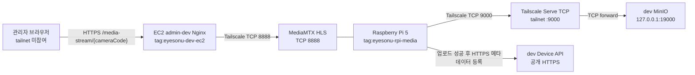

# dev Tailscale 구현·운영 가이드

이 문서는 dev 환경의 EC2와 Raspberry Pi 5 미디어 서버를 Tailscale로 연결하는 목표 구성과 운영 절차를 정의한다. 현재 저장소에는 아래 Tailscale·MinIO 노출 구성이 아직 적용되어 있지 않으므로, 실제 Compose·Nginx 변경과 장비 등록은 별도 구현 작업에서 수행한다. master 환경은 이 문서의 적용 대상이 아니다.

> 문서 기준일: 2026-08-02 · 구현 상태: 설계 완료, 인프라 설정과 장비 등록은 미적용

## 0. 구현 순서 요약

아래 순서를 변경하지 않는다. 기존 공개 경로를 먼저 제거하면 dev 실시간 영상이 중단될 수 있으므로 새 경로 검증 후 Nginx를 전환한다.

1. tailnet 관리자와 EC2·Raspberry Pi 5 접근 권한을 확보한다.
2. Device approval을 활성화하고 태그·Grants를 등록한다.
3. EC2와 Raspberry Pi 5에 Tailscale을 설치하고 각각 지정 태그로 등록·승인한다.
4. 양방향 `tailscale ping`과 연결 방식(`direct`/`relay`)을 확인한다.
5. EC2 호스트와 Nginx 컨테이너에서 Pi의 HLS `8888` 접근을 검증한다.
6. dev MinIO만 EC2 loopback `19000`에 publish하고 Serve로 tailnet `9000`에 전달한다.
7. Pi에서 MinIO health, 테스트 업로드, HEAD/stat을 검증한다.
8. admin-dev Nginx upstream과 Pi 업로더 endpoint를 Tailscale 주소로 전환한다.
9. 최소 권한, 네 카메라 동시 재생, 재부팅 자동 복구를 인수 테스트한다.

### 구현 전 준비물

| 구분 | 준비 항목 |
| --- | --- |
| Tailscale | tailnet Admin 권한, Device approval 설정 권한, 태그·Grants 편집 권한 |
| EC2 | SSH 또는 콘솔 접근, systemd, Docker Compose 운영 권한, Nginx 설정 변경 권한 |
| Raspberry Pi 5 | SSH 또는 콘솔 접근, systemd, MediaMTX·업로더 설정 변경 권한 |
| 애플리케이션 | dev MinIO 전용 access/secret key, 버킷명, Device Key의 비밀 저장소 참조 |
| 검증 | 테스트 카메라 path, 테스트 객체 key, admin-dev 브라우저 접근 수단 |

### 완료 정의

- 브라우저가 tailnet에 가입하지 않고 admin-dev의 HTTPS `/media-stream/`으로 네 카메라를 재생한다.
- Pi가 tailnet endpoint를 통해 dev MinIO에 녹화 파일을 업로드하고 같은 객체의 메타데이터를 등록한다.
- EC2 → Pi `tcp:8888`, Pi → EC2 `tcp:9000` 외의 장비 간 접근은 허용되지 않는다.
- 공인 인터페이스와 EC2 보안 그룹에 `8888`, `9000`, `19000`을 노출하지 않는다.
- EC2와 Pi 재부팅 후 별도 수동 명령 없이 연결과 서비스가 복구된다.

## 1. 적용 범위와 원칙

| 통신 방향 | 용도 | 허용 대상 | 포트 |
| --- | --- | --- | ---: |
| EC2 → Raspberry Pi 5 | MediaMTX HLS 조회 | `tag:eyesonu-dev-ec2` → `tag:eyesonu-rpi-media` | TCP 8888 |
| Raspberry Pi 5 → EC2 | dev MinIO 녹화 업로드 | `tag:eyesonu-rpi-media` → `tag:eyesonu-dev-ec2` | TCP 9000 |

- 브라우저는 tailnet에 참여하지 않는다. 실시간 영상은 기존 공개 HTTPS 경로인 `/media-stream/{cameraCode}`로만 요청한다.
- admin-dev Nginx가 브라우저 요청을 받아 Raspberry Pi 5의 Tailscale IP와 MediaMTX HLS 포트로 프록시한다.
- Raspberry Pi 5는 녹화 MP4를 tailnet의 dev MinIO에 업로드한 뒤 기존 공용 HTTPS Device API로 메타데이터를 등록한다.
- RTSP, 후보 이벤트 REST API, Device Key 인증 경로는 기존 계약을 유지한다.
- Tailscale Funnel은 사용하지 않는다. TCP 8888과 9000을 인터넷에 공개하지 않는다.
- EC2 보안 그룹과 호스트 방화벽에는 Tailscale 때문에 공용 8888·9000 인바운드 규칙을 추가하지 않는다.

## 2. 목표 네트워크 구조



MinIO의 `19000`은 EC2 loopback에만 바인딩하는 예시 호스트 포트다. tailnet 클라이언트가 사용하는 endpoint는 `http://<EC2_TAILSCALE_IP>:9000`이며, 브라우저에는 이 주소를 반환하지 않는다.

## 3. 장비 식별과 비밀정보

장비 태그는 다음 값으로 고정한다.

| 장비 | hostname 권장값 | 태그 |
| --- | --- | --- |
| dev EC2 | `eyesonu-dev-ec2` | `tag:eyesonu-dev-ec2` |
| Raspberry Pi 5 미디어 서버 | `eyesonu-rpi-media` | `tag:eyesonu-rpi-media` |

- Tailscale 인증키, S3 access key, S3 secret key, Device Key의 실제 값은 저장소, 명령 예시, 셸 이력, CI 로그에 기록하지 않는다.
- 자동 등록이 필요하면 재사용 가능 범위를 제한한 태그 인증키를 비밀 저장소로 주입하고 작업 종료 후 폐기한다. 이 문서의 기본 절차는 인증키가 명령행에 남지 않는 대화형 등록이다.
- MinIO root 계정을 장치에 배포하지 않는다. dev 녹화 버킷 또는 필요한 prefix에만 권한을 가진 전용 애플리케이션 자격증명을 사용한다.
- 태그를 적용해 처음 인증한 장비는 key expiry가 기본적으로 비활성화된다. 운영자는 Machines 화면에서 이를 확인하고, 장비 분실·교체·폐기 시 만료를 기다리지 말고 즉시 장비를 revoke한다.

태그 및 key expiry 동작은 [Tailscale 태그 공식 문서](https://tailscale.com/docs/features/tags)를 기준으로 한다.

## 4. 최소 권한 Grants

Tailscale은 신규 접근 제어에 Grants 사용을 권장한다. tailnet 정책의 `tagOwners`와 `grants`에 다음 규칙을 반영한다.

```json
{
  "tagOwners": {
    "tag:eyesonu-dev-ec2": ["autogroup:admin"],
    "tag:eyesonu-rpi-media": ["autogroup:admin"]
  },
  "grants": [
    {
      "src": ["tag:eyesonu-dev-ec2"],
      "dst": ["tag:eyesonu-rpi-media"],
      "ip": ["tcp:8888"]
    },
    {
      "src": ["tag:eyesonu-rpi-media"],
      "dst": ["tag:eyesonu-dev-ec2"],
      "ip": ["tcp:9000"]
    }
  ]
}
```

Grants는 허용 규칙이 합산되는 방식이므로 기존 `autogroup:member` 대상 전체 포트 허용 같은 광범위한 ACL·Grant가 남아 있으면 위 규칙만 추가해도 최소 권한이 되지 않는다. 특히 빈 정책 파일은 deny-all이 아니라 Tailscale의 기본 allow-all 정책을 적용할 수 있으므로, 위 두 규칙을 추가했다는 사실만으로 차단이 완료됐다고 판단하지 않는다. 기존 정책 전체를 함께 검토해 이 두 장비 사이에는 위 방향과 포트만 허용되도록 정리하고, Admin Console의 정책 검증과 9.4의 실제 차단 테스트를 모두 통과시킨다. 자세한 문법은 [Grants 공식 문서](https://tailscale.com/docs/features/access-control/grants)와 [정책 파일 문법](https://tailscale.com/kb/1337/policy-syntax)을 따른다.

## 5. 설치와 tailnet 등록

EC2와 Raspberry Pi 5에서 각각 [공식 Linux 설치 절차](https://tailscale.com/docs/install/linux)를 수행한다.

```bash
curl -fsSL https://tailscale.com/install.sh | sh
sudo systemctl enable --now tailscaled
```

설치 스크립트 실행이 허용되지 않는 환경은 공식 패키지 저장소의 배포판별 수동 설치 절차를 사용한다.

대부분의 네트워크에서는 Tailscale용 공용 인바운드 포트를 추가할 필요가 없다. 제어 서버와 DERP 연결을 위해 아웃바운드 TCP `443`은 허용되어야 한다. `relay`만 사용되어 HLS 성능이 부족한 경우에만 실제 `tailscaled` 리스닝 포트를 확인한 뒤 UDP 인바운드를 검토하며, 관성적으로 `41641/udp`를 전체 공개하지 않는다. 기준은 [Tailscale 방화벽 포트 공식 문서](https://tailscale.com/docs/reference/faq/firewall-ports)를 따른다.

EC2 등록:

```bash
sudo tailscale up \
  --hostname=eyesonu-dev-ec2 \
  --advertise-tags=tag:eyesonu-dev-ec2
```

Raspberry Pi 5 등록:

```bash
sudo tailscale up \
  --hostname=eyesonu-rpi-media \
  --advertise-tags=tag:eyesonu-rpi-media
```

각 명령이 출력하는 인증 URL에서 등록을 완료한 뒤 Admin Console에서 hostname, 태그, 소유 주체를 확인한다. 두 장비에서 다음 명령으로 할당 주소와 peer 상태를 기록한다. 실제 인증키나 애플리케이션 자격증명은 기록하지 않는다.

```bash
tailscale ip -4
tailscale status
```

## 6. MediaMTX HLS 경로 적용

1. Raspberry Pi 5에서 MediaMTX HLS 리스너가 TCP 8888에 떠 있고 `camera-01`부터 `camera-04`까지 필요한 path가 준비되었는지 확인한다.
2. admin-dev Nginx의 `/media-stream/`에서 기관망 주소를 쓰는 `proxy_pass`, `proxy_set_header Host`, 절대 URL용 `proxy_redirect`를 모두 Raspberry Pi 5 Tailscale IP 기준으로 변경한다. prefix 제거, 상대 redirect 재작성, buffering 비활성화, 장시간 timeout 설정은 기존 프록시 계약을 유지한다.
3. master Nginx와 프론트 빌드 인자는 변경하지 않는다.
4. EC2 호스트에서 먼저 확인한 다음 Nginx 컨테이너 내부에서 같은 주소를 확인한다.

변경 후 `70.12.108.93:8888`이 admin-dev `/media-stream/` location에 남지 않았는지 검색하고 Nginx 설정 문법을 검증한다. `proxy_redirect / /media-stream/;` 상대 redirect 규칙은 유지한다.

EC2 호스트:

```bash
hls_status="$(curl --silent --show-error --max-time 10 \
  --output /dev/null \
  --write-out '%{http_code}' \
  http://<PI_TAILSCALE_IP>:8888/camera-01/)"
test "$hls_status" = "200"
```

Nginx 컨테이너:

```bash
docker compose \
  --env-file infra/.env.deploy \
  -f infra/compose.deploy.yml \
  exec -T nginx \
  wget -S -T 10 -O /dev/null \
  http://<PI_TAILSCALE_IP>:8888/camera-01/
```

두 요청 모두 `200 OK`여야 Nginx 설정을 전환한다. EC2 호스트는 성공하지만 컨테이너가 실패하면 Docker bridge에서 `tailscale0` 경로로 나가는 호스트 라우팅과 방화벽을 점검한다.

## 7. dev MinIO의 tailnet 노출

### 7.1 loopback 전용 publish

별도 구현 작업에서 `compose.deploy.yml`의 dev MinIO만 EC2 loopback에 publish한다. 목표 형태는 다음과 같으며 master MinIO에는 적용하지 않는다.

```yaml
services:
  minio-dev:
    ports:
      - "127.0.0.1:${DEV_MINIO_TAILSCALE_FORWARD_PORT:-19000}:9000"
```

적용 후 EC2에서 `ss -lntp`로 `127.0.0.1:19000`만 LISTEN하는지 확인한다. `0.0.0.0:19000`, 공인 IP, EC2 보안 그룹에는 노출하지 않는다.

### 7.2 Tailscale Serve TCP forwarder

EC2에서 loopback 포트를 tailnet TCP 9000으로 전달한다.

Tailscale Serve는 raw TCP forwarder에도 tailnet의 HTTPS 인증서 기능 활성화를 요구한다. 최초 실행 시 CLI가 동의 URL을 출력하면 tailnet 관리자가 웹 화면에서 Serve 사용과 HTTPS 활성화를 승인한 뒤 명령을 다시 확인한다. 이 승인은 Funnel 공개를 의미하지 않으며, 이 구성에서는 Funnel을 실행하지 않는다. 자세한 선행 조건은 [Tailscale Serve 공식 문서](https://tailscale.com/docs/features/tailscale-serve)를 따른다.

```bash
sudo tailscale serve --bg --tcp=9000 tcp://127.0.0.1:19000
sudo tailscale serve status
```

`--bg`로 등록한 Serve 설정은 `tailscaled` 재시작과 EC2 재부팅 후 자동 복구된다. 상태와 해제 방법은 [Tailscale Serve CLI 공식 문서](https://tailscale.com/docs/reference/tailscale-cli/serve)를 따른다. 이 구성은 tailnet 내부 raw TCP forwarder이며 Funnel이 아니다.

forwarder만 해제할 때는 다음과 같이 실행하고 상태를 다시 확인한다.

```bash
sudo tailscale serve --bg --tcp=9000 tcp://127.0.0.1:19000 off
sudo tailscale serve status
```

해당 EC2가 다른 Serve 구성을 전혀 사용하지 않는다는 사실을 확인한 경우에만 `sudo tailscale serve reset`으로 전체 Serve 설정을 초기화한다.

## 8. Raspberry Pi 5 녹화 업로드 설정

업로더는 보호된 환경 파일 또는 비밀 저장소에서 다음 설정을 읽는다. 아래 값은 형식만 나타낸 placeholder이며 실제 자격증명을 문서나 명령행에 넣지 않는다.

```text
MINIO_INTERNAL_ENDPOINT=http://<EC2_TAILSCALE_IP>:9000
MINIO_BUCKET=<DEV_RECORDING_BUCKET>
MINIO_APP_ACCESS_KEY=<SECRET_STORE_REFERENCE>
MINIO_APP_SECRET_KEY=<SECRET_STORE_REFERENCE>
```

업로드 순서는 다음과 같다.

1. path-style S3 요청으로 `recordings/{cameraCode}/.../*.mp4` 객체를 dev MinIO에 업로드한다.
2. 업로드 성공 후 같은 endpoint에서 HEAD/stat으로 object key와 크기를 확인한다.
3. 같은 object key로 기존 공용 HTTPS `POST /api/v1/device/cameras/{cameraCode}/recordings`를 호출한다.
4. 업로드 또는 HEAD/stat이 실패하면 메타데이터 API를 호출하지 않고 재시도 대상으로 남긴다.

tailnet MinIO endpoint는 장치 업로드 전용이다. 백엔드가 브라우저에 이 endpoint를 반환하거나 이를 기준으로 브라우저용 presigned URL을 생성해서는 안 된다.

## 9. 배포 인수 절차

아래 항목을 순서대로 검증하고 결과 시각과 담당자만 운영 기록에 남긴다. 비밀정보와 전체 요청 헤더는 남기지 않는다.

### 9.1 peer와 연결 방식

양쪽 장비에서 peer를 ping한 뒤 연결 방식을 확인한다.

```bash
tailscale ping <PEER_HOSTNAME_OR_TAILSCALE_IP>
tailscale status
```

`direct` 연결을 우선 인수한다. `relay` 또는 `peer-relay`만 가능한 경우 장애로 단정하지는 않되, [연결 방식 공식 문서](https://tailscale.com/docs/reference/connection-types)를 기준으로 네 카메라 동시 HLS의 처리량·지연·끊김을 별도로 검증한다.

### 9.2 HLS

- EC2 호스트에서 `http://<PI_TAILSCALE_IP>:8888/camera-01/` GET이 `200 OK`다.
- Nginx 컨테이너에서 같은 GET이 `200 OK`다.
- admin-dev에서 네 카메라가 동시에 재생된다.
- 브라우저 Network 요청이 모두 HTTPS `/media-stream/`이며 Mixed Content와 `504 Gateway Timeout`이 발생하지 않는다.

### 9.3 MinIO와 메타데이터

Raspberry Pi 5에서 health endpoint를 확인한다.

```bash
curl --fail --show-error --max-time 10 \
  http://<EC2_TAILSCALE_IP>:9000/minio/health/live
```

보호된 실행 환경에 주입된 전용 애플리케이션 자격증명으로 테스트 객체를 업로드하고 HEAD/stat이 성공하는지 확인한다. 테스트 도구의 debug 출력과 셸 trace는 끈다. 이후 동일 object key로 녹화 메타데이터 등록 API를 호출해 성공하는지 확인하고 테스트 객체를 정리한다.

### 9.4 최소 권한과 재부팅

- 위 태그가 없는 tailnet 테스트 장비에서 Pi TCP 8888과 EC2 TCP 9000 접근이 모두 거부된다.
- EC2 태그 장비에서 Pi TCP 8888은 허용되지만 EC2 → Pi의 비허용 포트는 거부된다.
- Pi 태그 장비에서 EC2 TCP 9000은 허용되지만 Pi → EC2의 비허용 포트는 거부된다.
- Pi와 EC2를 각각 재부팅한 뒤 `tailscaled`, peer 연결, MediaMTX, dev MinIO, Serve TCP 9000이 자동 복구된다.
- 재부팅 후 HLS GET, MinIO health, 테스트 업로드·HEAD/stat을 다시 수행한다.

### 9.5 운영 기록

다음 항목만 변경 기록 또는 배포 티켓에 남긴다.

- 작업 일시, 작업자, 대상 환경과 장비 hostname
- 적용한 정책 revision 또는 변경 링크
- 장비별 Tailscale 버전과 태그, Tailscale IP
- peer 연결 방식과 HLS·MinIO·권한·재부팅 테스트 결과
- 롤백 여부와 남은 후속 작업

인증 URL, auth key, S3 자격증명, Device Key, 전체 환경 파일과 인증 헤더는 기록하지 않는다.

## 10. 상태 점검과 장애 분리

다음 상태를 하나의 카메라 DB 상태로 합치지 않고 독립적으로 기록한다.

| 점검 대상 | 점검 위치 | 성공 기준 | 실패 의미 |
| --- | --- | --- | --- |
| Tailscale peer | EC2와 Pi | peer online, ping 성공 | 터널·인증·정책·경로 문제 |
| MediaMTX HLS | EC2 호스트와 Nginx 컨테이너 | 카메라 path GET `200 OK` | MediaMTX·소스 스트림·8888 경로 문제 |
| MinIO 업로드 | Pi | health, PUT, HEAD/stat 성공 | Serve·MinIO·9000 경로·S3 권한 문제 |
| DB 카메라 상태 | 중앙 API·DB | 등록·활성 상태 조회 성공 | 업무 데이터 상태이며 위 연결 상태를 대신하지 않음 |

장애 화면이나 운영 로그에는 실패한 계층과 마지막 성공·점검 시각을 분리해 표시한다.

## 11. 장애 복구 순서

### HLS가 실패할 때

1. EC2와 Pi의 `tailscale status` 및 `tailscale ping`을 확인한다.
2. Pi 로컬에서 `http://127.0.0.1:8888/camera-01/`을 확인하고 MediaMTX 로그를 점검한다.
3. EC2 호스트에서 Pi Tailscale IP의 HLS path를 확인한다.
4. Nginx 컨테이너에서 같은 path를 확인한다.
5. 앞 단계가 모두 성공할 때만 Nginx `/media-stream/` 설정과 브라우저 요청을 점검한다.

### MinIO 업로드가 실패할 때

1. EC2에서 dev MinIO 컨테이너와 `127.0.0.1:19000/minio/health/live`를 확인한다.
2. `tailscale serve status`에서 TCP 9000 → `127.0.0.1:19000` mapping을 확인한다.
3. Pi에서 EC2 peer ping과 tailnet health endpoint를 확인한다.
4. 네트워크가 정상이면 버킷, 전용 자격증명, path-style 설정, object key 권한을 확인한다.
5. 객체 업로드가 확인되기 전에는 녹화 메타데이터 API를 재호출하지 않는다.

## 12. 장비 분실·폐기와 롤백

장비가 분실되었거나 폐기될 때는 다음 순서를 즉시 수행한다.

1. Tailscale Admin Console의 Machines 화면에서 해당 장비를 선택해 `Remove` → `Remove machine`으로 즉시 제거(revoke)한다.
2. 장비 등록에 사용한 재사용 가능 auth key가 있으면 함께 revoke하고, 장비가 보유했던 dev MinIO 애플리케이션 자격증명과 Device Key를 폐기·재발급한다.
3. tailnet 정책에서 더 이상 쓰지 않는 장비 예외와 태그 위임을 제거한다.
4. EC2 폐기 시 Serve TCP forwarder를 해제하고 dev MinIO loopback publish도 제거한다.
5. Nginx upstream과 장치 설정에서 폐기된 Tailscale IP가 남아 있지 않은지 확인한다.

Device approval을 사용하지 않는 tailnet에서는 제거된 장비가 관리자 재승인 없이 다시 등록될 수 있다. 현장 장비 tailnet에는 [Device approval](https://tailscale.com/docs/features/access-control/device-management/device-approval)을 활성화하고, 새 장비는 운영자 승인 전까지 통신하지 못하도록 하는 것을 원칙으로 한다.

Tailscale 적용 자체를 롤백할 때는 Nginx upstream을 직전 검증된 설정으로 복구한 후 Serve를 해제하고, dev MinIO loopback publish와 장비 태그·Grants를 제거한다. 기존 기관망 주소는 EC2에서 접근할 수 없었던 경로이므로 단순히 그 주소로 되돌리는 것만으로 원격 HLS가 복구된다고 간주하지 않는다.

## 13. 이번 범위에서 제외하는 항목

- master 환경의 Tailscale 적용
- RTSP와 후보 이벤트 REST API·Device Key 인증 경로 변경
- 브라우저의 tailnet 참여
- 녹화 브라우저 재생용 동일 출처 HTTPS 또는 외부 접근 가능한 presigned URL 설계
- 실제 Compose·Nginx·MediaMTX 설정 변경과 Tailscale 장비 등록

브라우저용 presigned URL이 내부 `minio-dev:9000`을 기준으로 생성될 수 있는 문제는 이 구성과 별개의 미해결 애플리케이션 과제로 관리한다. Tailscale 장치 업로드 주소를 브라우저 응답에 재사용해서는 안 된다.
