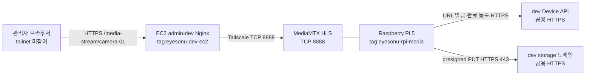

# dev Tailscale 구현·운영 가이드

이 문서는 dev 환경의 EC2와 Raspberry Pi 5 미디어 서버를 Tailscale로 연결해 MediaMTX HLS를 제공하는 구성과 운영 절차를 정의한다. Tailscale은 실시간 HLS 전용이며 녹화본 업로드에는 사용하지 않는다. 녹화본은 공용 HTTPS Device API에서 presigned PUT URL을 발급받아 공용 HTTPS storage 도메인으로 업로드한다. master 환경은 이 문서의 Tailscale 적용 대상이 아니다.

> 문서 기준일: 2026-08-04 · 장비 등록과 실제 Tailscale 주소는 환경별 운영 기록으로 관리

## 0. 구현 순서 요약

기존 공개 경로를 먼저 제거하면 dev 실시간 영상이 중단될 수 있으므로 새 경로를 검증한 뒤 Nginx를 전환한다.

1. tailnet 관리자와 EC2·Raspberry Pi 5 접근 권한을 확보한다.
2. Device approval을 활성화하고 태그·Grant를 등록한다.
3. EC2와 Raspberry Pi 5에 Tailscale을 설치하고 각각 지정 태그로 등록·승인한다.
4. 양방향 `tailscale ping`과 연결 방식(`direct`/`relay`)을 확인한다.
5. EC2 호스트와 Nginx 컨테이너에서 Pi의 HLS TCP 8888 접근을 검증한다.
6. admin-dev Nginx의 `/media-stream/` upstream을 Pi의 Tailscale 주소로 전환한다.
7. 최소 권한, 네 카메라 동시 재생, 재부팅 자동 복구를 인수 테스트한다.

### 구현 전 준비물

| 구분 | 준비 항목 |
| --- | --- |
| Tailscale | tailnet Admin 권한, Device approval 설정 권한, 태그·Grants 편집 권한 |
| EC2 | SSH 또는 콘솔 접근, systemd, Docker Compose 운영 권한, Nginx 설정 변경 권한 |
| Raspberry Pi 5 | SSH 또는 콘솔 접근, systemd, MediaMTX·업로더 설정 변경 권한 |
| 검증 | `camera-01`부터 `camera-04`까지의 HLS path, admin-dev 브라우저 접근 수단 |

### 완료 정의

- 브라우저가 tailnet에 가입하지 않고 admin-dev의 HTTPS `/media-stream/`으로 네 카메라를 재생한다.
- 장비 간 Tailscale 접근은 EC2 → Pi TCP 8888만 허용한다.
- 공인 인터페이스와 EC2 보안 그룹에 TCP 8888을 노출하지 않는다.
- 녹화 업로더는 Tailscale 주소와 MinIO 장기 자격증명 없이 공용 HTTPS presigned PUT 흐름을 사용한다.
- EC2와 Pi 재부팅 후 별도 수동 명령 없이 peer 연결과 HLS 서비스가 복구된다.

## 1. 적용 범위와 원칙

| 통신 방향 | 용도 | 허용 대상 | 포트 |
| --- | --- | --- | ---: |
| EC2 → Raspberry Pi 5 | MediaMTX HLS 조회 | `tag:eyesonu-dev-ec2` → `tag:eyesonu-rpi-media` | TCP 8888 |

- 브라우저는 tailnet에 참여하지 않는다. 실시간 영상은 공개 HTTPS `/media-stream/{cameraCode}`로만 요청한다.
- admin-dev Nginx가 브라우저 요청을 받아 Raspberry Pi 5의 Tailscale IP와 MediaMTX HLS 포트로 프록시한다.
- 녹화본은 `POST /api/v1/device/cameras/{cameraCode}/recording-upload-urls`로 URL을 발급받아 응답의 공용 HTTPS `uploadUrl`에 PUT한 뒤 완료 API를 호출한다.
- 녹화 업로드, RTSP, 후보 이벤트 REST API와 Device Key 인증에 Tailscale 주소를 사용하지 않는다.
- Tailscale Funnel은 사용하지 않는다. TCP 8888을 인터넷에 공개하지 않는다.
- EC2 보안 그룹과 호스트 방화벽에는 Tailscale 때문에 공용 TCP 8888 인바운드 규칙을 추가하지 않는다.

## 2. 목표 네트워크 구조



Tailscale 경로는 Nginx의 HLS upstream 한 곳에만 존재한다. Device API와 storage 도메인은 일반 공용 HTTPS DNS 이름을 사용하며, 응답의 `uploadUrl`에 Tailscale IP나 Docker 내부 MinIO hostname이 포함되면 배포 오류로 처리한다.

## 3. 장비 식별과 비밀정보

| 장비 | hostname 권장값 | 태그 |
| --- | --- | --- |
| dev EC2 | `eyesonu-dev-ec2` | `tag:eyesonu-dev-ec2` |
| Raspberry Pi 5 미디어 서버 | `eyesonu-rpi-media` | `tag:eyesonu-rpi-media` |

- Tailscale 인증키와 Device Key의 실제 값은 저장소, 명령 예시, 셸 이력, CI 로그에 기록하지 않는다.
- 미디어 서버에는 MinIO root 계정, bucket, app access key 또는 app secret key를 배포하지 않는다.
- presigned `uploadUrl`의 query string도 인증정보로 취급해 애플리케이션·프록시·장치 로그에 기록하지 않는다. dev·master storage Nginx는 이 이유로 access log를 비활성화한다.
- 자동 등록이 필요하면 범위를 제한한 태그 인증키를 비밀 저장소로 주입하고 작업 종료 후 폐기한다. 기본 절차는 인증키가 명령행에 남지 않는 대화형 등록이다.
- 태그를 적용해 처음 인증한 장비는 key expiry가 기본적으로 비활성화된다. 장비 분실·교체·폐기 시 만료를 기다리지 말고 즉시 revoke한다.

태그 및 key expiry 동작은 [Tailscale 태그 공식 문서](https://tailscale.com/docs/features/tags)를 기준으로 한다.

## 4. 최소 권한 Grant

tailnet 정책의 `tagOwners`와 `grants`에 HLS 단방향 규칙만 반영한다.

```json
{
  "tagOwners": {
    "tag:eyesonu-dev-ec2": ["autogroup:admin"],
    "tag:eyesonu-rpi-media": ["autogroup:admin"]
  },
  "grants": [
    {
      "src": ["tag:eyesonu-dev-ec2"],
      "dst": ["tag:eyesonu-rpi-media"],
      "ip": ["tcp:8888"]
    }
  ]
}
```

Grants는 허용 규칙이 합산된다. 기존 `autogroup:member` 전체 포트 허용 같은 광범위한 ACL·Grant가 남아 있으면 위 규칙만 추가해도 최소 권한이 되지 않는다. 기존 정책 전체를 검토하고 Admin Console 정책 검증과 실제 차단 테스트를 모두 통과시킨다. 자세한 문법은 [Grants 공식 문서](https://tailscale.com/docs/features/access-control/grants)와 [정책 파일 문법](https://tailscale.com/kb/1337/policy-syntax)을 따른다.

## 5. 설치와 tailnet 등록

EC2와 Raspberry Pi 5에서 각각 [공식 Linux 설치 절차](https://tailscale.com/docs/install/linux)를 수행한다.

```bash
curl -fsSL https://tailscale.com/install.sh | sh
sudo systemctl enable --now tailscaled
```

대부분의 네트워크에서는 Tailscale용 공용 인바운드 포트를 추가할 필요가 없다. 제어 서버와 DERP 연결을 위해 아웃바운드 TCP 443은 허용한다. `relay`만 사용되어 HLS 성능이 부족한 경우 실제 `tailscaled` 리스닝 포트를 확인한 뒤 UDP 인바운드를 검토하며, 관성적으로 `41641/udp`를 전체 공개하지 않는다. 기준은 [Tailscale 방화벽 포트 공식 문서](https://tailscale.com/docs/reference/faq/firewall-ports)를 따른다.

EC2 등록:

```bash
sudo tailscale up \
  --hostname=eyesonu-dev-ec2 \
  --advertise-tags=tag:eyesonu-dev-ec2
```

Raspberry Pi 5 등록:

```bash
sudo tailscale up \
  --hostname=eyesonu-rpi-media \
  --advertise-tags=tag:eyesonu-rpi-media
```

각 명령의 인증 URL에서 등록을 완료한 뒤 Admin Console에서 hostname, 태그, 소유 주체를 확인한다. 두 장비에서 다음 명령으로 할당 주소와 peer 상태를 기록한다. 인증 URL이나 키는 기록하지 않는다.

```bash
tailscale ip -4
tailscale status
```

## 6. MediaMTX HLS 경로 적용

1. Raspberry Pi 5에서 MediaMTX HLS 리스너가 TCP 8888에 떠 있고 `camera-01`부터 `camera-04`까지 필요한 path가 준비됐는지 확인한다.
2. admin-dev Nginx의 `/media-stream/`에서 `proxy_pass`, `proxy_set_header Host`, 절대 URL용 `proxy_redirect`를 모두 Raspberry Pi 5 Tailscale IP 기준으로 설정한다. prefix 제거, 상대 redirect 재작성, buffering 비활성화, 장시간 timeout은 기존 프록시 계약을 유지한다.
3. master Nginx와 프론트 빌드 인자는 변경하지 않는다.
4. EC2 호스트에서 먼저 확인한 다음 Nginx 컨테이너 내부에서 같은 주소를 확인한다.

EC2 호스트:

```bash
hls_status="$(curl --silent --show-error --max-time 10 \
  --output /dev/null \
  --write-out '%{http_code}' \
  http://<PI_TAILSCALE_IP>:8888/camera-01/)"
test "$hls_status" = "200"
```

Nginx 컨테이너:

```bash
docker compose \
  --env-file infra/.env.deploy \
  -f infra/compose.deploy.yml \
  exec -T nginx \
  wget -S -T 10 -O /dev/null \
  http://<PI_TAILSCALE_IP>:8888/camera-01/
```

두 요청 모두 `200 OK`여야 Nginx 설정을 전환한다. EC2 호스트는 성공하지만 컨테이너가 실패하면 Docker bridge에서 `tailscale0` 경로로 나가는 호스트 라우팅과 방화벽을 점검한다.

## 7. 녹화 업로드 경로

녹화 업로드는 Tailscale과 분리한다. 업로더의 보호된 설정에는 공용 API origin과 Device Key만 두며 `MINIO_INTERNAL_ENDPOINT`, `MINIO_BUCKET`, `MINIO_APP_ACCESS_KEY`, `MINIO_APP_SECRET_KEY`를 두지 않는다.

```text
CENTRAL_API_BASE_URL=https://<DEV_API_HTTPS_ORIGIN>
CENTRAL_API_DEVICE_KEY=<SECRET_STORE_REFERENCE>
```

업로드 순서는 다음과 같다.

1. `camera-01` 녹화가 끝나면 canonical UUID를 생성하고, 같은 UUID를 `Idempotency-Key`로 URL 발급 API에 보낸다.
2. 응답의 `objectKey`, `uploadUrl`, `contentType`, `expiresInSeconds`, `maxFileSizeBytes`를 메모리에만 보관한다.
3. 100 MiB 이하 원본 MP4를 `Content-Type: video/mp4`로 `uploadUrl`에 PUT한다. PUT 요청에는 Device Key를 보내지 않는다.
4. URL 만료 또는 전송 실패 시 최초 요청과 동일한 UUID, `startTime`, `endTime`으로 URL을 재발급받아 전체 파일을 다시 PUT한다.
5. PUT 성공 후 같은 UUID·촬영 시간·서버 발급 object key로 녹화 완료 API를 호출한다. 완료 성공 뒤에는 URL을 즉시 폐기하고 다시 PUT하지 않는다. 기존 URL은 완료 처리로 취소되지 않고 원래 만료 시각까지 유효하다.

배포 응답의 `uploadUrl`은 `https://storage-dev...` 같은 공용 HTTPS endpoint여야 한다. Tailscale IP, `minio-dev:9000`, 평문 HTTP endpoint는 허용하지 않는다. 상세 계약은 [REST API 명세서](<./API 명세서.md>)와 [미디어 서버 Device Key 운영](<./미디어서버 Device Key 운영.md>)을 따른다.

## 8. 배포 인수 절차

### 8.1 peer와 연결 방식

양쪽 장비에서 peer를 ping하고 연결 방식을 확인한다.

```bash
tailscale ping <PEER_HOSTNAME_OR_TAILSCALE_IP>
tailscale status
```

`direct` 연결을 우선 인수한다. `relay` 또는 `peer-relay`만 가능한 경우 장애로 단정하지는 않되, [연결 방식 공식 문서](https://tailscale.com/docs/reference/connection-types)를 기준으로 네 카메라 동시 HLS의 처리량·지연·끊김을 별도로 검증한다.

### 8.2 HLS

- EC2 호스트와 Nginx 컨테이너에서 `http://<PI_TAILSCALE_IP>:8888/camera-01/` GET이 `200 OK`다.
- admin-dev에서 네 카메라가 동시에 재생된다.
- 브라우저 Network 요청이 모두 HTTPS `/media-stream/`이며 Mixed Content와 `504 Gateway Timeout`이 발생하지 않는다.

### 8.3 녹화 presigned PUT

- Pi에 MinIO endpoint·bucket·app access key·app secret key가 없고 Device Key만 안전하게 주입되어 있다.
- URL 발급 응답이 HTTPS storage 도메인, `video/mp4`, 900초, 104857600바이트를 반환한다.
- 100 MiB 이하 테스트 MP4의 PUT과 완료 등록이 성공하고, 만료 URL은 같은 UUID·촬영 시간으로 재발급해 성공한다.
- 100 MiB 초과 PUT은 storage Nginx에서 `413`으로 거부된다.
- 업로더·Nginx·애플리케이션 로그에 Device Key와 presigned query string이 남지 않는다.

### 8.4 최소 권한과 재부팅

- 태그가 없는 tailnet 테스트 장비에서 Pi TCP 8888 접근이 거부된다.
- EC2 태그 장비에서 Pi TCP 8888은 허용되지만 EC2 → Pi의 비허용 포트는 거부된다.
- Pi → EC2 신규 연결은 Tailscale 정책에서 허용되지 않는다.
- Pi와 EC2를 각각 재부팅한 뒤 `tailscaled`, peer 연결, MediaMTX가 자동 복구된다.
- 재부팅 후 HLS GET과 공용 HTTPS 녹화 업로드 흐름을 각각 다시 확인한다.

### 8.5 운영 기록

작업 일시·작업자, 대상 장비, 정책 revision, Tailscale 버전·태그·IP, peer 연결 방식, HLS·presigned 업로드·재부팅 테스트 결과만 기록한다. 인증 URL, auth key, Device Key, presigned URL, 전체 환경 파일과 인증 헤더는 기록하지 않는다.

## 9. 상태 점검과 장애 분리

| 점검 대상 | 점검 위치 | 성공 기준 | 실패 의미 |
| --- | --- | --- | --- |
| Tailscale peer | EC2와 Pi | peer online, ping 성공 | 터널·인증·정책·경로 문제 |
| MediaMTX HLS | EC2 호스트와 Nginx 컨테이너 | 카메라 path GET `200 OK` | MediaMTX·소스 스트림·TCP 8888 경로 문제 |
| 녹화 업로드 | Pi → 공용 HTTPS API/storage | URL 발급, PUT, 완료 등록 성공 | Device API·공용 DNS/TLS·storage·객체 검증 문제이며 Tailscale HLS와 독립 |
| DB 카메라 상태 | 중앙 API·DB | 등록·활성 상태 조회 성공 | 업무 데이터 상태이며 위 연결 상태를 대신하지 않음 |

## 10. 장애 복구 순서

### HLS가 실패할 때

1. EC2와 Pi의 `tailscale status` 및 `tailscale ping`을 확인한다.
2. Pi 로컬에서 `http://127.0.0.1:8888/camera-01/`을 확인하고 MediaMTX 로그를 점검한다.
3. EC2 호스트에서 Pi Tailscale IP의 HLS path를 확인한다.
4. Nginx 컨테이너에서 같은 path를 확인한다.
5. 앞 단계가 모두 성공할 때만 Nginx `/media-stream/` 설정과 브라우저 요청을 점검한다.

### 녹화 업로드가 실패할 때

1. 공용 HTTPS Device API의 URL 발급 응답 코드와 `uploadUrl` hostname을 확인한다. URL과 Device Key 자체는 로그에 남기지 않는다.
2. 장비 시각과 URL 만료 여부를 확인하고, 만료됐으면 같은 UUID·촬영 시간으로 다시 발급한다.
3. 파일 크기와 PUT의 `Content-Type: video/mp4`를 확인한다.
4. PUT이 성공했는데 완료 등록이 실패하면 서버 생성 object key, 크기, 저장된 Content-Type과 `ftyp` 시그니처를 확인한다.
5. Tailscale HLS 상태를 녹화 업로드 장애 원인으로 간주하지 않는다.

## 11. 장비 분실·폐기와 롤백

장비가 분실되거나 폐기될 때는 다음 순서를 즉시 수행한다.

1. Tailscale Admin Console의 Machines 화면에서 장비를 즉시 제거(revoke)한다.
2. 재사용 가능한 Tailscale auth key가 있으면 폐기하고, 장비가 보유했던 Device Key를 중앙 서버에서 폐기·재발급한다.
3. tailnet 정책에서 더 이상 쓰지 않는 예외와 태그 위임을 제거한다.
4. Nginx upstream과 장치 설정에서 폐기된 Tailscale IP가 남아 있지 않은지 확인한다.

현장 장비 tailnet에는 [Device approval](https://tailscale.com/docs/features/access-control/device-management/device-approval)을 활성화하고 새 장비는 운영자 승인 전까지 통신하지 못하게 한다. Tailscale 적용을 롤백할 때는 Nginx HLS upstream을 직전 검증된 설정으로 복구한 뒤 장비 태그·Grant를 제거한다. 녹화의 공용 HTTPS presigned PUT 경로는 Tailscale 롤백 대상이 아니다.

## 12. 이번 범위에서 제외하는 항목

- master 환경의 Tailscale 적용
- RTSP와 후보 이벤트 REST API·Device Key 인증 경로 변경
- 브라우저의 tailnet 참여
- MediaMTX 자체 설정과 실제 Tailscale 장비 등록
- 녹화 저장소의 Tailscale 노출 또는 장치용 MinIO 장기 자격증명 발급
