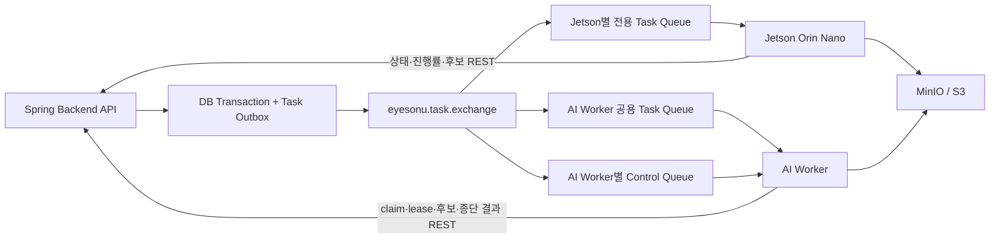
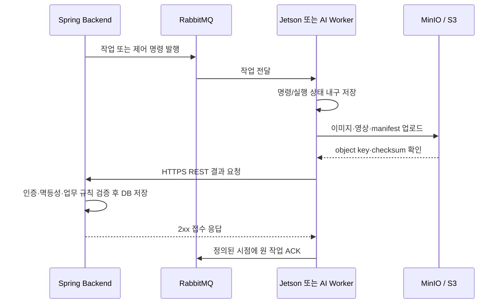

# RabbitMQ 작업 전달과 REST 결과 회신 연동 안내서

> 문서 구분: 이 문서는 목표 연동 계약이다. **10.1 현재 구현**에 명시된 항목만 현재 `dev`에 존재하며, 그 밖의 장치별 Queue, v2 Jetson API, 외부 AI Worker API와 실행 lease는 미구현 후속 범위다.

이 문서는 Backend API가 Jetson Orin Nano와 AI Worker에 RabbitMQ로 작업·제어 명령을 전달하고, 두 실행 주체가 Spring REST API로 상태·진행률·후보·종료 결과를 회신하는 **목표 계약**을 정의합니다.

이미지·영상·manifest 같은 대용량 파일은 MinIO/S3에 먼저 업로드합니다. RabbitMQ 작업과 REST 요청에는 object key, checksum, content type, 크기처럼 저장된 파일을 검증하는 정보만 포함합니다.

> 현재 구현에는 `search.target.exchange` 기반 실시간 검색 대상 변경 알림, Jetson의 `/api/v1/device/search-targets` 조회, `/api/v1/device/candidate-event-upload-urls` 이미지 업로드 URL 발급과 `/api/v1/device/candidate-events` 등록, 녹화 분석 DB outbox·publisher와 `search.target.recording.queue`가 있습니다. 이 문서의 장치별 작업 Queue, v2 Jetson API, AI Worker 내부 API와 실행 lease는 목표 계약이며 아직 모두 구현된 상태가 아닙니다.

## 1. 최종 결정

| 구분 | Jetson Orin Nano | AI Worker |
|---|---|---|
| 역할 | 관할 카메라 최대 4대에서 한 사건의 실시간 스트림 탐색 | 지정된 녹화 파일을 끝이 있는 배치 작업으로 분석하거나 클립 생성 |
| 작업 단위 | `사건 1건 + Jetson 1대 + 카메라 최대 4대`의 실시간 검색 할당 | `analysis_jobs 1건 + 입력 1건 + 검색 조건 1건` |
| 작업 수신 | 장치별 RabbitMQ Task Queue | 작업 종류별 RabbitMQ 공용 Task Queue |
| 제어 수신 | 더 높은 revision의 UPSERT·STOP | Worker 전용 RabbitMQ Control Queue의 취소 명령 |
| 결과 회신 | Device Key로 인증한 REST API | mTLS 또는 service credential로 인증한 내부 REST API |
| RabbitMQ ACK | 명령과 desired state를 로컬에 내구 저장한 뒤 | 종단 결과 REST 요청이 2xx로 내구 접수된 뒤 |
| 파일 전송 | Object Storage 업로드 후 object key만 REST로 전달 | 동일 |
| 복구 | v2 전체 활성 할당 REST 스냅샷 | DB 실행 lease, RabbitMQ 재전달, Worker local outbox |

RabbitMQ는 비동기 작업 배포와 즉시 제어에 사용합니다. 결과는 검증 오류와 접수 성공을 즉시 확인할 수 있고 별도의 Backend 결과 소비 계층이 필요 없는 REST로 통일합니다. RabbitMQ `reply-to`를 이용한 장기 RPC는 사용하지 않습니다.

다음 정책을 v1 기본값으로 정합니다.

- Jetson 작업은 `(caseId, jetsonId)`별 할당이며 카메라 목록은 최대 4대입니다. Jetson 하나에는 활성 사건을 하나만 할당합니다.
- 실시간 검색 시작과 조건 수정은 최신 전체 스냅샷을 담은 `UPSERT`로 보냅니다. 부분 수정 메시지는 사용하지 않습니다.
- 후보가 발견되어도 실시간 검색을 자동 종료하지 않습니다. 명시적인 `STOP`, 사건 종료 또는 `validUntil` 도달 때만 종료합니다.
- AI 녹화 분석은 녹화본 하나와 검색 조건 하나당 `analysis_jobs` 행 하나와 RabbitMQ 작업 하나를 생성합니다.
- 현재 별도 Jetson 엔터티가 없으므로 최초 도입은 `미디어 서버 1대 = Jetson 1대`를 전제로 합니다. routing용 `jetsonId`는 프로비저닝 때 충돌 검사를 거쳐 저장한 canonical ID를 사용합니다.

## 2. 전체 흐름





`GET /api/v2/device/realtime-search-assignments`는 Jetson이 세 종류의 결과를 받는 API가 아닙니다. 재시작·재연결 때 Backend의 활성 할당 전체를 가져와 로컬 desired state와 재조정하는 복구 전용 조회 API입니다.

### 2.1 중앙 서버 자동 탐색 흐름

1. 사건 탐색 시작 시 마지막 목격 장소·시각에 해당하는 녹화본 작업을 `LAST_SIGHTING`으로 생성합니다.
2. 성공한 AI Worker 결과 중 임계값 이상 후보를 공개한 뒤 관측 추정 경로를 갱신합니다.
3. 최근 경로와 카메라 위·경도로 다음 카메라를 최대 2대 선정하고 예상 도착 전후 구간의 `ROUTE_PREDICTION` 작업을 생성합니다.
4. 관리자 확정 후보는 별도 확정 경로에 반영하며 수사자료에는 확정 경로와 그 기반 예측만 포함합니다.

Jetson 후보는 `JETSON_REALTIME` 출처로 저장하고 관리자 후보 목록의 최상단에 표시합니다. 출처 우선순위는 관리자 판정 상태와 분리합니다.

## 3. RabbitMQ 작업·제어 리소스

### 3.1 Exchange

| 이름 | 타입 | 발행 주체 | 용도 |
|---|---|---|---|
| `eyesonu.task.exchange` | `topic` | Backend API | Jetson·AI Worker 작업과 AI 취소 명령 |
| `eyesonu.dlx.exchange` | `topic` | RabbitMQ | 최대 재시도를 넘긴 작업·제어 메시지 격리 |

모든 Exchange와 Queue는 durable, 작업 메시지는 persistent로 선언합니다. 운영 환경의 중요 Queue는 quorum queue를 권장합니다.

### 3.2 Queue와 routing key

| 소비자 | Queue | Binding routing key | 소비 방식 |
|---|---|---|---|
| 특정 Jetson | `eyesonu.jetson.{jetsonId}.task.q` | `task.jetson.{jetsonId}.#` | 장치별 1개, `x-single-active-consumer=true` |
| 녹화 분석 Worker | `eyesonu.ai.recording-analysis.task.q` | `task.ai.recording.execute.v1` | Worker 간 경쟁 소비, GPU 슬롯당 prefetch 1 |
| 클립 생성 Worker | `eyesonu.ai.clip-generation.task.q` | `task.ai.clip.execute.v1` | Worker 간 경쟁 소비 |
| 특정 AI Worker 제어 | `eyesonu.ai.{workerId}.control.q` | `control.ai.{workerId}.#` | 현재 실행에 대한 대상 지정 취소 |

```text
task.jetson.{jetsonId}.realtime.upsert.v1
task.jetson.{jetsonId}.realtime.stop.v1
task.ai.recording.execute.v1
task.ai.clip.execute.v1
control.ai.{workerId}.cancel.v1
```

`jetsonId`와 `workerId`는 `[a-z0-9][a-z0-9-]{0,62}`를 만족하는 불변 canonical ID입니다. Queue 생성과 권한 부여는 장치가 아니라 운영 배포 과정에서 수행합니다.

각 Task Queue와 Control Queue에는 필요에 따라 `.retry.5s`, `.retry.30s`, `.retry.5m`, `.dlq` 대응 Queue를 둡니다. 예를 들어 녹화 분석 DLQ는 `eyesonu.ai.recording-analysis.task.q.dlq`입니다. DLQ는 자동으로 무한 redrive하지 않습니다.

Jetson 전용 Queue가 필요한 이유는 Queue가 기본적으로 경쟁 소비 방식이기 때문입니다. 여러 Jetson이 공용 Queue를 함께 소비하면 필요한 장치가 아니라 임의의 한 장치에만 메시지가 전달될 수 있습니다.

## 4. 공통 작업 메시지 Envelope

모든 RabbitMQ 작업·제어 메시지는 다음 Envelope를 사용합니다.

```json
{
  "schemaVersion": "1.0",
  "messageId": "da4ef53e-27bf-4c2a-bf51-0db259a1dcda",
  "messageType": "MESSAGE_TYPE",
  "jobId": "job-identifier",
  "attempt": 1,
  "correlationId": "case-or-request-correlation-id",
  "causationId": "source-command-id",
  "createdAt": "2026-08-01T10:00:00Z",
  "expiresAt": null,
  "traceId": "21e59f619ced4bd4b2c5332a6719f178",
  "payload": {}
}
```

필드 규칙은 다음과 같습니다.

- `messageId`: UUID. 소비자 inbox 중복 제거 기준입니다.
- `jobId`: 실시간 할당 또는 `analysis_jobs`의 외부 식별자입니다.
- `attempt`: Jetson 작업은 `1`, AI 작업은 재실행할 때 증가합니다.
- `correlationId`: 사용자 요청·사건 단위 추적 ID입니다.
- `causationId`: 이 작업을 만든 명령이나 이벤트 ID입니다.
- `createdAt`, `expiresAt`: UTC ISO-8601입니다. STOP과 AI 취소는 안전을 위해 만료시키지 않습니다.
- `traceId`: Backend·RabbitMQ·실행 주체·REST 요청 로그를 연결합니다.

본문을 계약의 기준으로 사용하며 AMQP header만 보고 업무 처리를 결정하지 않습니다. 메시지는 256 KiB 이하로 제한하고 비밀정보, presigned URL, 바이너리, 임베딩 배열은 넣지 않습니다.

## 5. Jetson Orin Nano 작업

### 5.1 실시간 검색 UPSERT

Routing key는 `task.jetson.{jetsonId}.realtime.upsert.v1`, `messageType`은 `JETSON_REALTIME_SEARCH_UPSERT`입니다.

```json
{
  "schemaVersion": "1.0",
  "messageId": "c2c8d8a0-0e85-4a29-9e34-9bd0f7a5a001",
  "messageType": "JETSON_REALTIME_SEARCH_UPSERT",
  "jobId": "realtime-101-media-gangnam-01",
  "attempt": 1,
  "createdAt": "2026-08-01T10:00:00Z",
  "expiresAt": "2026-08-02T10:00:00Z",
  "traceId": "21e59f619ced4bd4b2c5332a6719f178",
  "payload": {
    "jetsonId": "media-gangnam-01",
    "assignmentRevision": 7,
    "caseId": 101,
    "cameras": [
      {"cameraId": 1, "cameraCode": "CAM-001", "streamRef": "mediamtx:CAM-001"},
      {"cameraId": 2, "cameraCode": "CAM-002", "streamRef": "mediamtx:CAM-002"},
      {"cameraId": 3, "cameraCode": "CAM-003", "streamRef": "mediamtx:CAM-003"},
      {"cameraId": 4, "cameraCode": "CAM-004", "streamRef": "mediamtx:CAM-004"}
    ],
    "conditions": [
      {
        "conditionId": 10,
        "prompt": "red jacket and black backpack",
        "threshold": 0.78
      }
    ],
    "model": {
      "modelKey": "orin-dh",
      "modelVersion": "2026.08.1"
    },
    "output": {
      "framePrefix": "frames/realtime/realtime-101-media-gangnam-01/revision-7/",
      "cropPrefix": "crops/realtime/realtime-101-media-gangnam-01/revision-7/"
    },
    "validUntil": "2026-08-02T10:00:00Z"
  }
}
```

Backend는 사건·조건·카메라 목록 변경을 한 DB 트랜잭션에서 할당 snapshot과 outbox에 저장합니다. 카메라는 최대 4대이며 새 사건을 할당하기 전에 기존 활성 사건을 중지해야 합니다. `assignmentRevision`은 같은 `jobId`에서 단조 증가하며, Jetson은 더 낮거나 같은 revision을 중복·stale 명령으로 처리합니다.

### 5.2 실시간 검색 STOP

Routing key는 `task.jetson.{jetsonId}.realtime.stop.v1`, `messageType`은 `JETSON_REALTIME_SEARCH_STOP`입니다.

```json
{
  "schemaVersion": "1.0",
  "messageId": "4d5d942c-1af8-4f50-b2ba-e13958174350",
  "messageType": "JETSON_REALTIME_SEARCH_STOP",
  "jobId": "realtime-101-media-gangnam-01",
  "attempt": 1,
  "createdAt": "2026-08-01T11:00:00Z",
  "expiresAt": null,
  "traceId": "21e59f619ced4bd4b2c5332a6719f178",
  "payload": {
    "jetsonId": "media-gangnam-01",
    "assignmentRevision": 8,
    "caseId": 101,
    "stoppedAt": "2026-08-01T11:00:00Z",
    "reason": "SEARCH_STOPPED"
  }
}
```

Jetson은 UPSERT와 STOP을 받을 때 신규 추론·후보 생성 gate를 먼저 닫고 `gateClosedAt`을 기록합니다. 명령과 desired state, `ACCEPTED` 상태 보고를 local durable storage에 원자적으로 기록한 뒤 RabbitMQ 작업을 ACK합니다. 실제 카메라·모델 적용은 비동기로 수행하고 성공·실패 상태는 REST로 보고합니다.

STOP은 gate를 닫지 못하거나 desired state를 저장하지 못하면 ACK하지 않습니다. 자원 정리에 실패하더라도 gate는 닫힌 상태로 유지하고 local retry를 계속합니다.

## 6. Jetson REST 회신 계약

모든 API는 HTTPS와 Device Key 인증을 사용합니다. Backend는 인증된 미디어 서버를 canonical `jetsonId`로 매핑하고, 요청의 `jobId`, 카메라 소유권, 최대 4대의 할당 목록과 활성 revision을 검증합니다.

### 6.1 명령 적용 상태

```http
POST /api/v2/device/realtime-search-assignments/{jobId}/command-status
Content-Type: application/json
X-Device-Key: ...
```

```json
{
  "reportId": "7499113e-c7e9-43d9-94a0-f4f0293d1437",
  "assignmentRevision": 7,
  "desiredRevision": 7,
  "previousAppliedRevision": 6,
  "appliedRevision": 7,
  "statusSequence": 2,
  "status": "APPLIED",
  "bootId": "boot-5c8f2ca4",
  "inferenceGateOpen": true,
  "gateClosedAt": "2026-08-01T10:00:00.400Z",
  "gateOpenedAt": "2026-08-01T10:00:01.100Z",
  "stateChangedAt": "2026-08-01T10:00:01.100Z",
  "localRetryCount": 0,
  "nextRetryAt": null,
  "error": null
}
```

`status`는 `ACCEPTED`, `APPLIED`, `SUPERSEDED`, `EXPIRED`, `REJECTED`, `STOPPED`, `APPLY_FAILED` 중 하나입니다. `statusSequence`는 같은 `jobId + assignmentRevision`에서 단조 증가합니다. `APPLY_FAILED`와 `REJECTED`에는 `code`, `message`, `stage`, `retryable`을 가진 `error`가 필수입니다.

새 보고는 `201`, 동일 `reportId`와 동일 payload의 재요청은 `200`과 같은 receipt를 반환합니다. 동일 `reportId`의 payload가 다르면 `409 REPORT_PAYLOAD_CONFLICT`입니다.

### 6.2 실행 진행 상태

```http
PUT /api/v2/device/realtime-search-assignments/{jobId}/progress
Content-Type: application/json
X-Device-Key: ...
```

```json
{
  "assignmentRevision": 7,
  "desiredRevision": 7,
  "appliedRevision": 7,
  "sequence": 17,
  "state": "RUNNING",
  "inferenceGateOpen": true,
  "activeCameraCount": 4,
  "lastFrameAt": "2026-08-01T10:00:09.950Z",
  "inputFps": 15.1,
  "inferenceFps": 12.8,
  "inferenceP95Ms": 74,
  "processedFrames": 154,
  "droppedFrames": 14,
  "candidateEventCount": 0,
  "error": null
}
```

`state`는 `STARTING`, `RUNNING`, `DEGRADED`, `FAILED`, `STOPPED` 중 하나입니다. 정상 상태는 10초 간격을 기본으로 보내고 상태가 바뀌면 즉시 보냅니다. Backend는 더 작은 `sequence`를 성공한 stale 요청으로 무시하고 현재 `acceptedSequence`를 반환합니다.

진행률은 최신 상태만 의미하므로 Jetson local outbox에서 같은 `jobId + assignmentRevision`의 미전송 진행 요청을 더 큰 sequence로 대체할 수 있습니다. 명령 상태와 후보 요청은 이렇게 합치면 안 됩니다.

### 6.3 실시간 후보

Jetson은 프레임과 모든 crop 업로드가 끝난 뒤 다음 API를 호출합니다.

```http
POST /api/v2/device/realtime-search-assignments/{jobId}/candidate-events
Content-Type: application/json
X-Device-Key: ...
```

```json
{
  "eventId": "rt-media-gangnam-01-boot5c8f-CAM-001-000044-20260801100312123",
  "assignmentRevision": 7,
  "caseId": 101,
  "cameraId": 1,
  "cameraCode": "CAM-001",
  "detectedAt": "2026-08-01T10:03:12.123456Z",
  "frameObjectKey": "frames/realtime/realtime-101-media-gangnam-01/revision-7/boot-5c8f2ca4/20260801/100312123.jpg",
  "frameWidth": 1920,
  "frameHeight": 1080,
  "coordinateSystem": "PIXEL_TOP_LEFT",
  "trackerSessionId": "boot-5c8f2ca4",
  "modelKey": "orin-dh",
  "modelVersion": "2026.08.1",
  "detections": [
    {
      "trackId": "44",
      "conditionId": 10,
      "similarity": 0.86,
      "cropObjectKey": "crops/realtime/realtime-101-media-gangnam-01/revision-7/boot-5c8f2ca4/44.jpg",
      "boundingBox": {"x": 631, "y": 122, "width": 284, "height": 771}
    }
  ]
}
```

`assignmentRevision`은 후보 생성 당시 `appliedRevision`과 같아야 하고 `inferenceGateOpen=true`여야 합니다. `cameraId`는 해당 할당의 카메라 목록에 포함되어야 합니다. Backend는 현재 revision 또는 직전 revision의 `detectedAt <= gateClosedAt`인 in-flight 후보만 허용합니다. STOP 이후에는 `detectedAt <= stoppedAt`인 지연 후보만 late arrival로 저장합니다.

새 이벤트는 `201`, 동일 `eventId`와 동일 payload는 `200`과 `duplicate=true`, 동일 `eventId`의 다른 payload는 `409 EVENT_PAYLOAD_CONFLICT`입니다. 기존 `/api/v1/device/candidate-events`는 전환 기간에만 legacy 호환용으로 유지합니다.

접수된 후보는 `source=JETSON_REALTIME`로 저장합니다. 이 출처는 관리자 판정과 별개이며 관리자 후보 목록에서 항상 녹화 분석 후보보다 먼저 정렬합니다.

### 6.4 활성 할당 복구 조회

```http
GET /api/v2/device/realtime-search-assignments
If-None-Match: "assignment-snapshot-etag"
X-Device-Key: ...
```

응답의 각 항목은 `JETSON_REALTIME_SEARCH_UPSERT`와 같은 `jobId`, revision과 전체 payload를 포함합니다. 비활성 할당은 제외합니다. Jetson은 시작·재연결 때 즉시 조회하고 이후 ETag 조건부 조회를 주기적으로 수행합니다. 전체 스냅샷에 없는 로컬 할당은 중지합니다.

## 7. AI Worker 작업과 REST 회신 계약

### 7.1 녹화 분석 작업

Routing key는 `task.ai.recording.execute.v1`, `messageType`은 `AI_RECORDING_ANALYZE`입니다.

```json
{
  "schemaVersion": "1.0",
  "messageId": "3b9a31ca-70fb-4621-a4f4-88e0a1256333",
  "messageType": "AI_RECORDING_ANALYZE",
  "jobId": "analysis-9001",
  "attempt": 1,
  "createdAt": "2026-08-01T10:10:00Z",
  "expiresAt": "2026-08-01T11:10:00Z",
  "traceId": "a8ef0bb989d74ed0a017c77309b457aa",
  "payload": {
    "caseId": 101,
    "recordingId": 5501,
    "cameraId": 1,
    "trigger": {
      "type": "ROUTE_PREDICTION",
      "sourceCandidateIds": [8990, 9001],
      "predictedCameraRank": 1
    },
    "searchWindow": {
      "from": "2026-08-01T09:20:00Z",
      "to": "2026-08-01T09:40:00Z"
    },
    "input": {
      "objectKey": "recordings/CAM-001/2026/08/01/09/segment.mp4",
      "sha256": "4a44dc15364204a80fe80e9039455cc1608281820fe2b24e39da33aee0c16e99"
    },
    "condition": {
      "conditionId": 10,
      "prompt": "red jacket and black backpack",
      "threshold": 0.78
    },
    "model": {
      "modelKey": "gpu-dh",
      "modelVersion": "2026.08.1"
    },
    "output": {
      "prefix": "analysis/analysis-9001/attempt-1/"
    },
    "timeoutSeconds": 3600,
    "heartbeatIntervalSeconds": 10
  }
}
```

`trigger.type`은 최초 탐색의 `LAST_SIGHTING` 또는 후속 탐색의 `ROUTE_PREDICTION`입니다. 후속 작업은 예측 카메라 순위와 원인이 된 후보 ID를 포함하며, Worker는 `searchWindow` 구간만 분석합니다. 현재 녹화 테이블에 codec, FPS와 해상도가 없으므로 이를 필수 작업 필드로 두지 않고 Worker가 FFprobe로 확인해 성공 manifest에 기록합니다.

### 7.2 실행 claim

Worker는 작업을 실행하기 전에 claim합니다.

```http
POST /api/v1/internal/analysis-jobs/{jobId}/attempts/{attempt}/claim
Authorization: Worker <service-credential>
Content-Type: application/json

{}
```

```json
{
  "executionId": "exec-59609875-a16f-4d3c-81c8-f3530c9506ee",
  "leaseExpiresAt": "2026-08-01T10:10:30Z",
  "heartbeatIntervalSeconds": 10,
  "cancelRequested": false
}
```

Backend는 인증 주체를 canonical `workerId`로 매핑하고 `jobId + attempt`를 원자적으로 claim합니다. `workerId`는 요청 body로 선택할 수 없습니다.

- `200`: claim 성공
- `403 WORKER_NOT_AUTHORIZED`: Worker 등록 또는 작업 유형 권한 없음. 보안 경보 후 원 작업을 DLQ로 보냅니다.
- `409 LEASE_ALREADY_HELD`: 유효한 다른 실행이 있음. 이 delivery는 no-op ACK합니다.
- `410 JOB_NOT_RUNNABLE`: 취소·종단 상태 또는 더 최신 attempt가 있음. 이 delivery는 no-op ACK합니다.

### 7.3 lease 갱신과 진행률

```http
PUT /api/v1/internal/analysis-jobs/{jobId}/attempts/{attempt}/executions/{executionId}/lease
Authorization: Worker <service-credential>
Content-Type: application/json
```

```json
{
  "leaseSeconds": 30,
  "progress": {
    "sequence": 17,
    "phase": "INFERENCE",
    "percent": 42.5,
    "processedFrames": 45900,
    "processedPositionMs": 1530000,
    "candidateEventCount": 4,
    "throughputFps": 30.1,
    "reportedAt": "2026-08-01T10:20:00Z"
  }
}
```

```json
{
  "leaseExpiresAt": "2026-08-01T10:20:30Z",
  "acceptedProgressSequence": 17,
  "cancelRequested": false,
  "cancelReason": null
}
```

Backend는 인증된 `workerId`, `jobId`, `attempt`, `executionId`가 현재 lease와 모두 일치할 때만 갱신합니다. 더 작은 progress sequence는 현재 상태를 덮어쓰지 않습니다. 갱신이 `409` 또는 `410`으로 거절되거나 `cancelRequested=true`이면 Worker는 checkpoint에서 중지하고 더 이상 성공 결과를 만들지 않습니다.

### 7.4 녹화 분석 후보 등록

Worker는 후보 이미지 업로드 후 단건 또는 제한된 크기의 배치로 등록합니다. 기본 배치 상한은 50건, JSON 요청 크기 상한은 1 MiB입니다.

```http
POST /api/v1/internal/analysis-jobs/{jobId}/attempts/{attempt}/executions/{executionId}/candidate-events
Authorization: Worker <service-credential>
Content-Type: application/json
```

```json
{
  "batchId": "batch-a1-00017",
  "events": [
    {
      "eventId": "analysis-9001-a1-event-0042",
      "candidateKey": "recording-5501-track-44-1530123",
      "caseId": 101,
      "recordingId": 5501,
      "cameraId": 1,
      "conditionId": 10,
      "detectedAt": "2026-08-01T09:25:30.123Z",
      "frameObjectKey": "analysis/analysis-9001/attempt-1/frames/event-0042.jpg",
      "trackerSessionId": "analysis-9001-attempt-1",
      "detections": [
        {
          "trackId": "44",
          "similarity": 0.89,
          "cropObjectKey": "analysis/analysis-9001/attempt-1/crops/event-0042-0.jpg",
          "boundingBox": {"x": 631, "y": 122, "width": 284, "height": 771}
        }
      ]
    }
  ]
}
```

Backend는 후보를 곧바로 공개 `candidate_events`에 넣지 않고 `(jobId, attempt, eventId)`가 UNIQUE인 staging에 저장합니다. 응답은 각 event의 `CREATED`, `DUPLICATE`, `CONFLICT` 결과를 포함합니다. 동일 `eventId`와 같은 canonical payload는 성공한 중복이고, 다른 payload는 `409 EVENT_PAYLOAD_CONFLICT`입니다. 성공 attempt의 후보만 `source=RECORDING_ANALYSIS`로 공개하고, 임계값 이상 후보로 관측 추정 경로와 후속 작업을 갱신합니다.

프레임과 crop의 Object Key는 현재 작업의 `analysis/analysis-{jobId}/attempt-{attempt}/frames/` 또는 `analysis/analysis-{jobId}/attempt-{attempt}/crops/` 하위 경로여야 한다. 다른 작업이나 attempt의 키는 `400 INVALID_UPLOAD_OBJECT_KEY`로 거부한다.

### 7.5 종단 결과 접수

성공·실패·취소는 하나의 API로 내구 접수합니다.

```http
POST /api/v1/internal/analysis-jobs/{jobId}/attempts/{attempt}/executions/{executionId}/terminal-result
Authorization: Worker <service-credential>
Content-Type: application/json
```

성공 예시는 다음과 같습니다.

```json
{
  "terminalRequestId": "terminal-analysis-9001-attempt-1",
  "status": "SUCCEEDED",
  "completedAt": "2026-08-01T10:35:00Z",
  "result": {
    "type": "RECORDING_MANIFEST",
    "objectKey": "analysis/analysis-9001/attempt-1/manifest.json",
    "sha256": "7878799a...",
    "sizeBytes": 18412,
    "candidateEventCount": 4
  },
  "error": null,
  "cancelReason": null
}
```

실패 예시는 다음과 같습니다.

```json
{
  "terminalRequestId": "terminal-analysis-9001-attempt-1",
  "status": "FAILED",
  "completedAt": "2026-08-01T10:35:00Z",
  "result": null,
  "error": {
    "code": "STORAGE_TEMPORARILY_UNAVAILABLE",
    "message": "Input object could not be read",
    "stage": "DOWNLOAD",
    "retryable": true
  },
  "cancelReason": null
}
```

Backend는 현재 lease와 인증 주체를 확인한 뒤 `terminalRequestId`, status와 result/error/cancelReason의 canonical JSON fingerprint를 원자적으로 저장합니다.

- 새 접수는 `201`, 같은 ID와 같은 payload는 `200`과 동일한 receipt를 반환합니다.
- 저장은 완료됐지만 manifest 검증·후보 승격이 남으면 `202`를 반환합니다.
- 모든 2xx 응답은 `terminalReceiptId`, `duplicate`, `finalizationStatus=ACCEPTED|FINALIZED`, `receivedAt`을 포함합니다.
- 같은 `terminalRequestId`의 payload가 다르면 `409 TERMINAL_PAYLOAD_CONFLICT`입니다.
- stale attempt·execution이면 `409` 또는 `410`이며 현재 작업 상태를 바꾸지 않습니다.
- 취소 요청이 먼저 확정됐으면 `SUCCEEDED` 또는 `FAILED`를 `409 CANCEL_REQUESTED`로 거절합니다. Worker는 결과 초안을 폐기하고 고정된 새 `terminalRequestId`로 `CANCELLED`를 접수합니다.

Worker는 후보·artifact와 종단 요청을 local outbox에 내구 저장하고, 모든 후보 요청이 2xx를 받은 다음 종단 결과를 보냅니다. 종단 결과가 2xx로 접수되면 원 RabbitMQ 작업을 ACK하고 heartbeat를 중지합니다.

Backend finalizer는 manifest에 선언된 후보가 모두 staging에 있는지, object checksum·크기·content type이 맞는지 검증합니다. 성공할 때만 staging 후보를 `(jobId, candidateKey)` 기준으로 공개 후보에 승격하고 같은 트랜잭션에서 작업을 `SUCCEEDED`로 바꿉니다. 실패·취소·timeout attempt의 staging 후보는 공개하지 않습니다.

### 7.6 클립 생성 작업

Routing key는 `task.ai.clip.execute.v1`, `messageType`은 `AI_CLIP_GENERATE`입니다.

```json
{
  "schemaVersion": "1.0",
  "messageId": "cc4b3101-c581-4427-82d5-bbe88fabf708",
  "messageType": "AI_CLIP_GENERATE",
  "jobId": "clip-job-7401",
  "attempt": 1,
  "createdAt": "2026-08-01T10:40:00Z",
  "expiresAt": "2026-08-01T11:00:00Z",
  "traceId": "bfb39bd985414970a4a9fc87b2280c88",
  "payload": {
    "caseId": 101,
    "candidateId": 7401,
    "recordingId": 5501,
    "inputObjectKey": "recordings/CAM-001/2026/08/01/09/segment.mp4",
    "clipStartMs": 1520000,
    "clipEndMs": 1545000,
    "outputObjectKey": "clips/case-101/candidate-7401/clip-job-7401-a1.mp4",
    "timeoutSeconds": 600,
    "heartbeatIntervalSeconds": 10
  }
}
```

클립 작업도 같은 claim·lease·종단 결과·ACK 순서를 사용합니다. 진행 phase는 `DOWNLOADING`, `TRANSCODING`, `UPLOADING`을 사용하고 성공 결과 type은 `CLIP_ARTIFACT`입니다. Backend가 녹화본과 clip 구간을 결정하며 Worker가 Backend DB를 직접 조회하지 않습니다.

### 7.7 실행 중 취소

Backend는 실행 중 취소를 `control.ai.{workerId}.cancel.v1`로 보냅니다.

```json
{
  "schemaVersion": "1.0",
  "messageId": "310831a8-d9db-4030-be6d-1369c306fd7c",
  "messageType": "AI_JOB_CANCEL",
  "jobId": "analysis-9001",
  "attempt": 1,
  "createdAt": "2026-08-01T10:25:00Z",
  "expiresAt": null,
  "traceId": "a8ef0bb989d74ed0a017c77309b457aa",
  "payload": {
    "executionId": "exec-59609875-a16f-4d3c-81c8-f3530c9506ee",
    "requestedAt": "2026-08-01T10:25:00Z",
    "reason": "ADMIN_CANCELLED"
  }
}
```

Backend는 `cancelRequestedAt`과 cancel outbox를 같은 DB 트랜잭션으로 저장합니다. Worker는 Control Queue를 통한 즉시 통지와 lease 응답의 `cancelRequested`를 함께 사용합니다. 일치하는 취소를 받으면 checkpoint에서 중지하고 `CANCELLED` 종단 결과를 REST로 접수한 뒤 원 작업을 ACK합니다. 대기 중 작업은 DB를 먼저 `CANCELLED`로 바꾸므로 이후 claim이 `410`을 반환합니다.

## 8. ACK, 멱등성, 재시도와 장애 복구

### 8.1 RabbitMQ ACK

- Jetson은 명령, desired state와 `ACCEPTED` 보고를 local durable storage에 기록한 뒤 ACK합니다. 전체 검색 기간이나 후보 업로드 완료까지 기다리지 않습니다.
- AI Worker는 claim 후 `SUCCEEDED`, `FAILED`, `CANCELLED` 종단 요청이 Backend에서 2xx로 내구 접수된 뒤 원 작업을 ACK합니다.
- AI 작업의 `timeoutSeconds + 여유 시간`보다 RabbitMQ consumer acknowledgement timeout을 길게 설정합니다.
- claim 전에 Backend API에 도달하지 못하면 ACK하지 않고 Task retry Queue로 이동합니다.
- claim 뒤 실행 실패는 같은 delivery를 다시 실행하지 않습니다. `FAILED(retryable=true)` 종단 결과를 접수하고 ACK한 뒤 Backend가 새 attempt 생성 여부를 결정합니다.
- `messageId`나 `jobId`를 신뢰할 수 없는 poison message만 `reject(requeue=false)`로 DLQ에 보냅니다.

AI 작업을 수신 직후 ACK하려면 Worker durable inbox, 재시작 복구와 Backend lease watchdog이 모두 구현되어야 합니다. 그 전에는 종단 결과 접수 후 ACK가 기본입니다.

### 8.2 멱등 키

| 처리 | 멱등 키 |
|---|---|
| RabbitMQ 작업 중복 | `messageId` |
| Jetson 할당 상태 | `jetsonId + jobId + assignmentRevision + statusSequence` |
| Jetson 상태 요청 | `reportId`와 payload fingerprint |
| Jetson·AI 후보 | `eventId`와 payload fingerprint |
| AI 실행 시도 | `jobId + attempt` |
| AI 실행 lease | `jobId + attempt + executionId` |
| AI 진행 순서 | `jobId + attempt + progress.sequence` |
| AI 종단 접수 | `terminalRequestId`와 payload fingerprint |
| AI 후보 공개 승격 | `jobId + candidateKey` |

같은 ID와 같은 canonical payload는 성공한 중복으로 처리합니다. 같은 ID의 다른 payload는 `409`로 격리합니다. claim된 실행이 끝난 뒤 재시도할 때는 새 `messageId`를 만들고 `attempt`를 1 증가시킵니다.

### 8.3 REST 재시도

- 네트워크 오류, timeout, `429`, `5xx`는 local outbox에서 지수 backoff와 jitter로 재시도합니다.
- `Retry-After`가 있으면 이를 우선합니다.
- `401`, `403`은 자격 증명·권한 오류이므로 무한 재시도하지 않고 실행을 안전하게 중지한 뒤 운영 경보를 발생시킵니다.
- `409`, `410`은 stale lease·attempt·payload 충돌 또는 취소를 뜻하므로 응답 코드에 따라 중지·재조정합니다.
- 그 밖의 영구 `4xx`는 local quarantine에 보관하고 운영 경보를 발생시킵니다.
- 상태·후보·종단 요청은 2xx를 받을 때까지 local outbox에서 삭제하지 않습니다. 진행 요청만 최신 sequence로 대체할 수 있습니다.

### 8.4 Task retry와 DLQ

Task retry 기본 간격은 `5초 → 30초 → 5분 → DLQ`이며 운영 설정으로 조정합니다. 일시적인 claim 전 장애만 같은 `messageId`와 attempt로 재전달합니다. 식별 가능한 영구 validation 오류는 REST에 실패 상태를 남길 수 있으면 남긴 뒤 ACK하고, 해석할 수 없는 메시지만 DLQ로 보냅니다.

Backend는 `retryable=true`, `cancelRequestedAt=null`, 최대 시도 횟수 미만일 때만 실패 attempt를 닫고 backoff 후 `attempt + 1`과 새 `messageId`의 Task outbox를 원자적으로 생성합니다.

### 8.5 Outbox와 watchdog

Backend는 업무 데이터 변경과 RabbitMQ Task outbox 생성을 같은 DB 트랜잭션으로 커밋합니다. publisher는 broker confirm을 받은 뒤에만 outbox를 발행 완료로 표시합니다.

Jetson과 AI Worker는 REST 요청 body와 멱등 ID를 local outbox에 저장합니다. 전송 중 요청 결과를 잃어도 같은 ID로 다시 요청해 안전하게 receipt를 회복합니다.

AI lease가 종단 결과 접수 전에 만료되면 watchdog은 `cancelRequestedAt`이 있으면 `CANCELLED`, 없으면 `FAILED + WORKER_LOST(retryable=true)`로 닫습니다. 종단 결과가 이미 내구 접수됐다면 lease 만료로 새 attempt를 만들지 않고 finalizer/watchdog이 검증과 후보 승격을 계속합니다.

## 9. 보안과 네트워크

현재 Compose는 RabbitMQ를 `127.0.0.1` 또는 Docker 내부 네트워크에만 두므로 외부 Jetson과 외부 GPU Worker의 직접 소비를 위해 별도 네트워크 구성이 필요합니다.

- dev에서는 `tag:eyesonu-jetson`, `tag:eyesonu-ai-worker`에서 Backend HTTPS, 필요한 AMQP port와 Object Storage로 향하는 단방향 Tailscale Grant를 추가합니다.
- Broker listener 또는 TCP proxy는 EC2의 Tailscale 주소에만 bind하고 공인 인터페이스에는 열지 않습니다.
- prod에서는 사설망과 AMQPS `5671`, HTTPS를 사용합니다.
- 공개 인터넷에 평문 AMQP `5672`나 Management UI `15672`를 노출하지 않습니다.

RabbitMQ 권한은 다음과 같이 최소화합니다.

| 계정 | 읽기 권한 | 쓰기 권한 |
|---|---|---|
| Backend | 없음 | Task exchange의 작업·제어 routing key |
| Jetson 장치 계정 | 자신의 Task Queue | 없음 |
| AI Worker 계정 | 허용된 AI Task Queue와 자신의 Control Queue | 없음 |

REST 인증은 RabbitMQ 계정과 분리합니다.

- `/api/v2/device/**`: 기존 Device Key 인증을 확장하고 인증 주체를 canonical `jetsonId`로 매핑합니다.
- `/api/v1/internal/analysis-jobs/**`: 별도 stateless SecurityFilterChain을 추가하고 mTLS 또는 회전 가능한 service credential을 canonical `workerId`로 매핑합니다.
- 요청 body의 `jetsonId`나 `workerId`만으로 호출자를 신뢰하지 않습니다.
- Object Storage는 구성요소별 service account와 작업·시도 전용 prefix만 허용합니다. 업로드 object는 overwrite를 금지하고 Backend가 checksum, content type과 크기를 검증합니다.

RabbitMQ 메시지와 REST 요청에는 신고자 연락처, 관리자 메모, Device Key, RabbitMQ 비밀번호, Object Storage secret, 인증정보가 포함된 RTSP URL, presigned URL과 바이너리를 넣지 않습니다.

## 10. 현재 구현과 전환 순서

### 10.1 현재 구현

Jetson 관련 실제 흐름은 다음과 같습니다.

```text
Backend
 → search.target.exchange / search.target.updated
 → search.target.realtime.queue
 → Jetson이 GET /api/v1/device/search-targets
 → Jetson이 POST /api/v1/device/candidate-event-upload-urls
 → 응답의 presigned PUT URL로 프레임·crop 이미지 업로드
 → POST /api/v1/device/candidate-events
```

녹화 분석에는 DB outbox와 publisher가 구현되어 있습니다. `RecordingAnalysisJobPublisher`는 다음 리소스를 사용합니다.

```text
search.target.exchange
search.target.recording.created
search.target.recording.queue
search.target.dlx
search.target.recording.queue.dlq
```

현재 `RecordingAnalysisJobEvent`는 `commandId`, `eventType`, `jobId`, `caseId`, `occurredAt`만 전달합니다. `RecordingAnalysisJobListener`가 Backend 프로세스 안에서 이 Queue를 소비하고 작업을 `RUNNING`으로 claim하는 구조는 외부 AI Worker가 붙기 전의 임시 consumer입니다.

외부 AI Worker 도입 전에 `recording.analysis.consumer.auto-start=false`로 Backend listener를 비활성화하거나 소비자 소유권을 Worker 애플리케이션으로 이전해야 합니다. 두 소비자가 같은 Queue를 경쟁 소비하게 두면 Backend가 작업을 가져가 AI Worker가 받지 못할 수 있습니다.

현재 `/api/v1/device/**`에는 Device Key 기반 stateless 보안 체인이 있지만 `/api/v1/internal/analysis-jobs/**`용 Worker 인증 체인은 없습니다.

### 10.2 필요한 Backend·DB 변경

| 영역 | 필요한 변경 |
|---|---|
| Jetson 식별 | routing용 canonical ID 저장; 필요하면 `jetson_devices`, `camera_jetson_assignments` 추가 |
| 실시간 할당 | Jetson별 활성 사건 1건, 카메라 최대 4대, revision과 gate 시각 저장 |
| RabbitMQ | 장치별 Jetson Queue, AI 작업 Queue, Worker Control Queue와 Task retry/DLQ 선언 |
| Task outbox | 사건·할당·분석 작업 변경과 Task 발행을 같은 DB 트랜잭션으로 저장 |
| Jetson REST | v2 status·progress·candidate·assignment snapshot API와 HTTP 멱등 receipt 구현 |
| Worker 보안 | 내부 API 전용 인증 체인과 인증 주체→canonical `workerId` 매핑 |
| AI lease | claim·renew, progress, 취소 CAS와 watchdog 구현 |
| AI REST | candidate staging과 단일 terminal result receipt 구현 |
| `analysis_jobs` | trigger type·후보, 예상 카메라 순위·탐색 구간과 attempt·lease·terminal 필드 추가 |
| AI attempt 이력 | `(job_id, attempt)` UNIQUE인 불변 실행 이력 저장 |
| 후보 staging | `(job_id, attempt, event_id)` UNIQUE, payload fingerprint와 승격·폐기 상태 저장 |
| 후보 추적성 | source, job, recording, condition, candidate key, tracker session, model version 저장 |
| 경로·예측 | 관측 추정 경로와 확정 경로 분리, 카메라 위·경도 기반 다음 카메라 최대 2대 선정 |

AI 후보를 현재 `CandidateEventCommandService`에 직접 넣지 않습니다. 현재 서비스는 미디어 서버 Device principal과 사건 상태를 전제로 하므로 AI 전용 내부 진입점에서 attempt staging에 저장하고 성공 확정 때 공통 후보 저장 로직으로 승격합니다.

Jetson v2 후보 API는 사건 화면 상태만 검사하지 않고 해당 `jobId + assignmentRevision`의 활성 할당과 gate 시각을 검증합니다. 기존 `/api/v1/device/candidate-events`는 전환 기간에 유지합니다.

### 10.3 단계적 전환

1. RabbitMQ 작업과 REST 요청·응답 JSON Schema, canonical payload fixture를 Backend·Jetson·AI Worker CI에 추가합니다.
2. Backend Task outbox와 장치별 Jetson Queue, AI Task·Control Queue, retry/DLQ를 구성합니다.
3. v2 Jetson 할당 snapshot과 status·progress·candidate API를 추가하고 기존 v1 경로를 병행합니다.
4. Jetson을 새 Queue와 v2 REST 회신으로 전환하고 재연결·중복·STOP gate를 검증합니다.
5. Worker 인증, claim·lease, candidate staging, terminal result receipt와 finalizer를 구현합니다.
6. 외부 AI Worker를 배포하기 전에 Backend 내부 `RecordingAnalysisJobListener`의 자동 소비를 중단합니다.
7. 기존 녹화 분석 outbox payload를 전체 작업 snapshot 계약으로 확장하고 AI Worker가 Queue를 소비하게 합니다.
8. 최초 목격 작업과 경로 기반 후속 작업 생성, Jetson 4개 스트림·단일 사건 제한을 검증합니다.
9. 처리량·중복·DLQ·REST 장애·재연결 시험 후 legacy `search.target.realtime.queue`와 v1 Jetson API의 제거 일정을 결정합니다.

## 11. 완료 기준

- Jetson 하나에는 사건 하나와 카메라 최대 4대가 할당되고 다른 사건의 동시 실행이 차단됩니다.
- 마지막 목격 기준 최초 작업과 관측 추정 경로 기반 다음 카메라 최대 2대의 후속 작업이 발행됩니다.
- 같은 RabbitMQ 작업이 재전달돼도 중복 실행이 발생하지 않고 낮은 revision이 최신 상태를 되돌리지 않습니다.
- Jetson의 명령 상태, 진행 상태와 후보가 각각의 REST 쓰기 API로 전달됩니다.
- `GET /api/v2/device/realtime-search-assignments`는 활성 할당 복구에만 사용됩니다.
- Jetson은 desired state와 REST local outbox를 저장한 뒤 작업을 ACK하며 후보가 없어도 탐색 상태를 보고합니다.
- AI 작업은 Worker 복제본 사이에 경쟁 분배되고 `jobId + attempt` lease로 중복 실행을 차단합니다.
- AI 진행률은 lease 갱신에 포함되고 후보와 종단 결과는 전용 REST API에 멱등 접수됩니다.
- 종단 결과 2xx를 잃어도 같은 `terminalRequestId` 재요청으로 같은 receipt를 회복할 수 있습니다.
- 종단 결과가 접수된 뒤 lease가 만료돼도 `WORKER_LOST` 재시도가 생성되지 않습니다.
- 실행 중 취소는 Control Queue로 즉시 통지되고 lease 응답으로도 복구됩니다.
- Jetson과 AI 후보는 `eventId`로 전송 중복을 제거하고 AI 후보는 성공 attempt만 공개됩니다.
- Jetson 후보는 관리자 목록 최상단에 표시되고 관측 추정 경로와 확정 경로는 분리됩니다.
- 수사자료에는 확정 경로와 그 경로를 기반으로 한 예측 결과만 포함됩니다.
- 이미지·영상·manifest 바이너리는 메시지나 REST body에 들어가지 않고 Object Storage key와 검증 정보만 전달됩니다.
- 네트워크 오류·`429`·`5xx`는 local outbox에서 재시도되고 영구 `4xx`는 격리·경보됩니다.
- 외부 장치는 Tailscale 또는 사설망, TLS와 최소 권한 계정으로만 RabbitMQ·Backend·Object Storage에 접근합니다.

## 12. RabbitMQ 공식 참고 문서

- [Authentication, Authorisation, Access Control](https://www.rabbitmq.com/docs/access-control)
- [Consumers and Single Active Consumer](https://www.rabbitmq.com/docs/consumers)
- [Consumer Acknowledgements and Publisher Confirms](https://www.rabbitmq.com/docs/confirms)
- [Configurable Limits and consumer timeout](https://www.rabbitmq.com/docs/limits)
