# 실시간 임베디드 연동 안내서

이 문서는 임베디드·Jetson 팀이 사건 탐색 알림을 받고, 서버에서 탐색 조건을 조회한 뒤, 실시간 후보를 서버에 저장하기 위한 연동 안내서입니다.

## 1. 전체 흐름

```mermaid
flowchart LR
    A[관제실 사건 등록] --> B[서버 DB에 사건 저장]
    B --> C[인상착의·탐색 조건 등록]
    C --> D[CCTV와 사건 연결]
    D --> E[사건 상태 SEARCHING 전환]
    E --> F[Exchange에 알림 1회 발행]
    F --> G[search.target.realtime.queue]
    G --> H[Jetson이 메시지 수신]
    H --> I[GET /api/v1/device/search-targets]
    I --> J[카메라별 실시간 CLIP 탐색]
    J --> K[프레임·crop을 MinIO/S3에 업로드]
    K --> L[POST /api/v1/device/candidate-events]
    L --> M[서버가 후보·탐지 이벤트 저장]
    M --> N[관제실 대시보드에서 사건별 후보 조회]
```



현재 사건 생성 직후 상태는 `RECEIVED`입니다. 탐색 조건과 카메라가 모두 등록된 뒤 사건을 `SEARCHING`으로 바꾸는 순간 실시간 시작 알림이 발행됩니다.

이미 `SEARCHING` 중인 사건의 검색 조건이나 연결 카메라가 추가·수정·삭제되어도 같은 `SEARCH_TARGET_UPDATED` 알림이 발행됩니다.

녹화영상 탐색 등록·녹화 큐는 이 안내서와 현재 구현 범위에 포함되지 않습니다.

## 2. RabbitMQ 실시간 메시지

### RabbitMQ 리소스

| 항목 | 값 |
|---|---|
| Exchange | `search.target.exchange` |
| Exchange 타입 | `topic` |
| Routing key | `search.target.updated` |
| 실시간 큐 | `search.target.realtime.queue` |
| 메시지 형식 | JSON |
| 메시지 보존 | durable queue + persistent message |

백엔드는 Exchange에 메시지를 한 번만 발행합니다. RabbitMQ가 실시간 큐에 전달하며, 녹화 큐는 추후 별도로 연결합니다.

### 탐색 시작·조건 변경 메시지

```json
{
  "commandId": "c2c8d8a0-0e85-4a29-9e34-9bd0f7a5a001",
  "eventType": "SEARCH_TARGET_UPDATED",
  "caseId": 101,
  "updatedAt": "2026-07-31T02:00:00Z",
  "occurredAt": "2026-07-31T02:00:00Z"
}
```

필드 설명:

| 필드 | 타입 | 설명 |
|---|---|---|
| `commandId` | string | 메시지 식별자. Jetson에서 이미 처리한 메시지인지 확인할 때 사용 |
| `eventType` | string | `SEARCH_TARGET_UPDATED`이면 사건 탐색 시작 또는 최신 조건 동기화 |
| `caseId` | number | 서버에서 상세 사건을 조회할 사건 ID |
| `updatedAt` | string/null | 서버 탐색 대상의 변경 시각 |
| `occurredAt` | string | 알림이 발행된 UTC 시각 |

### 탐색 중지 메시지

사건이 `SEARCHING`에서 `CANDIDATE_FOUND`, `CLOSED` 등으로 변경되면 다음 메시지가 발행됩니다.

```json
{
  "commandId": "c2c8d8a0-0e85-4a29-9e34-9bd0f7a5a002",
  "eventType": "SEARCH_TARGET_DISABLED",
  "caseId": 101,
  "updatedAt": "2026-07-31T03:10:00Z",
  "occurredAt": "2026-07-31T03:10:00Z"
}
```

Jetson은 해당 `caseId`의 실시간 탐색을 중지하고 로컬 탐색 목록에서 비활성화해야 합니다.

### 메시지 처리 규칙

1. 메시지를 받으면 `commandId`를 확인합니다.
2. 이미 처리한 `commandId`이면 다시 탐색을 시작하지 않습니다.
3. `SEARCH_TARGET_UPDATED` 처리 성공 후에만 ACK합니다.
4. 처리 전에 장애가 발생하면 ACK하지 않아 RabbitMQ가 재전달하도록 합니다.
5. Jetson 재연결 시 메시지를 기다리지 말고 조회 API를 한 번 호출해 전체 목록을 동기화합니다.

## 3. Jetson에서 상세 탐색 조건 조회

RabbitMQ 메시지는 알림만 포함합니다. 인상착의, threshold, 카메라 목록은 API에서 가져옵니다.

### 요청

```http
GET /api/v1/device/search-targets
X-Device-Key: {deviceKey}
Accept: application/json
If-None-Match: "이전에 받은 ETag"
```

`If-None-Match`가 없으면 전체 목록을 받고, 이전 ETag와 동일하면 서버가 `304 Not Modified`를 반환할 수 있습니다.

### 응답

```json
{
  "data": [
    {
      "caseId": 101,
      "caseNumber": "EFU-0123456789ABCDEFGHJKMNPQRS",
      "searchConditions": [
        {
          "conditionId": 10,
          "prompt": "검은색 상의와 청바지를 입은 사람",
          "exclusionPrompt": "모자를 쓴 사람",
          "searchStart": "2026-07-31T00:00:00Z",
          "searchEnd": "2026-07-31T06:00:00Z",
          "searchArea": "강남역 주변",
          "similarityThreshold": 0.72
        }
      ],
      "cameras": [
        {
          "cameraId": 2,
          "cameraCode": "CAM-001"
        }
      ],
      "updatedAt": "2026-07-31T02:00:00Z"
    }
  ]
}
```

Jetson에서 사용하는 주요 정보:

| 경로 | 용도 |
|---|---|
| `caseId` | 후보 전송 시 반드시 포함 |
| `caseNumber` | 로컬 로그·화면 표시용 |
| `searchConditions[].conditionId` | 조건 식별 및 로그용 |
| `prompt` | CLIP positive prompt |
| `exclusionPrompt` | CLIP negative/exclusion prompt |
| `similarityThreshold` | 후보 판정 기준값 |
| `searchStart`, `searchEnd` | 시간 범위가 있는 조건이면 탐색 범위 제한 |
| `searchArea` | 카메라·영역 필터 참고값 |
| `cameras[].cameraId` | 서버 카메라 식별자 |
| `cameras[].cameraCode` | 후보 전송 시 `cameraCode`로 사용 |

서버는 임베디드에 신고자 이름·전화번호·이메일, 관리자 메모 등 개인정보를 제공하지 않습니다.

### curl 예시

```bash
curl -i \
  -H "X-Device-Key: ${DEVICE_KEY}" \
  -H "Accept: application/json" \
  "https://{server-host}/api/v1/device/search-targets"
```

## 4. Jetson의 실시간 탐색 처리

사건 하나를 받은 뒤의 권장 처리 순서는 다음과 같습니다.

```text
RabbitMQ 메시지 수신
 → commandId 중복 확인
 → GET /api/v1/device/search-targets 호출
 → caseId에 해당하는 조건·카메라 확인
 → 카메라 스트림에서 사람 탐지
 → CLIP similarity 계산
 → threshold 이상인 탐지 결과 선별
 → 원본 프레임과 crop 이미지를 MinIO/S3에 업로드
 → 후보 이벤트 API 호출
 → 서버 응답 확인 후 RabbitMQ ACK
```

여러 카메라가 있으면 `cameras` 목록의 각 `cameraCode`를 기준으로 분석합니다. 같은 사건의 후보라도 카메라별로 독립적인 `eventId`를 생성해야 합니다.

## 5. Jetson → 서버 후보 이벤트 API

### 요청

```http
POST /api/v1/device/candidate-events
X-Device-Key: {deviceKey}
Content-Type: application/json
Accept: application/json
```

### 요청 JSON 전체 형식

```json
{
  "caseId": 101,
  "cameraCode": "CAM-001",
  "eventId": "realtime-CAM-001-track-44-20260731050312001",
  "detectedAt": "2026-07-31T05:03:12.123456Z",
  "frameObjectKey": "frames/realtime/101/CAM-001/20260731/050312123.jpg",
  "detections": [
    {
      "trackId": "44",
      "similarity": 0.86,
      "cropObjectKey": "crops/realtime/101/CAM-001/20260731/050312123-track-44.jpg",
      "boundingBox": {
        "x": 100,
        "y": 80,
        "width": 120,
        "height": 240
      }
    }
  ]
}
```

필수 필드와 제약:

| 필드 | 필수 | 제약·의미 |
|---|---:|---|
| `caseId` | O | `GET /search-targets`에서 받은 사건 ID |
| `cameraCode` | O | `cameras[].cameraCode`와 동일해야 함 |
| `eventId` | O | 최대 255자. 이벤트마다 유일해야 하며 재전송 시 같은 값을 사용 |
| `detectedAt` | O | UTC ISO-8601 시각. 예: `2026-07-31T05:03:12.123456Z` |
| `frameObjectKey` | O | 업로드 완료된 원본 프레임의 S3/MinIO object key |
| `detections` | O | 최소 1개, 최대 100개 |
| `trackId` | O | 카메라 내 추적 ID. 문자열로 전송 |
| `similarity` | O | `0.0` 이상 `1.0` 이하 |
| `cropObjectKey` | O | 업로드 완료된 사람 crop 이미지의 object key |
| `boundingBox.x/y` | O | 0 이상인 픽셀 좌표 |
| `boundingBox.width/height` | O | 1 이상인 픽셀 크기 |

`frameObjectKey`와 모든 `cropObjectKey`는 API 호출 전에 MinIO/S3에 업로드되어 있어야 합니다. 서버는 object key를 검증하고, 존재하지 않거나 빈 객체이면 저장하지 않습니다.

### curl 예시

```bash
curl -i -X POST \
  -H "X-Device-Key: ${DEVICE_KEY}" \
  -H "Content-Type: application/json" \
  --data @candidate-event.json \
  "https://{server-host}/api/v1/device/candidate-events"
```

### 응답 의미

| HTTP 상태 | 의미 |
|---:|---|
| `201 Created` | 새 이벤트와 후보가 저장됨 |
| `200 OK` | 동일한 `eventId`의 동일 요청을 재전송한 멱등 응답 |
| `400 Bad Request` | JSON·필수값·범위 오류 |
| `401 Unauthorized` | `X-Device-Key` 누락 또는 인증 실패 |
| `403 Forbidden` | 해당 카메라가 Jetson의 미디어 서버 소속이 아님 |
| `409 Conflict` | 같은 `eventId`가 다른 카메라·시각·탐지 내용으로 이미 사용됨 |
| `422 Unprocessable Entity` | 사건이 탐색 중이 아니거나 카메라가 사건에 활성 연결되지 않음 |
| `503 Service Unavailable` | S3/MinIO object 검증 실패 또는 저장소 일시 장애 |

응답 예시:

```json
{
  "data": {
    "eventId": "realtime-CAM-001-track-44-20260731050312001",
    "caseId": 101,
    "cameraId": 2,
    "detectionCount": 1,
    "candidateIds": [3001],
    "duplicate": false,
    "createdAt": "2026-07-31T05:03:12.500000Z"
  }
}
```

## 6. 반드시 지켜야 할 규칙

- 서버 시간과 `detectedAt`은 UTC로 전송합니다.
- 메시지를 받았다고 상세 사건 정보를 메시지에서 찾지 말고 API를 호출합니다.
- `SEARCH_TARGET_DISABLED`를 받으면 해당 사건의 탐색을 중지합니다.
- 동일 이벤트 재전송 시 기존과 동일한 `eventId`를 사용합니다.
- 서로 다른 카메라에서 발생한 이벤트는 `cameraCode`가 다르므로 서로 다른 `eventId`를 사용합니다.
- 후보 API 호출은 object upload가 성공한 뒤 수행합니다.
- 후보 API 저장 성공 전에는 탐지 결과를 성공 처리하지 않습니다.
- API 성공 응답을 받은 뒤에만 RabbitMQ 메시지를 ACK합니다.
- Jetson 재시작·재연결 시 전체 탐색 목록 API를 다시 호출해 누락된 사건을 복구합니다.
