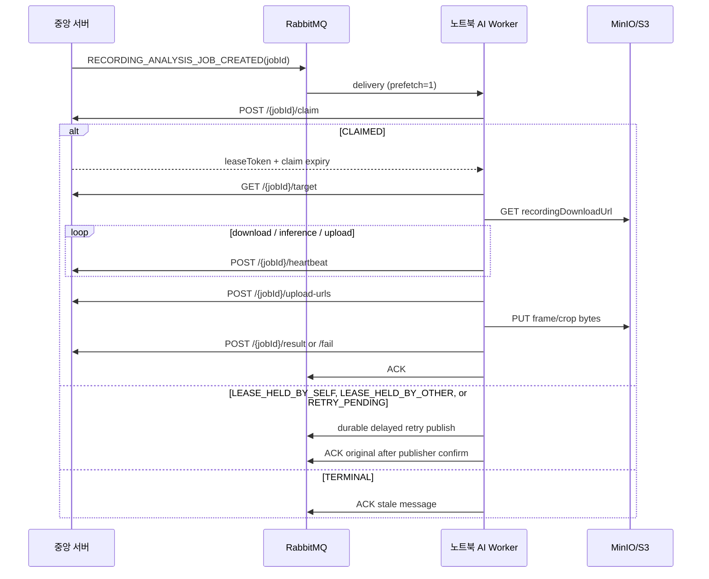

# 녹화본 분석 AI Worker 계약

노트북 AI Worker는 RabbitMQ 메시지에서 개인 인상착의나 저장소 자격 증명을 받지 않는다.
메시지는 작업 식별자만 전달하며, Worker는 중앙 서버에 작업을 claim한 뒤 인증된 내부 API로
검색 조건과 presigned URL을 받는다.

## 처리 순서



Worker는 terminal callback이 중앙 서버에 수락된 뒤에만 정상 ACK한다. 재처리의 자세한
RabbitMQ 규칙은 [RabbitMQ 전송 계약](../ai-worker/docs/RABBITMQ_NOTEBOOK_WORKER_TRANSPORT.md)을 따른다.

## RabbitMQ 이벤트

- exchange: `search.target.exchange`
- routing key: `search.target.recording.created`
- queue: `search.target.recording.queue`
- event type: `RECORDING_ANALYSIS_JOB_CREATED`

```json
{
  "commandId": "01K1...",
  "eventType": "RECORDING_ANALYSIS_JOB_CREATED",
  "jobId": 42,
  "occurredAt": "2026-08-04T00:31:00Z"
}
```

`jobId`만 routing 기준이다. `caseId`, 녹화·카메라 정보, object key, prompt, 다운로드 URL,
MinIO/S3 자격 증명은 RabbitMQ payload에 포함하면 안 된다.

## 인증과 응답 envelope

모든 내부 Worker API에는 아래 헤더가 필요하다.

```http
X-Worker-Key: <worker-key>
```

성공한 claim 이후 `target`, `heartbeat`, `upload-urls`, `result`, `fail`에는 아래 헤더도 필요하다.

```http
X-Worker-Claim-Token: <claim-response.leaseToken>
```

성공 응답은 `ApiResponse` envelope를 쓴다.

```json
{
  "timestamp": "2026-08-04T00:31:00Z",
  "data": {}
}
```

## 1. 작업 claim

```http
POST /api/v1/internal/recording-analysis-jobs/{jobId}/claim
X-Worker-Key: <worker-key>
```

claim 응답의 `disposition`이 Worker의 다음 동작을 결정한다. `duplicate`는 더 이상 claim 계약이
아니다.

| disposition | 상태 | leaseToken | Worker 동작 |
| --- | --- | --- | --- |
| `CLAIMED` | `RUNNING` | 필수 | 분석 시작 |
| `LEASE_HELD_BY_SELF` | `RUNNING` | 없음 | 같은 Worker의 stale delivery이므로 lease 만료 뒤 지연 재시도 |
| `LEASE_HELD_BY_OTHER` | `RUNNING` | 없음 | 다른 Worker가 active lease 소유, lease 만료 뒤 지연 재시도 |
| `RETRY_PENDING` | `QUEUED` | 없음 | 짧은 지연 뒤 재시도 |
| `TERMINAL` | `SUCCEEDED`/`FAILED`/`CANCELLED` | 없음 | stale 메시지 ACK |

```json
{
  "jobId": 42,
  "status": "RUNNING",
  "attempt": 1,
  "disposition": "CLAIMED",
  "startedAt": "2026-08-04T00:31:00Z",
  "claimedBy": "recording-ai-worker",
  "claimExpiresAt": "2026-08-04T00:36:00Z",
  "leaseToken": "opaque-once-only-token"
}
```

`JOB_NOT_RUNNABLE`은 terminal stale 메시지로 ACK한다. 다른 HTTP 4xx는 worker 설정·권한·요청
문제이므로 무한 재큐잉하지 않고 DLQ로 보낸다. 네트워크 오류와 HTTP 5xx만 retry budget을 소비하는
지연 재시도를 한다. `LEASE_HELD_BY_SELF`와 `LEASE_HELD_BY_OTHER`, `RETRY_PENDING`은 실패가 아니므로
기존 retry count를 보존한다. 구형 서버의 `LEASE_HELD` 응답도 같은 안전한 대기 경로로 처리한다.
구형 `RUNNING` 행에 `claimExpiresAt`이 없으면 서버는 응답에서 `startedAt + worker claim lease`를
다음 claim 가능 시각으로 제공하고, `startedAt`도 없으면 즉시 회수한다. 지연 delivery가 더 이상
없어도 중앙 서버의 lease-recovery scheduler가 만료 `RUNNING` job을 `QUEUED`와 새 outbox로 복구한다.

## 2. 분석 target과 녹화본 다운로드

```http
GET /api/v1/internal/recording-analysis-jobs/{jobId}/target
X-Worker-Key: <worker-key>
X-Worker-Claim-Token: <lease-token>
```

```json
{
  "jobId": 42,
  "caseId": 7,
  "searchConditionId": 13,
  "recordingId": 15,
  "cameraId": 3,
  "cameraCode": "CAM-003",
  "cameraName": "Front",
  "recordingObjectKey": "recordings/CAM-003/2026/08/04/video.mp4",
  "recordingDownloadUrl": "https://minio.example/presigned-get",
  "recordingStart": "2026-08-04T00:00:00Z",
  "recordingEnd": "2026-08-04T01:00:00Z",
  "prompt": "black short sleeve top and black pants",
  "exclusionPrompt": null,
  "searchStart": "2026-08-04T00:00:00Z",
  "searchEnd": "2026-08-04T00:30:00Z",
  "searchArea": "front gate",
  "searchFromMs": 0,
  "searchToMs": 1800000,
  "attempt": 1
}
```

Worker는 `recordingDownloadUrl`만 직접 GET하며 MinIO access key/secret을 보관하지 않는다.
`detectedAt`은 `recordingStart + frameOffsetMs`로 계산한다.

## 3. Heartbeat, 증거 업로드, 결과

```http
POST /api/v1/internal/recording-analysis-jobs/{jobId}/heartbeat
POST /api/v1/internal/recording-analysis-jobs/{jobId}/upload-urls
POST /api/v1/internal/recording-analysis-jobs/{jobId}/result
POST /api/v1/internal/recording-analysis-jobs/{jobId}/fail
```

모든 요청은 `X-Worker-Key`와 현재 `X-Worker-Claim-Token`이 필요하다. 다운로드·GPU 추론·증거
업로드 동안 heartbeat로 lease를 갱신한다. `WORKER_LEASE_CONFLICT`가 오면 이전 token으로 결과를
더 보내지 않고 새 claim을 위한 지연 재시도 경로로 돌린다. frame/crop signed PUT와 결과 payload의
상세는 [증거 업로드 계약](recording-analysis-upload-url-api.md)을 따른다.

## 노트북 환경 변수

```dotenv
CENTRAL_API_BASE_URL=https://central.example
CENTRAL_API_WORKER_KEY=<secret>
RABBITMQ_URL=amqps://<user>:<password>@<host>/<vhost>
RABBITMQ_QUEUE=search.target.recording.queue
EYESONU_AI_WORKER_RABBITMQ_RETRY_EXCHANGE=search.target.recording.retry.exchange
EYESONU_AI_WORKER_RABBITMQ_RETRY_ROUTING_KEY_PREFIX=search.target.recording.retry
EYESONU_AI_WORKER_MODEL_KEY=hybrid-solider-clip-v1
EYESONU_AI_WORKER_HEARTBEAT_INTERVAL_SECONDS=20
```

중앙 서버의 `recording.analysis.lease-recovery.auto-start`는 기본 `true`이며,
`recording.analysis.lease-recovery.poll-delay-ms` 기본값은 60초다. 운영 중에는 이 scheduler를
끄지 않는다.

`CENTRAL_API_BASE_URL`/`CENTRAL_API_WORKER_KEY`와 `RABBITMQ_URL`/`RABBITMQ_QUEUE`는 기존 dotenv
호환 이름이다. secrets는 Git·문서·로그에 넣지 않으며, 중앙 backend의 worker key와 같은 값이
런타임 secret store를 통해 주입되어야 한다. `recording.analysis.backend-consumer.auto-start`는
노트북 Worker가 이 queue를 소비하는 운영에서 `false`여야 한다.
