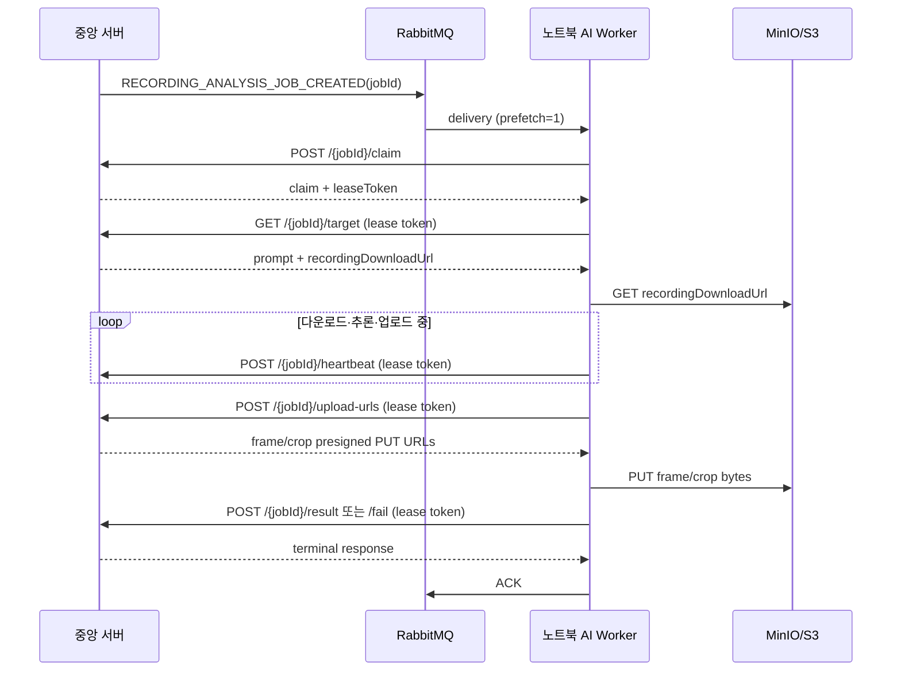

# 녹화본 분석 AI Worker 계약

노트북 AI Worker는 RabbitMQ 메시지에서 개인 인상착의나 저장소 자격 증명을 받지 않는다.
메시지는 작업 식별자만 전달하고, Worker가 중앙 서버에 작업을 claim한 뒤 안전한 내부 API로
목표 정보와 presigned URL을 받는다.

## 처리 순서



`ACK`는 중앙 서버가 `result` 또는 `fail`을 수락한 뒤에만 전송한다. claim 실패, lease 충돌,
또는 terminal callback 미확인 상태에서는 delivery를 requeue한다.

## RabbitMQ 이벤트

- exchange: `search.target.exchange`
- routing key: `search.target.recording.created`
- queue: `search.target.recording.queue`
- 이벤트 타입: `RECORDING_ANALYSIS_JOB_CREATED`

```json
{
  "commandId": "01K1...",
  "eventType": "RECORDING_ANALYSIS_JOB_CREATED",
  "jobId": 42,
  "caseId": 7,
  "recordingId": 15,
  "cameraId": 3,
  "cameraCode": "CAM-003",
  "cameraName": "Front",
  "recordingObjectKey": "recordings/CAM-003/2026/08/03/video.mp4",
  "attempt": 1,
  "occurredAt": "2026-08-03T00:31:00Z"
}
```

이벤트의 `jobId`만 작업 대상의 기준이다. prompt, 검색 시간, 다운로드 URL, 인상착의는
이벤트에 넣지 않으며 `/target` 응답만 사용한다.

## 인증과 응답 envelope

모든 내부 Worker API에는 아래 헤더가 필요하다.

```http
X-Worker-Key: <worker-key>
```

claim 성공 후에는 `target`, `heartbeat`, `upload-urls`, `result`, `fail` 요청에 아래 헤더를
추가한다.

```http
X-Worker-Claim-Token: <claim-response.leaseToken>
```

성공 응답은 `ApiResponse` envelope를 사용한다.

```json
{
  "timestamp": "2026-08-03T00:31:00Z",
  "data": {}
}
```

## 1. 작업 claim

```http
POST /api/v1/internal/recording-analysis-jobs/{jobId}/claim
X-Worker-Key: <worker-key>
```

정상 claim 응답의 `duplicate`가 `false`이면 `leaseToken`이 반드시 존재한다.
`duplicate: true`는 다른 delivery가 이미 `RUNNING` 상태로 claim했음을 뜻하므로 로컬 추론 없이
ACK한다. `409 JOB_NOT_RUNNABLE`은 재시도 가능한 작업이 아님을 뜻한다.

```json
{
  "jobId": 42,
  "status": "RUNNING",
  "attempt": 1,
  "duplicate": false,
  "startedAt": "2026-08-03T00:31:00Z",
  "claimedBy": "recording-ai-worker",
  "claimExpiresAt": "2026-08-03T00:36:00Z",
  "leaseToken": "opaque-once-only-token"
}
```

## 2. 분석 target 및 원본 녹화본 다운로드

```http
GET /api/v1/internal/recording-analysis-jobs/{jobId}/target
X-Worker-Key: <worker-key>
X-Worker-Claim-Token: <lease-token>
```

```json
{
  "jobId": 42,
  "caseId": 7,
  "searchConditionId": 13,
  "recordingId": 15,
  "cameraId": 3,
  "cameraCode": "CAM-003",
  "cameraName": "Front",
  "recordingObjectKey": "recordings/CAM-003/2026/08/03/video.mp4",
  "recordingDownloadUrl": "https://minio.example/presigned-get",
  "recordingStart": "2026-08-03T00:00:00Z",
  "recordingEnd": "2026-08-03T01:00:00Z",
  "prompt": "black short sleeve top and black pants",
  "exclusionPrompt": null,
  "searchStart": "2026-08-03T00:00:00Z",
  "searchEnd": "2026-08-03T00:30:00Z",
  "searchArea": "front gate",
  "searchFromMs": 0,
  "searchToMs": 1800000,
  "attempt": 1
}
```

Worker는 `recordingDownloadUrl`로 직접 GET하여 로컬에 저장한다. MinIO access key/secret을
노트북에 넣지 않는다. `detectedAt`은 `recordingStart + frameOffsetMs`로 계산한다.

## 3. heartbeat

```http
POST /api/v1/internal/recording-analysis-jobs/{jobId}/heartbeat
X-Worker-Key: <worker-key>
X-Worker-Claim-Token: <lease-token>
```

다운로드, GPU 추론, evidence 업로드가 진행되는 동안 주기적으로 호출한다. `409
WORKER_LEASE_CONFLICT`는 토큰이 만료되었거나 다른 Worker가 작업을 소유한다는 의미다. 이 경우
결과나 실패를 다시 제출하지 않고 delivery를 requeue한다.

## 4. 최종 결과 또는 실패

결과는 `/result`, 운영 실패는 `/fail`에 보낸다. 둘 다 현재 lease token이 유효해야 하며,
동일 attempt에 동일 `resultId`와 payload를 재전송하면 idempotent response(`duplicate: true`)를
받는다. 자세한 evidence PUT 절차는
[recording-analysis-upload-url-api.md](recording-analysis-upload-url-api.md)를 따른다.

## 노트북 환경 변수

```dotenv
CENTRAL_API_BASE_URL=https://central.example
CENTRAL_API_WORKER_KEY=<secret>
RABBITMQ_URL=amqps://<user>:<password>@<host>/<vhost>
RABBITMQ_QUEUE=search.target.recording.queue
EYESONU_AI_WORKER_MODEL_KEY=hybrid-solider-clip-v1
EYESONU_AI_WORKER_HEARTBEAT_INTERVAL_SECONDS=20
```

`CENTRAL_API_BASE_URL`/`CENTRAL_API_WORKER_KEY`는 기존 `.env` 호환 이름이다. 같은 값은
`EYESONU_AI_WORKER_CENTRAL_API_URL`/`EYESONU_AI_WORKER_API_KEY`로도 설정할 수 있다.
`RABBITMQ_URL`/`RABBITMQ_QUEUE`도 각각
`EYESONU_AI_WORKER_RABBITMQ_URL`/`EYESONU_AI_WORKER_RABBITMQ_QUEUE`의 호환 이름이다.
중앙 백엔드는 `WORKER_AUTHENTICATION_KEY`(또는 호환 변수 `AI_WORKER_API_KEY`)에 Worker의
`CENTRAL_API_WORKER_KEY`와 같은 값을 주입해야 `X-Worker-Key` 인증이 성공한다. 값 자체는
로그·문서·Git에 넣지 말고 secret store에서 두 프로세스에 함께 주입한다.
중앙 백엔드의 `recording.analysis.backend-consumer.auto-start`는 노트북 Worker가 이 queue를
소비하는 운영에서는 `false`여야 한다.
