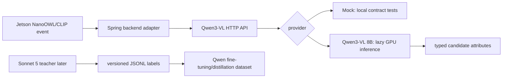

# Qwen3-VL 후보 속성 검증 학습 가이드

## 문제와 결과

Jetson의 NanoOWL/CLIP 이벤트는 후보 box와 `imageKey`를 만들고, GPU 서버는 후보 이미지의 색상·복장·객체 속성을 검증해야 합니다. 이 단계의 결과는 Sonnet 5가 오기 전에도 백엔드가 호출할 수 있는 API 계약과 mock/Qwen provider 경계입니다.

## 핵심 구조

- `schemas.py`: Spring과 약속할 request/response 및 Sonnet label schema.
- `providers.py`: mock과 Qwen3-VL을 같은 `AnalysisProvider`로 감쌉니다. Qwen import와 17GB checkpoint load는 첫 실제 요청까지 지연됩니다.
- `main.py`: health와 분석 HTTP surface입니다. blocking GPU 호출은 anyio thread로 옮깁니다.
- `dataset.py`: Sonnet 결과를 JSONL로 읽는 검증 경계입니다. API가 없을 때 가짜 teacher 결과를 만들지 않습니다.

## 로컬 학습 순서

1. `uv sync` 후 `uv run pytest`로 schema, mock, API, JSONL failure를 확인합니다.
2. `QWEN_PROVIDER=mock`인 상태에서 Spring adapter가 `POST /v1/candidates/analyze`의 alias 필드(`modelVersion`, `latencyMs`)를 읽게 합니다.
3. GPU 서버에서는 `QWEN_PROVIDER=qwen`으로 바꾸고 local checkpoint image 한 장으로 모델 load와 JSON 응답을 확인합니다.
4. Sonnet API가 승인되면 teacher 호출기는 이 JSONL schema만 생산하고, `candidateQuality=keep`/`review` 데이터만 사람 검수 후 학습 split으로 보냅니다.

## 검증된 경계와 한계

현재 입력은 서버 로컬 `image_path`라서 운영 인증/MinIO lookup이 없습니다. 실제 서비스에서는 Spring이 `imageKey`를 인증된 내부 storage lookup으로 변환해야 합니다. 또한 실제 distillation loss, multi-GPU 학습, Jetson 배포는 Sonnet label set과 별도 학습 task입니다.

## 연습 문제

1. `image_path` 대신 `imageKey`를 받는 adapter를 추가하고, provider에는 여전히 로컬 `Path`만 전달되도록 테스트하세요.
2. `TeacherLabel`에 `promptVersion`과 `sourceHash`를 추가하고 malformed label 테스트를 확장하세요.
3. Qwen raw JSON이 enum 밖의 decision을 반환할 때 502로 처리하는 contract test를 추가하세요.

