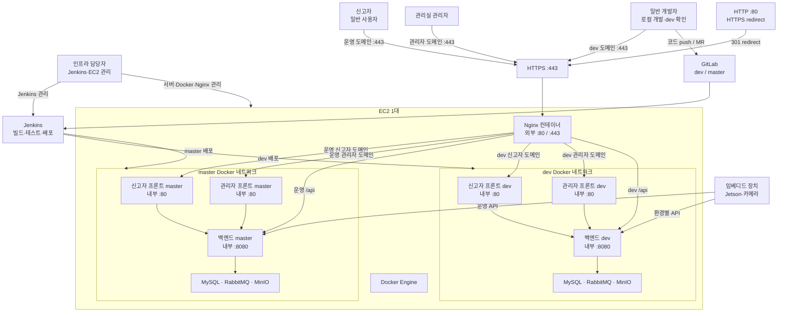

# EC2 배포 구조

`compose.local.yml`은 개발자 로컬 인프라용이고, EC2 배포에는 `compose.deploy.yml`을 사용한다.

## 전체 구조



외부에 공개되는 포트는 Nginx의 `80`, `443`뿐이다. 백엔드와 DB·RabbitMQ·MinIO는 Docker 내부 네트워크에서만 통신한다.

## 컨테이너 구성

- 외부 공개: `eyesonu-nginx`의 `80`, `443`만 공개
- dev: 관리자 프론트, 신고자 프론트, 백엔드, MySQL, RabbitMQ, MinIO
- master: 관리자 프론트, 신고자 프론트, 백엔드, MySQL, RabbitMQ, MinIO
- 백엔드와 인프라 컨테이너에는 `ports`를 사용하지 않는다.
- dev/master는 Docker 네트워크와 데이터 볼륨을 분리한다.

## EC2 최초 준비

1. Docker Engine, Docker Compose plugin, `flock`이 포함된 util-linux를 설치한다.
2. Jenkins 전용 checkout을 `/home/ubuntu/jenkins-data/workspace/ssafy-a204-infra`에 두고, `eyesonu-deploy`와 그 보조 그룹이 이 checkout에 쓰지 못하게 한다.
3. `infra/.env.deploy.example`을 **root 전용** `/etc/eyesonu/deploy.env`로 준비하고 모든 `change-me` 값을 교체한다. 저장소 안의 `.env.deploy`는 배포 입력으로 사용하지 않는다.
4. `infra/nginx/conf.d/default.conf`의 도메인과 인증서 경로를 실제 도메인에 맞춘 뒤, root가 관리하는 공유 Nginx 런타임으로 설치한다.
5. 인증서와 ACME 디렉터리, root 전용 ingress Compose stack을 준비한다.

### 프로필별 비밀값 검사

`compose.deploy.yml`은 dev와 master 서비스를 함께 정의하므로 Compose는 선택되지 않은 프로필의 변수도 먼저 해석한다. `deploy-on-host.sh`는 상위 셸에서 상속된 `DEV_*`·`MASTER_*` 값을 먼저 제거해 선택된 프로필의 값이 보호된 `/etc/eyesonu/deploy.env`에서만 오도록 한다. 이어서 선택하지 않은 프로필의 `:?` 필수 변수에만 자리값을 **해당 `docker compose` 프로세스에 한정해** 주입한다. 또한 상속된 `COMPOSE_PROJECT_NAME`을 제거하고 CLI에서 `--project-name eyesonu-deploy`를 강제한다. 따라서 `.env` 파일 또는 상위 셸의 외부 project name이 있어도 다른 Compose stack을 선택하지 않는다. 반대로 선택된 프로필의 비밀값은 대체하지 않아 기존처럼 배포 전에 실패한다.

예를 들어 `MASTER_AI_WORKER_API_KEY`는 master 배포에는 반드시 실제 값이 필요하지만, dev 배포에는 필요하지 않다. 두 환경의 키를 재사용하거나 저장소에 기록하지 않는다.

인증서·개인키와 Nginx 설정은 release checkout에 넣지 않는다. 배포 시에는 root가 관리하는 `/var/lib/eyesonu-deploy/runtime`만 bind-mount하므로 dev 또는 master의 후보 release가 공유 Nginx의 라우팅·인증서 경로를 바꿀 수 없다.

```bash
sudo install -d -o root -g root -m 0755 /var/lib/eyesonu-deploy/runtime
sudo install -d -o root -g root -m 0755 \
  /var/lib/eyesonu-deploy/runtime/certbot/www \
  /var/lib/eyesonu-deploy/runtime/certbot/conf \
  /var/lib/eyesonu-deploy/runtime/nginx/conf.d \
  /var/lib/eyesonu-deploy/runtime/nginx/snippets
sudo install -o root -g root -m 0644 infra/nginx/conf.d/default.conf \
  /var/lib/eyesonu-deploy/runtime/nginx/conf.d/default.conf
sudo install -o root -g root -m 0644 infra/nginx/snippets/ssl-params.conf \
  /var/lib/eyesonu-deploy/runtime/nginx/snippets/ssl-params.conf
sudo install -d -o root -g root -m 0755 /etc/eyesonu/ingress
sudo install -o root -g root -m 0644 infra/compose.ingress.yml \
  /etc/eyesonu/ingress/compose.yml
sudo install -o root -g root -m 0755 infra/scripts/bootstrap-shared-ingress.sh \
  /usr/local/sbin/eyesonu-bootstrap-shared-ingress
```

인증서를 발급한 뒤 다음 경로가 존재해야 한다.

```text
/var/lib/eyesonu-deploy/runtime/certbot/conf/live/example.com/fullchain.pem
/var/lib/eyesonu-deploy/runtime/certbot/conf/live/example.com/privkey.pem
```

`example.com`은 실제 인증서 디렉터리명으로 바꾼다.

### 최초 HTTPS 인증서 발급

최초에는 인증서가 없으므로 HTTPS 설정이 포함된 Nginx를 먼저 실행하면 안 된다. Nginx가 `443` 설정을 읽다가 인증서 파일이 없어 종료되기 때문이다. 다음 순서로 부트스트랩한다.

1. 모든 도메인의 DNS A 레코드를 EC2 공인 IP로 연결한다.
2. AWS 보안 그룹에서 `80`을 임시 또는 상시로 허용한다.
3. Nginx 컨테이너가 실행 중이면 중지해 `80`을 비운다.
4. 저장소 루트에서 Certbot standalone 발급 스크립트를 실행한다.

```bash
sudo DEPLOY_RUNTIME_ROOT=/var/lib/eyesonu-deploy/runtime \
  sh infra/scripts/bootstrap-certificates.sh \
  example.com \
  admin@example.com \
  admin.example.com \
  dev.example.com \
  admin-dev.example.com \
  storage.example.com \
  storage-dev.example.com
```

첫 번째 도메인이 인증서 디렉터리 이름이 된다. 따라서 Nginx 설정의 다음 경로와 일치해야 한다.

```text
/var/lib/eyesonu-deploy/runtime/certbot/conf/live/example.com/fullchain.pem
/var/lib/eyesonu-deploy/runtime/certbot/conf/live/example.com/privkey.pem
```

인증서 발급이 성공한 뒤에만 root가 공용 Nginx를 한 번 부트스트랩한다. 이후 애플리케이션은 protected Jenkins deployment job이 별도로 올린다.

```bash
sudo DEPLOY_RUNTIME_ROOT=/var/lib/eyesonu-deploy/runtime \
  /usr/local/sbin/eyesonu-bootstrap-shared-ingress
```

정상 dev/master 배포는 아래의 protected Jenkins deployment job만 사용한다. `deploy-on-host.sh`는 verified runner가 새 Git-free release 안에서 호출하는 내부 구현이며, host checkout에서 직접 실행하면 commit 검증·SSH 경계·root-owned lock 검증을 우회하므로 수동 실행하지 않는다.

프로필별 배포에는 `docker compose ... --profile`을 직접 실행하지 않는다. 인증서 갱신처럼 Nginx만 다루는 운영 명령도 앱 Compose가 아니라 root 전용 ingress Compose stack을 사용한다.

인증서 갱신은 Nginx가 제공하는 ACME webroot를 사용한다.

```bash
docker run --rm \
  -v "/var/lib/eyesonu-deploy/runtime/certbot/conf:/etc/letsencrypt" \
  -v "/var/lib/eyesonu-deploy/runtime/certbot/www:/var/www/certbot" \
  certbot/certbot:latest renew --webroot -w /var/www/certbot

sudo DEPLOY_RUNTIME_ROOT=/var/lib/eyesonu-deploy/runtime docker compose \
  --project-name eyesonu-ingress \
  -f /etc/eyesonu/ingress/compose.yml \
  exec nginx nginx -s reload
```

## 수동 배포 확인

Jenkins agent가 Docker Engine이 설치된 EC2에서 실행되는 경우:

`deploy-on-host.sh`는 verified runner가 생성한 immutable release에서만 호출한다. 정상 운영·장애 대응 모두 host checkout에서 이 파일을 직접 실행하지 않는다.

profile 배포는 해당 profile의 서비스만 갱신한다. 공유 Nginx가 없거나 healthy가 아니면 profile 배포는 실패하며, 후보 release가 Nginx를 생성·재생성·reload하지 않는다.

## Jenkins 동작

- `dev` push: 전체 빌드·테스트 후 dev profile 배포
- `master` push 또는 merge 반영: 전체 빌드·테스트 후 master profile 배포
- Merge Request·feature branch: 이 protected deployment job은 즉시 거절한다. 별도의 무권한 CI job에서만 빌드·테스트를 수행한다.
- 배포는 각 컨테이너의 healthcheck가 통과할 때까지 최대 180초 대기하며, 실패하면 Jenkins도 실패 처리
- 배포 전 기존 Jenkinsfile이 사용하던 컨테이너 이름만 제거
- Docker volume과 image는 자동 삭제하지 않음

Jenkins는 검증된 commit SHA로 backend/admin/reporter의 dev·master 이미지 태그를 모두 만들고 image ID를 확인한다. host runner는 release에 `IMAGE_TAG`와 세 image ID를 담은 manifest를 기록한 뒤, `--no-build --pull never`로만 Compose를 실행한다. 따라서 `latest`를 다시 빌드하거나 pull한 결과로 rollback하지 않으며, 필요한 이미지가 host Docker Engine에 없거나 ID가 달라지면 배포를 시작하지 않는다.

Jenkins는 SSH로 실행기 본문이나 호스트 경로를 전달하지 않고 `eyesonu-deploy <profile> <commit>` 요청만 보낸다. `authorized_keys`의 forced command는 이 형식만 수락하고 root-owned broker를 호출한다. broker는 요청 commit이 호스트의 현재 `refs/remotes/origin/dev` 또는 `refs/remotes/origin/master`와 정확히 같은지 확인한 뒤, 검증 실행기 자체를 그 commit object에서 직접 추출한다. 호스트 checkout의 워킹 트리 상태는 배포 입력으로 사용하지 않는다.
실행기는 빈 Git template과 `env -i` 환경에서 `GIT_CONFIG_COUNT=0`, `--no-replace-objects`를 강제한 임시 clone을 만든 뒤, 그 clone에서 커밋 tree를 tar archive로 추출한다. 호스트 checkout의 hook·filter·`info/attributes`·Git 환경 변수와 기존 release의 Git 메타데이터는 release 생성 경로에 영향을 줄 수 없다.
host checkout은 Jenkins 서비스 계정만 쓰고 `eyesonu-deploy` 및 그 보조 그룹은 쓰지 못해야 한다. root broker가 runner를 실행하더라도 system/global Git config는 계속 무시하고, canonical checkout 하나만 private temporary global Git config의 `safe.directory`로 허용한다.
인증서와 공유 Nginx 설정은 release checkout에 복사하지 않고 root 관리 `/var/lib/eyesonu-deploy/runtime`을 `DEPLOY_RUNTIME_ROOT`로 전달해 사용한다. profile release는 root-managed shared Nginx가 실행 중이고 healthy이며 올바른 mount·network·port를 가질 때만 진행하고, 설정은 검증(`nginx -t`)만 하며 reload하지 않는다.

release는 root가 미리 만든 `/var/lib/eyesonu-deploy/releases/release-<commit>.*`에 Git 메타데이터 없이 보존한다. 매 배포는 새 pending 디렉터리에 완성한 뒤 원자적으로 publish하므로, 추출 실패 후에도 같은 커밋을 재시도할 수 있고 기존 release는 다음 배포 입력으로 재사용하지 않는다. lock은 checkout·release 디렉터리와 분리된 root 소유 `/var/lib/eyesonu-deploy/deployment.lock`을 read-only로 열어 사용한다. marker 쓰기 가능 여부를 서비스 변경 전에 먼저 확인하고, 모든 Compose healthcheck와 공유 Nginx 검증이 성공한 뒤에만 profile별 `.active-release-dev` 또는 `.active-release-master` marker를 새 release 경로와 content digest로 원자적으로 갱신한다. rollback 직전에는 active marker와 digest를 다시 읽어 처음 선택한 같은 release인지 확인한다. 현재 release가 중간에 실패하거나 marker publish가 실패하면 먼저 후보 release에만 존재할 수 있는 서비스를 포함해 해당 profile의 앱·의존 인프라를 모두 중지한 뒤, 같은 profile의 이전 verified release로 rollback을 시도한다. 이전 release가 없는 첫 배포도 같은 중지 동작을 수행하되 공유 Nginx는 유지한다. rollback 또는 중지가 실패한 경우에는 marker를 바꾸지 않은 채 Jenkins를 실패 처리한다. 현재 실행 중인 release를 지우지 말고, 오래된 release 정리는 컨테이너가 새 release로 전환된 것을 확인한 뒤 운영자가 수행한다.
release checkout에는 Git이 추적하지 않는 `target/*.jar`가 없으므로 백엔드 Dockerfile은 Maven multi-stage build로 `pom.xml`과 `src/`만 사용해 JAR를 생성한다. Jenkins도 테스트를 통과한 뒤 같은 source-build Docker image를 한 번 더 빌드해 이 계약을 확인한다.
Jenkins 컨테이너는 `/home/ubuntu/jenkins-data`를 `/var/jenkins_home`으로 bind mount하고,
Jenkins checkout 결과는 호스트의 `/home/ubuntu/jenkins-data/workspace/ssafy-a204-infra`에
실시간으로 공유된다. 별도의 파일 전송 단계는 없으며, 호스트 스크립트는 이 공유된 checkout을
사용하되 Compose와 인증서 볼륨은 호스트 경로에서 직접 해석한다.

Jenkins에는 `eyesonu-ec2-deploy-key`라는 SSH private key credential을 등록하고, EC2의 `eyesonu-deploy` 계정에는 그 공개키 한 개만 restricted forced command로 허용한다. 호스트 checkout과 `/etc/eyesonu/deploy.env`의 경로는 root-owned broker에 고정되어 있으며 Jenkinsfile에서 바꾸지 않는다.
Jenkins 에이전트의 `$HOME/.ssh/known_hosts`에는 배포 대상 호스트의 공개 키를 사전에 등록해야 하며,
파이프라인은 호스트 키 검증을 끄지 않고 등록된 키와 일치하는 경우에만 접속한다.

호스트에서 `deploy-on-host.sh`를 직접 실행하지 않는다. 이 스크립트는 verified runner가 생성한 immutable release에서만 실행된다.

Jenkins가 EC2와 다른 서버에서 실행된다면 `DEPLOY_SSH_HOST`만 실제 EC2 환경에 맞게 변경한다. `DEPLOY_SSH_USER`는 `eyesonu-deploy`, checkout은 `/home/ubuntu/jenkins-data/workspace/ssafy-a204-infra`, 비밀값은 `/etc/eyesonu/deploy.env`로 고정한다. 다른 경로가 꼭 필요하면 root broker·host validator·설치 파일·파일 소유권을 함께 재프로비저닝하고, 그 전에는 배포가 fail-closed로 중단된다.

### 배포 입력 검증

Jenkins는 원격 shell 명령을 만들기 전에 `GIT_COMMIT`을 full lowercase object ID로, `DEPLOY_PROFILE`을 `dev` 또는 `master`로 검증한다. SSH에는 이 두 검증된 값만 전달하며, 호스트 경로나 비밀값 파일은 사용자·Jenkins 입력으로 전달하지 않는다.

### Jenkins pipeline source trust (필수)

배포 권한은 저장소 checkout 안의 스크립트가 아니라 **Jenkins controller의 보호된 배포 job**이 가진다. 이 저장소의 `infra/Jenkinsfile`은 `dev`, `master`와 명시된 전체 ref만 profile로 매핑하며 `feature/master` 같은 접미사 일치를 허용하지 않는다. 하지만 Jenkins가 feature branch의 Jenkinsfile을 실행하면 그 파일 자체가 pipeline 권한을 바꿀 수 있으므로, 아래 controller 설정이 반드시 선행되어야 한다.

- 배포 job의 Pipeline SCM 정의를 보호된 `dev` branch의 `infra/Jenkinsfile`로 고정하고, refspec은 `+refs/heads/*:refs/remotes/origin/*`로 설정해 `dev`와 `master`의 canonical ref를 같은 protected checkout object database에 가져온다. 임의 branch Jenkinsfile을 실행하는 multibranch/MR job으로 사용하지 않는다.
- MR·feature branch용 CI job은 별도로 만들고 `eyesonu-ec2-deploy-key`, Docker socket, SSH 권한을 제공하지 않는다.
- `eyesonu-ec2-deploy-key` credential은 위 전용 배포 job 또는 그 상위 folder에만 scope를 제한한다.
- controller의 webhook/trigger는 보호된 `dev` 또는 `master`로 향하는 non-MR 이벤트만 이 배포 job에 전달한다.
- 이 job은 전용 `eyesonu-trusted-deploy` agent label에서만 실행하고, 해당 노드·Docker socket·workspace를 MR/feature CI와 공유하지 않는다. Jenkinsfile도 기본 checkout을 끄고(`skipDefaultCheckout`) 매 실행의 workspace를 `deleteDir()`로 비운 뒤 보호된 SCM만 checkout한다.
- 위 경계가 어긋난 이벤트는 controller에서 실행되는 `Authorize deployment event` 단계에서 trusted agent·checkout을 할당하기 전에 실패한다.

`checkout scm`은 보호된 Jenkinsfile과 controller가 가져온 canonical ref를 읽기 위한 checkout으로만 사용한다. 실제 배포가 선택되면 Jenkins는 `checkout scm`이 보고한 보호 pipeline commit에서 source materializer blob을 isolated Git environment로 직접 추출해 임시 파일로 실행한다. 즉 mutable workspace에 있는 helper를 실행하지 않는다. 이어서 canonical ref(`refs/remotes/origin/dev` 또는 `refs/remotes/origin/master`)의 full SHA를 검증하고, fresh no-checkout clone에서 `git archive`로 `.verified-release-source`를 만든다. 따라서 worktree checkout·hook·smudge filter·replace ref가 build/test source에 영향을 줄 수 없고 source tree에는 `.git`도 없다. GitLab event SHA가 제공되면 canonical ref tip과 정확히 같아야 하며, 다르면 이전 event를 배포하지 않고 더 최신 event를 재시도하도록 실패한다. 검증된 archive SHA를 `GIT_COMMIT`으로 설정하고, configuration validation, backend/frontend build, runner 추출, host archive는 모두 그 SHA와 같은 source tree를 사용한다.

이 controller 경계를 아직 설정하지 않았다면 Jenkinsfile의 명시적 allowlist만으로는 신뢰 경계가 완성되지 않는다. 설정 전에는 배포 stage를 비활성화하고 CI만 실행한다.

### 전용 배포 SSH 계정과 호스트 보안 게이트

Jenkins는 일반 `ubuntu` 계정이 아니라 전용 비대화형 계정 `eyesonu-deploy`로만 배포 호스트에 접속한다. SSH 키는 restricted forced command로 root-owned broker만 `sudo -n`으로 실행할 수 있다. broker가 시작한 root runner는 host에 독립적으로 설치된 `/usr/local/sbin/eyesonu-verify-deployment-host-security`를 직접 실행한다. 이 검증기는 release checkout과 별개로 root 소유여야 하며, 다음 조건이 하나라도 깨지면 배포를 중단한다.

- `eyesonu-deploy`의 login shell이 `/bin/sh`이고 홈·`.ssh`·`authorized_keys`가 root 소유이며 group/world writable이 아님
- `sshd -T -C`의 유효 설정에서 `PermitUserEnvironment no`, `PermitUserRC no`
- `eyesonu-deploy`는 Docker socket·release·runtime·비밀값 파일에 직접 접근하지 못하고 broker 한 개만 password 없이 실행할 수 있음

EC2 콘솔 또는 root 권한으로 다음을 **최초 1회** 준비한다. 키 본문과 실제 경로는 비밀값·호스트 구성에 맞게 운영자가 채운다.

```bash
sudo useradd --system --create-home --home-dir /home/eyesonu-deploy \
  --shell /bin/sh --user-group eyesonu-deploy
sudo chown root:eyesonu-deploy /home/eyesonu-deploy
sudo chmod 0750 /home/eyesonu-deploy
sudo install -d -o root -g root -m 0700 /home/eyesonu-deploy/.ssh
sudo install -o root -g root -m 0600 /dev/null /home/eyesonu-deploy/.ssh/authorized_keys
sudo install -d -o root -g root -m 0750 /var/lib/eyesonu-deploy
sudo install -d -o root -g root -m 0750 /var/lib/eyesonu-deploy/releases
sudo install -o root -g root -m 0640 /dev/null /var/lib/eyesonu-deploy/deployment.lock
sudo install -d -o root -g root -m 0755 \
  /var/lib/eyesonu-deploy/runtime/certbot/www \
  /var/lib/eyesonu-deploy/runtime/certbot/conf \
  /var/lib/eyesonu-deploy/runtime/nginx/conf.d \
  /var/lib/eyesonu-deploy/runtime/nginx/snippets
sudo install -o root -g root -m 0644 \
  /home/ubuntu/jenkins-data/workspace/ssafy-a204-infra/infra/nginx/conf.d/default.conf \
  /var/lib/eyesonu-deploy/runtime/nginx/conf.d/default.conf
sudo install -o root -g root -m 0644 \
  /home/ubuntu/jenkins-data/workspace/ssafy-a204-infra/infra/nginx/snippets/ssl-params.conf \
  /var/lib/eyesonu-deploy/runtime/nginx/snippets/ssl-params.conf
sudo install -d -o root -g root -m 0700 /etc/eyesonu
sudo install -o root -g root -m 0600 /dev/null /etc/eyesonu/deploy.env
sudo install -d -o root -g root -m 0755 /usr/local/libexec
sudoedit /home/eyesonu-deploy/.ssh/authorized_keys
sudoedit /etc/eyesonu/deploy.env

sudo install -o root -g root -m 0755 \
  /home/ubuntu/jenkins-data/workspace/ssafy-a204-infra/infra/scripts/verify-deployment-host-security.sh \
  /usr/local/sbin/eyesonu-verify-deployment-host-security
sudo install -o root -g root -m 0755 \
  /home/ubuntu/jenkins-data/workspace/ssafy-a204-infra/infra/scripts/eyesonu-deploy-forced-command.sh \
  /usr/local/libexec/eyesonu-deploy-forced-command
sudo install -o root -g root -m 0755 \
  /home/ubuntu/jenkins-data/workspace/ssafy-a204-infra/infra/scripts/eyesonu-run-deployment.sh \
  /usr/local/libexec/eyesonu-run-deployment
sudo visudo -f /etc/sudoers.d/eyesonu-deploy
```

`/etc/sudoers.d/eyesonu-deploy`에는 다음 한 줄만 넣는다.

```sudoers
eyesonu-deploy ALL=(root) NOPASSWD: /usr/local/libexec/eyesonu-run-deployment *
```

`/home/eyesonu-deploy/.ssh/authorized_keys`에는 Jenkins 배포 키를 다음 형식으로 한 줄만 둔다. `<JENKINS_PUBLIC_KEY>`에는 실제 공개키 전체를 넣는다.

```text
restrict,command="/usr/local/libexec/eyesonu-deploy-forced-command" <JENKINS_PUBLIC_KEY>
```

`/etc/ssh/sshd_config.d/90-eyesonu-deploy.conf`에는 아래 Match 정책을 추가한 뒤 `sudo /usr/sbin/sshd -t && sudo systemctl reload ssh`로 적용한다.

```text
Match User eyesonu-deploy
    PermitUserEnvironment no
    PermitUserRC no
    PermitTTY no
    AllowTcpForwarding no
```

`eyesonu-deploy`에는 Docker Engine group을 부여하지 않는다. 이 계정은 deployment checkout·`/var/lib/eyesonu-deploy/releases`·`/etc/eyesonu/deploy.env`·runtime의 읽기/쓰기 권한도 갖지 않으며, restricted SSH 요청으로 broker만 실행한다. `/var/lib/eyesonu-deploy`, `deployment.lock`, `/etc/eyesonu`, `/var/lib/eyesonu-deploy/runtime`은 root가 계속 소유한다. Jenkins credential은 위 `authorized_keys`의 공개키와 짝이 맞아야 한다.

위 호스트 준비가 끝나기 전에는 의도적으로 배포가 실패한다. source checkout에서 실행되는 스크립트만 바꿔 SSH 초기화 경계를 신뢰하지 않기 위한 fail-closed 정책이다.

### Jenkins Docker socket access

Jenkins 컨테이너가 호스트 Docker Engine을 사용하려면 `/var/run/docker.sock`을 마운트하고,
호스트 소켓의 GID를 컨테이너 프로세스 그룹에 전달해야 한다.

```bash
docker run ... \
  -v /var/run/docker.sock:/var/run/docker.sock \
  --group-add "$(stat -c '%g' /var/run/docker.sock)" \
  ...
```

`--group-add`는 호스트마다 달라질 수 있는 Docker 소켓 GID를 실행 시점에 맞춘다.
Jenkins 이미지 내부의 고정된 `docker` 그룹만 사용하는 것보다 안전하다.

### DB 스키마 마이그레이션과 rollback

컨테이너 rollback은 애플리케이션 release만 되돌리며 MySQL schema 또는 data를 rollback하지 않는다. 따라서 master 배포의 DB 변경은 반드시 **expand/contract** 방식으로 나눈다. 먼저 이전 애플리케이션도 읽고 쓸 수 있는 추가·확장 마이그레이션을 배포하고, 구버전 코드가 더 이상 실행되지 않는 다음 배포에서만 제거·이름 변경·타입 축소 같은 contract 변경을 수행한다.

`infra/release-policy.env`의 `AUTO_ROLLBACK_SCHEMA_COMPATIBLE=0`이 기본값이다. 이 값에서는 후보 서비스를 중지한 뒤 자동 rollback을 금지하고 Jenkins를 실패시켜 forward corrective migration 또는 승인된 수동 복구를 요구한다. `=1`은 해당 commit에 대해 N-1 애플리케이션과 새 schema의 읽기·쓰기 호환성을 CI 또는 점검 환경에서 검증한 증적이 있을 때만 넣는다.

파괴적 DB 변경 전에는 복구 검증이 끝난 snapshot 또는 dump와 현재 마이그레이션 버전을 남긴다. 마이그레이션 이후 배포가 실패했을 때는 이전 image를 무조건 재기동하지 말고, 이전 코드와 새 schema의 호환성을 먼저 확인한다. 호환되지 않으면 forward corrective migration을 우선 적용하고, 전체 DB 복구가 필요할 때만 점검 창에서 검증된 backup을 사용한다.

## 운영 주의사항

- `infra/.env.deploy`와 인증서 개인키는 Git에 올리지 않는다.
- AWS 보안 그룹에는 `80`, `443`, 제한된 관리자용 `22`만 허용한다.
- MySQL, RabbitMQ, MinIO, Docker API 포트는 외부에 열지 않는다.
- MinIO API는 `storage` 전용 HTTPS 도메인을 통해서만 프록시하며 Console 포트는 공개하지 않는다.
- MinIO 초기화 시 버킷의 익명 정책을 `private`으로 재설정한다. 외부 객체 조회와 미디어 서버 녹화 PUT은 유효한 presigned URL로만 허용한다.
- dev·master storage Nginx는 HTTPS 요청 본문을 100 MiB로 제한한다. HTTP redirect와 HTTPS storage 가상 호스트 모두 access log를 비활성화하고, 전체 presigned 요청이 남지 않도록 error log도 `/dev/null`로 보낸다. storage 요청 단위 관측성을 의도적으로 포기하는 대신 Nginx 상태, 백엔드와 MinIO 컨테이너 로그·메트릭으로 장애를 확인한다.
- presigned query string은 애플리케이션·프록시·장치 로그에도 기록하지 않는다.
- 미디어 서버에는 `MINIO_APP_ACCESS_KEY`·`MINIO_APP_SECRET_KEY`를 배포하지 않는다. 녹화 업로드는 공용 HTTPS Device API에서 URL을 발급받아 공용 HTTPS storage 도메인으로 수행한다.
- master 볼륨은 배포 전 백업 정책을 별도로 둔다.
- 현재 레거시 정리 스크립트는 컨테이너만 삭제하며 데이터 볼륨은 삭제하지 않는다.
