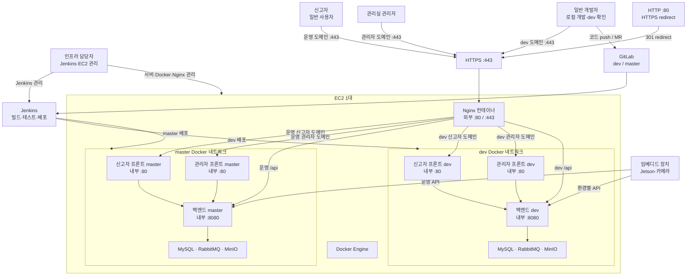

# EC2 배포 구조

`compose.local.yml`은 개발자 로컬 인프라용이고, EC2 배포에는 `compose.deploy.yml`을 사용한다.

## 전체 구조



외부에 공개되는 포트는 Nginx의 `80`, `443`뿐이다. 백엔드와 DB·RabbitMQ·MinIO는 Docker 내부 네트워크에서만 통신한다.

## 컨테이너 구성

- 외부 공개: `eyesonu-nginx`의 `80`, `443`만 공개
- dev: 관리자 프론트, 신고자 프론트, 백엔드, MySQL, RabbitMQ, MinIO
- master: 관리자 프론트, 신고자 프론트, 백엔드, MySQL, RabbitMQ, MinIO
- 백엔드와 인프라 컨테이너에는 `ports`를 사용하지 않는다.
- dev/master는 Docker 네트워크와 데이터 볼륨을 분리한다.

## EC2 최초 준비

1. Docker Engine과 Docker Compose plugin을 설치한다.
2. 저장소를 Jenkins workspace 또는 EC2 배포 디렉터리에 checkout한다.
3. `infra/.env.deploy.example`을 `infra/.env.deploy`로 복사하고 모든 `change-me` 값을 교체한다.
4. `infra/nginx/conf.d/default.conf`의 도메인과 인증서 경로를 실제 도메인에 맞춘다.
5. 인증서와 ACME 디렉터리를 준비한다.

```bash
mkdir -p infra/certbot/www infra/certbot/conf
```

인증서를 발급한 뒤 다음 경로가 존재해야 한다.

```text
infra/certbot/conf/live/example.com/fullchain.pem
infra/certbot/conf/live/example.com/privkey.pem
```

`example.com`은 실제 인증서 디렉터리명으로 바꾼다.

### 최초 HTTPS 인증서 발급

최초에는 인증서가 없으므로 HTTPS 설정이 포함된 Nginx를 먼저 실행하면 안 된다. Nginx가 `443` 설정을 읽다가 인증서 파일이 없어 종료되기 때문이다. 다음 순서로 부트스트랩한다.

1. 모든 도메인의 DNS A 레코드를 EC2 공인 IP로 연결한다.
2. AWS 보안 그룹에서 `80`을 임시 또는 상시로 허용한다.
3. Nginx 컨테이너가 실행 중이면 중지해 `80`을 비운다.
4. 저장소 루트에서 Certbot standalone 발급 스크립트를 실행한다.

```bash
sh infra/scripts/bootstrap-certificates.sh \
  example.com \
  admin@example.com \
  admin.example.com \
  dev.example.com \
  admin-dev.example.com
```

첫 번째 도메인이 인증서 디렉터리 이름이 된다. 따라서 Nginx 설정의 다음 경로와 일치해야 한다.

```text
infra/certbot/conf/live/example.com/fullchain.pem
infra/certbot/conf/live/example.com/privkey.pem
```

인증서 발급이 성공한 뒤에만 Compose로 Nginx와 애플리케이션을 실행한다.

```bash
docker compose --env-file infra/.env.deploy \
  -f infra/compose.deploy.yml --profile dev up -d --build
docker compose --env-file infra/.env.deploy \
  -f infra/compose.deploy.yml --profile master up -d --build
```

인증서 갱신은 Nginx가 제공하는 ACME webroot를 사용한다.

```bash
docker run --rm \
  -v "$PWD/infra/certbot/conf:/etc/letsencrypt" \
  -v "$PWD/infra/certbot/www:/var/www/certbot" \
  certbot/certbot:latest renew --webroot -w /var/www/certbot

docker compose \
  --env-file infra/.env.deploy \
  -f infra/compose.deploy.yml \
  exec nginx nginx -s reload
```

## 수동 배포 확인

Jenkins agent가 Docker Engine이 설치된 EC2에서 실행되는 경우:

```bash
sh infra/scripts/cleanup-legacy-containers.sh
docker compose --env-file infra/.env.deploy \
  -f infra/compose.deploy.yml --profile dev up -d --build

docker compose --env-file infra/.env.deploy \
  -f infra/compose.deploy.yml --profile master up -d --build
```

두 명령은 서로 다른 profile만 갱신하므로 dev와 master 컨테이너가 함께 실행된다.

## Jenkins 동작

- `dev` push: 전체 빌드·테스트 후 dev profile 배포
- `master` push 또는 merge 반영: 전체 빌드·테스트 후 master profile 배포
- Merge Request: 빌드·테스트만 수행하고 배포하지 않음
- 배포는 각 컨테이너의 healthcheck가 통과할 때까지 최대 180초 대기하며, 실패하면 Jenkins도 실패 처리
- 배포 전 기존 Jenkinsfile이 사용하던 컨테이너 이름만 제거
- Docker volume과 image는 자동 삭제하지 않음

Jenkins가 EC2와 다른 서버에서 실행된다면 현재 Jenkinsfile의 Docker 명령을 EC2 SSH 배포 단계로 교체해야 한다. Docker 명령이 실행되는 대상은 반드시 EC2 Docker Engine이어야 한다.

### Jenkins Docker socket access

Jenkins 컨테이너가 호스트 Docker Engine을 사용하려면 `/var/run/docker.sock`을 마운트하고,
호스트 소켓의 GID를 컨테이너 프로세스 그룹에 전달해야 한다.

```bash
docker run ... \
  -v /var/run/docker.sock:/var/run/docker.sock \
  --group-add "$(stat -c '%g' /var/run/docker.sock)" \
  ...
```

`--group-add`는 호스트마다 달라질 수 있는 Docker 소켓 GID를 실행 시점에 맞춘다.
Jenkins 이미지 내부의 고정된 `docker` 그룹만 사용하는 것보다 안전하다.

## 운영 주의사항

- `infra/.env.deploy`와 인증서 개인키는 Git에 올리지 않는다.
- AWS 보안 그룹에는 `80`, `443`, 제한된 관리자용 `22`만 허용한다.
- MySQL, RabbitMQ, MinIO, Docker API 포트는 외부에 열지 않는다.
- master 볼륨은 배포 전 백업 정책을 별도로 둔다.
- 현재 레거시 정리 스크립트는 컨테이너만 삭제하며 데이터 볼륨은 삭제하지 않는다.
